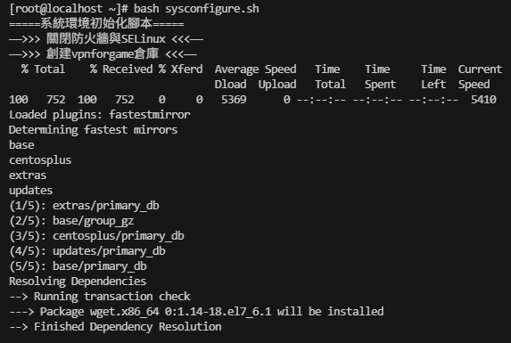

# VMware 虛擬機環境配置

## 新增虛擬機

    新增虛擬機，如下選擇稍後，否則默認會安裝全部套件


保持默認配置


這裡新增名稱配IP好後面SSH離線


選擇單一文件並配置大小


刪除用不到的配置，並調整記憶體及處理器核心數量


## 安裝系統

開啟虛擬機後如下，我這邊就保持英文接著配置安裝的套件


軟體選擇最小安裝節省空間    


時區需要調整下


這裡需要手動調整安裝目標的配置


新增對應的分割區，參考這個操作


最後磁區配置如下，最後 Done 即可


這裡會提示，直接同意即可


配置網路環境


這裡開啟網路


## 配置虛擬機網路編輯器

編輯 → 虛擬網路編輯器 → 如下視窗，點擊應用並確定


這裡閘道配置記得做修改


接著打開網路控制台設定如下


最後重新開啟虛擬機，並使用連線工具測試是否能連接上即可


## 腳本初始化系統

腳本內容如下，我直接保存 sysconfigure.sh 文件名稱

```shell
#!/bin/bash
echo "=====系統環境初始化腳本====="
sleep 3
echo "——>>> 關閉防火牆與SELinux <<<——"
sleep 3
systemctl stop firewalld
systemctl disable firewalld &> /dev/null
setenforce 0
sed -i '/SELINUX/{s/enforcing/disabled/}' /etc/selinux/config

echo "——>>> 創建vpnforgame倉庫 <<<——"
sleep 3
rm -rf /etc/yum.repos.d/*
curl -o /etc/yum.repos.d/CentOS-Base.repo http://mirrors.vpnforgame.net/centos/7/CentOS-Base.repo
yum -y install wget
wget -O /etc/yum.repos.d/epel.repo http://mirrors.vpnforgame.net/epel/7/epel.repo

echo "——>>> 設置時區並同步時間 <<<——"
sleep 3
timedatectl set-timezone Asia/Taipei
yum -y install chrony
systemctl start chronyd
systemctl enable chronyd


echo "——>>> 設置系統最大打開文件數 <<<——"
sleep 3
if ! grep "* soft nofile 65535" /etc/security/limits.conf &>/dev/null; then
cat >> /etc/security/limits.conf << EOF
* soft nofile 65535   #軟限制
* hard nofile 65535   #硬限制
EOF
fi

echo "——>>> 系統內核優化 <<<——"
sleep 3
cat >> /etc/sysctl.conf << EOF
net.ipv4.tcp_syncookies = 1             #防範SYN洪水攻擊，0為關閉
net.ipv4.tcp_max_tw_buckets = 20480     #此項參數可以控制TIME_WAIT套接字的最大數量，避免Squid服務器被大量的TIME_WAIT套接字拖死
net.ipv4.tcp_max_syn_backlog = 20480    #表示SYN隊列的長度，默認為1024，加大隊列長度為8192，可以容納更多等待連接的網絡連接數
net.core.netdev_max_backlog = 262144    #每個網絡接口 接受數據包的速率比內核處理這些包的速率快時，允許發送到隊列的數據包的最大數目
net.ipv4.tcp_fin_timeout = 20           #FIN-WAIT-2狀態的超時時間，避免內核崩潰
EOF

echo "——>>> 減少SWAP使用 <<<——"
sleep 3
echo "0" > /proc/sys/vm/swappiness

echo "——>>> 安裝系統性能分析工具及其他 <<<——"
sleep 3
yum install -y gcc make autoconf vim sysstat net-tools iostat  lrzsz
```

如下圖直接拖拉到 SFTP 中即可


輸入命令`bash sysconfigure.sh` 執行，如下圖結果



配置主機名稱 `hostnamectl set-hostname docker01` 退出重新登入如下


## 安裝Docker

操作下面命令即可

```shell
yum install -y yum-utils
yum-config-manager --add-repo https://download.docker.com/linux/centos/docker-ce.repo

# 查看當前官方倉庫的軟體包版本
yum list --showduplicates docker-ce
yum install -y docker-ce-20.10.24-3.el7
```


