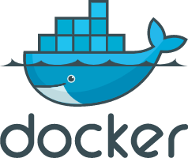
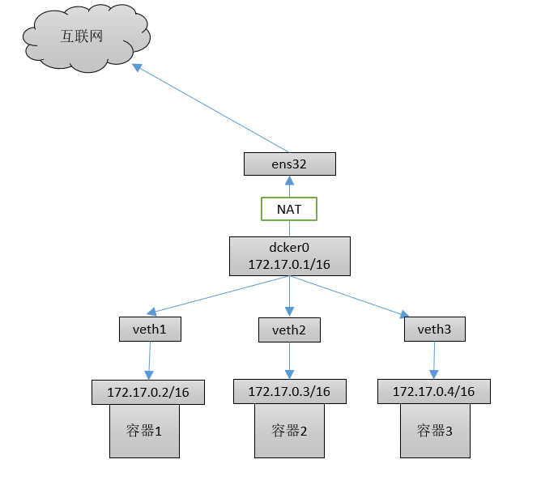
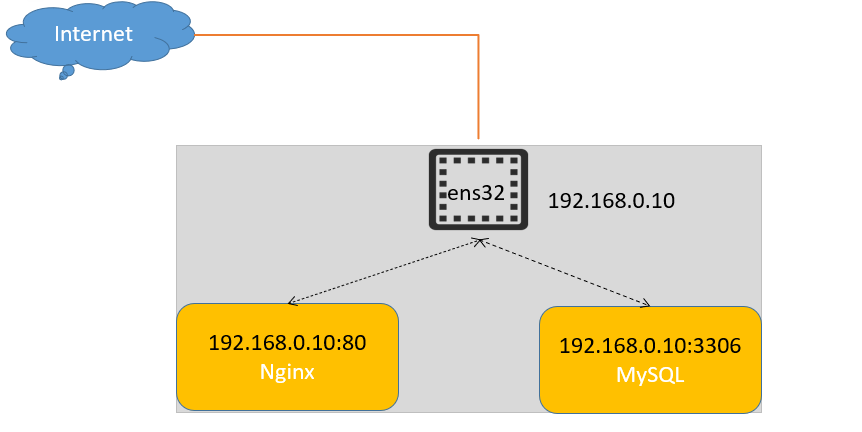
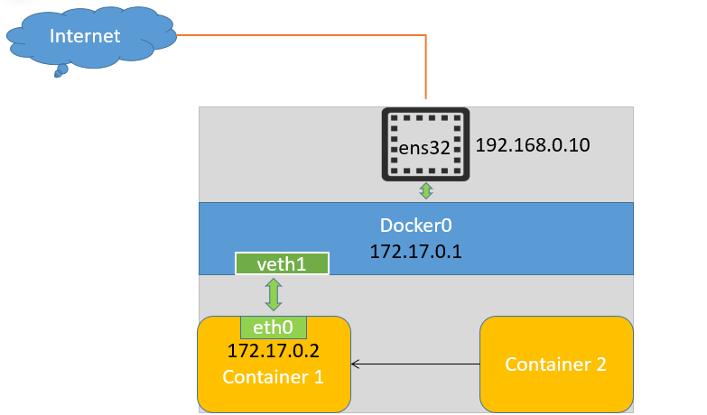
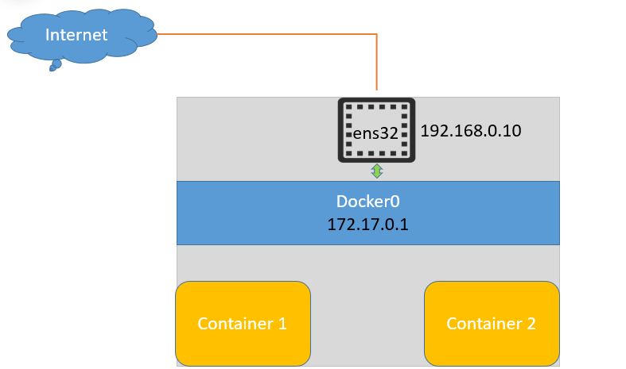
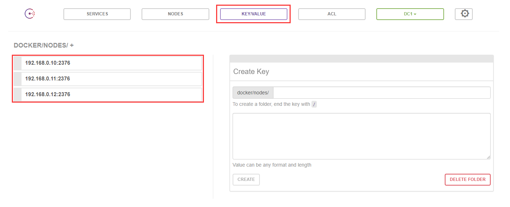
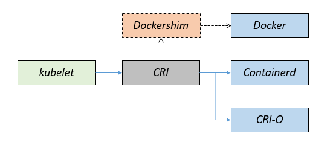

## 第一章：Docker快速入门


#### Docker介绍

Docker 是一个开源的容器运行时软件（容器运行时是负责运行容器的软件），基于 Go 语言编写，并遵从 Apache2.0 协议开源。 

Docker可以让开发者打包自己的应用以及依赖到一个轻量的容器中，然后发布到任何流行的Linux系统上（docker主要理念：一次封装随处运行）。

Docker的思想来源于集装箱，让容器与容器之间相互隔离，与系统相互隔离提高程序之间的安全，更重要的是容器性能开销极低。

Docker官网：www.docker.com




#### Docker组成部分

- 镜像（images）:用来创建容器的模板文件，一个镜像可以创建多个容器（容器动态）

- 容器（container）: 程序的载体，程序运行在容器中，每个容器相互隔离，互不影响，但可以相互通讯  

- 仓库（Repository）:集中存放镜像的场所，仓库分为公开仓库（public）和私有仓库（private）两种

  > 最大的公开仓库为docker hub：https://hub.docker.com
  >
  > 国内的公开仓库包括：阿里、网易、中科大等  

  

#### 容器应用场景

容器非常适合持续集成和持续交付（CI / CD）工作流程，请考虑以下示例方案：

- 开发人员在本地编写代码，并使用 Docker 封装成镜像，镜像推送到测试环境中，并执行自动或手动测试。
- 当开发人员发现错误时，他们可以在开发环境中对其进行修复，然后将其重新部署到测试环境中，以进行测试和验证。
- 测试完成后，将修补程序推送给生产环境，就像将更新的镜像推送到生产环境一样简单。


#### Docker资源汇总

- Docker 官方主页: https://www.docker.com
- Docker 官方博客: https://blog.docker.com/
- Docker 官方文档: https://docs.docker.com/
- Docker Cloud（云平台文档）: https://cloud.docker.com
- Docker Hub: https://hub.docker.com
- Docker 常见问题: https://docs.docker.com/engine/faq/


#### Docker版本介绍

Docker 从 1.17.03 版本之后分为：

- CE（Community Edition: 社区版）免费，功能有限，没有官方技术支持服务。
- EE（Enterprise Edition: 企业版）收费，功能全面，提供官方技术支持服务。


#### 环境规划

| 主机名称 | IP地址 | 操作系统   | 硬件配置               |
| -------- | ------ | ---------- | ---------------------- |
| docker01 | 自定义 | CentOS 7.6 | 2 Core/4G Mem/50 Gdisk |


#### 安装docker软件包

官方安装文档：https://docs.docker.com/engine/installation/linux/centos/

配置阿里的Base源(下载docker时，所需的依赖在Base源里)

```shell
wget -O /etc/yum.repos.d/CentOS-Base.repo https://mirrors.aliyun.com/repo/Centos-7.repo
```


通过阿里的docker仓库安装方式

```shell
yum install -y yum-utils
yum-config-manager --add-repo http://mirrors.aliyun.com/docker-ce/linux/centos/docker-ce.repo
```

```shell
yum -y install docker-ce-20.10.9-3.el7
```


卸载Docker方式：删除安装包， 删除镜像、容器、配置文件内容

```shell
yum remove docker-ce
rm -rf /var/lib/docker
```


#### 配置镜像加速器

默认情况下镜像从docker hub下载，由于docker hub服务器在国外，由于网络原因镜像下载速度较慢，一般会配置镜像加速器进行下载

国内镜像加速器有阿里云、网易云、腾讯云、中科大等，本实验配置阿里云镜像加速器，速度较快

阿里云镜像加速器地址：https://www.aliyun.com/


#### Docker命令介绍

查看docker可用命令

```shell
docker
```


#### 镜像常用管理命令

以下是一个Docker镜像常用的管理命令 

| 命令                           | 描述                       |
| ------------------------------ | -------------------------- |
| `docker images`                | 列出本地所有镜像           |
| `docker search <image>`        | 从Docker Hub搜索镜像       |
| `docker pull <image>`          | 从Docker Hub拉取镜像       |
| `docker rmi <image>`           | 删除一个镜像               |
| `docker image inspect <image>` | 查看镜像的详细信息和元数据 |


**docker查看本地镜像方式** 

`docker images` 命令用于列出本地所有的镜，命令格式如下：

```powershell
docker images

#字段解释
REPOSITORY	镜像名称
TAG   		镜像的标签
IMAGE ID    镜像的ID
CREATED     镜像更新时间
SIZE        镜像大小
```


**docker搜索镜像方式**

`docker search` 命令用于在Docker Hub中搜索镜像，命令格式如下：

```powershell
docker search nginx

#字段解释
NAME		 镜像仓库名称 
DESCRIPTION	 镜像仓库描述 
STARS        评分（星星数）
OFFICIAL     是否为官方镜像，[OK] 表示官方镜像
AUTOMATED    是否为自动构建的镜像，[OK]表示是，自动化构建是Docker Hub的一项功能，当代码仓库中的源代码发生变更时，Docker Hub会自动触发构建过程，从而创建一个新的镜像
```


**docker下载镜像方式**

`docker pull` 命令用于在Docker Hub中下载镜像，下载时如果不指定镜像版本则是仓库中的`latest` 版本，命令格式如下：

```shell
docker pull nginx:1.22.0
```


#### 容器常用管理命令

| 命令                                          | 作用                                         |
| --------------------------------------------- | -------------------------------------------- |
| docker  run     选项...                       | 创建容器                                     |
| docker  ps                                    | 查看正在运行容器                             |
| docker  ps  -a                                | 查看所有容器（包含关闭的容器）               |
| docker  exec  -it  容器名/容器ID              | 进入容器（正在运行的状态）                   |
| docker  stop       容器名/容器ID              | 停止容器                                     |
| docker  start       容器名/容器ID             | 启动被停止的容器                             |
| docker restart     容器名/容器ID              | 重启容器                                     |
| --restart=always                              | 创建容器时设置容器随机自启                   |
| docker  update                                | 更新容器配置                                 |
| docker  logs         容器名/容器ID            | 查看容器日志信息                             |
| docker cp             容器名:路径    本机目录 | 拷贝容器中的数据到宿主机                     |
| docker cp            本机目录  容器名:路径    | 拷贝宿主机中的数据到容器中                   |
| docker  rm          容器名/容器ID             | 删除容器（-f 用于强制删除，无需关闭容器）    |
| docker  kill          容器名/容器ID           | 强制停止正在运行的容器（一般不用，除非卡了） |
| docker  inspect   容器名称                    | 查看容器的元数据信息                         |


创建容器：`docker  run  选项...`

常用选项：

- **-id** :创建容器并指定容器在后台运行
- **--name="名称" :**为容器指定一个名称 
- **-p :**指定端口映射，格式为：宿主机端口:容器端口
- **--dns 8.8.8.8 :**指定容器使用的DNS服务器，默认和宿主一致 
- **-it:** 进入容器
- **-h "名称" :**指定容器的hostname 
- **-e username="ritchie" :**设置环境变量
- **-m :**设置容器使用内存最大值
-  **--net="bridge" :**指定容器的网络连接类型，支持 bridge/host/none/container: 四种类型 
-  **--link=[] :**添加链接到另一个容器 
-  **--expose=[]:** 开放一个端口或一组端口 
- **--volume , -v :**绑定一个数据卷
- **-u:** 可以指定用户进入容器（用户存在）


创建容器：docker  run  参数

```shell
docker run -id --name=nginx nginx:1.22.0
```


查看容器信息：

```shell
docker ps        通过-it创建的容器退出后自动关闭
docker ps -a     查看所有容器,包括未运行的
```


查看容器元数据信息

```shell
docker inspect nginx
```


进入容器：docker  exec  -it     容器ID/容器名

```shsell
docker exec -it nginx /bin/bash
```


停止容器：docker  stop       容器名/容器ID

```shell
docker  stop  nginx
```


启动被停止的容器：docker  start       容器名/容器ID

```shell
docker start nginx
```


启动被停止的所有容器：ps  -aq 获取所有容器ID

```shell
docker start `docker ps -aq`
```


删除容器：docker  rm          容器名/容器ID

常用选项： -f  强制删除（无需停止容器）

```shell
docker  rm  nginx
```


删除所有容器：ps  -aq 获取所有容器ID

```shell
docker rm `docker ps -aq`
```


练习：通过Docker部署Nginx的web应用并实现浏览器访问：

创建容器并实现端口映射（默认容器无法被外网访问）

```shell
docker run -d --name=ngx_v1 --restart=always -p 81:80  nginx:1.22.0
```

> **-p :**指定端口映射，格式为：宿主机端口:容器端口
>
> --restart=always     #设置容器随机自启

浏览器访问：http://server_ip:port


## 第二章：Docker容器数据卷


#### 数据卷概述

容器数据卷可以是宿主机中的一个目录或文件，通过将目录或文件挂载到容器中，可解决容器中的数据与宿主机之间立刻同步

数据卷可以间接的将外部主机文件传输到宿主机数据卷目录，可解决容器与外部主机之间文件交换的问题

一个数据卷目录可以同时挂载多个容器，解决多容器之间文件交换的问题

数据卷可以解决容器删除后容器数据丢失的问题，实现数据持久化


#### 配置容器数据卷

- 在创建启动容器时，使用-v参数设置数据卷

- docker  run  参数   -v  宿主机目录/文件:容器内目录/文件...

- 目录必须是绝对路径
- 如果目录不存在，会自动创建


#### Docker部署MySQL

案例：在Docker容器中部署MySQL数据库，并通过外部MySQL客户端管理MySQL数据库。


步骤：

1. 下载MySQL5.7镜像文件
2. 准备所需的数据卷目录
3. 拷贝容器中数据到宿主机数据卷目录
4. 创建MySQL并挂载数据卷


下载MySQL镜像文件

```shell
docker pull mysql:5.7
```


创建数据卷目录

```shell
mkdir -p /docker_mysql/
```


创建容器拷贝配置文件目录到/docker_mysql目录

> - 格式1：docker cp 容器名:目录/文件  宿主机目录      #将容器中文件或目录拷贝到宿主机
> - 格式2：docker cp 宿主机目录/文件  容器名:目录      #将宿主机文件/目录拷贝到容器中

```shell
docker run -id --name=mysql  -e MYSQL_ROOT_PASSWORD=123456 mysql:5.7
docker cp mysql:/etc/mysql/ /docker_mysql

#由于MySQL主配置文件是软连接，拷贝出来链接文件会失效，再次拷贝源文件
docker cp mysql:/etc/alternatives/my.cnf /docker_mysql/mysql/

#删除掉链接文件
rm -rf /docker_mysql/mysql/my.cnf

#修改配置文件的名称
mv /docker_mysql/mysql/my.cnf.fallback /docker_mysql/mysql/my.cnf
```


删除MySQL容器

```shell
docker rm -f mysql
```


创建MySQL容器并挂载数据卷

```SHELL
docker run -id --name=lnmp_mysql -p 3306:3306 \
-v /docker_mysql/mysql/:/etc/mysql \
-v /docker_mysql/data/mysql:/var/lib/mysql \
-v /docker_mysql/logs:/var/log/mysql \
-e MYSQL_ROOT_PASSWORD=123456 \
mysql:5.7
```


进入数据库授权远程连接用户访问

```shell
docker exec -it lnmp_mysql /bin/bash

root@9c8c0dccccee:/# mysql -uroot -p123456

mysql> grant all on *.* to root@"%" identified by "123456";
```


#### Docker部署Nginx

案例：在Docker容器中部署Nginx的web服务，并通过外部浏览器访问Nginx。


下载Nginx镜像

```shell
docker pull nginx:1.22.0
```


创建数据卷目录

```shell
mkdir -p /docker_nginx/conf
```


创建容器拷贝配置文件目录到/docker_nginx目录

```shell
docker run -id --name=nginx -p 80:80 nginx:1.20.2
docker cp nginx:/etc/nginx /docker_nginx/conf
```


删除nginx容器

```shell
docker rm -f nginx
```


创建nginx容器并挂载数据卷

```shell
docker run -id --name=lnmp_nginx -p 80:80 \
-v /docker_nginx/conf/nginx:/etc/nginx \
-v /docker_nginx/html:/usr/share/nginx/html \
-v /docker_nginx/logs/:/var/log/nginx \
nginx:1.20.2
```


浏览器访问容器Nginx服务：http://server_ip


#### Docker部署tomcat

案例：在Docker容器中部署tomcat，并通过外部浏览器访问tomcat。


下载tomcat镜像文件

```shell
docker pull tomcat:8.5-jre10-slim
```


创建数据卷目录

```shell
mkdir /docker_tomcat
```


拷贝容器数据

```shell
docker run -id --name=tomcat tomcat:8.5-jre10-slim /bin/bash
docker cp tomcat:/usr/local/tomcat /tomcat

#停止tomcat容器并删除
docker stop tomcat && docker rm tomcat
```


创建容器挂载数据卷

```shell
docker run -id --name=tomcat -p 8080:8080 \
-v /tomcat/tomcat:/usr/local/tomcat \
tomcat:8.5-jre10-slim
```


浏览器访问容器tomcat服务：http://server_ip:8080


## 第三章：Docker File定制镜像

当我们从 docker 镜像仓库中下载的镜像不能满足我们的需求时，我们可以通过以下两种方式对镜像进行更改。

1.使用 Dockerfile 指令来创建一个新的镜像。

2.将已经创建的容器转为镜像，并且提交这个镜像。


#### DockerFile定制镜像

Dockerfile 是一个用来构建镜像的文本文件，文本内容包含了一条条构建镜像所需的指令和说明，每条指令构建一层，最终构建出一个新的镜像。

| 关键字     |           作用           | 备注                                                         |
| ---------- | :----------------------: | ------------------------------------------------------------ |
| FROM       |       指定基础镜像       | 指定dockerfile基于哪个镜像构建                               |
| MAINTAINER |         作者信息         | 用来标明这个dockerfile谁写的                                 |
| LABEL      |           标签           | 用来标明dockerfile的标签，可以使用label代替Maintainer，最终都是在docker image基本信息中可以查看 |
| RUN        |         执行命令         | 容器创建过程中执行命令，默认是/bin/sh，格式：RUN 命令  或者 RUN ["命令","参数1","参数2"] |
| CMD        |       容器启动命令       | 提供启动容器时候的默认命令，和ENTRYPOINT配合使用，格式：CMD 命令 参数1  参数2  或者  CMD ["命令","参数1","参数2"] |
| COPY       |         复制文件         | 构建镜像时，复制文件到镜像中，COPY指令只能从执行docker build所在的主机上读取资源并复制到镜像中。 |
| ADD        |         添加文件         | ADD指令更擅长读取本地tar文件并解压缩。而ADD指令还支持通过URL从远程服务器读取资源并复制到镜像中。 |
| ENV        |         环境变量         | 指定构建时的环境变量，后续的指令中，就可以使用这个环境变量。 |
| VOLUME     | 定义外部可以挂载的数据卷 | 指定镜像中的目录可以挂载到数据卷目录，启动容器时用-v绑定，格式：VALUME ["目录"] |
| EXPOSE     |         暴露端口         | 定义容器运行时监听的端口，启动容器时，使用-p绑定暴露的端口，格式：EXPOSE  80  或者 EXPOSE  80/tcp |
| WORKDIR    |         工作目录         | 指定容器内部的工作目录，作为用户首次登录容器时停留的目录，如果没有创建则自动创建，如果指定/，使用的是绝对地址，如果不是/开头，那么是在上一条workdir的路径的相对路径 |


#### 构建CentOS镜像

案例1：通过dockerfile自定义CentOS7镜像

- 定义CentOS默认登录目录为/root目录
- 可以使用vim命令


实现步骤：

- 定义父镜像：FROM  centos:7
- 定义作者信息：MAINTAINER  zhangsan@example.com
- 执行安装常用工具：RUN  
- 定义默认登录目录：WORKDIR  /root


编写Dockerfile文件（文件名自定义）：

```shell
mkdir dockerfile && cd dockerfile
```

```shell
vim dockerfile
FROM  centos:7
MAINTAINER yesir@163.com
RUN yum -y install vim wget net-tools \
    && rm -rf /etc/yum.repos.d/* \
    && wget -O /etc/yum.repos.d/CentOS-Base.repo https://mirrors.aliyun.com/repo/Centos-7.repo \
    && wget -O /etc/yum.repos.d/epel.repo http://mirrors.aliyun.com/repo/epel-7.repo
WORKDIR /root
```


构建镜像格式：`docker  build  -f  dockerfile文件  -t   镜像名称:镜像标签   .`

```shell
docker build -f ./dockerfile -t centos7:v1 .
```

> **注**：最后的 `.` 代表本次执行的路径，如需将当前路径的文件打包到镜像中，docker build 会将路径下的所有内容打包到镜像（不要放无用的文件）。


创建容器验证

```shell
docker run -it --name=centos-test centos7:v1 /bin/bash
```


#### 构建Nginx镜像

案例1：通过dockerfile自定义Nginx镜像

- 定义Nginx网页

  

实现步骤：

- 定义父镜像：FROM  nginx:1.22.0
- 定义Nginx网页


```sh
mkdir ngx_dockerfile && ngx_dockerfile
```

```sh
vim dockerfile
FROM nginx:1.20.2
ADD . /usr/share/nginx/html
```

```sh
#上传项目后构建镜像
docker build -t ngx:choujiang .
```


#### 镜像转为压缩文件

案例：将前边构建的镜像转为压缩文件，以便于保存和传输。

`格式：docker save -o  压缩文件名称 镜像名称:版本号`

```shell
docker save -o ngx_choujiang.tar ngx:choujiang
```


#### 压缩文件转为镜像

案例：将将前边制作的镜像删除在进行导入验证。
`格式：docker load -i   压缩文件名称`

```shell
docker load -i ngx_choujiang.tar
```


创建容器验证

```shell
docker run -id --name=ngx_choujiang -p 80:80 ngx:choujiang
```


#### 容器转为镜像

容器转为镜像时，容器的配置或数据也会被保存到新镜像文件中，但是容器数据卷不会被保存到新镜像中，转为镜像时，容器可以是运行状态，也可以是退出状态。

`命令格式：docker commit  容器ID/容器名称  镜像名称:版本号`

```shell
docker commit ngx_choujiang ngx_choujiang:v1
```


## 第四章：Docker容器网络

#### Docker四种网络模式


##### 1. bridge网络（默认）

docker使用Linux虚拟网络技术在宿主机虚拟一个名为docker0的虚拟网桥，docker启动一个容器时会根据docker0网桥的网段分配给容器一个IP地址（可通过：docker  inspect 容器名/ID 查看容器地址）

同时docker0网桥作为每个容器的默认网关，同一宿主机内的容器都接入同一个docker0网桥，这样主机上的所有容器就通过docker0直接通信。

当创建一个容器的时候，同时也会创建一个veth开头名称接口，这个接口对接容器内的eth0网卡，通过这种方式，主机可以跟容器通信。





**使用需求**：当需要多个容器在同一个docker主机上进行通信时，使用桥接模式（bridge）最佳。 


查看容器网络

```shell
docker inspect 容器名称
...
   "bridge": {   
```


##### 2. Host模式

在Host类型的网络中，容器不会虚拟出自己的网卡，而是与物理机共享网络，拥有物理机的IP地址和网卡信息，而容器的其他方面，如文件系统、进程列表等还是和宿主机隔离的。

Host最大的优势就是网络性能比较好，不需要进行NAT，可以直接使用宿主机的IP地址/端口与外界通信。



**使用需求**：当容器需要与宿主机在同一网络，但又希望隔离容器的其他方面时，使用Host网络最佳。


创建容器并指定Host模式，格式：`--net=host`

> 提示：此模式无法通过-p为容器做端口映射，容器内的服务直接占用宿主机端口。

```shell
docker run -id --name=ngx_host --net=host nginx:1.22.0
```

```shell
docker inspect ngx_host
...
   host": {  
```


##### 3. Container模式

这个模式指定新创建的容器和已经存在的一个容器共享一个网络，除了网络方面，其他的如文件系统、进程等还是隔离的




##### 4. None模式

使用none模式，docker并不为容器进行任何网络配置，也就是说，这个容器没有网卡、IP、路由等信息，需要我们自己为容器添加网卡、配置IP等。





#### Docker自定义网络

自定义容器网络可使在同一个宿主机的容器使用不同的网络，避免相互影响。

`查看所有docker网络：docker network ls`

```shell
docker network ls
NETWORK ID     NAME        DRIVER    SCOPE
网络 ID        网络名称      网络模式    作用域
```

```shell
docker network create --driver bridge --subnet 172.16.0.0/16 --gateway 172.16.0.254 mynet

create         #创建网络
--driver       #定义网络模式
--subnet       #定义地址段
--gateway      #指定网关
mynet          #自己定义的网络名称
```


查看网络详细信息：`docker  network  inspect  网络名称/ID`

```shell
docker network inspect mynet
```


创建容器使用自定义网络

```shell
docker run -id --name=ngx_mynet --net=mynet --ip 172.16.0.10 -p 81:80 nginx:1.22.0

--net=网络名称  
--ip  IP地址          #定义容器IP，如果不自定义，将默认分配
```


查看容器详细信息

```sh
docker inspect ngx_mynet
```


容器加入网络：`docker  network  connect  网络名  容器名`

> 自定义网络和默认网络是不通的，这样就起到了隔离的作用，那如果我们想要打通这两个网络，使用 connect 将容器加入到该网络

查看容器网络

```sh
docker inspect ngx_choujiang
...
Networks": {
                "bridge": {
```

```shell
docker network connect mynet centos01
```

```shell
docker inspect centos01
...
   "bridge": {                                      
   "mynet": {
```

提示：打通后不同网络之间的容器就可以互相通信


删除网络：`docker network rm  网络名`

```shell
docker network rm  mynet
```

> 提示：如果有其他容器使用该网络，需要先清理容器。


#### Docker容器互联 --link

容器之间如果想要通过容器名称进行通信的话，可以通过--link来实现容器互联（单方向互联）

格式：`--link name:alias`

- name表示要链接的容器的名称
- alias是别名（也可以不指定别名）


创建centos01容器

```shell
docker run -id --name=centos01 centos:7
```


创建centos02容器，并与centos_1互联

```shell
docker run -id --name=centos02 --link centos01 centos:7
```


进入容器验证（注意：是单方向互联）

```shell
docker exec -it centos02 /bin/bash
ping centos01
```


查看容器的/etc/hosts文件，当容器创建并启动后，会自动在hosts文件里添加解析

```shell
cat /etc/hosts
172.17.0.3	centos01 c64ac9f7fbb0
```


#### Docker容器跨主机通信

docker默认的自定义网络的类型就是bridge，但是跨主机的时候bridge就明显不可用的。

原生的docker跨主机通信方案有macvlan和overlay两种。


##### 1.Macvlan网络？

macvlan 本质上是一种网卡虚拟化技术，首先使宿主机物理网卡工作在 "混杂模式"，这样物理网卡的MAC地址将会失效，所有二层网络中的流量物理网卡都能收到。接下来就是在这张物理网卡上创建虚拟网卡，并为虚拟网卡指定MAC地址，实现一卡多用，在物理网络看来，每张虚拟网卡都是一个单独的接口。

>**使用Macvlan需要注意：** 
> 容器直接连接物理网络，由物理网络负责分配IP地址，可能的结果是物理网络IP地址被耗尽，另一个后果是网络性能问题，物理网络变多，广播包占比快速升高而引起的网络性能下降问题；


##### 2.Overlay网络

overlay网络用于连接不同机器上的docker容器，允许不同机器上的容器相互通信，同时支持对消息进行加密（在docker swarm集群环境overlay是最佳选择）因此，Overlay网络实际上是目前最主流的容器跨节点数据传输和路由方案。

> 字面意思就是叠加的网络，指的就是在物理网络层上再搭建一层网络（称为逻辑网）他具有物理网络的所有特性，跟物理网络一模一样。
>


###### Overlan环境准备

| 主机名   | IP地址 | 角色       |
| -------- | ------ | ---------- |
| docker01 | 自定义 | docker主机 |
| docker02 | 自定义 | docker主机 |
| consul   | 自定义 | consul主机 |

注：每个节点安装Docker服务，每台宿主机的hostname必须不同。


###### 运行consul服务

Overlay 网络需要一个 key value分布式数据库来保存网络状态信息，而Consul、Etcd、ZooKeeper都是docker支持的数据库类型，我们这里使用consul。


在consul主机执行如下命令（提前安装好docker）

```shell
[root@consul ~]# docker run -id -p 8500:8500 -h consul --name consul --restart always progrium/consul -server -bootstrap

解释：
--server -bootstrap    #指定运行模式（该模式指定本机为server端）
--h                    #设置容器主机名
--restart always       #设置容器随机自启
```


###### 节点加入consul

修改/usr/lib/systemd/system/docker.service文件，将文件中的ExecStart参数替换成如下参数（根据自己的环境修改consul地址及网卡名称）

> 使得每一台都通过本机的2376（docker监听端口）端口被转发到192.168.0.12:8500，consul收集存储并使用这些信息实现网络一致。

```shell
[root@consul ~]# vim /usr/lib/systemd/system/docker.service
...
ExecStart=/usr/bin/dockerd -H unix:///var/run/docker.sock -H tcp://0.0.0.0:2376 --cluster-store=consul://192.168.0.22:8500 --cluster-advertise=ens32:2376

解释：
--cluster-store    #指定consul地址
--clusteradvertise #指定本机网卡及端口
```


重启服务

```shell
[root@consul ~]#  systemctl daemon-reload && systemctl restart docker
```


直接将配置文件拷贝到docker01与docker02主机即可

```shell
[root@consul ~]# scp /usr/lib/systemd/system/docker.service root@192.168.0.10:/usr/lib/systemd/system/docker.service

[root@consul ~]# scp /usr/lib/systemd/system/docker.service root@192.168.0.11:/usr/lib/systemd/system/docker.service
```


docker01重启服务

```shell
[root@docker01 ~]# systemctl daemon-reload && systemctl restart docker
```


docker02重启服务

```shell
[root@docker02 ~]# systemctl daemon-reload && systemctl restart docker
```


###### 访问consul

最后我们可以通过浏览器访问consul服务：http://server_ip:8500/



不同主机的docker已经添加到了一起。


###### 创建Overlan网络

在任意一个节点创建一个网络，我们在docker创建一个网络

```shell
[root@docker01 ~]# docker network create -d overlay myovernet
```

```sh
[root@docker01 ~]# docker network inspect myovernet
                {
                    "Subnet": "10.0.0.0/24",
                    "Gateway": "10.0.0.1"
                }
```


提示：网络默认使用的10.0.0.0/24网段，如果需要自定义网络地址通过下边命令创建（别跟宿主机在同一个网络，容易发生地址冲突）

```shell
docker network create -d overlay --subnet 172.16.1.0/24 --gateway 172.16.1.254  myovernet
```


###### 验证Overlan网络

这时候每一个节点都会有这个网络

```shell
[root@docker02 ~]# docker network ls
60210366228b   myovernet   overlay   global

consul主机查看
[root@consul ~]# docker network ls
60210366228b   myovernet   overlay   global
```


docker01、docker02创建容器测试跨主机通信

```shell
[root@docker01 ~]# docker run -it --name=c01 --net=myovernet centos:7 /bin/bash
[root@docker02 ~]# docker run -it --name=c02 --net=myovernet centos:7 /bin/bash
```


测试连通性：docker自定义的网落是自带域名解析的，所以直接ping名字

```shell
[root@097d21377fcc /]# ping c01
[root@097d21377fcc /]# ping c02
```


查看容器IP

```shell
[root@097d21377fcc /]# hostname -I
10.0.0.2 172.18.0.2 
```


## 第五章：Docker资源限额


#### 内存限额

大多数的场景要对容器的运行内存进行限制，防止使用过多的内存。


案例：创建一个centos容器，并指定内存资源为1G

格式：`-m `或 `--memory`

```shell
[root@docker01 ~]# docker run -id --name=centos01 -m 1G centos:7 
```


通过容器元数据过滤内存信息

```shell
[root@docker01 ~]# docker inspect centos01 | grep "Memory"
            "Memory": 1073741824   #单位是Byte（字节）
```

也可以在容器的`/sys/fs/cgroup/memory/memory.limit_in_bytes`文件中查看


#### CPU限额

大多数的场景要对容器的CPU利用率进行限制，防止使用过多的CPU。


案例：创建一个centos容器，并指定分配1核心CPU资源

格式：`--cpuset-cpus  `

```shell
[root@docker01 ~]# docker run -id --name=centos02 --cpuset-cpus 1 centos:7 
```


通过容器元数据过滤CPU信息

```shell
[root@docker01 ~]# docker inspect centos2 | grep "CpusetCpus"
            "CpusetCpus": "1",
```


## 第六章：Docker Compose

docker官方提供容器编排工具，Docker swarm是面向与集群的，Docker Compose 是一款单机版容器编排工具，遵循 YAML 文件形式来创建或启动所有的容器

> 提示：现在主流的容器编排工具是Kubernetes（K8s）


Docker Compose 使用的步骤：

- docker-compose.yml 定义构成应用程序的服务 

- 执行 docker-compose up 命令来启动 


#### Compose部署wordpress

案例：通过Docker Compose部署个人的wordpress

```tiki
#添加执行权限
chmod +x /usr/local/bin/docker-compose

#查看版本
docker-compose --version
```


创建Compose目录

```shell
[root@docker01 ~]# mkdir wordpress && cd wordpress
```


创建docker-compose.yml文件

```shell
[root@docker01 wordpress]# cat docker-compose.yml
version: '3'        #docker-compose的版本，目前3为最新版本
services:           #定义服务
   db:              #容器名称
     image: mysql:5.7    #容器镜像，如果不存在会自动下载
     volumes:            #容器数据卷 
       - ./db_data:/var/lib/mysql   #./当前目录:容器目录
     ports:              #暴露端口
       - "3306:3306"     #宿主机端口:容器端口
     restart: always     #容器随机自启
     environment:        #定义一些容器内部环境变量
       MYSQL_ROOT_PASSWORD: somewordpress #数据库密码
       MYSQL_DATABASE: wordpress          #数据库
       MYSQL_USER: wordpress              #用户名
       MYSQL_PASSWORD: wordpress          #密码

   wordpress:        #容器名称
     depends_on:     #容器排序，表示db容器优先
       - db
     image: wordpress
     volumes:
       - ./web_data:/var/www/html
     ports:
       - "80:80"
     restart: always
     environment:
       WORDPRESS_DB_HOST: db:3306
       WORDPRESS_DB_USER: wordpress
       WORDPRESS_DB_PASSWORD: wordpress
volumes:         #卷挂载路径
    db_data:
    web_data:
```


docker-compose 运行服务（检查其他容器占用的端口，避免端口冲突）

```shell
[root@docker01 wordpress]# docker-compose up -d
-d #后台运行
```


访问wordpress：http://server_ip/


docker-compose 关闭服务

```shell
[root@docker01 wordpress]# docker-compose down
```


## 第七章：Docker私有仓库


#### Docker仓库概述

Docker官方的Docke rhub是一个公共镜像的仓库，我们可以从上面拉取镜像到本地，也可以把自己的镜像推送上去，但有时候我们的服务器无法访问互联网，或者不希望将自己的镜像放到公网中，那么我们可以自己搭建私有仓库来存储镜像。

Docker 官方提供了一个registry镜像来搭建私有仓库，只需把镜像下载下来，运行容器并暴露5000端口（registry服务默认监听的是5000端口）就可以使用了。


#### 创建私有仓库

```shell
docker run -d --name registry -p5000:5000 \
-v /registry/:/var/lib/registry \
--restart=always \
registry
```

**注**：/var/lib/registry/ 目录来实现数据的持久化


#### 访问registry仓库

通过浏览器访问：http://server_ip:5000/v2/_catalog


#### Docker添加仓库

在 /etc/docker/daemon.json 文件中添加仓库地址及端口

```shell
vim /etc/docker/daemon.json
{
  "insecure-registries": ["仓库服务器IP:5000"]
}
```


重启docker

```shell
[root@docker01 ~]# systemctl restart docker
```


#### 为镜像打标签

为什么要打标签？如果镜像是上传到docker hub默认是不需要为镜像打标签，应为默认走的就是公共仓库（docker hub），如果是上传到本地私有仓库，那么标签是为了指定本地私有仓库的地址。


语法：`docker  tag 镜像名:tag  仓库地址:5000/镜像名:tag`

镜像改名方式： `docker tag 镜像ID 新镜像名称:版本`

```shell
[root@docker01 ~]# docker tag choujiang:v1 192.168.0.20:5000/choujiang:v1
[root@docker01 ~]# docker images
```

**注**：当你对源镜像打标签后，原镜像与新镜像ID号是相同的，删除镜像时如果按照镜像ID删除，则相同ID的所有不同标签的镜像也全部删除。


#### 上传镜像到私有仓库

格式：docker  push  镜像名:tag

```shell
[root@docker01 ~]# docker push 192.168.0.20:5000/choujiang:v1
```


浏览器访问：http://server_ip:5000/v2/_catalog


#### 拉取仓库镜像至本地

> 先删除本地同名镜像文件在进行拉取

```shell
[root@docker01 ~]# docker pull 192.168.0.20:5000/choujiang:v1
```


#### 私有仓库Harbor

Docker官方提供了Registry镜像仓库，但是Registry的功能相对简陋，Harbor是VMware公司提供的一款镜像仓库，提供了权限控制、分布式发布、强大的安全扫描与审查机制等功能

Harbor 私有仓库，它以 Registry 为基础，提供了对用户友好的管理界面，可以帮助我们快速搭建一个企业级的 Docker Registry 服务。

Harbor 的每个组件都是以 Docker 容器的形式构建的，使用 Docker Compose 进行部署。


#### Harbor优势

- 基于角色控制：有管理员与普通用户，可赋权普通⽤户，比如只能上传和下载，可根据项⽬来进⾏操作和管理。
- ⽀持LDAP/AD域控制：比如南京去下载北京harbor私有仓库的镜像，两端打上局域网的地址，连接在一块，数据信息的传输通过⼀条隧道，会通过两层加密，第⼀层为隧道加密，第⼆层为数据加密，安全可靠。
- 图像删除和垃圾收集：即回收站机制。
- 图形UI：具有统计功能，比如访问量与镜像下载热度。


#### 安装 harbor仓库

~~~powershell
#下载harbor离线安装包
wget https://github.com/goharbor/harbor/releases/download/v2.5.1/harbor-offline-installer-v2.5.1.tgz
~~~

~~~powershell
#解压harbor
tar xf harbor-offline-installer-v2.5.1.tgz  -C /


#创建配置文件
cd harbor/ && mv harbor.yml.tmpl harbor.yml
~~~

~~~powershell
#修改配置文件中的如下内容
vim harbor.yml

#上述内容省略...

hostname: 192.168.0.20    指定Harbor主机地址
http:                     #访问方式为http（不用修改）
  port: 80                #默认端口（不用修改）

#https:                     注释https访问方式（需要证书才可以使用）
# port: 443                 注释端口
 
# certificate: /root/harbor/6864844_kubemsb.com.pem  注释证书文件
# private_key: /root/harbor/6864844_kubemsb.com.key  注释证书文件
 
harbor_admin_password: 12345    访问密码
~~~

~~~powershell
执行安装脚本
# ./install.sh
...

✔ ----Harbor has been installed and started successfully.----


验证运行情况
# docker ps
~~~


登录到Harbor：http://server_ip


#### Harbor使用流程

1）创建私有仓库

2）修改/etc/docker/daemon.json文件，指定Harbor地址

3）上传镜像到Harbor仓库中

3）下载镜像验证仓库


```sh
[root@docker01 harbor]# vim /etc/docker/daemon.json
{
  "insecure-registries": ["192.168.0.20"]
}


#重启docker
[root@docker01 harbor]# systemctl restart docker


#重新启动Harbor服务（默认它不会跟着docker重启）
[root@docker01 harbor]# docker-compose down
[root@docker01 harbor]# docker-compose up -d
```


#### 上传镜像到Harbor

```sh
#先通过命令行登录到Harbor（需要用户认证）
[root@docker01 harbor]# docker login 192.168.0.20
Username: admin
Password: 12345

#按照提示修改镜像标签
docker tag nginx:1.22.0 192.168.0.20/test/nginx:1.22.0

#上传镜像
docker push 192.168.0.20/test/nginx:1.22.0

#下载镜像
docker pull 192.168.0.20/test/nginx:1.22.0
```


## 第八章：容器运行时Containerd


#### k8s为什么放弃docker？

k8s是今天容器编排领域的执行标准，而Docker从诞生为止在容器领域都扮演着举足轻重的地位，也都是k8s中默认的Container Runtime（容器运行时），而在2020年12月，k8s社区决定在k8s1.24版本中移除Dockershim 相关代码，这对于k8s和Docker来说都意义重大；



如上图所示，CRI接口（Container Runtime Interface）是k8s在1.5版本中引入的新接口，为了方便k8s通过这个接口使用各种容器运行时（例如：docker、Containerd、CRI-O）；

但是Docker 没有支持k8s的CRI接口，k8s为了能够使用Docker实现容器管理，专门在k8s代码中增加一个Dockershim，k8s通过Dockershim将请求转发给Docker从而进行容器的管理；


#### Containerd介绍

Containerd 最初是 Docker 的一个核心组件，负责底层容器管理，例如：创建容器、启动容器、停止容器、删除容器等；

2016年Docker 把 containerd 捐献给了 CNCF 管理，目标是作为一个独立的开源项目独立发展，提供一个更加开放、稳定的容器运行基础设施；


下面是containerd的一些核心概念：

- 命名空间（Namespace）：它是Linux内核的一个特性，用于隔离各个进程的资源，如网络、文件系统、进程等；

- 控制组（Cgroup）：它是Linux内核的另一个特性，用于限制进程的资源使用量，如CPU、内存、磁盘IO等；

- 镜像（Image）：它是一个文件或一组文件，包含了运行容器所需的环境及应用程序；

- 容器（Container）：它是从镜像创建出来的运行实例，具有独立的命名空间和控制组；


在containerd中，容器生命周期的管理涉及以下几个步骤：

- 创建容器：根据指定的镜像创建一个容器；

- 容器的状态管理：containerd会记录容器的状态，如正在运行、已停止、已删除等；

- 容器的资源管理：containerd可以为容器分配资源，如CPU、内存等；

- 容器的网络管理：containerd可以为容器配置网络；

- 容器的文件系统管理：containerd可以管理容器的文件系统，挂载点等；

- 容器的删除：删除不再需要的容器；

- 容器的日志记录：容器日志记录，可以帮助用户更好地了解容器的运行状态和问题；


#### Containerd安装方式

安装containerd可以直接使用docker的yum源，本次使用[阿里源](https://developer.aliyun.com/mirror/docker-ce?spm=a2c6h.13651102.0.0.4b121b11ZXY0V4)来进行安装；

以下是在CentOS或RHEL上使用yum安装containerd的步骤： 

添加阿里的Base仓库

```sh
wget -O /etc/yum.repos.d/CentOS-Base.repo https://mirrors.aliyun.com/repo/Centos-7.repo
```


1.添加containerd的yum仓库

```sh
tee /etc/yum.repos.d/containerd.repo <<EOF
[containerd]
name=containerd
baseurl=https://download.docker.com/linux/centos/7/\$basearch/stable
enabled=1
gpgcheck=1
gpgkey=https://download.docker.com/linux/centos/gpg
EOF
```


2.安装containerd

```sh
#安装containerd
yum install containerd.io-1.6.20-3.1.el7.x86_64 -y
```


3.启动containerd

```sh
systemctl start containerd
systemctl enable containerd
```


#### Containerd命令介绍

- 单机版containerd使用ctr命令管理容器和镜像；

- k8s中containerd使用crictl命令管理容器镜像；


 以下是一个简单的containerd与Docker命令对比： 

| 命令               | containerd         | Docker            |
| ------------------ | ------------------ | ----------------- |
| 显示创建的容器     | `ctr c ls`         | `docker ps`       |
| 显示所有创建的容器 | `ctr c ls `        | `docker ps -a`    |
| 启动容器           | `ctr task start `  | `docker start `   |
| 停止容器           | `ctr task pause `  | `docker stop `    |
| 重启容器           | `ctr task resume ` | `docker restart ` |
| 删除容器           | `ctr c rm`         | `docker rm `      |
| 显示镜像列表       | `ctr i ls`         | `docker images`   |
| 创建容器           | `ctr run`          | `docker run `     |
| 构建镜像           |                    | `docker build `   |
| 推送镜像           | `ctr i push `      | `docker push `    |
| 拉取镜像           | `ctr i pull `      | `docker pull `    |


#### Containerd镜像管理

以下是 containerd 常用的管理镜像命令，这些命令涵盖了镜像的查看、拉取、导入、导出、删除等常用操作。

| 命令                                    | 描述                          |
| --------------------------------------- | ----------------------------- |
| `ctr images pull <镜像名称>`            | 从镜像仓库拉取指定镜像        |
| `ctr images list`                       | 列出本地存储的所有镜像        |
| `ctr images check`                      | 检测镜像是否可用              |
| `ctr images mount <镜像名称> <目录>`    | 挂载镜像到宿主机目录          |
| `ctr images remove <镜像名称>`          | 删除指定镜像                  |
| `ctr images export <文件名> <镜像名称>` | 将指定镜像导出为tar文件       |
| `ctr images import <导入文件>`          | 导入tar文件中的镜像到本地存储 |
| `ctr images tag <镜像名称> <目标名称>`  | 为镜像打上指定标签            |
| `ctr images push <镜像名称> <目标仓库>` | 将本地镜像推送到指定仓库      |


**containerd拉取镜像方式**

可以使用 `ctr images pull` `<镜像名称>` 命令来拉取镜像，其中 `<镜像名称>` 可以是完整的镜像名称，也可以是不带标签的镜像名称；

containerd 支持从多个平台拉取镜像，多个平台指的是镜像支持在多种CPU架构运行，包括： 

- amd64（64 位 x86 架构）
- armv6、armv7 和 arm64（ARM 架构）
- ppc64le（IBM Power 架构）

通过支持多个平台的方式拉取镜像，可以轻松实现跨平台容器的部署和迁移。 


例如，如果要拉取 Docker Hub 上的 nginx 镜像，且支持多个平台的镜像，命令格式如下： 

```sh
ctr images pull docker.io/library/nginx:1.20.1 --all-platforms

#解释
--all-platforms  #用来表示支持在所有CPU架构运行，拉取镜像时，如果不加该参数，镜像导出后，无法再次导入到系统
```


**containerd查看镜像基本信息方式** 

可以使用 `ctr images list` 命令来查看本地已经下载的镜像，命令格式如下： 

```sh
#列出本地所有已下载的镜像，包括它们的名称、标签、大小等信息
ctr images list

#解释：
REF 		#镜像的来源及镜像完整名称（包括镜像仓库名称、镜像名称和标签）
TYPE		#镜像的类型，独有的一种记录方式，描述了一个Docker镜像的各种组成部分
DIGEST 		#镜像的摘要信息，是一个唯一的标识符，可以用于验证镜像的完整性
SIZE 		#镜像的大小
PLATFORMS 	#镜像支持的平台架构列表，多个架构之间用逗号分隔
LABELS		#镜像的标签列表，-表示没有额外的标签


#或者使用
ctr images ls

#或者使用
ctr i ls

#使用-q（--quiet）选项可以只打印镜像名称
ctr images list -q

#或者使用
ctr i ls -q
```


**containerd检测镜像可用性方式** 

可以使用`ctr images check` 命令用于检查镜像是否可以被使用，它会对镜像进行验证并输出一些有用的信息，命令格式如下： 

```sh
#主要查看其中的STATUS字段，如果是complete表示镜像是完整可用的状态
ctr i check
```


**containerd挂载镜像到宿主机方式** 

可以使用 `ctr images mount` 命令用于将指定的镜像挂载到宿主机指定的目录下，以便可以访问镜像的文件系统内容，或者提取其中的文件，命令格式如下： 

> 提示： 并不是用来修改镜像配置， 这个命令的主要功能是将镜像的层解压并挂载到指定目录。 

```sh
#将nginx镜像挂载到宿主机/opt目录
ctr i mount docker.io/library/nginx:1.20.1 /opt

#查看/opt目录
ls /opt/etc/nginx

#卸载镜像
umount /opt
```


**containerd将指定镜像导出为tar文件方式** 

可以使用 `ctr image export` 命令将 containerd 中的指定镜像导出为 tar 归档文件，导出的 tar 文件包含镜像的所有层，可以用于备份镜像、在其他主机上导入镜像或者分享给他人使用，命令格式如下： 

```sh
ctr i export nginx-1.20.1.tar docker.io/library/nginx:1.20.1 --all-platforms

#提示：导出镜像时，如果不加--all-platforms参数，镜像无法再次导入到系统
```


**containerd删除镜像方式** 

可以使用 `ctr images remove` 命令删除 containerd 中的指定镜像，如果已经使用该镜像创建了容器，需要先删除该容器，在删除镜像，命令格式如下： 

```sh
#如果需要删除多个镜像，可以在命令行中指定多个镜像名称
ctr i remove docker.io/library/nginx:1.20.1

#或者使用
ctr i rm

#或者使用
crt i delete
```


**containerd导入镜像方式** 

可以使用 `ctr image import` 命令将本地的镜像 tar 归档文件导入到 containerd 中，命令格式如下： 

```sh
#导入镜像
ctr i import nginx-1.20.1.tar

#查看镜像
ctr i ls
```


**containerd修改镜像tag方式**

镜像的标签主要用来描述镜像的一些基本信息，例如：镜像的版本、作者、供应商、URL、文档和许可证等信息，要修改 containerd 中的镜像标签（tag），可以使用 `ctr images tag` 命令

命令格式：  `ctr images tag SOURCE_IMAGE[:TAG] TARGET_IMAGE[:TAG] `

```sh
#修改nginx镜像标签
ctr i tag docker.io/library/nginx:1.20.1 nginx:1.20.1

#查看镜像
ctr i ls -q
```


#### Containerd容器管理

以下是 containerd 常用的管理容器命令，这些命令涵盖了容器的创建、启动、停止、删除、查看等常用操作。

| 命令                      | 描述                         |
| ------------------------- | ---------------------------- |
| `ctr containers create  ` | 创建容器(但并不启动容器任务) |
| `ctr containers run  `    | 创建容器(并启动容器任务)     |
| `ctr containers list`     | 列出所有容器                 |
| `ctr containers info `    | 显示容器详细信息             |
| `ctr containers rm`       | 删除容器                     |
| `ctr task start `         | 启动容器内的任务             |
| `ctr task list`           | 列出所有任务（运行中的容器） |
| `ctr task pause `         | 暂停容器内的任务             |
| `ctr task resume `        | 恢复容器内的任务             |
| `ctr task kill `          | 终止容器内的任务             |
| `ctr task delete `        | 删除容器内的任务             |
| `ctr task exec  `         | 进入任务容器                 |
| `ctr task ps`             | 查看容器中启动的所有任务     |


**containerd创建容器方式**

使用 `ctr containers create  `创建容器，例如，根据 `docker.io/library/nginx:1.20.1` 镜像创建一个名为 `nginx` 的容器

```sh
ctr c create docker.io/library/nginx:1.20.1 nginx01
```


**containerd查看容器方式**

使用`ctr containers list`查看所有当前存在的容器及其状态

```sh
ctr c ls

CONTAINER    IMAGE                             RUNTIME
nginx01      docker.io/library/nginx:1.20.1    io.containerd.runc.v2
```

提示： `ctr containerd create`  这个命令用于创建一个新的容器实例，但并不启动容器。在执行此命令时，会创建容器的文件系统、网络等配置，但容器内的进程不会运行。


**containerd启动容器任务方式**

`containerd` 将容器内正在运行的进程称为任务（task） 创建容器后，可以通过 `ctr task start` 来启动容器中的任务，-d 后台启动

```sh
ctr t start -d nginx01
```


**containerd查看容器任务方式**

 `ctr task list`  用于列出所有当前运行或已停止的容器任务

```sh
ctr t ls

TASK       PID     STATUS
nginx01    9629    RUNNING

#解释：
Task ID：任务的唯一标识符，与容器名称相同。
PID：任务在宿主机上的进程 ID。
Status：任务的当前状态，如 "RUNNING"（正在运行）或 "STOPPED"（已停止）。
```

提示：容器任务运行时，无法直接删除容器，如需删除，需要先停止容器中的任务。


**containerd暂停容器任务方式**

`ctr task pause `  用于暂停正在运行的容器任务，当容器任务被暂停时，其中的所有进程都会被冻结，不会消耗 CPU，临时停止容器的运行，以便进行调试、监控或其他操作 

```sh
ctr t pause nginx01

#查看容器任务状态
ctr t ls
TASK       PID      STATUS
nginx01    10226    PAUSED  #任务状态为STOPPED(暂停)
```

提示：容器任务暂停时，无法直接删除容器，如需删除，需要先停止掉容器中的任务。


**containerd恢复容器任务方式**

`ctr task resume`  用于恢复先前被暂停的容器任务，当容器任务被恢复时，其中的所有进程将重新开始运行，消耗 CPU

```sh
ctr t resume nginx01

#查看容器任务状态
ctr t ls
TASK       PID      STATUS
nginx01    10226    RUNNING  #任务状态为RUNNING(运行)
```


**containerd终止容器内的任务方式**

`ctr task kill` 用于向容器中的主进程发送指定信号，以便终止容器中的任务

```sh
ctr t kill nginx01

#查看容器任务状态
ctr t ls
TASK       PID     STATUS
nginx01    9817    STOPPED  #任务状态为STOPPED(停止)，此状态的任务无法再次重启，如果需要重启，需要先删除任务，在重新启动任务。
```

提示：此时可以通过 `ctr c rm nginx01` 删除该任务所对应的容器，如果只想删除该任务，并不想删除该任务的容器，通过以下方法。


**containerd删除容器内的任务方式**

`ctr task delete ` 用于删除已经终止的容器任务( 只能删除已经终止的任务 )

```sh
ctr t delete nginx01
```

提示：容器并没有备删除


**containerd删除容器的方式**

`ctr containers rm`   用于删除已停止的任务容器，无法删除运行的任务容器

```sh
ctr c rm nginx01
```


**containerd创建容器并立即启动容器中的任务方式**

`ctr run`命令用于创建并启动一个新的容器，与 `ctr c create` 不同，`ctr run` 在创建容器后会立即启动容器中的进程， 此命令用于那些不需要在启动容器进程之前进行任何配置的情况下使用

```sh
ctr run -d docker.io/library/nginx:1.20.1 nginx01

#查看容器任务状态
ctr t ls
TASK       PID      STATUS
nginx01    20673    RUNNING
```


**containerd进入容器方式**

`ctr task exec`  用于进入到一个已经运行的容器内部

选项说明：

- `-t`                  #用于在容器中分配一个命令终端；

- `--exec-id`   #用于指定一个唯一的标识符(ID)，可以理解为用户在进入容器时的一个编号，此 编号在同一个容器中是唯一的，如果该ID已经被占用，其他用户无法重复使用(退出容器后ID消失)；
- `/bin/bash`   #执行命令的解释器；


例如：进入名为 `nginx01` 的容器中，并使用唯一的 exec ID `123` ，可以使用以下命令： 

```sh
ctr t exec -t --exec-id 123 nginx01 /bin/bash
```

提示：无法进入被暂停的容器，和未运行任务的容器。


**containerd列出容器中的所有任务方式**

`ctr task ps` 用于列出一个容器中的所有任务，包括主进程（容器中的初始进程）以及通过 `ctr task exec` 在容器中启动的其他任务

```sh
ctr t ps nginx01
```


**containerd创建带有网络的容器方式**

containerd自身并不具备为容器提供网络的能力，默认Containerd管理的容器仅有lo网络，如果容器需要配置网络，需要结合CNI（Container Network Interface）插件为容器配置网络。也可以让容器共享主机的网络。

选项说明： `--net-host` 设置容器的网络模式为主机模式，使容器直接使用宿主机的网卡和IP地址

```sh
ctr run -d --net-host docker.io/library/nginx:1.20.1 nginx02

#进入容器查看网络
ctr t exec -t --exec-id 123 nginx02 /bin/bash

#查看网络
ifconfig

#提示：如果没有ifconfig命令，通过以下方式安装
apt update
apt install net-tools
```


#### Containerd命名空间管理

在 containerd 中，命名空间（namespace）用于将不同的容器、镜像等资源进行隔离。


命名空间在 containerd 中的作用如下：

- 隔离：命名空间可以将容器、镜像、快照等资源在同一个主机中进行隔离，这些资源对其他命名空间不可见，防止资源之间的冲突；

- 多用户支持：每个用户可以在自己的命名空间中管理自己负责的资源，而不会影响其他用户；

- 资源分组管理：例如，可以为每个项目或应用程序创建一个单独的命名空间，防止管理混乱的现象；


containerd命名空间管理命令

| 命令                     | 描述             |
| ------------------------ | ---------------- |
| `ctr namespaces list`    | 列出所有命名空间 |
| `ctr namespaces create ` | 创建新命名空间   |
| `ctr namespaces remove ` | 删除指定命名空间 |


**containerd查看命名空间方式**

```sh
ctr ns ls

NAME    LABELS
default

#解释：
NAME	#名称，default是默认命名空间
LABELS  #标签
```


**containerd创建命名空间方式**

```sh
ctr ns create k8s.io

ctr ns ls
NAME    LABELS
default
k8s.io
```


如果需要在指定的名称空间管理资源（如创建容器、拉取镜像等）  需要使用 `--namespace`（或 `-n`）选项指定命名空间

```sh
#例如：拉取镜像到k8s.io空间
ctr -n k8s.io i pull docker.io/library/nginx:1.20.1

#例如：查看k8s.io空间镜像
ctr -n k8s.io i ls

#例如：在k8s.io空间创建容器
ctr -n k8s.io run -d docker.io/library/nginx:1.20.1 nginx01

#例如：查看K8s.io空间容器
ctr -n k8s.io c ls

#例如：查看k8s.io空间任务容器
ctr -n k8s.io t ls

#例如：进入k8s.io空间下的容器内部
ctr -n k8s.io t exec -t --exec-id 1 nginx01 /bin/bash

#例如：终止k8s.io空间下的任务容器
ctr -n k8s.io t kill nginx01

#例如：删除k8s.io空间下的容器
ctr -n k8s.io c rm nginx01

#例如：删除k8s.io空间下的镜像
ctr -n k8s.io i rm docker.io/library/nginx:1.20.1
```


**containerd删除命名空间方式**

```sh
ctr ns remove k8s.io
```


总结：Containerd虽然已经实现了大多数容器的管理功能，但在实际生产环境中，Containerd很少单独出现(功能有限、配置繁琐)，其设计目的是为了嵌入到Kubernetes中使用，Kubernetes在底层使用containerd实现容器的管理，而Kubernetes提供了更丰富的功能和更易于用户使用的命令。 

