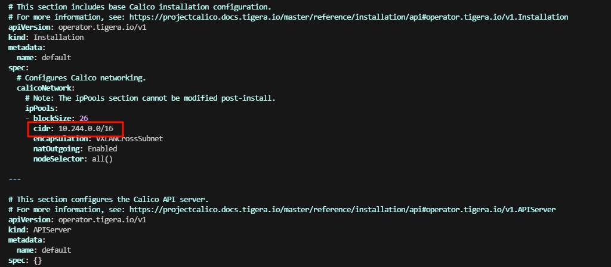

# 部署K8S節點集群

## Docker 環境準備

先將準備好的離線包使用 FileZilla 上傳到不同的 node 節點如下圖先配置站點


接著連線上去上傳即可


確認每台機器都有安裝包


接著先解壓縮 `tar -xf docker.tar.gz`如下圖


接著我們進去目錄中輸入指令安裝 `yum install -y ./*.rpm`


安裝完成後輸入指令 `systemctl status docker` 驗證如下圖


## 安裝K8S

配置K8S軟件包來安裝，這邊使用阿里雲，因為Google我測試不支持舊版

```shell
cat > /etc/yum.repos.d/k8s.repo <<EOF
[kubernetes]
name=Kubernetes
baseurl=https://packages.cloud.google.com/yum/repos/kubernetes-el7-x86_64
enabled=1
gpgcheck=1
repo_gpgcheck=1
gpgkey=https://packages.cloud.google.com/yum/doc/yum-key.gpg https://packages.cloud.google.com/yum/doc/rpm-package-key.gpg
exclude=ku
EOF
```

接著輸入下面指令

```shell
yum install -y --nogpgcheck kubeadm-1.23.0-0  kubelet-1.23.0-0 kubectl-1.23.0-0
```

- kubeadm：用於初始化集群，並配置集群所需的組件並生成對應的安全證書和令牌；
- kubelet：負責與 Master 節點通信，並根據 Master 節點的調度決策來創建、更新和刪除 Pod，同時維護 Node 節點上的容器狀態；
- kubectl：用於管理k8集群的一個命令行工具；


### Cgroup控制組

配置kubelet啟用Cgroup控制組，用於限制進程的資源使用量，如CPU、記憶體等

```shell
tee > /etc/sysconfig/kubelet <<EOF
KUBELET_EXTRA_ARGS="--cgroup-driver=systemd"
EOF
```

配置開機自動啟動

```shell
systemctl enable kubelet
```

## 集群初始化

查看集群所需鏡像文件

```shell
kubeadm config images list
```


接著執行命令，用來生成初始化配置的文件

```shell
kubeadm config print init-defaults > kubeadm-config.yaml
```

接著修改這個文件，主要幾點如下

```yaml
#本機的IP地址
advertiseAddress: 192.168.0.10

#本機名稱
name: master01

#集群鏡像下載地址，修改為阿里雲
imageRepository: registry.cn-hangzhou.aliyuncs.com/google_containers
```


在master主機上執行集群初始化命令如下

```shell
kubeadm init --config /root/kubeadm-config.yaml --upload-certs

#選項說明：
--upload-certs   //初始化過程將生成證書，並將其上傳到etcd存儲中，以便後續節點的加入入
```

拉取鏡像會花些時間，完成如下圖


接著根據提示操作如下命令

```shell
mkdir -p $HOME/.kube
cp -i /etc/kubernetes/admin.conf $HOME/.kube/config
chown $(id -u):$(id -g) $HOME/.kube/config
export KUBECONFIG=/etc/kubernetes/admin.conf
```

接著查看拉取結果 `docker images`


接著配置子節點，按照下圖複製對應的命令如下

```shell
kubeadm join 192.168.0.10:6443 --token abcdef.0123456789abcdef \
--discovery-token-ca-cert-hash sha256:66ddb643f46202381da6e15174243ccfaaab665aaa522f5ba5768a0a7ba073e5
```


如下執行結果


接著使用 `kubectl get nodes` 查看集群情況


## 安裝網路

Calico 和 Flannel 是兩種流行的 k8s 網絡插件，它們都為集群中的 Pod 提供網絡功能。然而，它們在實現方式和功能上有一些重要區別：

**網絡模型的區別：**

- Calico 使用 BGP（邊界網關協議）作為其底層網絡模型。它利用 BGP 為每個 Pod 分配一個唯一的 IP 地址，並在集群內部進行路由。[Calico 支持網絡策略，可以對流量進行精細控制，允許或拒絕特定的通信]()。
- Flannel 則採用了一個簡化的覆蓋網絡模型。它為每個節點分配一個 IP 地址子網，然後在這些子網之間建立覆蓋網絡。Flannel 將 Pod 的數據包封裝到一個更大的網絡數據包中，並在節點之間進行轉發。[Flannel 更注重簡單和易用性，不提供與 Calico 類似的網絡策略功能]()。

**性能的區別：**

- 由於 Calico 使用 BGP 進行路由，其性能通常優於 Flannel。[Calico 可以實現直接的 Pod 到 Pod 通信，而無需在節點之間進行額外的封裝和解封裝操作]()。這使得 Calico 在大型或高度動態的集群中具有更好的性能。
- Flannel 的覆蓋網絡模型會導致額外的封裝和解封裝開銷，從而影響網絡性能。對於較小的集群或對性能要求不高的場景，這可能並不是一個嚴重的問題。

在k8s-master01節點安裝Calico網絡即可，打開[網址](https://archive-os-3-26.netlify.app/calico/3.26/getting-started/kubernetes/quickstart/)


先根據步驟一配置 tigera-oprator.yaml 如下圖

```shell
kubectl create -f https://raw.githubusercontent.com/projectcalico/calico/v3.26.5/manifests/tigera-operator.yaml
```


這裡我們使用命令先拉取配置到本地

```shell
wget https://raw.githubusercontent.com/projectcalico/calico/v3.26.5/manifests/custom-resources.yaml
```

接著修改如下參數 `cidr: 10.244.0.0/16` 



接著執行，會發現根本沒跑起來

```shell
kubectl apply -f custom-resources.yaml
```

### 排查 Calico 無法執行原因

先查看 tigera 執行情況如下命令找到對應 pod

```shell
kubectl get pods -n tigera-operator
```


再查看日誌，可以看出沒有配置 podSubnet 導致異常！

```shell
kubectl logs -n tigera-operator tigera-operator-87b96fbcf-vwgwh
```


這裡我們需要重新初始化集群配置 `vim kubeadm-config.yaml`部分截圖如下


### 重新初始化集群

```shell
kubeadm reset -f

# 刪除 kubelet 的相關檔案
rm -rf /etc/kubernetes/manifests/*

# 清空 etcd 資料資料夾
rm -rf /var/lib/etcd

# 清除 CNI 配置和網路資料
rm -rf /etc/cni/net.d

# 重啟 kubelet 和 docker
systemctl restart kubelet
systemctl restart docker
```

重新初始化命令如下

```shell
kubeadm init --config /root/kubeadm-config.yaml --upload-certs
```

| 項目      | `serviceSubnet`                         | `podSubnet`                                 |
| ------- | --------------------------------------- | ------------------------------------------- |
| 作用      | 定義 Kubernetes 內 Service 的 IP 範圍         | 定義 Pod 的 IP 分配範圍                            |
| 主要用途    | 用於服務發現和負載平衡，確保服務有唯一的 Cluster IP         | 確保每個 Pod 有獨立的 IP 可以在集群內自由通訊                 |
| 儲存位置    | 在 `kubeadm` 初始化時設置（透過 `--service-cidr`） | 在 `kubeadm` 初始化時設置（透過 `--pod-network-cidr`） |
| IP 分配方式 | 通過 iptables NAT 將外部請求轉發到 Pod IP         | Pod 直接使用由 `podSubnet` 指定的 IP，Pod 間可直接通訊     |

### 刷新證書

使用命令 `kubectl get nodes` 查看出現下錯誤是因為 `kubectl` 客戶端無法驗證 Kubernetes API Server 所用的證書

出現錯誤 `Unable to connect to the server: x509: certificate signed by unknown authority (possibly because of "crypto/rsa: verification error" while trying to verify candidate authority certificate "kubernetes")`

重新配置管理文件如下命令

```shell
mkdir -p $HOME/.kube
cp -i /etc/kubernetes/admin.conf $HOME/.kube/config
chown $(id -u):$(id -g) $HOME/.kube/config
export KUBECONFIG=/etc/kubernetes/admin.conf
```

### 配置子節點

使用下述命令查看

```shell
kubeadm token create --print-join-command
```


接著按下面命令執行，先清除之前配置再添加

```shell
kubeadm reset -f
kubeadm join 192.168.0.10:6443 --token tyewks.w7gpuiunea6dzitp --discovery-token-ca-cert-hash sha256:076d741251f8fe441b2c5fb091bbf1b6e2b7c0819238a12d7d53b434b1f741e0
```


### 重新配置網路

使用下面命令來配置

```shell
kubectl create -f https://raw.githubusercontent.com/projectcalico/calico/v3.26.5/manifests/tigera-operator.yaml
kubectl apply -f custom-resources.yaml
```


## 測試部署 Pod

使用 master01 執行下面命令

```shell
# 創建
kubectl create deployment nginx --image=docker.io/library/nginx:1.20.0

# 暴露連接埠
kubectl expose deployment nginx --port=80 --type=NodePort
```

接著查看結果

```shell
kubectl get svc
```


接著打開瀏覽器查看


