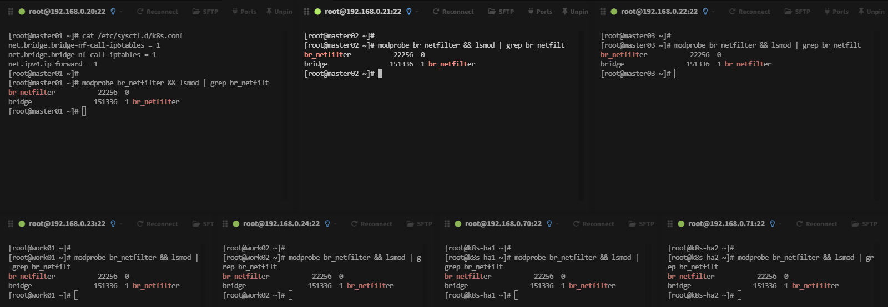
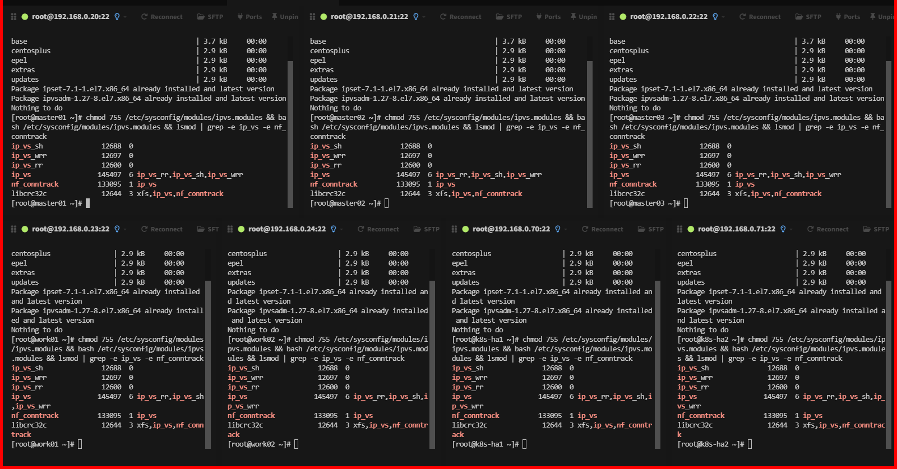
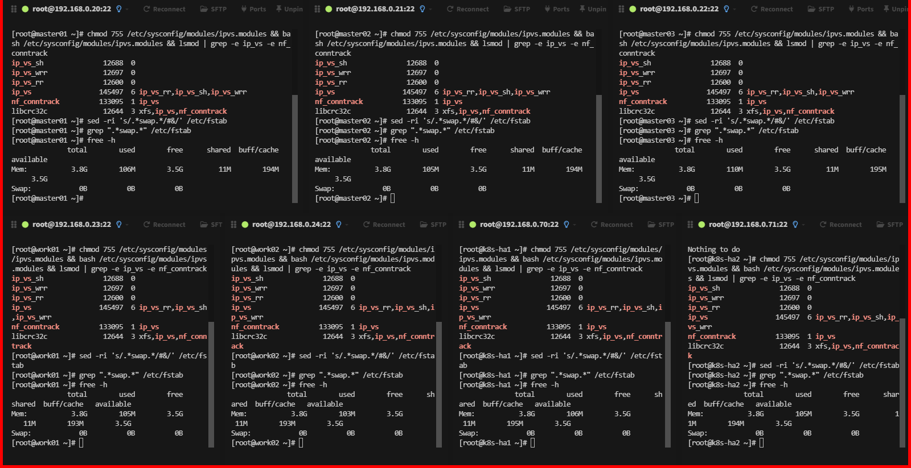
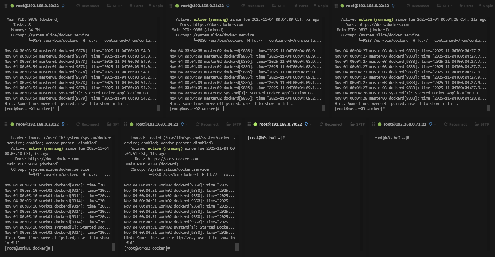
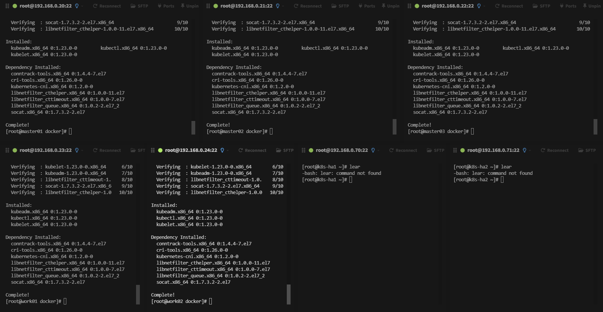
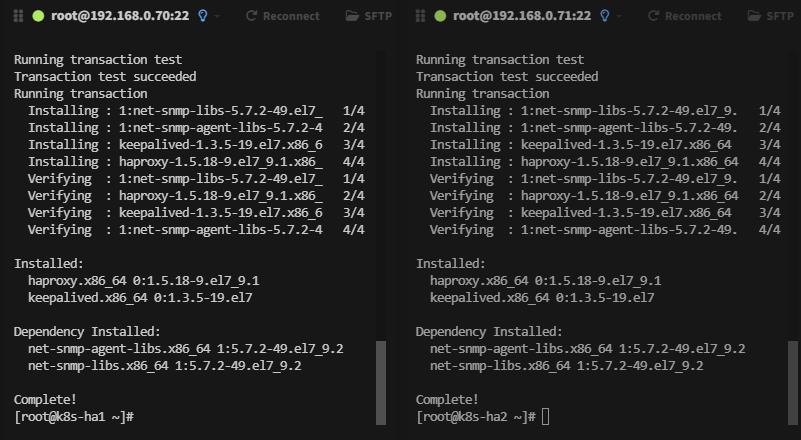
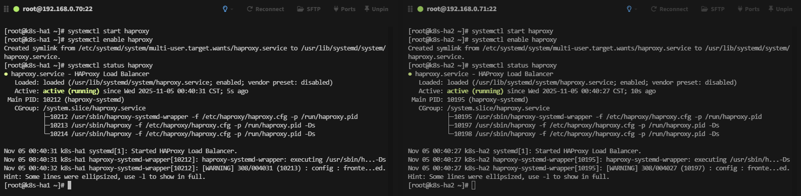

# Kubeadm 高可用環境準備

節點規劃如下

| 主機IP          | 主機名      | 主機配置  | 角色        |
| ------------- | -------- | ----- | --------- |
| 192.168.0.20  | master01 | 2C/4G | 管理節點      |
| 192.168.0.21  | master02 | 2C/4G | 管理節點      |
| 192.168.0.22  | master03 | 2C/4G | 管理節點      |
| 192.168.0.23  | worker01 | 2C/4G | 工作節點      |
| 192.168.0.23  | worker01 | 2C/4G | 工作節點      |
| 192.168.0.70  | k8s-ha1  | 1C/2G | LB        |
| 192.168.0.71  | k8s-ha2  | 1C/2G | LB        |
| 192.168.0.100 | /        | /     | VIP(虛擬IP) |

虛擬機配置完成後需要調整主機名稱

```shell
hostnamectl set-hostname master01
hostnamectl set-hostname master02
hostnamectl set-hostname master03
hostnamectl set-hostname worker01
hostnamectl set-hostname worker0
hostnamectl set-hostname k8s-ha1
hostnamectl set-hostname k8s-ha2
```

如下圖，接著重啟

配置集群之間本地解析，集群在初始化時需要能夠解析主機名

```shell
echo "192.168.0.10 master01" >> /etc/hosts
echo "192.168.0.11 master02" >> /etc/hosts
echo "192.168.0.12 master03" >> /etc/hosts
echo "192.168.0.13 worker01" >> /etc/hosts
echo "192.168.0.14 worker02" >> /etc/hosts
echo "192.168.0.70 k8s-ha1" >> /etc/hosts
echo "192.168.0.71 k8s-ha2" >> /etc/hosts
```

開啟bridge網橋過濾功能

bridge(橋接) 是 Linux 系統中的一種虛擬網絡設備，它充當一個虛擬的交換機，為集群內的容器提供網絡通信功能，容器就可以通過這個 bridge 與其他容器或外部網絡通信了。

```shell
cat > /etc/sysctl.d/k8s.conf <<EOF
net.bridge.bridge-nf-call-ip6tables = 1
net.bridge.bridge-nf-call-iptables = 1
net.ipv4.ip_forward = 1
EOF

#參數解釋
net.bridge.bridge-nf-call-ip6tables = 1  //對網橋上的IPv6數據包通過iptables處理
net.bridge.bridge-nf-call-iptables = 1   //對網橋上的IPv4數據包通過iptables處理
net.ipv4.ip_forward = 1       //開啟IPv4路由轉發,來實現集群中的容器與外部網絡的通信
```

執行下面命令

```shell
#由於開啟bridge功能，需要加載br_netfilter模塊來允許在bridge設備上的數據包經過iptables防火牆處理
modprobe br_netfilter && lsmod | grep br_netfilte

#參數解釋：
modprobe        //命令可以加載內核模塊
br_netfilter    //模塊模塊允許在bridge設備上的數據包經過iptables防火牆處理r
```

如下圖察看結果



重新加載配置

```shell
sysctl -p /etc/sysctl.d/k8s.conf
```

## 配置ipvs功能

在k8s中Service有兩種代理模式，一種是基於iptables的，一種是基於ipvs，兩者對比ipvs負載均衡算法更加的靈活，且帶有健康檢查的功能，如果想要使用ipvs模式，需要手動載入ipvs模塊。

ipset 和 ipvsadm 是兩個與網絡管理和負載均衡相關的軟件包，在k8s代理模式中，提供多種負載均衡算法，如輪詢（Round Robin）、最小連接（Least Connection）和加權最小連接（Weighted Least Connection）等；

```shell
yum -y install ipset ipvsadm
```

將需要加載的ipvs相關模塊寫入到文件中

```shell
cat > /etc/sysconfig/modules/ipvs.modules <<EOF
#!/bin/bash
modprobe -- ip_vs
modprobe -- ip_vs_rr
modprobe -- ip_vs_wrr
modprobe -- ip_vs_sh
modprobe -- nf_conntrack
EOF

#模塊介紹
ip_vs //提供負載均衡的模塊,支持多種負載均衡算法,如輪詢、最小連接、加權最小連接等
ip_vs_rr //輪詢算法的模塊（默認算法）
ip_vs_wrr //加權輪詢算法的模塊,根據後端服務器的權重值轉發請求
ip_vs_sh //哈希算法的模塊,同一客戶端的請求始終被分發到相同的後端服務器,保證會話一致性
nf_conntrack //鏈接跟蹤的模塊,用於跟蹤一個連接的狀態,例如 TCP 握手、數據傳輸和連接關閉等
```

執行文件來加載模塊

```shell
chmod 755 /etc/sysconfig/modules/ipvs.modules && bash /etc/sysconfig/modules/ipvs.modules && lsmod | grep -e ip_vs -e nf_conntrack
```



## 關閉SWAP分區

為了保證 kubelet 正常工作，k8s強制要求禁用，否則集群初始化失敗

```shell
#臨時關閉
swapoff -a

#永久關閉
sed -ri 's/.*swap.*/#&/' /etc/fstab
grep ".*swap.*" /etc/fstab
```

## 檢查swap

```shell
free -h
```



## Docker 環境準備

> 所有集群主机安装，不包括负载均衡节点

先使用 FileZilla 上傳 docker.tar.gz 接著輸入下面命令安裝

```shell
# 解壓縮
tar -xf docker.tar.gz
cd docker

# 離線安裝
yum install -y ./*.rpm
```

### 配置Cgroup驅動程序

啟用Cgroup控制組，用於限制進程的資源使用量，如CPU、內存資源

```shell
# 在/etc/docker/daemon.json添加如下內容
mkdir /etc/docker
cat > /etc/docker/daemon.json <<EOF
{
        "exec-opts": ["native.cgroupdriver=systemd"]
}
EOF

# 啟動Docker
systemctl start docker
systemctl enable docker
systemctl status docker
```



## 安裝K8S

這部分邏輯跟單節點保持一致，同樣要先配置下載倉庫

```shell
cat > /etc/yum.repos.d/k8s.repo <<EOF
[kubernetes]
name=Kubernetes
baseurl=https://mirrors.aliyun.com/kubernetes/yum/repos/kubernetes-el7-x86_64/
enabled=1
gpgcheck=1
repo_gpgcheck=1
gpgkey=https://mirrors.aliyun.com/kubernetes/yum/doc/yum-key.gpg https://mirrors.aliyun.com/kubernetes/yum/doc/rpm-package-key.gpg
EOF
```

接著輸入下面指令，還是三者都要安裝並指定版本

```shell
yum install -y --nogpgcheck kubeadm-1.23.0-0  kubelet-1.23.0-0 kubectl-1.23.0-0
```



### 配置 Cgroup 控制組

用於限制進程的資源使用量，如CPU、內存資源

```shell
tee > /etc/sysconfig/kubelet <<EOF
KUBELET_EXTRA_ARGS="--cgroup-driver=systemd"
EOF
```

接著先配置開機自動啟動

```shell
systemctl enable kubelet
```

## HAProxy 和 Keepalived 部署

此處的haproxy為apiserver提供反向代理，集群的管理請求通過VIP進行接收，haproxy將所有管理請求輪詢轉發到每個master節點上。

Keepalived為haproxy提供vip（192.168.0.100）在二個haproxy實例之間提供主備，降低當其中一個haproxy失效時對服務的影響。

.accets/17523a485b9e77fef907090500c74a5.jpg)

> 以下操作只需要在k8s-ha1、k8s-ha2配置。

安裝軟體包

```shell
yum -y install haproxy keepalived
```



### 共同修改 haproxy 配置

下面配置內容 ha1和ha2 保持一致

```shell
vim /etc/haproxy/haproxy.cfg
```

先`ggVG`（`gg` 跳到文件開始，`V` 進入行可視模式，`G` 跳到文件末尾並選中全部行），接著按 `d` 鍵刪除，接著按`i`插入模式貼上內容如下

```
#---------------------------------------------------------------------
# Example configuration for a possible web application.  See the
# full configuration options online.
#
#
#---------------------------------------------------------------------

#---------------------------------------------------------------------
# Global settings
#---------------------------------------------------------------------
global
  maxconn  2000                   #單個進程最大併發連接數
  ulimit-n  16384                 #每個進程可以打開的文件數量
  log  127.0.0.1 local0 err       #日誌輸出配置，所有日誌都記錄在本機系統日誌，通過 local0 輸出
  stats timeout 30s               #連接socket超時時間

defaults
  log global                      #定義日誌為global（全局）
  mode  http                      #使用的連接協議
  option  httplog                 #日誌記錄選項，httplog表示記錄與HTTP會話相關的日誌
  timeout connect 5000            #定義haproxy將客戶端請求轉發至後端服務器所等待的超時時長
  timeout client  50000           #客戶端非活動狀態的超時時長
  timeout server  50000           #客戶端與服務器端建立連接後，等待服務器端的超時時長
  timeout http-request 15s        #客戶端建立連接但不請求數據時，關閉客戶端連接超時時間
  timeout http-keep-alive 15s     # session 會話保持超時時間

frontend monitor-in               #監控haproxy服務本身
  bind *:33305                    #監聽的端口
  mode http                       #使用的連接協議
  option httplog                  #日誌記錄選項，httplog表示記錄與HTTP會話相關的日誌
  monitor-uri /monitor            #監控URL路徑

frontend k8s-master               #接收請求的前端名稱，名稱自定義，類似於Nginx的一個虛擬主機server。
  bind 0.0.0.0:6443               #監聽客戶端請求的 IP地址和端口（以包含虛擬IP）
  bind 127.0.0.1:6443 
  mode tcp                        #使用的連接協議
  option tcplog                   #日誌記錄選項，tcplog表示記錄與tcp會話相關的日誌
  tcp-request inspect-delay 5s    #等待數據傳輸的最大超時時間
  default_backend k8s-master      #將監聽到的客戶端請求轉發到指定的後端

backend k8s-master                #後端服務器組，要與前端中設置的後端名稱一致
  mode tcp                        #使用的連接協議
  option tcplog                   #日誌記錄選項，tcplog表示記錄與tcp會話相關的日誌
  option tcp-check                #tcp健康檢查
  balance roundrobin              #負載均衡方式為輪詢
  default-server inter 10s downinter 5s rise 2 fall 2 slowstart 60s maxconn 250 maxqueue 256 weight 100
  server master01   192.168.0.20:6443  check  # 根據自己環境修改後端實例IP
  server master02   192.168.0.21:6443  check  # 根據自己環境修改後端實例IP
  server master03   192.168.0.22:6443  check  # 根據自己環境修改後端實例IP
```

同時啟動 haproxy 如下命令

```shell
systemctl start haproxy
systemctl enable haproxy
systemctl status haproxy
```



### 修改 k8s-ha1 keepalived 配置

下面配置內容給 ha1

```shell
vim /etc/keepalived/keepalived.conf
```

先`ggVG`（`gg` 跳到文件開始，`V` 進入行可視模式，`G` 跳到文件末尾並選中全部行），接著按 `d` 鍵刪除，接著按`i`插入模式貼上內容如下

```
! Configuration File for keepalived
global_defs {
    router_id LVS_DEVEL
script_user root
    enable_script_security
}
vrrp_script chk_apiserver {
    script "/etc/keepalived/check_apiserver.sh"
    interval 5
    weight -5
    fall 2
rise 1
}
vrrp_instance VI_1 {
    state MASTER
    interface ens32
    virtual_router_id 51
    priority 101
    advert_int 2
    authentication {
        auth_type PASS
        auth_pass abc123
    }
    virtual_ipaddress {
        192.168.0.100/24
    }
    track_script {
       chk_apiserver
    }
}
```

配置文件詳解

```
#定義一個自定義腳本，名稱為chk_apiserver
vrrp_script chk_apiserver {
    #腳本所在的路徑及名稱
    script "/etc/keepalived/check_apiserver.sh"
    #監控檢查的時間間隔，單位秒
    interval 5
    #健康檢車的次數，連續2次健康檢查失敗，服務器將被標記為不健康
    fall 2
    #連續健康檢查成功的次數，有1次健康檢查成功，服務器將被標記為健康
    rise 1
}

#配置了一個名為VI_1的VRRP實例組
vrrp_instance VI_1 {
    #該節點在VRRP組中的身份，Master節點負責處理請求並擁有虛擬IP地址
    state MASTER
    #實例綁定的網絡接口，實例通過這個網絡接口與其他VRRP節點通信，以及虛擬IP地址的綁定
    interface ens32
    #虛擬的路由ID，範圍1到255之間的整數，用於在一個網絡中區分不同的VRRP實例組，但是在同一個VRRP組中的節點，該ID要保持一致
    virtual_router_id 51
    #實例的優先級，範圍1到254之間的整數，用於決定在同一個VRRP組中哪個節點將成為Master節點，數字越大優先級越>高
    priority 101
    #Master節點廣播VRRP報文的時間間隔，用於通知其他Backup節點Master節點的存在和狀態，在同一個VRRP組中，所有>節點的advert_int參數值必須相同
    advert_int 2
    #實例之間通信的身份驗證機制
    authentication {
        #PASS為密碼驗證
        auth_type PASS
    #此密碼必須為1到8個字符，在同一個VRRP組中，所有節點必須使用相同的密碼，以確保正確的身份驗證和通信
        auth_pass abc123
    }

    #定義虛擬IP地址
    virtual_ipaddress {
        192.168.0.100/24      
    }

    #引用自定義腳本，名稱與上方vrrp_script中定義的名稱保持一致
    track_script {
       chk_apiserver
    }
}
```

### 修改 k8s-ha1 檢測haproxy腳本


