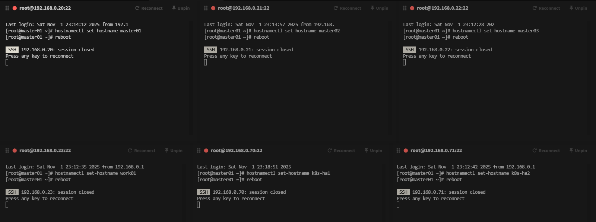

# Kubeadm 高可用環境準備

節點規劃如下

| 主機IP          | 主機名      | 主機配置  | 角色        |
| ------------- | -------- | ----- | --------- |
| 192.168.0.20  | master01 | 2C/4G | 管理節點      |
| 192.168.0.21  | master02 | 2C/4G | 管理節點      |
| 192.168.0.22  | master03 | 2C/4G | 管理節點      |
| 192.168.0.23  | worker01 | 2C/4G | 工作節點      |
| 192.168.0.70  | k8s-ha1  | 1C/2G | LB        |
| 192.168.0.71  | k8s-ha2  | 1C/2G | LB        |
| 192.168.0.100 | /        | /     | VIP(虛擬IP) |

虛擬機配置完成後需要調整主機名稱

```shell
hostnamectl set-hostname master01
hostnamectl set-hostname master02
hostnamectl set-hostname master03
hostnamectl set-hostname worker01
hostnamectl set-hostname k8s-ha1
hostnamectl set-hostname k8s-ha2
```

如下圖，接著重啟



配置集群之間本地解析，集群在初始化時需要能夠解析主機名


