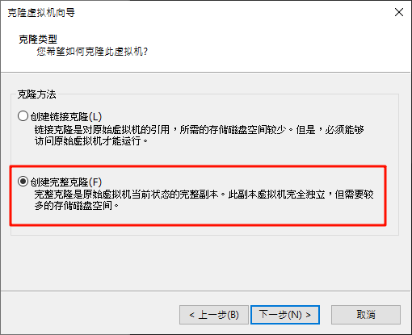
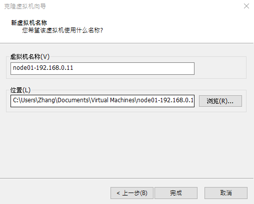
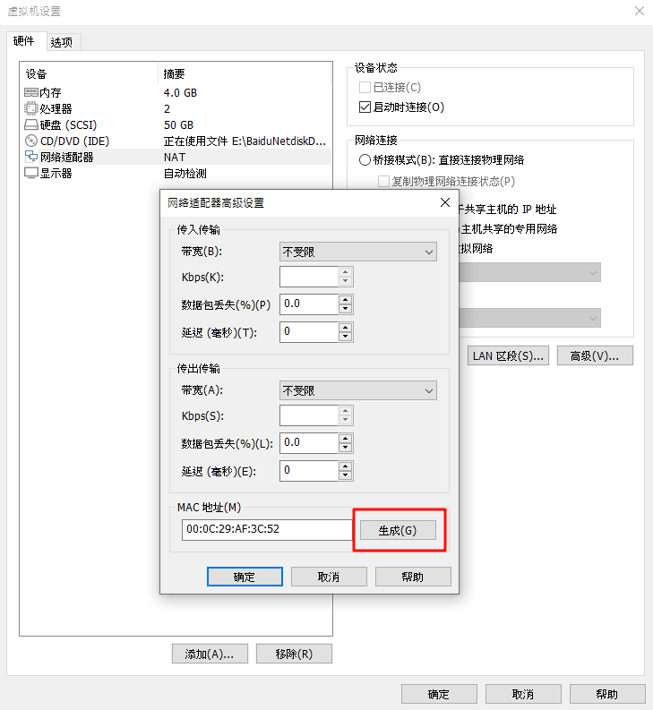
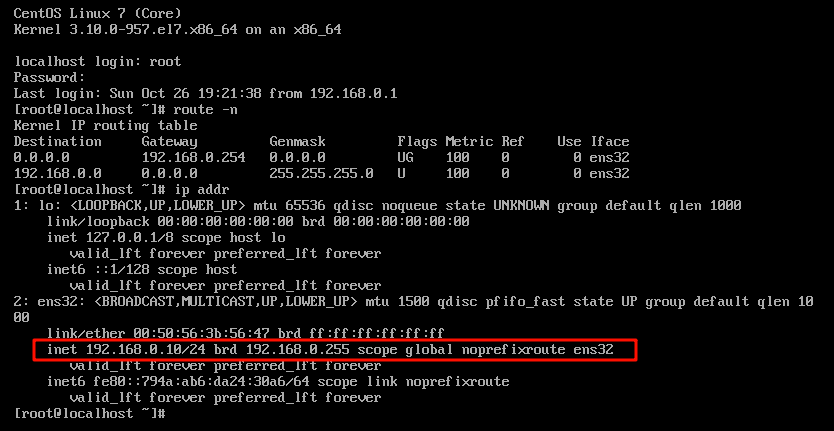
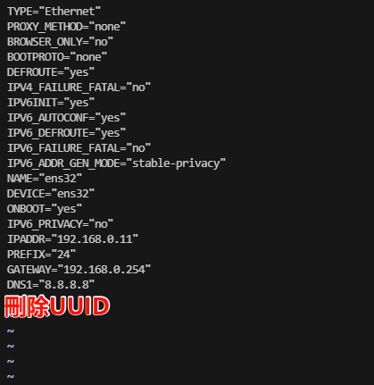
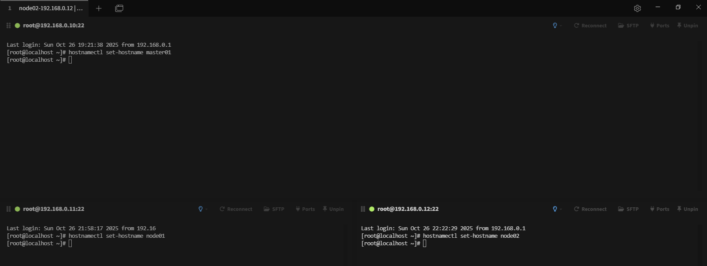
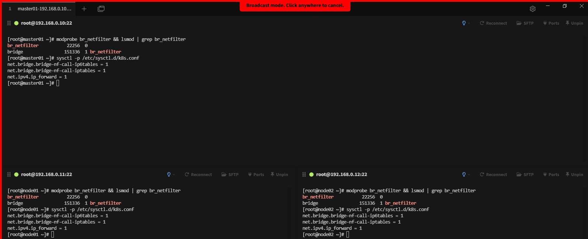
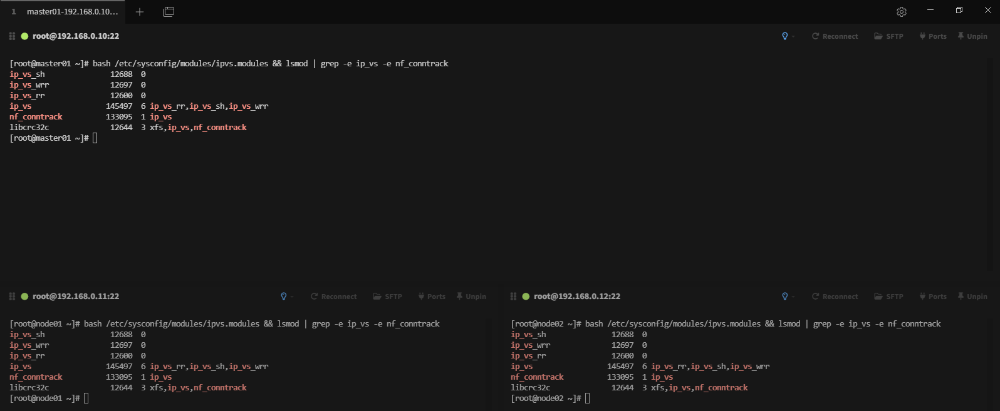
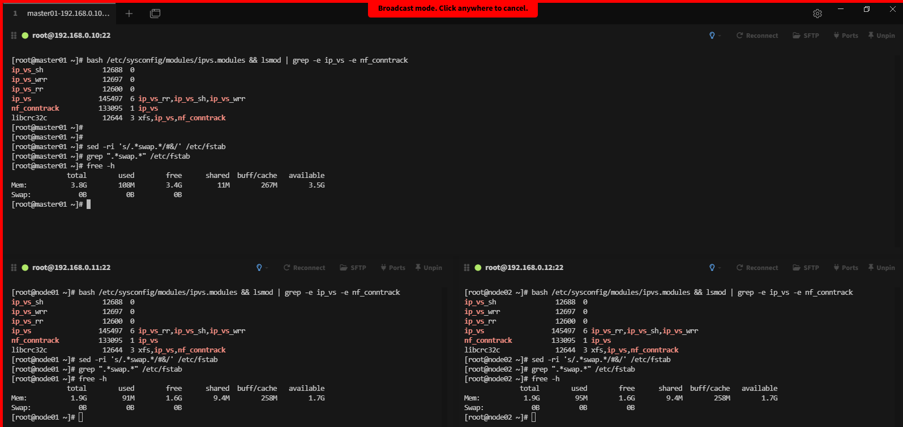

# Kubeadm 環境準備

## 克隆虛擬機

先手動建置好虛擬環境並關機，根據下圖重新克隆


這邊記得選擇完整



修改名稱



接著編輯克隆好的虛擬機設定如下圖，生成新的MAC位置



剛複製好的虛擬機IP位置跟原始相同，如下查看



## 修改IP位址

修改文件 `vim /etc/sysconfig/network-scripts/ifcfg-ens32` 最後重啟虛擬機即可



UUID 的作用

1. 唯一識別網路連線
   UUID 保證每個網卡設定檔在系統內唯一，即使多張網卡名稱相似（如 ens32, ens33），NetworkManager 仍能透過 UUID 找到對應的設定紀錄，確保啟動與管理正確對應 。

2. 避免網卡名稱變化導致錯誤
   有時候因為硬體變動或虛擬機克隆，Linux 會改變網卡名稱（例如從 ens32 變 ens33）。若使用 UUID，網路設定可自動綁定正確的連線記錄，不受名稱變動影響 。

3. 在虛擬機與雲環境中的穩定性
   對於克隆的虛擬機（如 VMware、KVM、VirtualBox），若多台機器的 UUID 相同，可能導致 NetworkManager 混淆而無法正常啟動網路。因此克隆後通常需刪除原 UUID 讓系統重新生成 。

## 集群配置

使用Tabby搭配 Ctrl + Alt + Shift + I（macOS 為 Cmd + Option + Shift + I）啟動 Broadcast mode，輸入指令如下

```shell
hostnamectl set-hostname xxx
```



測試節點之間的解析情況（使用Ctrl + Shift + V 贴上）

```sh
echo "192.168.0.10 master01" >> /etc/hosts
echo "192.168.0.11 node01" >> /etc/hosts
echo "192.168.0.12 node02" >> /etc/hosts
```

### 開啟橋接功能

所有機器同步執行下面命令，這一步驟主要是讓集群之間能夠互相訪問

```shell
cat > /etc/sysctl.d/k8s.conf <<EOF
net.bridge.bridge-nf-call-ip6tables = 1
net.bridge.bridge-nf-call-iptables = 1
net.ipv4.ip_forward = 1
EOF
```

- net.bridge.bridge-nf-call-ip6tables = 1  //對網橋上的IPv6數據包通過iptables處理

- net.bridge.bridge-nf-call-iptables = 1   //對網橋上的IPv4數據包通過iptables處理

- net.ipv4.ip_forward = 1       //開啟IPv4路由轉發,來實現集群中的容器與外部網絡的通信

執行下面命令載入模塊允許橋接設備經過ipatables

```shell
#由於開啟bridge功能，需要加載br_netfilter模塊來允許在bridge設備上的數據包經過iptables防火牆處理
modprobe br_netfilter && lsmod | grep br_netfilter

#加载配置文件，使上述配置生效
sysctl -p /etc/sysctl.d/k8s.conf
```



### 配置 IPVS 功能

在k8s中Service有兩種代理模式，一種是基於iptables的，一種是基於ipvs，兩者對比ipvs負載均衡算法更加的靈活，且帶有健康檢查的功能，如果想要使用ipvs模式，需要手動載入ipvs模塊。

`ipset` 和 `ipvsadm` 是兩個與網絡管理和負載均衡相關的軟件包，在k8s代理模式中，提供多種負載均衡算法，如輪詢（Round Robin）、最小連接（Least Connection）和加權最小連接（Weighted Least Connection）等；

```shell
yum -y install ipset ipvsadm
```

將需要加載的ipvs相關模塊寫入到文件中

```shell
cat > /etc/sysconfig/modules/ipvs.modules <<EOF
#!/bin/bash
modprobe -- ip_vs
modprobe -- ip_vs_rr
modprobe -- ip_vs_wrr
modprobe -- ip_vs_sh
modprobe -- nf_conntrack
EOF
```

模塊介紹

- ip_vs         //提供負載均衡的模塊,支持多種負載均衡算法,如輪詢、最小連接、加權最小連接等

- ip_vs_rr      //輪詢算法的模塊（默認算法）

- ip_vs_wrr     //加權輪詢算法的模塊,根據後端服務器的權重值轉發請求

- ip_vs_sh      //哈希算法的模塊,同一客戶端的請求始終被分發到相同的後端服務器,保證會話一致性

- nf_conntrack  //鏈接跟蹤的模塊,用於跟蹤一個連接的狀態,例如 TCP 握手、數據傳輸和連接關閉等

執行文件來加載模塊

```shell
bash /etc/sysconfig/modules/ipvs.modules && lsmod | grep -e ip_vs -e nf_conntrack
```

如下圖結果即可



### 關閉 SWAP 分區

這是K8S強制要求必須關閉，否則集群初始化會失敗

```shell
#临时关闭
swapoff -a

#永久关闭
sed -ri 's/.*swap.*/#&/' /etc/fstab
grep ".*swap.*" /etc/fstab
```

最後輸入命令 `free -h` 如下圖結果即可


