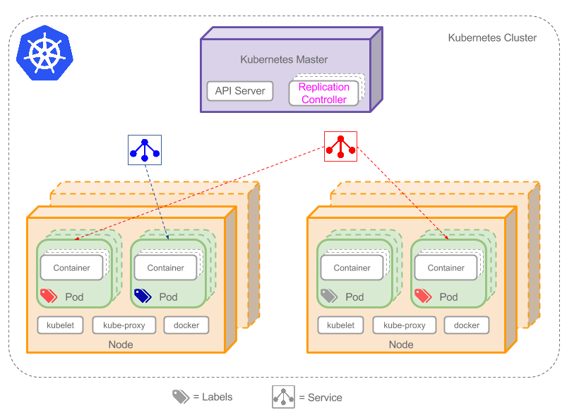

# 第一章：k8s资源管理方式

k8s是一个容器集群管理系统，在k8s中，所有内容都被抽象为资源对象，学习k8s主要学习如何管理资源对象。

```powershell
#所有资源可通过下面命令进行查看
kubectl api-resources
```


#### 常用资源对象介绍

| 资源名称                 | 缩写    | 资源作用            |
| ------------------------ | ------- | ------------------- |
| nodes                    | no,node | 集群组成部分        |
| namespaces               | ns      | 名称空间（隔离pod） |
| pods                     | po,pod  | 容器组              |
| replicationcontrollers   | rc      | Pod控制器           |
| replicasets              | rs      | Pod控制器           |
| deployments              | deploy  | Pod控制器           |
| daemonsets               | ds      | Pod控制器           |
| jobs                     |         | Pod控制器           |
| cronjobs                 | cj      | Pod控制器           |
| horizontalpodautoscalers | hpa     | Pod控制器           |
| statefulsets             | sts     | Pod控制器           |
| services                 | svc     | 四层负载均衡        |
| ingress                  | ing     | 七层负载均衡        |
| persistentvolumes        | pv      | 存储资源            |
| persistentvolumeclaims   | pvc     | 存储资源            |
| configmaps               | cm      | 配置资源            |
| secrets                  |         | 密钥资源            |
| serviceaccount           | sa      | 服务账户            |


#### 集群管理方式介绍

直接使用kubectl命令去管理k8s集群

```shell
kubectl run nginx-pod --image=nginx:1.18.0 --port=80
```


将配置写入到yaml文件，通过文件去管理k8s集群

```shell
kubectl create/apply -f nginx-pod.yaml
```


#### kubectl命令介绍

是k8s集群的命令行工具，通过它能过够对集群本身进行管理

```powershell
#获取命令帮助
kubectl --help
```


**kubectl常用命令如下**

| 命令         | 作用                           |
| :----------- | ------------------------------ |
| [create]()   | [创建资源]()                   |
| [apply]()    | [创建资源/更新资源]()          |
| [edit]()     | [编辑资源]()                   |
| [get]()      | [查看资源]()                   |
| [delete]()   | [删除资源]()                   |
| [explain]()  | [展示资源文档]()               |
| [describe]() | [显示资源详细信息]()           |
| [logs]()     | [输出pod中容器日志]()          |
| expose       | 在命令行暴露资源端口           |
| run          | 在命令行运行一个容器           |
| exec         | 进入Pod中的容器                |
| cp           | 在pod内外复制文件              |
| rollout      | 管理资源的版本                 |
| scale        | 扩(缩)容pod的数量              |
| label        | 标签管理命令                   |
| cluster-info | 显示集群信息                   |
| version      | 显示当前Server和Client版本信息 |


**命令格式：** `kubectl  [command]  [type]  [name]  [flags]`

- `command`：指定要对资源执行的操作，例如：`create、get、delete`

- `type`：指定资源类型，例如：`deployment、pod、service`

- `name`：指定资源名称，名称区分大小写

- `flags`：指定额外的可选参数，例如：`-o  wide|json|yaml`


#### kubectl命令练习

| 资源名称 | 缩写 | 资源作用 |
| -------- | ---- | -------- |
| pods     | pod  | 容器组   |

```powershell
#查看pod信息
kubectl get pod

#查看指定的pod（根据pod名字查找）信息
kubectl get pod nginx-696649f6f9-g5nds

#通过-o wide，显示pod更多信息，包括pod的IP地址，pod运行的节点等
kubectl get pod nginx-696649f6f9-g5nds -o wide

#通过-o json，以json格式显示信息
kubectl get pod nginx-696649f6f9-g5nds -o json

#通过-o yaml，以yaml格式显示
kubectl get pod nginx-696649f6f9-g5nds -o yaml

#通过describe查看pod详细信息
kubectl describe pod nginx-696649f6f9-g5nds
```


**扩展**：如果在node节点需要使用kubectl命令需要执行如下操作

```shell
#将master节点上的.kube目录复制到node节点上，该目录在root用户家目录下
scp -r /root/.kube worker01:/root
```


# 第二章：Namespace名称空间

#### Namespace名称空间介绍

Namespace（名称空间）是一种用于对集群中的资源进行逻辑分组和隔离的机制。它可以将集群中的资源划分为不同的命名空间，以便在同一集群中运行多个应用程序或服务时提供隔离和组织。 

不同 Namespace 的资源默认情况下是相互隔离的，即一个 Namespace 中的资源无法直接访问另一个 Namespace 中的资源。这意味着一个 Pod、Service 或其他资源只能在它们所属的 Namespace 内进行访问。 


**案例**：以一个`namespace`的创建和删除演示命令用法

| 资源名称   | 缩写 | 资源作用 |
| ---------- | ---- | -------- |
| namespaces | ns   | 隔离pod  |


查看集群中所有的 `namespace`

```powershell
kubectl get ns
```


#### default名称空间

`default` 作为集群默认的名称空间，在创建资源时，如果没有指定命名空间的情况下，资源对象将被自动分配在default中

```sh
#查看default中的Pod信息
kubectl get pod
```


#### kube-node-lease名称空间

`kube-node-lease` 用于管理集群节点租约（node lease），用于跟踪集群每个节点的健康状态，kubelet 负责定期向 kube-node-lease 命名空间中的节点发送心跳信号，以表明节点的健康状态。如果节点的心跳信号中断，控制平面将认为节点不再可用，并采取相应的措施，例如重新调度Pod到其他可用的节点上。 

```powershell
#查看kube-node-lease中的lease（租约）信息
kubectl get lease -n kube-node-lease


参数说明：
NAME		//节点名称
HOLDER		//持有该租约的节点
AGE			//租约节点存在的时间
```


#### kube-public名称空间

`kube-public` 用于存储集群的公共信息，其中包含集群的 CA证书、集群的元数据和配置信息（ 集群的名称、版本、网络配置、存储配置等），这些资源是以 ConfigMap 和 Secret 的形式存储的。

```sh
#查看kube-public中的ConfigMap信息（ConfigMap中存储集群的CA证书）
kubectl get cm -n kube-public

#查看kube-public中的Secret信息（Secret中存储集群的元数据）
kubectl get secret -n kube-public
```

提示：`kube-public` 空间中的资源对象和信息是只读的，不能直接进行修改或删除。它们由 k8ss 集群组件自动管理和更新。 


#### kube-system名称空间

`kube-system` 是集群系统级别的名称空间，用于托管和运行集群中核心组件（  kube-apiserver、kube-controller-manager、kube-scheduler、kube-proxy、coredns ），除了核心的系统组件，该空间还用于托管集群插件和附加组件，如网络插件（例如 Calico、Flannel）、日志聚合器（如 Elasticsearch、Fluentd、Kibana）、监控工具（如 Prometheus、Grafana）等。 

```sh
#查看kube-system中的Pod信息
kubectl get pod -n kube-system

#可以通过 all 可以查看名称空间中的Pods、Pod控制器、Service资源信息，而ConfigMap、Secret、PV、PVC 等资源无法通过 kubectl get all 命令显示
kubectl get all -n kube-system
```


#### 创建名称空间的方式

```sh
#创建一个名为dev的名称空间
kubectl create ns dev
kubectl get ns

#删除名称空间
kubectl  delete -n dev
```


# 第三章：资源管理之YAML语言

YAML可以被看作是一种文本文件的语法规范，k8s中几乎所有的资源都可以通YAML语法来创建。


#### YAML的语法特点

- YAML 语法使用缩进表示层级关系，缩进不允许使用tab键，只允许使用空格，空格数量没有严格要求，只要相同层级左对齐即可
- YAML 语法使用键值对的形式来表示数据，键和值之间使用英文冒号分隔，例如 `key: value` 
-  YAML 支持注释，以 `#` 开头表示注释，注释内容不会被YAML解析（被忽略）
- 如果需要将不同YAML配置放在同一个文件中，中间需要用 `---` 作为分隔
- 通过使用 `.yml` 或 `.yaml` 后缀名，可以清楚地标识该文件采用 YAML 格式编写 


#### YAML常用语法结构

**对象结构：**使用键值对的形式表示语法结构，其中键和值之间使用冒号分隔，例如：

```yaml
#对象形式一（推荐）
users:
    name: zhangsan
    age: 30
    address: tianjin

#对象形式二（了解）
user: {name: zhangsan，age: 30,address: tianjin}
```


如果需要将多个不同配置放在同一个文件中，中间需要用 --- 作为分隔，例如：

```yaml
users:
  name: zhangsan
  age: 30
  address: tianjin
---
users:
  name: lisi
  age: 25
  address: tianjin
```


**列表结构：**使用短横线 `-` 开头表示列表结构，在一个列表中，一个属性的多种配置都属于一个列表

```yaml
email:
  - zhangsan@qq.com
  - zhangsan@163.com
```


**嵌套结构：**YAML支持将对象和列表嵌套在其他对象或列表中，以构建复杂的结构。

```yaml
users:
  - name: zhangsan
    age: 30
    address: tianjin
    email:
      - zhangsan@qq.com
      - zhangsan@163.com
  - name: lisi
    age: 25
    address: tianjin
    email:
      - lisi@qq.com
      - lisi@163.com
```


#### YAML文件创建资源

**案例**：通过yaml文件创建一个test名称空间

参考地址：https://kubernetes.io/zh-cn/docs/tasks/administer-cluster/namespaces/

资源文档查询方法：`kubect explain  资源名称`      

```yaml
cat ns-test.yml

apiVersion: v1
kind: Namespace
metadata:
    name: test
```

```powershell
#执行文件创建ns
kubectl create -f ns-test.yml

#查看ns信息
kubectl get ns

#通过yaml文件删除ns
kubectl delete -f ns-test.yml
```


# 第四章：Pod与Pod控制器

#### Pod 介绍

Pod是k8s集群进行调度的最小单元，k8s会将Pod调度到集群中的节点上运行，一个Pod中可以存在一个或多个容器，这些容器共享Pod中的存储、网络等资源，所以我们可以把Pod看做一个抽象的逻辑主机，来为容器提供一个运行的环境。

|  |
| :----------------------------------------------------: |
|                         |


#### 静态 Pod

在k8s中，静态Pod也称之为无控制器管理的自主式Pod，这种Pod不由k8s的控制平面（如kube-apiserver、kube-scheduler、kube-controller-manager）进行管理， 而是由对应节点上的kubelet进程负责管理，这意味着它们不受k8的自动调度、健康检查或重器策略的控制， 因此通常不建议在生产环境中广泛使用静态Pod。 


**案例：**创建一个Nginx的静态Pod

参考地址：https://kubernetes.io/zh-cn/docs/concepts/workloads/pods/#using-pods

资源文档查询方法：`kubectl explain pod`

```yaml
cat static-web.yaml

apiVersion: v1
kind: Pod
metadata:
  name: static-web
spec:
  containers:
    - name: web
      image: nginx:1.18.0
```

```sh
#创建Pod
kubectl create -f static-web.yaml

#查看Pod信息
kubectl get pod

#删除Pod
kubectl delete pod static-web
```


#### Pod 资源清单

在k8s中基本所有资源的一级属性都是一样的，主要分为五部分：

- `apiVersion`    //资源版本，由k8s内部定义，版本号可以通过资源对应文档查询
- `kind`                 //资源类型，由k8s内部定义，类型可以通过资源对应文档查询
- `metadata`        //元数据，主要是指定资源标识与说明，常用的有name、namespace、labels等
- `spec`                //定义资源详细配置信息，这是资源对象中最重要的一部分
- `status`            //资源状态信息，里边的内容不需要定义，由资源自动生成


Pod配置参考地址：https://kubernetes.io/zh-cn/docs/tasks/configure-pod-container/

```yaml
以下是比较详细的资源清单介绍

KIND:     Pod  #资源类型
VERSION:  v1   #资源版本

FIELDS:        #资源可配置的属性，如下
apiVersion: v1   	#必选的一级属性，版本号，例如v1
kind: Pod			#必选的一级属性，资源类型，例如Pod
metadata:			#必选的一级属性，元数据
    name:			#资源名称
    namespace: test	#资源所属的名称空间，例如dev，默认为default名称空间
    labels:			#自定义标签列表
     - name:		#标签名称
spec:				#必选的一级属性
 containers:		#Pod中容器列表
 - name:			#容器名称
   image:			#容器镜像名称
   imagePullPolicy:	#镜像的拉取策略
   command:			#容器的启动命令列表，如不指定，使用打包时使用的启动命令
   args:			#容器的启动命令参数列表
   workingDir:		#容器的工作目录
   volumeMounts:	#挂载到容器内部的存储卷配置
   - name:			#引用pod定义的共享存储卷的名称
     mountPath:		#存储卷在容器内mount的绝对路径，应少于512字节
     readOnly:		#是否为只读模式
   ports:			#需要暴露的端口号列表
   - name:			#端口的名称
     containerPort:	#容器需要监听的端口号
     hostPort:		#容器所在的主机需要监听的端口号，默认与Container相同
     protocol:		#端口协议，支持TCP/UDP,默认为TCP
   env:				#容器运行前需要设置的环境变量列表
   - name:			#环境变量名称
     value:			#环境变量的值
   resources:		#资源限制和请求的设置		
     limits:		#资源最大限制的设置
        CPU:		#CPU资源限制，单位为core数，将用于docker run --cpu-shares参数
        memory:		#内存资源限制，单位可以为Mib/Gib，将用于docker run --memory参数
     requests:		#资源最小请求的设置
        CPU:		#CPU请求，容器启动的初始可用数量
        memory:		#内存请求，容器启动的初始可用数量
   lifecycle:		#生命周期钩子
     postStart:		#容器启动后立即执行此钩子，如果执行失败，会根据重启策略进行重启
     preStop:		#容器终止前执行此钩子，无论结果如何，容器都会终止
   livenessProbe:	#对Pod内个容器健康检查设置，当探测容器无响应后将自动重启该容器
   tcpSocket:		#对Pod内容器健康检查方式
   initialDelaySeconds:		#容器启动完成后，首次探测时间，单位为秒
   timeoutSeconds:			#对容器健康检查探测等待相应的超时时间，单位秒，默认1秒
   periodSeconds:			#对容器监控检查的定期探测时间设置，单位秒，默认10秒一次
 restartPolicy:		#Pod的重启策略
 nodeName:			#设置pod调度到指定的node节点上
 nodeSelector:		#设置Pod调度到指定的label的node节点上
 imagePullSecrets:	#拉取镜像时，使用secret名称，以key:secretkey格式指定
 hostNetwork:		#是否使用主机网络模式，默认为false，如果设置为true，表示使用宿主机网络
 volumes:			#在该Pod上定义共享存储卷列表
 - name:			#共享存储卷名称
   emptyDir:		#类型为emptyDir的存储卷
   hostPath:		#类型为hostPath的存储卷
     path:			#Pod所在宿主机的目录
   secret:			#类型为secret的存储卷，挂载secret对象到容器内部
   configMap:		#类型为configMap的存储卷，挂载configMap对象到容器内部
```


#### Pod 控制器

参考地址：https://kubernetes.io/zh-cn/docs/concepts/workloads/controllers/

在k8s中，Pod控制器（Controller）用于管理和控制Pod的生命周期、副本数和状态。Pod控制器的主要作用包括以下几个方面： 

- 副本管理：Pod控制器可以定义和管理Pod的副本数，确保指定数量的Pod副本在集群中运行。

- 自愈性和健康检查：Pod控制器通过监视Pod的健康状态来实现自愈性。如果Pod出现故障或终止，控制器会自动重启或创建新的Pod，以确保应用程序的高可用性和可靠性。

- 扩展性：使用Pod控制器，可以通过调整副本数来扩展应用程序。通过增加副本数，可以实现应对高负载的能力，并在负载减少时自动缩减副本数，从而实现资源的有效利用。

- 版本管理：Pod控制器还负责应用程序的滚动更新和版本回退。

- Pod调度规则：通过Pod控制器，可以确保Pod被调度到指定的节点上，以满足特殊的部署策略。


#### ReplicaSet 控制器

ReplicaSet（RS）控制器具备副本管理、自愈性和健康检查、扩展性、Pod调度规则等功能。


**案例**：通过RS控制器创建3个Nginx Pod

参考地址：https://kubernetes.io/zh-cn/docs/concepts/workloads/controllers/replicaset/

资源文档查询方法：`kubectl explain rs`

```yaml
# cat rs-nginx.yml

apiVersion: apps/v1     
kind: ReplicaSet        
metadata:               
    name: rs-nginx
    namespace: test     

spec:                   
    replicas: 3         		#创建pod的副本数量，默认为1
    selector:           		#标签选择器，通过标签指定RS管理哪些pod
      matchLabels:      		#标签类型（key-value）
        app: rs-nginx   		#匹配pod的标签（表示RS管理带有此标签的Pod）

    template:           		#pod的配置模板，通过模板创建Pod
      metadata:         		#定义模板元数据信息
        labels:         		#定义标签
          app: rs-nginx    		#标签名称（与selector中的标签保持一致）
          
      spec:						#定义容器的详细配置
        containers:				#定义容器列表
        - name: nginx			#定义容器名称
          image: nginx:1.18.0	#定义容器镜像
```

```powershell
#创建pod
kubectl create -f rs-nginx.yml

#查看pod信息
kubectl get po -n test

#查看pod控制器信息
kubectl get rs -o wide -n test

DESIRED		//期望的pod副本数量
CURRENT		//当前的pod副本数量
READY		//已经准备好提供服务的副本数量

#查看Pod详细信息
kubectl describe pod -n test
```


**案例**：通过RS控制器实现Pod数量的扩缩容功能

```yaml
#方式1：通过vim编辑配置文件来调整Pod的副本数，然后通过apply更新资源对象配置
#方式2：通过命令行直接修改 kubectl scale rs rs-nginx -n test --replicas=4
#方式3：通过edit（实时修改）更新资源对象的配置（资源配置文件不会跟着发生变化）

kubectl edit rs rs-nginx -n test
...
spec:
  replicas: 6     #修改pod的副本数


#查看pod信息
kubectl get pod -n test
```


删除RS方式

```powershell
#命令删除方式
kubectl delete rs rs-nginx -n test

#查看rs信息
kubectl get rs -n test

#配置文件删除方式
kubectl delete -f rs-nginx.yml
```


#### Deployment 控制器

Deployment（deploy）控制器是在RS控制器的基础上进行进一步扩展和增强的一种控制器，提供了更高级的功能和更便捷的应用程序管理方式。Deployment控制器的主要功能包括： 

- 具备RS所有功能：通过控制RS来实现对Pod的副本管理、自愈性和健康检查、扩展性、Pod调度规则等功能。
- 滚动更新：Deployment控制器支持应用程序的滚动更新， 确保应用程序在更新过程中的平滑过渡，避免服务中断。
- 版本管理：Deployment控制器可以管理应用程序的不同版本，可以轻松地进行版本切换和回滚。


**案例**：通过 Deployment 控制器创建3个Nginx Pod

参考地址：https://kubernetes.io/zh-cn/docs/concepts/workloads/controllers/deployment/

资源文档查询方法：`kubectl explain deploy`

```yaml
# cat deploy-nginx.yml

apiVersion: apps/v1
kind: Deployment
metadata:
    name: deploy-nginx
    namespace: test

spec:
    replicas: 3       			#创建pod的副本数量，默认为1
    selector:         			#标签选择器
      matchLabels:    			#标签类型（key-value）
        app: deploy-nginx    	#匹配pod的标签(表示deploy管理带有此标签的Pod)

    template:         			#pod的配置模板，通过模板创建pod
      metadata:					#定义模板元数据信息
        labels:					#定义标签
          app: deploy-nginx   	#标签名称（与select中的标签保持一致）

      spec:
        containers:
        - name: nginx
          image: nginx:1.17.0
```

```powershell
#创建deploy
kubectl create -f deploy-nginx.yml

#查看deploy信息
kubectl get deploy -n test
kubectl get deploy -n test -o wide

UP-TO-DATE		//最新版本的pod数量
AVAILABLE		//当前可用的pod数量


#查看rs信息，deploy通过控制rs管理pod，所以rs控制器也会被创建出来（rs的名称在deploy基础上随机生成）
kubectl get rs -n test 

#查看pod信息（pod名称是在rs基础上随机添加生成）
kubectl get po -n test

#查看Pod标签
kubectl get pod -n test --show-labels
```


#### Pod 生命周期

Pod 的生命周期分为几个阶段，主要用来让用户理解Pod的当前状态和问题所在：

- `Pending`：Pod 已经被系统接受，但是它需要完成一些准备工作才能运行。这些工作包括分配到指定节点上，下载容器镜像等。简单来说，这个阶段就是 Pod 的"准备"阶段。 

- `Running`：Pod 已经被分配到节点上，同时Pod中的所有容器都已经创建。至少有一个容器在运行、或处于启动、重启状态，这个阶段可以被看作是 Pod 的"运行"阶段。 

- `Succeeded`：Pod 的所有容器都已经成功完成了它们的任务并且都成功地终止了，并且不会再重启。这意味着，Pod 已经完成了它的生命周期并且不再需要。这个阶段看作是 Pod 的"完成"阶段。 

- `Failed`：Pod 中的所有容器都已经停止，但是至少有一个容器是因为失败而停止的。这意味着 Pod 在尝试完成它的任务时遇到了一些问题。这个阶段可以被看作是 Pod 的"失败"阶段。 

- `Unknown`：系统不能确定 Pod 的状态。通常是因为与Pod所在的主机通讯失败导致。这个阶段可以被看作是 Pod 的"未知"阶段。

- `CrashLoopBackOff`：这个状态通常意味着Pod 中的一个或多个容器在启动后立即崩溃，系统在重新启动它，但是连续多次尝试都失败了。 


#### Pod 镜像拉取策略

`imagePullPolicy` 属性用于设置镜像拉取策略，k8s支持三种拉取策略：

- `Always` 			   //总是从远程仓库拉取镜像
- `IfNotPresent`   //本地有则使用本地镜像，本地没有则从远程仓库拉取镜像
- `Never`                 //只使用本地镜像，从不去远程仓库拉取，本地如果没有就报错

默认值说明：如果镜像 `tag` 为具体版本号，默认策略是 `IfNotPresent` ，如果镜像标签为 `latest`，默认策略是`Always`


**案例**：创建pod，并指定镜像拉取策略为 `Never`，只使用本地镜像，从不去远程仓库拉取，本地如果没有就报错。

资源文档查询方法：`kubectl explain pod.spec.containers.imagePullPolicy`

```yaml
# cat deploy-nginx.yml
apiVersion: apps/v1
kind: Deployment
metadata:
    name: deploy-nginx
    namespace: test

spec:
    replicas: 1
    selector:
      matchLabels:
        app: deploy-nginx

    template:
      metadata:
        labels:
          app: deploy-nginx

      spec:
        containers:
        - name: nginx
          image: nginx:1.20.0       	#指定一个本地不存在的镜像版本
          imagePullPolicy: Never    	#设置镜像拉取策略
```

```shell
#更新pod配置
kubectl apply -f deploy-nginx.yml

#查看pod信息
kubectl get pod -n test

#查看pod详细信息
kubectl describe pod -n test
```


**案例**：创建pod，并指定镜像拉取策略为 `IfNotPresent`，本地有则使用本地镜像，本地没有则从远程仓库拉取镜像

```yaml
# cat deploy-nginx.yml

apiVersion: apps/v1
kind: Deployment
metadata:
    name: deploy-nginx
    namespace: test

spec:
    replicas: 1
    selector:
      matchLabels:
        app: deploy-nginx

    template:
      metadata:
        labels:
          app: deploy-nginx

      spec:
        containers:
        - name: nginx
          image: nginx:1.20.0
          imagePullPolicy: IfNotPresent		#设置镜像拉取策略
```

```shell
#更新pod配置
kubectl apply -f deploy_nginx.yml

#查看pod信息
kubectl get pod -n test

#查看pod详细信息
kubectl describe pod -n test
```


#### Pod 端口设置

`ports` 属性用于配置容器需要暴露的端口列表，支持的属性：

- `containerPort`		  //容器要监听的端口（不定义，采用默认端口）
- `name`						 	//端口名称，如果指定，必须保证名称在该pod中是唯一的（可以省略）
- `protocol`				    //端口协议，支持TCP、UDP，默认为TCP


**案例**：创建Pod并指定容器暴露80端口

资源文档查询方法：`kubectl explain pod.spec.containers.ports`

```yaml
# cat deploy-nginx.yml

apiVersion: apps/v1
kind: Deployment
metadata:
    name: deploy-nginx
    namespace: test

spec:
    replicas: 1
    selector:
      matchLabels:
        app: deploy-nginx

    template:
      metadata:
        labels:
          app: deploy-nginx

      spec:
        containers:
        - name: nginx
          image: nginx:1.20.0       
          imagePullPolicy: IfNotPresent
          ports:                			#定义容器端口
          - containerPort: 80   			#端口（必须为列表类型）
            protocol: TCP       			#端口协议
```

```shell
#更新pod配置
kubectl apply -f deploy-nginx.yml

#查看pod信息
kubectl get pod -n test

#查看pod详细信息
kubectl describe pod  -n test
...

    Port:           80/TCP


#访问pod中的容器需要访问pod的IP加容器端口
curl 10.244.2.30:80
```


#### Pod 资源配额

`resources` 属性用于限制Pod中的容器对系统的资源的使用量，避免容器出现问题大量吞噬系统资源，k8s目前提供了对**内存**和**CPU**的资源限制，当我们对Pod中的容器配置资源限额以后，如果容器超出资源使用量，k8s则会认位该容器出现故障，则重新启动该容器。

resources 支持的属性：

- `limits` 		//限制容器资源上限，当容器超出该使用量时，容器会被终止，并进行重启。

- `requests`    //限制容器需要的最小资源，如果环境资源不够，容器将无法启动，如果不定义，默认与 `limits` 相等。


**案例**：创建pod并设置容器的内存与CPU资源限额

参考地址：https://kubernetes.io/zh-cn/docs/tasks/configure-pod-container/assign-memory-resource/

资源文档查询方法：`kubectl explain pod.spec.containers.resources`

```yaml
# cat deploy-nginx.yml

apiVersion: apps/v1
kind: Deployment
metadata:
    name: deploy-nginx
    namespace: test

spec:
    replicas: 1
    selector:
      matchLabels:
        app: deploy-nginx

    template:
      metadata:
        labels:
          app: deploy-nginx

      spec:
        containers:
        - name: nginx
          image: nginx:1.20.0       
          imagePullPolicy: IfNotPresent
          ports:
          - containerPort: 80
            protocol: TCP
          resources:           	#定义资源限额
            limits:            	#资源上限
              cpu: "1"      	#表示一核心CPU资源
              memory: "128M"  	#内存单位可以使用G、M等形式
            requests:          	#资源下限
              cpu: "0.5"      	#表示0.5核心CPU资源
              memory: "64M"   	#所需最低内存资源（如果不足64M,容器无法启动）
```

```sh
#更新pod配置
kubectl apply -f deploy-nginx.yml

#查看pod信息
kubectl get pod -n test

#查看pod详细信息
kubectl describe pod -n test
...
    Limits:
      cpu:     500m
      memory:  128Mi
    Requests:
      cpu:        250m
      memory:     64Mi
```


#### Pod 多容器创建方式

**案例**：将nginx与tomcat放在同一个Pod中运行

```yaml
# cat vim deploy-nginx.yml

apiVersion: apps/v1
kind: Deployment
metadata:
  name: nginx-deployment
  namespace: test

spec:
  replicas: 1
  selector:
    matchLabels:
      app: deploy-nginx

  template:
    metadata:
      labels:
        app: deploy-nginx

    spec:
      containers:
      - name: nginx
        image: nginx:1.18.0
        imagePullPolicy: IfNotPresent
        ports:
        - name: web-nginx
          containerPort: 80
          protocol: "TCP"
        resources:
            limits: 
              cpu: "500m"
              memory: "128Mi"
            requests:
              cpu: "250m"
              memory: "64Mi"

	  #通过-name在定义一个容器的配置
      - name: tomcat
        image: tomcat:8.5-jre10-slim
        imagePullPolicy: IfNotPresent
        ports:
        - name: web-tomcat
          containerPort: 8080
          protocol: "TCP"
        resources:
            limits:
              cpu: "500m"
              memory: "128Mi"
            requests:
              cpu: "250m"
              memory: "64Mi"
```

```shell
#更新Pod配置
kubectl apply -f deploy-nginx.yml

#查看Pod信息
kubectl get pod -n test
```


#### 进入Pod中容器

格式：`kubectl exec -it -n 命名空间 pod名称 -c 容器名称 -- /bin/bash`

> 提示：-c 为可选项，如果是1个pod中只有1个容器，则不用指定，如果是1个pod中有多个容器，不指定默认为第1个容器。


**案例**：进入上述案例中创建的nginx容器与tomcat容器

查询命令帮助：`kubectl exec -h`

```powershell
#进入nginx容器
kubectl exec -it -n test deploy-nginx-579696c576-jfqz6 -c nginx -- /bin/bash

#进入tomcat容器
kubectl exec -it -n test deploy-nginx-579696c576-jfqz6 -c tomcat -- /bin/bash
```


#### 对Pod中容器执行命令

格式: `kubectl exec -n 名称空间 pod名 -c 容器名 -- 命令`

> 提示：没有 -it 选项

~~~powershell
#对nginx容器执行命令
kubectl exec -n test deploy-nginx-579696c576-jfqz6 -c nginx -- ls /opt

#对tomcat容器执行命令
kubectl exec -n test deploy-nginx-579696c576-jfqz6  -c tomcat -- ls /opt
~~~


#### Pod 环境变量

`env` 属性是用于设置容器环境变量的列表，环境变量的定义要根据容器具体需求定义，本章节只讲解如何定义环境变量，env支持的属性：

- `name`		   //定义环境变量名称
- `value`		 //定义变量值


**案例**：为MySQL添加环境变量设置root密码

资源文档查询方法：`kubectl explain pod.spec.containers.env`

```yaml
# cat vim mysql.yml

apiVersion: apps/v1
kind: Deployment
metadata:
    name: deploy-mysql
    namespace: test

spec:
    replicas: 1
    selector: 
      matchLabels:
        app: deploy-mysql

    template:
      metadata:
        labels:
          app: deploy-mysql

      spec:
        containers:
        - name: mysql
          image: mysql:5.7
          imagePullPolicy: IfNotPresent
          ports:
          - containerPort: 3306
            protocol: TCP
          env:                             #定义环境变量
          - name: "MYSQL_ROOT_PASSWORD"    #变量名称（必须为列表类型）
            value: "123456"                #变量值
```

```shell
#更新Pod配置
kubectl create -f mysql.yml

#查看Pod信息
kubectl get pod -n test

#查看Pod详细信息
kubectl describe pod  -n test

#删除Pod
kubectl delete -f mysql.yml
```


#### Pod 调度策略

在默认情况下，一个Pod被调度到哪个Node节点运行，是由Scheduler组件采用相应的算法计算出来的，这个过程是不受人工控制的，但是在实际工作中，我们想要控制某些Pod调度到指定的Node节点，就需要用到Pod调度，k8s提供了四种调度方式：

- 自动调度                  //由Scheduler对Pod进行调度，不受人工干预。
- 定向调度                  //人为的将Pod调度到指定的节点。
- 亲和性调度              //人为的将Pod调度到指定的节点。
- 反亲和性调度          //人为的将Pod调度到指定的节点。


**Pod定向调度**

定向调度是通过在pod上声明 `nodeName` 或者 `node Selector` 将pod调度到指定的节点上

- `nodeName`               //根据节点名称， 可以强制将Pod调度到指定的节点上。
- `node Selector`    //根据节点的标签，可以强制将Pod调度到指定的节点上。

> 定向调度属于强制调度，即使指定的Node节点不存在，也会向该节点进行调度，只不过pod运行失败而已。


**案例**：创建pod，并通过 `NodeName` 将Pod调度到 worker01节点

参考地址：https://kubernetes.io/zh-cn/docs/tasks/configure-pod-container/assign-pods-nodes/

资源文档查询方式：`kubectl explain pod.spec.nodeName`

```yaml
# cat deploy-nginx.yml

apiVersion: apps/v1
kind: Deployment
metadata:
    name: deploy-nginx
    namespace: test

spec:
    replicas: 1
    selector:         					
      matchLabels:    					
        app: deploy-nginx    			
    template:         					
      metadata:
        labels:
          app: deploy-nginx   			

      spec:
        nodeName: worker01   			#定义调度策略，并指定集群节点名称
        containers:
        - name: nginx
          image: nginx:1.20.0 
          imagePullPolicy: IfNotPresent
          ports: 
          - containerPort: 80
            protocol: TCP 
```

```sh
#更新pod配置
kubectl apply -f deploy-nginx.yml

#查看pod信息
kubectl get pod -o wide -n test 
```


**案例**：创建pod，并通过 `node Selector` 将pod调度到带有node=worker02标签的节点

```powershell
#worker02节点打标签
kubectl label node worker02 node=worker02

#查看节点标签
kubectl get node worker02 --show-labels | grep worker02
```


创建Pod并通过 `NodeSelector` 进行调度

```yaml
# cat deploy-nginx.yml

apiVersion: apps/v1
kind: Deployment
metadata:
    name: deploy-nginx
    namespace: test

spec:
    replicas: 1
    selector:
      matchLabels:
        app: deploy-nginx

    template:
      metadata:
        labels:
          app: deploy-nginx

      spec:
        nodeSelector:          #定义nodeSelector
          node: worker02       #指定节点标签
        containers:
        - name: nginx
          image: nginx:1.20.0
          imagePullPolicy: IfNotPresent
          ports:
          - containerPort: 80
            protocol: TCP
```

```shell
#更新pod配置
kubectl apply -f deploy-nginx.yml

#查看pod信息
kubectl get pod -o wide -n test 
```


**亲和性调度（Affinity）**：亲和性调度用于指定Pod与某些标签匹配的节点进行调度。

**反亲和性调度（Anti-Affinity）**：用于指定Pod与某些标签不匹配的节点进行调度。

根据官方说明，亲和性和反亲和性调度都需要相当的计算量，因此会在大规模集群中显著降低调度度速度。官方不建议在集群中使用这类设置。 


#### 污点和容忍

**污点（Taint）** 通过在节点上添加污点属性，来避免 Pod 被分配到不合适的节点上。

**容忍（Toleration）**通过在 Pod 上添加容忍属性，允许Pod被调度到带有污点的节点上。 


**污点属性说明：**

- `PreferNoSchedule`		//尽量避免调度（软限制），除非没有其他节点可调度。
- `NoSchedule`                    //拒绝调度（硬限制），但不会影响当前节点已经存在的pod。
- `NoExecute`                      //拒绝调度，同时驱逐已经存在的pod。


**污点案例1：**对 worker01节点设置污点 `PreferNoSchedule` ，尽量避免 Pod 的调度。

参考地址：https://kubernetes.io/zh-cn/docs/concepts/scheduling-eviction/taint-and-toleration/

命令查询方法：`kubectl taint --help`

设置污点格式：`kubectl taint node 节点名称 key=value:污点属性`

更新污点格式：`kubectl taint node 节点名称 key=value:新污点属性`

删除污点格式：`kubectl taint node 节点名称 key=value:污点-`

```shell
#设置污点PreferNoSchedule
kubectl taint node worker01 node=worker01:PreferNoSchedule

#通过Pod详细查看污点
kubectl describe node worker01 | grep -i taint
...
Taints:     node=worker01:PreferNoSchedule
```


为了演示污点效果，将worker02节点关机

```shell
# kubectl get nodes
...
worker02   NotReady  
```


将前边案例创建的Pod先删除掉

```shell
kubectl delete -f deploy-nginx.yml
```


把配置文件中定向调度属性删除，在进行创建，否则看不到效果，应为定向调度中nodeName属于强制调度，即便有污点，也会被调度。

```yaml
# cat deploy-nginx.yml

apiVersion: apps/v1
kind: Deployment
metadata:
    name: deploy-nginx
    namespace: test

spec:
    replicas: 1
    selector:
      matchLabels:
        app: deploy-nginx

    template:
      metadata:
        labels:
          app: deploy-nginx

      spec:
        nodeSelector:          #删除（或者注释掉）
          node: worker02       #删除（或者注释掉）
        containers:
        - name: nginx
          image: nginx:1.20.0
          imagePullPolicy: IfNotPresent
          ports:
          - containerPort: 80
            protocol: TCP
```

```shell
#创建pod
kubectl apply -f deploy-nginx.yml

#查看pod信息
kubectl get pod -o wide -n test 

#验证Pod如果已经被调度到worker01节点后，删除Pod
kubectl delete -f deploy-nginx.yml
```


**污点案例2：**对worker01节点设置污点 `NoScheduler` ， 拒绝 Pod 的调度。

```powershell
#更新node=worker01污点为NoSchedule
kubectl taint node worker01 node=worker01:NoSchedule

#查看污点信息
kubectl describe node worker01 | grep -i taint
...
Taints:             node=worker01:NoSchedule
```

```shell
#创建Pod
kubectl create -f deploy-nginx.yml

#查看Pod信息
kubectl get pod -o wide -n test 

#验证Pod如果无法被调度到worker01节点后，删除Pod
kubectl delete -f deploy-nginx.yml
```


[提示]()：使用kubeadm搭建的集群，默认就会给 Master 节点添加一个污点NodeSchedule，默认的Pod不会被调度到Master节点。

```powershell
kubectl describe node master01 | grep -i taint
kubectl describe node master02 | grep -i taint
kubectl describe node master03 | grep -i taint
```


**容忍 （Toleration）**：通过 `tolerations` 在 Pod 上添加容忍属性，来容忍特定的污点，即使节点上存在匹配的污点，也可以将Pod调度到该节点上，`tolerations` 属性说明:

- `key`					              //容忍污点的key名称
- `value`                             //key的值
- `effect`				           //容忍的污点（`IfNotPresent、NoSchedule`）


**案例**：继上述案例，创建pod并添加容忍，将pod调度到worker01节点

资源文档查询方法：`kubectl explain pod.spec.tolerations`

```yaml
# cat vim deploy-nginx.yml

apiVersion: apps/v1
kind: Deployment
metadata:
    name: deploy-nginx
    namespace: test

spec:
    replicas: 1
    selector:
      matchLabels:
        app: deploy-nginx

    template:
      metadata:
        labels:
          app: deploy-nginx

      spec:
        tolerations:            #添加容忍
        - key: "node"       	#污点的key（必须引起来）
          value: "worker01"		#key的值
          effect: NoSchedule    #容器的污点
          
        containers:
        - name: nginx
          image: nginx:1.17.0
          imagePullPolicy: IfNotPresent
          ports:
          - containerPort: 80
            protocol: TCP
```

```shell
#创建pod
kubectl create -f deploy-nginx.yml

#查看pod信息
kubectl get pod -o wide -n test 

#验证Pod如果已经被调度到worker01节点后，删除Pod
kubectl delete -f deploy-nginx.yml

#删除污点
kubectl taint node worker01 worker01:NoSchedule-
```


#### Pod 容器探测

容器探测类似于对容器进行健康检查，用来探测容器中的程序是否可以正常工作，如果探测到容器出现故障，k8s会尝试重启容器，如果重启失败，k8s不会将流量分配给该容器，不承担业务流量。


k8s提供了两种探针来实现对容器的探测，可通 `kubectl explain pod.spec.containers`  查看：

- `liveness Probe`	 //存活探针，检测容器是否为正常运行状态，如果不是，容器将会被重启。
- `readiness Probe`   //就绪探针，检测容器当前是否能接收请求，如果不能，k8s不会分配流量，也不会被重启。


以上两种探针目前均支持多种探测方式，可通过下边命令查看：

存活性探针属性查询：`kubectl explain pod.spec.containers.livenessProbe`

就绪性探针属性查询：`kubectl explain pod.spec.containers.readinessProbe`

- `exec`					              //通过在容器内执行命令，并根据返回的状态码来判断容器是否存活。 
- `tcpSocket`				        //通过检查容器的特定端口是否可以成功连接来判断容器是否存活。 
- `httpGet`					        //通过向容器发送HTTP请求，根据返回的状态码，判断容器是否存活。 
- `initialDelaySeconds`   //容器启动后等待多少秒执行第一次探测，默认为立即开始执行。
- `timeoutSeconds`			 //探测超时时间，默认1秒，最小可设置1秒。
- `failureThreshold`		 //连续探测失败多少次才被认定失败，默认3次为失败，最小可设置1。
- `periodSeconds`			   //执行探测频率，默认是10秒，最小可设置1秒。
- `successThreshold`		 //连续探测成功多少次才被认定为成功，默认1次。


**案例1：**以 `liveness Probe` 存活性探针为例，通过 `exec` 命令探测方式，在容器内执行命令，如果命令执行的退出码为 0，则程序正常，否则不正常。

参考地址：https://kubernetes.io/zh-cn/docs/tasks/configure-pod-container/configure-liveness-readiness-startup-probes/#define-a-liveness-HTTP-request

```yaml
# cat deploy-nginx.yml

apiVersion: apps/v1
kind: Deployment
metadata:
    name: deploy-nginx
    namespace: test

spec:
    replicas: 1
    selector: 
      matchLabels:
        app: deploy-nginx

    template:
      metadata:
        labels:
          app: deploy-nginx

      spec:
        containers:
        - name: nginx
          image: nginx:1.18.0
          imagePullPolicy: IfNotPresent
          ports:
          - containerPort: 80
            protocol: TCP
          livenessProbe:       						#定义探针
            exec:              						#定义探测方式
              command: [/bin/ls,/etc/hello.txt]  	#探测一个不存在的文件
```

```shell
#创建Pod
kubectl create -f deploy-nginx.yml

#查看Pod信息
kubectl get pod -n test

#查看Pod详细信息
kubectl describe pod -n test

#删除Pod
kubectl delete -f deploy-nginx.yml
```


探测一个存在的文件

```yaml
# cat deploy-nginx.yml

apiVersion: apps/v1
kind: Deployment
metadata:
    name: deploy-nginx
    namespace: test

spec:
    replicas: 1
    selector: 
      matchLabels:
        app: deploy-nginx

    template:
      metadata:
        labels:
          app: deploy-nginx

      spec:
        containers:
        - name: nginx
          image: nginx:1.18.0 
          imagePullPolicy: IfNotPresent
          ports:
          - containerPort: 80
            protocol: TCP
          livenessProbe:
            exec:
              command: [/bin/ls,/etc/passwd]  	#探测一个存在的文件
```

```shell
#创建Pod
kubectl create -f deploy-nginx.yml

#查看Pod信息
kubectl get pod -n test

#查看Pod详细信息
kubectl describe pod -n test

#删除Pod
kubectl delete -f deploy-nginx.yml
```


**案例2：**以 readiness Probe就绪性探针为例，通过 tcpSocket 检查容器的特定端口是否可以成功连接来判断容器是否可以接收请求。

```yaml
# cat deploy-nginx.yml

apiVersion: apps/v1
kind: Deployment
metadata:
    name: deploy-nginx
    namespace: test

spec:
    replicas: 1
    selector:
      matchLabels:
        app: deploy-nginx

    template:
      metadata:
        labels:
          app: deploy-nginx

      spec:
        containers:
        - name: nginx
          image: nginx:1.18.0
          imagePullPolicy: IfNotPresent
          ports:
          - containerPort: 80
            protocol: TCP
          readinessProbe:       	#定义探针
            tcpSocket:         		#定义探测方式
              port: 8080       		#探测一个不存在的端口
            initialDelaySeconds: 3	#容器启动后等待3秒执行探测
            periodSeconds: 3	 	#执行探测频率为3秒
```

```shell
#创建pod
kubectl create -f deploy-nginx.yml

#查看Pod信息
kubectl get pod -n test

#查看Pod详细信息
kubectl describe pod -n test

#删除Pod
kubectl delete -f deploy-nginx.yml
```


探测一个存在的端口

```yaml
# cat deploy-nginx.yml

apiVersion: apps/v1
kind: Deployment
metadata:
    name: deploy-nginx
    namespace: test

spec:
    replicas: 1
    selector:
      matchLabels:
        app: deploy-nginx

    template:
      metadata:
        labels:
          app: deploy-nginx

      spec:
        containers:
        - name: nginx
          image: nginx:1.18.0
          imagePullPolicy: IfNotPresent
          ports:
          - containerPort: 80
            protocol: TCP
          livenessProbe:
            tcpSocket:
              port: 80         	#探测一个存在的端口
            initialDelaySeconds: 3	#容器启动后等待3秒执行探测
            periodSeconds: 3	 	#执行探测频率为3秒
```

```shell
#创建pod
kubectl create -f deploy-nginx.yml

#查看Pod信息
kubectl get pod -n test

#查看Pod详细信息
kubectl describe pod -n test

#删除Pod
kubectl delete -f deploy-nginx.yml
```


**案例3：**以 readiness Probe就绪性探针为例，通过 httpGet 像容器发送HTTP请求，来判断容器是否可以接收请求。

```yaml
# cat deploy-nginx.yml

apiVersion: apps/v1
kind: Deployment
metadata:
  name: deploy-nginx
  namespace: test

spec:
#  replicas: 3
  selector:
    matchLabels:
      app: deploy-nginx

  template:
    metadata:
      labels:
        app: deploy-nginx

    spec:
      containers:
      - name: nginx
        image: nginx:1.20.2
        ports:
        - name: http-nginx
          containerPort: 80
          protocol: TCP
        imagePullPolicy: IfNotPresent
        resources:
          limits: 
            cpu: "1"
            memory: "200M"
          requests:
            cpu: "0.5"
            memory: "128M"
        readinessProbe:				#就绪探针
          httpGet:					#发送HTTP请求
            path: /index.html		#请求的页面
            port: 80				#端口
          initialDelaySeconds: 3	#容器启动后等待3秒执行探测
          periodSeconds: 3			#执行探测频率为3秒
```


#### Pod 重启策略

参考地址：https://kubernetes.io/zh-cn/docs/concepts/workloads/pods/pod-lifecycle/#restart-policy

当Pod中的容器一旦出现了问题，K8s就会对容器所在的Pod进行重启，重启操作是由Pod的重启策略决定，Pod的重启策略有三种，可通过 `kubectl explain pod.spec.restartPolicy` 查看：

- Always				//容器异常时，自动重启该容器，默认策略

- OnFailure		   //容器终止运行，且退出码不为0时重启（异常终止）

- Never				  //无论容器状态如何，都不重启该容器

重启操作延时：首次立即重启，随后为 10s、20s、40s、80s、160s、300s，最长延时为 300s，以后重启延时均为 300s，直至重启成功。


#### Pod 更新策略

Deployment 控制器支持两种 Pod 更新的策略，通过 `strategy` 属性进行配置，可通过 `kubectl explain deploy.spec.strategy` 查看：

- `Recreate`（重建更新）         //首先停止所有旧的Pod副本，然后再创建新的Pod副本，直到新的Pod副本完全就绪。
- `RollingUpdat`（滚动更新） //逐步替换旧的Pod副本，以确保在更新过程中服务的持续可用性，也是默认策略。


**案例**：通过 `Recreate` 对Pod进行重建更新

```yaml
# cat deploy-nginx.yml

apiVersion: apps/v1
kind: Deployment
metadata:
    name: deploy-nginx
    namespace: test

spec:
    strategy:           #更新策略
      type: Recreate    #策略类型
    replicas: 3         #创建Pod数量
    selector:
      matchLabels:
        app: deploy-nginx

    template:
      metadata:
        labels:
          app: deploy-nginx

      spec:
        containers:
        - name: nginx
          image: nginx:1.18.0       
          imagePullPolicy: IfNotPresent
          ports:
          - containerPort: 80
            protocol: TCP
```

```shell
#创建pod
kubectl create -f deploy-nginx.yml

#另外开一个终端查看pod的信息，-w（Watch）选项可以持续监视资源的变化
kubectl get pod -w -n test 
```

```yaml
#更新镜像版本
kubectl edit deploy deploy-nginx -n test
...
    spec:
      containers:
      - image: nginx:1.20.0    #指定新版本
```

观察pod的重建过程：

- 第一步：将Running的pod先终止（Terminating）

- 第二步：接下来创建新Pod，新Pod刚开始处于等待状态（Pending）

- 第三步：创建容器（ContainerCreating）

- 第四步：新的容器被创建且以成功运行（Running ）

```shell
#查看Pod信息
kubectl get pod -n test

#查看deploy信息
kubectl get deploy -o wide -n test 

#删除Pod
kubectl delete -f deploy-nginx.yml
```


**案例**：通过 `RollingUpdat` 对Pod进行滚动更新，可以通过以下属性控制Pod的更新数量：

- `maxUnavailable`    //用来指定在升级过程中最多可停止的pod数量，默认为25%

- `maxSurge`                //用来指定在升级过程中最多可新建的pod数量，默认为25%

```shell
strategy:
  type: RollingUpdate
  rollingUpdate:
    maxUnavailable: 1
    maxSurge: 1
```

```yml
# cat deploy-nginx.yml

apiVersion: apps/v1
kind: Deployment
metadata:
    name: deploy-nginx
    namespace: test

spec:
    strategy:           
      rollingUpdate:			#滚动更新
        maxUnavailable: 1		#最多停止的Pod数量为1个
        maxSurge: 1				#最多新建的Pod数量为1个
    replicas: 3
    selector:
      matchLabels:
        app: deploy-nginx

    template:
      metadata:
        labels:
          app: deploy-nginx

      spec:
        containers:
        - name: nginx
          image: nginx:1.18.0       
          imagePullPolicy: IfNotPresent
          ports:
          - containerPort: 80
            protocol: TCP
```

```shell
#创建pod
kubectl create -f deploy-nginx.yml

#另外一个终端动态查看pod信息
kubectl get pod -w -n test
```

```yaml
#更新镜像版本
kubectl edit deploy deploy-nginx -n test
    spec:
      containers:
      - image: nginx:1.20.0
```

```shell
#查看Pod信息
kubectl get pod -n test

#查看deploy信息
kubectl get deploy -o wide -n test 

#查看RS信息，当pod滚动更新后，rs也会随之跟着更新，原有rs中的pod会被删除，但是原有的rs并不会删除，用于做版本回退
kubectl get rs -o wide -n test
```


#### Pod 版本回退

Deploy支持滚动升级过程中的暂停、继续、回退等功能，具体功能如下：

命令格式：`kubectl rollout <command> [选项]`   

- `status`            //显示当前升级状态
- `history`          //显示升级历史记录
- `pause`              //暂停升级过程
- `resume`            //继续升级过程
- `restart`          //重启升级过程
- `undo`                //版本回退（可以通过--to-revision切换到指定版本）


**案例**：多次更新镜像版本，随后对版本进行回退

```yaml
#升级镜像版本
kubectl edit deploy deploy-nginx -n test
    spec:
      containers:
      - image: nginx:1.20.1

#升级镜像版本
kubectl edit deploy deploy-nginx -n test
    spec:
      containers:
      - image: nginx:1.21.0
```

```shell
#通过 kubectl rollout status 显示当前升级的状态
kubectl rollout status deploy deploy-nginx -n test

#查看deploy当前使用的版本
kubectl get deploy -o wide -n test

#查看当前所有版本（通过rs可以查看）
kubectl get rs -o wide -n test

#通过 kubectl rollout history 查看升级历史记录
kubectl rollout history deploy deploy-nginx -n test

#通过 kubectl rollout history --revision=版本编号，查看具体版本详细信息
kubectl rollout history --revision=2 deploy deploy-nginx -n test

#通过 kubectl rollout undo --to-revision=版本编号，可直接回退到1版本，如果省略这个选项，就是回退到上个版本
kubectl rollout undo --to-revision=1 deploy deploy-nginx -n test

#查看当前使用的版本
kubectl get deploy -o wide -n test

#查看升级历史记录
kubectl rollout history deploy deploy-nginx -n test
```


#### DaemonSet 控制器

DaemonSet（DS）控制器在功能方面与Deployment控制器几乎一样，支持滚动更新、版本回退等， 但DaemonSet适合部署系统级别的服务，如日志收集、节点监控、节点代理、网络插件等，以下是DaemonSet的特点及应用场景：

> 提示：DaemonSet不通过控制RS管理Pod。

- 每个节点只有一个副本：DaemonSet确保每个节点上都运行一个Pod副本（如：日志收集、节点监控、节点代理等），当新的节点加入集群时，DaemonSet会自动创建并调度Pod到这个新节点上。相反，如果节点从集群中被移除，这个节点上的Pod将被垃圾回收。

- 支持Pod的故障自动恢复：如果DaemonSet控制的Pod发生故障，它会自动重启Pod，如果Pod被删除，他会在节点重建新的Pod，以保证服务的可用性。

- 滚动更新：DaemonSet支持滚动更新，这使得你可以对运行在所有节点上的Pod进行版本更新操作，而不会影响到整个服务的可用性。

- 特定节点运行：也可以通过在DaemonSet的Pod模板中设置nodeSelector来让DaemonSet仅在满足某种条件的节点上运行。


**案例**1：通过 DaemonSet 控制器创建Nginx Pod，并保证在每个节点都运行。

参考地址：https://kubernetes.io/zh-cn/docs/concepts/workloads/controllers/daemonset/

资源文档查询方法：`kubectl explain ds`

```yaml
# cat ds-nginx.yml

apiVersion: apps/v1
kind: DaemonSet
metadata:
  name: ds-nginx
  namespace: test

spec:
  selector:
    matchLabels:
      name: ds-nginx

  template:
    metadata:
      labels:
        name: ds-nginx

    spec:
#      tolerations:        		#如果节点有污点且需要调度，需要通过添加容忍来调度
#      - key: 					#污点key
#        value:					#污点的值
#        effect: NoSchedule		#污点类型
      containers:
      - name: nginx
        image: nginx:1.18.0
        ports:
        - containerPort: 80
```

```shell
#创建Pod
kubectl create -f ds-nginx.yml

#查看Pod信息
kubectl get pod -n test -o wide

#查看ds信息
kubectl get ds -n test

#删除Pod
kubectl delete -f ds-nginx.yml
```


**案例**2：通过 DaemonSet 控制器创建Nginx Pod，并通过 `nodeSelector` 让Pod仅在master01、master02节点运行。

为master01、master02节点打标签

```shell
#master01、master02节点打标签
kubectl label node master01 master02 k8s=master

#查看节点标签
kubectl get node master01 master02 --show-labels | grep master
```


检查节点是否存在污点

```shell
kubectl describe node master01 master02 | grep -i taint
Taints:             master:NoSchedule
Taints:             master:NoSchedule
```


创建Pod，并通过 `nodeSelector` 让Pod仅在master01、master02节点运行。

```yaml
# cat ds-nginx.yml

apiVersion: apps/v1
kind: DaemonSet
metadata:
  name: ds-nginx
  namespace: test

spec:
  selector:
    matchLabels:
      name: ds-nginx

  template:
    metadata:
      labels:
        name: ds-nginx

    spec:
      nodeSelector:          #定义nodeSelector
        k8s: master          #指定节点标签
      tolerations:           #如果节点有污点，需要通过添加容忍来调度
      - key: master          #污点key
        value:               #污点的值
        effect: NoSchedule   #污点类型
      containers:
      - name: nginx
        image: nginx:1.18.0
        ports:
        - containerPort: 80
```

```shell
#创建Pod
kubectl create -f ds-nginx.yml

#查看Pod信息
kubectl get pod -n test -o wide

#查看ds信息
kubectl get ds -n test

#删除Pod
kubectl delete -f ds-nginx.yml
```


#### HPA 控制器

HPA（Horizontal Pod Autoscaler）控制器， 可帮助Deployment 或者StatefulSet 根据CPU利用率自动调整Pod副本数量，它获取每个Pod的CPU指标，然后和HPA中定义的CPU指标进行对比，同时计算出需要增加或者删除的具体数量，最后实现pod的数量的自动（非手动）调整。以下是HPA控制器的主要特点： 

- 自动扩缩容：HPA可以根据实际的工作负载自动调整Pod的副本数，以实现Pod的水平扩缩。这对于那些工作负载波动较大的应用非常有用。

- CPU利用率：HPA可以基于CPU利用率来自动调整Pod的副本数。当Pod的平均CPU利用率超过预定的目标时，HPA会增加Pod的副本数；反之，则减少副本数。

- 稳定性：HPA会根据规定的最小和最大副本数进行扩缩，不会导致副本数无休止的增加或者减少，这有助于保持系统的稳定性。

- 与Metrics Server协同工作：HPA依赖于Metrics Server（资源监控组件），通过Metrics Server获取到实时的监控数据，来决定是否需要增加或减少Pod的副本数。


**metrics-server 资源监控**

Metrics Server是Kubernetes的一个核心监控组件，它用于收集和存储每个节点和Pod的资源使用情况，如CPU和内存等。以下是Metrics Server的主要作用：

- 提供资源使用情况的数据：Metrics Server会周期性地从每个节点和Pod收集CPU和内存使用情况，并存储在内存中。

- 支持自动扩缩：Metrics Server的数据是HPA做自动扩缩容决策的重要依据。HPA根据Metrics Server提供的数据来决定是否需要增加或减少Pod的副本数。

- 支持kubectl top命令：kubectl top命令用于显示Node或Pod的CPU和内存使用情况。这个命令需要Metrics Server的支持才能工作。

请注意，Metrics Server并不提供长期的指标存储和数据可视化，只提供实时的资源使用情况。如果需要长期存储和数据可视化，或者需要收集更多种类的指标（如网络流量、磁盘使用等），需要使用其他的监控系统，如Prometheus等。


下载Metrics Server资源文件

```shell
wget https://github.com/kubernetes-sigs/metrics-server/releases/latest/download/components.yaml
```


在文件中添加 `--kubelet-insecure-tls` 参数，忽略证书检测  ，默认情况下Metrics Server 会使用 TLS 方式与 Kubelet 通信， 而 Kubelet 使用的是自签名证书，Metrics Server 无法验证，进而导致通信失败。 

```yaml
# vim components.yaml
...
      - args:
        - --kubelet-insecure-tls     #忽略证书检测
```


生成Metrics Server证书签名请求文件

```shell
cat > metrics-csr.json <<EOF
{
  "CN": "aggregator",
  "hosts": [],
  "key": {
    "algo": "rsa",
    "size": 2048
  },
  "names": [
    {
      "C": "CN",
      "ST": "BeiJing",
      "L": "BeiJing",
      "O": "system:masters",
      "OU": "System"
    }
  ]
}
EOF
```


使用现有的CA证书及其私钥 ，对`Metrics Server` 证书签名请求文件进行签署，生成一个新的https证书和对应的私钥

```shell
cfssl gencert -ca=ca.pem -ca-key=ca-key.pem -config=ca-config.json -profile=kubernetes metrics-csr.json | cfssljson -bare metrics
```

会生成如下证书与之配套的文件：

- `metrics.csr `				 //证书配套的签名请求文件, 包含证书中定义的一些信息
- `metrics-key.pem  `        //证书配套的私钥文件, 验证证书的真实性 

- `metrics.pem`                //证书文件


分发证书到其他master节点

```shell
#本机
cp metrics*.pem /etc/kubernetes/ssl/

#其他master节点
for master in k8s-master02 k8s-master03
do 
	scp metrics*.pem $master:/etc/kubernetes/ssl
done
```


将Metrics Server证书注册到 `API Server` 中，三台master节点修改`kube-apiserver.conf`文件，添加以下内容

```powershell
  --runtime-config=api/all=true \
  --requestheader-allowed-names=aggregator \
  --requestheader-group-headers=X-Remote-Group \
  --requestheader-username-headers=X-Remote-User \
  --requestheader-extra-headers-prefix=X-Remote-Extra- \
  --requestheader-client-ca-file=/etc/kubernetes/ssl/ca.pem \
  --proxy-client-cert-file=/etc/kubernetes/ssl/metrics.pem \
  --proxy-client-key-file=/etc/kubernetes/ssl/metrics-key.pem"
  
#参数说明：
runtime-config=api/all=true		//启用所有API版本和资源,这样可以使用所有API功能。
requestheader-allowed-names		//允许"aggregator"用户发送请求,该用户在证书中已定义。
requestheader-group-headers		//用户所在的组信息将通过X-Remote-Group请求头告诉API。
requestheader-username-headers	//用户名将通过X-Remote-User这个请求头告诉API。
requestheader-extra-headers-prefix=X-Remote-Extra-	//请求头中需要检查的前缀名。
```


参考master01节点添加方法

```shell
cat /etc/kubernetes/kube-apiserver.conf

KUBE_APISERVER_OPTS="--enable-admission-plugins=NamespaceLifecycle,NodeRestriction,LimitRanger,ServiceAccount,DefaultStorageClass,ResourceQuota \
  --anonymous-auth=false \
  --bind-address=192.168.0.10 \
  --secure-port=6443 \
  --advertise-address=192.168.0.10 \
  --insecure-port=0 \
  --authorization-mode=Node,RBAC \
  --runtime-config=api/all=true \
  --enable-bootstrap-token-auth \
  --service-cluster-ip-range=10.96.0.0/16 \
  --token-auth-file=/etc/kubernetes/token.csv \
  --service-node-port-range=30000-32767 \
  --tls-cert-file=/etc/kubernetes/ssl/kube-apiserver.pem  \
  --tls-private-key-file=/etc/kubernetes/ssl/kube-apiserver-key.pem \
  --client-ca-file=/etc/kubernetes/ssl/ca.pem \
  --kubelet-client-certificate=/etc/kubernetes/ssl/kube-apiserver.pem \
  --kubelet-client-key=/etc/kubernetes/ssl/kube-apiserver-key.pem \
  --service-account-key-file=/etc/kubernetes/ssl/ca-key.pem \
  --service-account-signing-key-file=/etc/kubernetes/ssl/ca-key.pem  \
  --service-account-issuer=api \
  --etcd-cafile=/etc/etcd/ssl/ca.pem \
  --etcd-certfile=/etc/etcd/ssl/etcd.pem \
  --etcd-keyfile=/etc/etcd/ssl/etcd-key.pem \
  --etcd-servers=https://192.168.0.10:2379,https://192.168.0.11:2379,https://192.168.0.12:2379 \
  --enable-swagger-ui=true \
  --allow-privileged=true \
  --apiserver-count=3 \
  --audit-log-maxage=30 \
  --audit-log-maxbackup=3 \
  --audit-log-maxsize=100 \
  --audit-log-path=/var/log/kube-apiserver-audit.log \
  --event-ttl=1h \
  --alsologtostderr=true \
  --log-dir=/var/log/kubernetes \
  --v=4 \
  --runtime-config=api/all=true \
  --requestheader-allowed-names=aggregator \
  --requestheader-group-headers=X-Remote-Group \
  --requestheader-username-headers=X-Remote-User \
  --requestheader-extra-headers-prefix=X-Remote-Extra- \
  --requestheader-client-ca-file=/etc/kubernetes/ssl/ca.pem \
  --proxy-client-cert-file=/etc/kubernetes/ssl/metrics.pem \
  --proxy-client-key-file=/etc/kubernetes/ssl/metrics-key.pem"
```


三台节点重启API server服务

```shell
systemctl daemon-reload
systemctl restart kube-apiserver
```

```shell
#创建Metrics Server
kubectl create -f components.yaml

#查看Metrics Server信息
kubectl get pod -n kube-system

#通过kubectl top命令查看监控数据
kubectl top node
kubectl top pod -n kube-system
```


**案例**：通过HPA 控制器创建Nginx Pod，并根据Pod的CPU负载量对Pod数量自动扩缩容

参考地址：https://kubernetes.io/zh-cn/docs/tasks/run-application/horizontal-pod-autoscale-walkthrough/
资源文档查询方法：`kubectl explain hpa`

```yaml
# cat hpa-nginx.yml

apiVersion: autoscaling/v1         		#自动扩缩容版本
kind: HorizontalPodAutoscaler
metadata:
    name: hpa-nginx
    namespace: test

spec:
  minReplicas: 1                     	#最小的pod数量
  maxReplicas: 10                    	#最大的pod数量
  targetCPUUtilizationPercentage: 10  	#cpu使用指标,表示10%（生产环境建议定义在60-80）
  scaleTargetRef:              			#指定要控制的deploy信息
    apiVersion: apps/v1        			#deploy版本
    kind: Deployment           			#deploy类型
    name: deploy-nginx         			#deploy名称
---
apiVersion: apps/v1
kind: Deployment
metadata:
  name: deploy-nginx
  namespace: test

spec:
  selector:
    matchLabels:
      app: deploy-nginx

  template:
    metadata:
      labels:
        app: deploy-nginx

    spec:
      containers:
      - name: nginx
        image: nginx:1.18.0
        resources:            #资源限额
          limits:             #资源上限
            cpu: 100m         #cpu 1核心的10%的资源（生产环境建议600m-800m）
```

```shell
#创建Pod
kubectl create -f hpa-nginx.yml

#查看Pod信息
kubectl get pod test

#查看deploy，hpa信息
kubectl get deploy,hpa -n test
```


测试HPA扩缩容

```shell
#另开终端动态查看pod信息
kubectl get po -n test -w

#通过压力测试工具访问Pod地址进行压力测试
yum -y install httpd-tools
ab -n 300000 -c 100 http://10.244.30.104/index.html

#选项介绍
 -n  请求的总数量
 -c  并发数量
```


**备注：**在HPA的autoscaling/v2版本中，废弃targetCPUUtilizationPercentage属性，通过下边方式定义CPU利用率

```yaml
apiVersion: autoscaling/v2
kind: HorizontalPodAutoscaler
metadata:
    name: hpa-nginx
    namespace: test

spec:
  scaleTargetRef:                       #指定要控制的deploy信息
    apiVersion: apps/v1                 #deploy版本
    kind: Deployment                    #deploy类型
    name: deploy-nginx                  #deploy名称
  minReplicas: 1                        #最小的pod数量
  maxReplicas: 10                       #最大的pod数量
  metrics:
  - type: Resource
    resource:
      name: cpu
      target:
        type: Utilization
        averageUtilization: 10
```


# 第五章：Service四层负载均衡

#### Service介绍

在k8s集群中，由于Pod经常处于用后即焚状态，Pod经常被重新生成，因此Pod对应的IP地址也会经常变化，导致无法直接访问Pod提供的服务。

ks中使用了Service来解决这一问题，即在Pod前面使用Service对Pod进行代理，无论Pod怎样变化 ，只要有Label，就可以让Service能够联系上Pod，进而实现通过Service访问Pod目的。

Service的本质就是一条代理规则，真正实现代理功能的其实是kube-proxy代理组件，当创建Service时，就等于创建了一条代理规则，而这条规则就是告诉kube-proxy通过那种方式进行代理。


#### Service代理规则-iptables

iptables规则通过内核模块netfilter实现流量转发，基于内核进行流量转发本身效率就高，但是iptables模式不能提供灵活的负载均衡策略，只是随机的将流量转发到后端的Pod，当后端Pod不可用时也无法进行健康检查。


#### Serviceipvs代理规则-ipvs

ipvs（Virtual Server）与iptables类似，都是基于 netfilter 进行流量转发，但是ipvs在转发时支持的负载均衡算法非常的灵活，例如：轮询、加权轮询、基于端口转发、最小负载、最少连接等，ipvs 支持服务器健康检查和连接重试等功能。


想要使用ipvs转发模式需要安装ipvs内核模块，否则会降级为iptables模式

```powershell
# lsmod | grep -e ip_vs -e nf_conntrack_ipv4
ip_vs_sh
ip_vs_wrr
ip_vs_rr 
ip_vs
nf_conntrack


#查看ipvs功能是否开启
ipvsadm -Ln    
```


提示：如果是通过kubeadm部署的集群，需要手动修改kube-proxy来开启ipvs模式

```shell
#编辑kube-proxy的cm资源，开启ipvs模式
kubectl edit cm kube-proxy -n kube-system
...
mode: "ipvs"   #修改为ipvs模式


#删除当前正在使用的kube-proxy的pod（按照标签删除）
kubectl get pod --show-labels -n kube-system | grep kube-proxy*
kubectl delete pod -l k8s-app=kube-proxy -n kube-system

#查看kube-proxy的pod是否被重建
kubectl get po -n kube-system
```


#### Service常用访问方式介绍

- ClusterIP：默认访问方式，分配一个集群内部可以访问的虚拟IP（该方式只能用于集群内部访问，外部无法访问）

- NodePort：在每个Node上分配一个端口作为外部访问入口，端口范围为30000-32767（该访问适用于外部访问）

- LoadBalancer：通过在集群外部的公有云平台上，例如：阿里云、华为云、AWS等做一个负载均衡，通过外部负载均衡将流量转发到集群中。


#### Cluster IP应用案例

**案例**：创建3个Pod并设置标签为`app=deploy-nginx`通过Service ClusterIP访问方式进行代理

参考地址：https://kubernetes.io/zh-cn/docs/concepts/services-networking/service/

资源文档查询方法：`kubectl explain svc` 

```yaml
#使用前面的hpa-deploy_nginx.yml创建即可
# cat hpa-nginx.yml

apiVersion: v1          
kind: Service
metadata:
  name: svc-nginx
  namespace: test

spec:
  type: ClusterIP        	#service默认访问方式
  ports:                 	#定义端口信息
  - port: 80             	#访问service使用的端口，可自定义
    targetPort: 80       	#pod中容器端口
  selector:              	#标签选择器（基于标签选择代理的Pod）
    app: deploy-nginx    	#标签（需要下方代理的Pod标签一致）
---
apiVersion: autoscaling/v1
kind: HorizontalPodAutoscaler
metadata:
    name: hpa-nginx
    namespace: test
spec:
  minReplicas: 3
  maxReplicas: 10
  targetCPUUtilizationPercentage: 6
  scaleTargetRef:
    apiVersion: apps/v1
    kind: Deployment
    name: deploy-nginx

---
apiVersion: apps/v1
kind: Deployment
metadata:
    name: deploy-nginx
    namespace: test

spec:
    replicas: 3
    selector:
      matchLabels:
        app: deploy-nginx		

    template:
      metadata:
        labels:
          app: deploy-nginx		#Pod标签要与Service的selector定义的标签一致

      spec:
        containers:
        - name: nginx
          image: nginx:1.17.0
          ports:
          - containerPort: 80
            protocol: TCP
```

```shell
#创建Pod
kubectl create -f hpa-nginx.yml

#查看pod信息
kubectl get pod -n test -o wide

#查看svc信息
kubectl  get svc -n test

#查看svc详细信息
kubectl describe svc -n test
```

```shell
#为了验证用户请求被分配到哪个Pod中，修改3个Pod中nginx页面为具体的Pod IP地址
kubectl exec -it deployment-6696798b78-6zl8p /bin/bash -n test
```

```shell
#访问svc测试
while :
do
 	curl serviceIP
    sleep 2
done
```


总结：Cluster IP的访问方式只能用在集群内部主机之间访问，集群外部主机没办法访问。


#### NodePort应用案例

在生产环境中，Service是需要暴露给外部访问的，那么就要用到NodePort类型，NodePort的工作原理其实就是在Node节点上暴露一个端口，然后外部主机就可以通过节点IP+NodePort端口来访问集群中的pod。


**案例**：将前边案例中的清单文件Cluster IP改为NodePort 类型，实现外部访问。

参考地址：https://kubernetes.io/zh-cn/docs/concepts/services-networking/service/

```yaml
# cat hpa-nginx.yml

apiVersion: v1
kind: Service
metadata:
  name: svc-nginx
  namespace: test

spec:
  type: NodePort         #service类型
  ports:
  - port: 80             #访问service使用的内部端口，可自定义
    targetPort: 80       #指定pod中容器端口
    nodePort: 30007      #外部访问service的端口
  selector:              #标签选择器（基于标签选择代理的Pod）
    app: deploy-nginx    #标签（需要与代理的Pod标签一致）

---
apiVersion: autoscaling/v1
kind: HorizontalPodAutoscaler
metadata:
    name: hpa-nginx
    namespace: test
spec:
  minReplicas: 3
  maxReplicas: 10
  targetCPUUtilizationPercentage: 6
  scaleTargetRef:
    apiVersion: apps/v1
    kind: Deployment
    name: deploy-nginx

---
apiVersion: apps/v1
kind: Deployment
metadata:
    name: deploy-nginx
    namespace: test

spec:
    replicas: 3
    selector:
      matchLabels:
        app: deploy-nginx

    template:
      metadata:
        labels:
          app: deploy-nginx     	#Pod标签要与Service的selector定义的标签一致

      spec:
        containers:
        - name: nginx
          image: nginx:1.17.0
          ports:
          - containerPort: 80
            protocol: TCP
```

```shell
#创建Pod
kubectl create -f hpa-nginx.yml

#查看Pod信息
kubectl get pod -n test

#查看Service信息
kubectl get svc -n test
NAME        TYPE       CLUSTER-IP       EXTERNAL-IP   PORT(S)        AGE
svc-nginx   NodePort   10.110.174.205   <none>        80:32388/TCP   13s

#提示：
80     #Service内部端口
32388  #Service的NodePortNode，这个端口监听在集群节点上，提供外部访问的
```

外部主机访问测试：http://192.168.0.13:32388


# 第六章：Ingress七层负载均衡

#### Ingress控制器介绍

Ingress相当于一个7层的负载均衡器，是k8s对反向代理的一个抽象，它的工作原理类似于Nginx反向代理，用户编写Ingress规则，说明哪个域名对应集群中的Service，然后生成一段对应的Nginx反向代理配置进行流量转发。

下面是一个将所有流量都发送到同一个Service的简单Ingress示例：


#### Ingress-nginx环境部署

Ingress 控制器种类很多，本实验使用ingress-nginx来部署，资源清单文件下载地址：https://raw.githubusercontent.com/kubernetes/ingress-nginx/main/deploy/static/provider/baremetal/deploy.yaml 

> 提示：由于网络原因可能无法下载，直接使用我给大家下载好的文件即可，文件名：ingress-nginx.yml

```powershell
#将ingress-nginx.yaml文件中的Servcie类型LoadBalancerg改为NodePort
vim ingress-nginx.yaml
...
340   type: NodePort

#创建ingress-nginx
kubectl create -f ingress-nginx.yaml

#查看ns（会有一个ingress-nginx的命名空间）
kubectl get ns

#查看ingress-nginx空间的Pod信息(ingress-nginx-controller运行在那个节点，该节点就是一台Nginx代理服务器)
kubectl get pod -n ingress-nginx -o wide

NAME                                        READY   STATUS      RESTARTS   AGE
ingress-nginx-admission-create-ltfrs        0/1     Completed   0          110s
ingress-nginx-admission-patch-pxsjt         0/1     Completed   0          110s
ingress-nginx-controller-5d9df7655c-n8mrc   1/1     Running     0          110s


#查看Ingress-nginx空间的service
kubectl get svc -n ingress-nginx
```


#### Ingress HTTP应用案例

**案例**：创建Nginx的pod，并通过Ingress进行HTTP访问

参考地址：https://kubernetes.io/zh-cn/docs/concepts/services-networking/ingress/

```yaml
# cat http-nginx.yml

apiVersion: apps/v1
kind: Deployment
metadata:
  name: deploy-nginx
  namespace: test

spec:
  selector:
    matchLabels:
      app: deploy-nginx

  template:
    metadata:
      labels:
        app: deploy-nginx
    spec:
      containers:
      - name: nginx
        image: nginx:1.18.0
        ports:
        - containerPort: 80
---
apiVersion: v1
kind: Service
metadata:
  name: svc-nginx
  namespace: test
spec:
  type: NodePort         #service类型
  selector:              #标签选择器（基于标签选择代理的Pod）
    app: deploy-nginx    #标签（需要与代理的Pod标签一致）
  ports:
  - name: http
    port: 80             #访问service使用的内部端口，可自定义
    targetPort: 80       #指定pod中容器端口
    nodePort: 30007      #外部访问service的端口
---
apiVersion: networking.k8s.io/v1
kind: Ingress
metadata:
  name: http-nginx               #自定义ingress名称
  namespace: test
  annotations:
    #指定spec下方的rules的path可以使用正则表达式,如果我们没有使用正则表达式,此项则可不使用
    #ingressclass.kubernetes.io/is-default-class: "true"
    #指定控制器的类别为nginx
    kubernetes.io/ingress.class: nginx
spec:
  rules:                         #定义主机列表
  - host: web.nginx.com          #自定义域名
    http:
      paths:
      - pathType: Prefix         #路径类型
        path: "/"                #定义站点路径
        backend:                 #定义后端引用的服务
          service:               #关联service
            name: svc-nginx      #对应上面创建的service名称
            port:
              number: 80         #service的ClusterIP端口
```

```shell
#创建Pod
kubectl create -f http-nginx.yml

#查看Pod信息
kubectl get pod -n test

#查看ingress信息
kubectl get ing -n test
NAME          CLASS    HOSTS            ADDRESS        PORTS   AGE
http-nginx    <none>   web.nginx.com    10.96.208.77   80      4m52s

#查看Service NodePort端口
kubectl get svc -n test
NAME         TYPE       CLUSTER-IP     EXTERNAL-IP   PORT(S)          AGE
svc-nginx    NodePort   10.96.86.40    <none>        80:30007/TCP     4m25s
```


配置windows本地解析：C:\Windows\System32\drivers\etc\hosts

访问测试：[web.nginx.com:30007]()


**案例**：创建tomcat的Pod，并通过Ingress进行HTTP访问

```yaml
# cat http-tomcat.yml

apiVersion: apps/v1
kind: Deployment
metadata:
  name: deploy-tomcat
  namespace: test

spec:
  selector:
    matchLabels:
      app: deploy-tomcat

  template:
    metadata:
      labels:
        app: deploy-tomcat
    spec:
      containers:
      - name: tomcat
        image: tomcat:8.5-jre10-slim
        ports:
        - containerPort: 8080
---
apiVersion: v1
kind: Service
metadata:
  name: svc-tomcat
  namespace: test

spec:
  type: NodePort         #service类型
  selector:              #标签选择器（基于标签选择代理的Pod）
    app: deploy-tomcat   #标签（需要与代理的Pod标签一致）
  ports:
  - name: http
    port: 8080           #访问service使用的内部端口，可自定义
    targetPort: 8080     #指定pod中容器端口
    nodePort: 30008      #外部访问service的端口
---
apiVersion: networking.k8s.io/v1
kind: Ingress
metadata:
  name: http-tomcat               #自定义ingress名称
  namespace: test
  annotations:
    #指定spec下方的rules的path可以使用正则表达式,如果我们没有使用正则表达式,此项则可不使用
    #ingressclass.kubernetes.io/is-default-class: "true"
    #指定控制器的类别为nginx
    kubernetes.io/ingress.class: nginx
spec:
  rules:                         #定义主机列表
  - host: web.tomcat.com         #自定义域名
    http:
      paths:
      - pathType: Prefix         #路径类型
        path: "/"                #定义站点路径
        backend:                 #定义后端引用的服务
          service:               #关联service
            name: svc-tomcat     #对应上面创建的service名称
            port:
              number: 8080       #service端口
```

```shell
#创建Pod
kubectl create -f http-tomcat.yml

#查看Pod信息
kubectl get pod -n test

#查看ingress信息
kubectl get ing -n test
NAME          CLASS    HOSTS            ADDRESS        PORTS   AGE
...
http-tomcat   <none>   web.tomcat.com   10.96.208.77   80      8m43s

#查看Service NodePort端口
kubectl get svc -n test
NAME         TYPE       CLUSTER-IP     EXTERNAL-IP   PORT(S)          AGE
...
svc-tomcat   NodePort   10.96.94.115   <none>        8080:30008/TCP   8m16s
```


配置windows本地解析：C:\Windows\System32\drivers\etc\hosts

访问测试：[web.nginx.com:30008]()


#### Ingress HTTPS应用案例

```powershell
#生成HTTPS证书
openssl req -x509 -sha256 -nodes -days 3650 -newkey rsa:2048 -keyout tls.key -out tls.crt -subj "/C=CN/ST=TJ/O=yesir/CN=web.yesir.com"

#说明：
CN		//证书的主题名称,例如，网站证书的CN通常是其域名(自签的证书，该名称自定义)
C		//国家
ST		//省份
O		//公司
```

```powershell
#通过secret存储证书
kubectl create secret tls tls-secret --key tls.key --cert tls.crt -n test
```


**案例**：创建Nginx的pod，并通过Ingress进行HTTPS访问

Ingress参考地址：https://kubernetes.io/zh-cn/docs/concepts/services-networking/ingress/

```yaml
# cat https-nginx.yml

apiVersion: apps/v1
kind: Deployment
metadata:
  name: deploy-nginx
  namespace: test

spec:
  selector:
    matchLabels:
      app: deploy-nginx

  template:
    metadata:
      labels:
        app: deploy-nginx
    spec:
      containers:
      - name: nginx
        image: nginx:1.18.0
        ports:
        - containerPort: 80
---
apiVersion: v1
kind: Service
metadata:
  name: svc-nginx
  namespace: test
spec:
  type: ClusterIP         	#service类型
  clusterIP: None         	#不分配ClusterIP(用不着)
  selector:
    app: deploy-nginx
  ports:
  - name: http
    protocol: TCP
    port: 80
    targetPort: 80
---
apiVersion: networking.k8s.io/v1
kind: Ingress
metadata:
  name: https-nginx			#自定义ingress名称
  namespace: test
  annotations:
    # 指定spec下方的rules的path可以使用正则表达式,如果我们没有使用正则表达式,此项则可不使用
    #ingressclass.kubernetes.io/is-default-class: "true"
    #指定控制器的类别为nginx
    kubernetes.io/ingress.class: nginx

spec:
  tls:
  - hosts:
    - web.nginx.com              #指定域名使用的证书
    secretName: tls-secret       #指定secret名称（与前边创建的保持一致）

  rules:
  - host: web.nginx.com
    http:
      paths:
      - pathType: Prefix
        path: "/"
        backend:
          service:
            name: svc-nginx
            port:
              number: 80
```

```shell
#创建Pod
kubectl create -f https-nginx.yml

#查看Pod信息
kubectl get pod -n test

#查看ingress-nginx空间的Service NodePort的443对应端口并访问
kubectl get svc -n ingress-nginx
...
NodePort    10.96.208.77    <none>        80:30195/TCP,443:32312/TCP
```


访问测试：[https://web.nginx.com:32312]()


**案例**：创建tomcat的pod，并通过Ingress进行HTTPS访问

```yaml
apiVersion: apps/v1
kind: Deployment
metadata:
  name: deploy-tomcat
  namespace: test

spec:
  selector:
    matchLabels:
      app: deploy-tomcat

  template:
    metadata:
      labels:
        app: deploy-tomcat
    spec:
      containers:
      - name: tomcat
        image: tomcat:8.5-jre10-slim
        ports:
        - containerPort: 8080
---
apiVersion: v1
kind: Service
metadata:
  name: svc-tomcat
  namespace: test

spec:
  type: ClusterIP               #service类型
  clusterIP: None               #不分配ClusterIP(用不着)
  selector:
    app: deploy-tomcat
  ports:
  - name: http
    protocol: TCP
    port: 8080
    targetPort: 8080
---
apiVersion: networking.k8s.io/v1
kind: Ingress
metadata:
  name: https-tomcat            #自定义ingress名称
  namespace: test
  annotations:
    #指定spec下方的rules的path可以使用正则表达式,如果我们没有使用正则表达式,此项则可不使用
    #ingressclass.kubernetes.io/is-default-class: "true"
    #指定控制器的类别为nginx
    kubernetes.io/ingress.class: nginx
spec:
  tls:
  - hosts:
    - www.tomcat.com            #指定域名使用的证书
    secretName: tls-secret      #指定secret名称（与前边创建的保持一致）

  rules:
  - host: web.tomcat.com
    http:
      paths:
      - pathType: Prefix
        path: "/"
        backend:
          service:
            name: svc-tomcat
            port:
              number: 8080       #service端口
```

```shell
#创建Pod
kubectl create -f https-tomcat.yml

#查看Pod信息
kubectl get pod -n test

#查看ingress-nginx空间的Service NodePort的443对应端口并访问
kubectl get svc -n ingress-nginx
...
NodePort    10.96.208.77    <none>        80:30195/TCP,443:32312/TCP
```


访问测试：[https://web.tomcat.com:32312]()


**补充：**如果想在集群中单独通过一台节点充当代理节点，可修改Ingress-nginx-controller与节点共享网络名称空间来实现。

```yaml
vim ingress-nginx.yaml
...
#将Ingress-nginx-controller的service的NodePort类型改为ClusterIP,则不提供对外访问的端口,大约在文件的339行
339   type: ClusterIP

#将ingress-nginx-controller的Pod开启hostNetwork与节点共享网络名称空间,则Pod监听节点的80和443端口,大约在389行
389     spec:
390       hostNetwork: true   #手动增加
391       containers:
```

```sh
#更新Ingress-nginx
kubectl apply -f ingress-nginx.yaml

#查看Ingress-nginx信息(它运行在那个节点,就会监听该节点的80和443端口,该节点就是一台Nginx代理服务器)
kubectl get pod -n ingress-nginx -o wide

#查看Ingress-nginx的Service(此时没有没有了NodePort端口)
kubectl get svc -n ingress-nginx
```


访问测试不需要加端口：https://web.nginx.com


**补充：**如果希望ingress-nginx-controller的Pod运行在指定的节点，可通过前边node Selector定向调度方式，将Pod调度到指定节点运行。

**补充：**如果需要ingress-nginx-controller的Pod运行在多个节点(避免单点)，参考DaemonSet**案例2**中的方式，让Pod可以运行在指定的多个节点。


# 第七章：ConfigMap与Secret

#### ConfigMap介绍

参考地址：https://kubernetes.io/zh-cn/docs/concepts/configuration/configmap/

我们在部署应用的时候， 许多应用程序会从配置文件或环境变量中读取所需的配置信息，如果程序较多且分散在集群的不同节点上，那么更新配置就很麻烦， 所以k8s引入了Configmap资源对象， 提供了向容器中注入配置信息的机制，让程序和配置文件解耦，以便实现配置的统一管理。

注意，ConfigMap以键值对的形式保存一些非机密性数据，并不适合存储敏感信息，如密码。比较常见的使用方式是当作程序的配置文件使用，当需要对配置文件批量更新时，这样会更加的方便。


**使用ConfigMap的限制条件：** 

- ConfigMap需要在Pod启动前创建出来，并且只有当ConfigMap和Pod处于同一空间时，才可以被 Pod引用；

- ConfigMap在设计上不是用来保存大量数据的，在ConfigMap中保存的数据不可超过1M。


#### ConfigMap案例

**案例1：**通过命令方式创建ConfigMap来存储Nginx虚拟web主机配置文件。

```shell
#准备配置文件
tee /opt/default.conf <<EOF
server {
    listen       80;
    server_name  _;

    location / {
        root /usr/share/nginx/html;
        index  index.html index.htm;
    }
}
EOF
```

```shell
#创建ConfigMap，可通过 kubectl create cm -h 获取帮助
kubectl create configmap ngx-default --from-file=/opt/default.conf -n test

#查看ConfigMap
kubectl get cm -n test
kubectl describe cm ngx-default -n test
```


创建Nginx的Pod，并使用Volume将ConfigMap挂载到nginx容器中

```yaml
# cat http-nginx.yml

apiVersion: apps/v1
kind: Deployment
metadata:
  name: deploy-nginx
  namespace: test

spec:
  selector:
    matchLabels:
      app: deploy-nginx

  template:
    metadata:
      labels:
        app: deploy-nginx

    spec:
      volumes:
        - name: ngx-default              #卷名称自定义
          configMap:                     #卷类型是configMap
            name: ngx-default            #configmap的名称

      containers:
      - name: nginx
        image: nginx:1.18.0
        ports:
        - containerPort: 80

        volumeMounts:                    #挂载到容器
        - name: ngx-default              #挂载的卷名称(上边定义的卷的名称)
          mountPath: /etc/nginx/conf.d   #挂载到容器的路径
---
apiVersion: v1
kind: Service
metadata:
  name: svc-nginx
  namespace: test
spec:
  type: ClusterIP
  clusterIP: None
  selector:
    app: deploy-nginx
  ports:
  - name: http
    protocol: TCP
    port: 80
    targetPort: 80
---
apiVersion: networking.k8s.io/v1
kind: Ingress
metadata:
  name: http-nginx
  namespace: test
  annotations:
    #指定spec下方的rules的path可以使用正则表达式,如果我们没有使用正则表达式,此项则可不使用
    #ingressclass.kubernetes.io/is-default-class: "true"
    #指定控制器的类别为nginx
    kubernetes.io/ingress.class: nginx
spec:
  rules:
  - host: web.nginx.com
    http:
      paths:
      - pathType: Prefix
        path: "/"
        backend:
          service:
            name: svc-nginx
            port:
              number: 80
```

```powershell
#创建Pod
kubectl create -f  http-nginx.yml

#查看Pod信息
kubectl get pod -o wide -n test
NAME       						READY   STATUS    RESTARTS  IP    
deploy-nginx-65c8d4bb9b-nvl6n   1/1     Running   0   		172.16.85.238
```

```shell
#进入容器查看文件内容
kubectl exec -it deploy-nginx-65c8d4bb9b-nvl6n /bin/bash -n test
cat /etc/nginx/conf.d/default.conf
```


**提示：**如果你想挂载的容器目录下有其他文件，默认会覆盖目录下其他文件，可以通过subPath属性挂载，subPath的作用是将configMap作为文件挂载到容器中而不覆盖挂载目录下的文件。

```shell
#准备nginx.conf配置文件
tee /opt/nginx.conf <<EOF

user  nginx;
worker_processes  1;

error_log  /var/log/nginx/error.log warn;
pid        /var/run/nginx.pid;


events {
    worker_connections  1024;
}


http {
    include       /etc/nginx/mime.types;
    default_type  application/octet-stream;

    log_format  main  '$remote_addr - $remote_user [$time_local] "$request" '
                      '$status $body_bytes_sent "$http_referer" '
                      '"$http_user_agent" "$http_x_forwarded_for"';

    access_log  /var/log/nginx/access.log  main;

    sendfile        on;
    #tcp_nopush     on;

    keepalive_timeout  65;

    #gzip  on;

    include /etc/nginx/conf.d/*.conf;
}
EOF
```

```shell
#创建ConfigMap
kubectl create configmap ngx-conf --from-file=/opt/nginx.conf -n test
```


Pod挂载ConfigMap

```sh
# cat http-nginx.yml

apiVersion: apps/v1
kind: Deployment
metadata:
  name: deploy-nginx
  namespace: test

spec:
  selector:
    matchLabels:
      app: deploy-nginx

  template:
    metadata:
      labels:
        app: deploy-nginx

    spec:
      volumes:
        - name: ngx-default
          configMap:                     
            name: ngx-default
        - name: ngx-conf				 #卷名称自定义
          configMap:					 #卷类型是configMap
            name: ngx-conf				 #configmap的名称

      containers:
      - name: nginx
        image: nginx:1.18.0
        ports:
        - containerPort: 80

        volumeMounts:
        - name: ngx-default
          mountPath: /etc/nginx/conf.d
        - name: ngx-conf				 	#挂载的卷名称(上边定义的卷的名称)
          mountPath: /etc/nginx/nginx.conf	#挂载到容器的路径
          subPath: nginx.conf				#指定文件名
---
apiVersion: v1
kind: Service
metadata:
  name: svc-nginx
  namespace: test
spec:
  type: ClusterIP
  clusterIP: None
  selector:
    app: deploy-nginx
  ports:
  - name: http
    protocol: TCP
    port: 80
    targetPort: 80
---
apiVersion: networking.k8s.io/v1
kind: Ingress
metadata:
  name: http-nginx
  namespace: test
  annotations:
    #指定spec下方的rules的path可以使用正则表达式,如果我们没有使用正则表达式,此项则可不使用
    #ingressclass.kubernetes.io/is-default-class: "true"
    #指定控制器的类别为nginx
    kubernetes.io/ingress.class: nginx
spec:
  rules:
  - host: web.nginx.com
    http:
      paths:
      - pathType: Prefix
        path: "/"
        backend:
          service:
            name: svc-nginx
            port:
              number: 80
```

```shell
#创建Pod
kubectl create -f http-nginx.yml

#查看Pod信息
kubectl get pod -n test
NAME                            READY   STATUS    
deploy-nginx-5c56dbf6bb-jxxrp   1/1     Running

#进入容器查看
kubectl exec -it deploy-nginx-5c56dbf6bb-jxxrp /bin/bash -n test
ls /etc/nginx/
```


#### ConfigMap更新

通过Volume挂载到容器内部时，当ConfigMap发生变化时，容器内部具备自动更新的能力，但是通过subPath挂载的ConfigMap不会自动更新。


通过ConfigMap更新Nginx端口为8080

```sh
kubectl edit cm ngx-default -n test

apiVersion: v1
data:
  nginx.conf: |
    server {
        listen       8080;       # 改为8080
        server_name  _;

        location / {
            root /usr/share/nginx/html;
            index  index.html index.htm;
        }
    }
```

```sh
#查看Pod
kubectl get pod -n test
NAME                         READY   STATUS         
deploy-nginx-5c56dbf6bb-jxxrp   1/1     Running 

#进入容器验证配置更新
kubectl exec -it deploy-nginx-5c56dbf6bb-jxxrp /bin/bash -n test

cat /etc/nginx/conf.d/default.conf 
server {
    listen       8080;
    server_name  _;

    location / {
        root /usr/share/nginx/html;
        index  index.html index.htm;
    }
}
```


访问Pod验证端口：[curl 172.16.85.241:8080]()

> 访问是8080端口发现失败，但从pod中查询nginx的配置文件，发现已经更改为8080，说明ConfigMap热更新已生效，这时就需要手动触发滚动更新才能再次加载nginx的配置文件。


这个命令是在 `.spec.template.metadata` 中添加 `annotations`注解，每次通过修改注解来触发滚动更新。 

```sh
kubectl edit deploy deploy-nginx -n test
...
template:
    metadata:
      annotations:
        configmap: "20230608"
...
```


访问Pod验证端口：[curl 172.16.85.242:8080]()


#### Secret介绍

参考地址：https://kubernetes.io/zh-cn/docs/concepts/configuration/secret/

Secret与ConfigMap类似，区别在于ConfigMap存储的数据是明文，而Secret存储的数据是密文。所以Secret可以用来存储和管理一些敏感数据，比如账号、密码、token，ssh密钥、证书等敏感内容。


Secret常用3种类型:

- Opaque               //用来存储密码、密钥，需要通过base64编码格式进行编码。
- docker-registry  //用来存储私有私有仓库的认证信息。
- tls                         //用于存储证书和私钥文件。


#### Secret案例

**案例：**使用Opaque类型来存储MySQL root密码。

```powershell
#Opaque类型需要将明文密码进行base64编码
echo -n 123456 | base64
MTIzNDU2
```

> 提示： echo -n 不换行输出，如果不使用-n，就会把换行符也作为字符当做密码使用，会一直报错进不去MySQL。


创建Opaque类型Secret

```yaml
# cat secret-mysql.yml

apiVersion: v1
kind: Secret
metadata:
  name: secret-mysql
  namespace: test
type: Opaque			#指定类型（不指定默认也是Opaque类型）
data:
  pass: MTIzNDU2		#数据以键值对方式定义
```

```powershell
kubectl create -f secret-mysql.yml
kubectl get secret -test
kubectl describe secret secret-mysql -n test
```


创建MySQL的Pod，并通过环境变量的方式传递给Pod使用。

```yaml
#  cat mysql.yml

apiVersion: apps/v1
kind: Deployment
metadata:
  name: deploy-mysql
  namespace: test

spec:
  selector:
    matchLabels:
      app: deploy-mysql

  template:
    metadata:
      labels:
        app: deploy-mysql
    spec:
      containers:
      - name: mysql
        image: mysql:5.7
        env:
        - name: MYSQL_ROOT_PASSWORD      #MySQL内置环境变量
          valueFrom:
            secretKeyRef:
              name: secret-mysql         #对应创建的secret名字
              key: pass                  #在secret中定义的key名称
```

```powershell
kubectl apply -f mysql.yml
kubectl get pod -n test
NAME                            READY   STATUS    
deploy-mysql-7f9ffb4598-zxvw2   1/1     Running
```

```powershell
#进入容器验证密码是否可用
kubectl exec -it deploy-mysql-7f9ffb4598-zxvw2 /bin/bash -n test

#查看MySQL环境变量
env | grep MYSQL_ROOT_PASSWORD

#进入数据库
mysql -p123456
```


#### Secret更新

```powershell
#将明文密码进行base64编码
echo -n 123456789 | base64
MTIzNDU2Nzg5 
```


```yaml
#编辑Secret
kubectl edit secret secret-mysql -n test

apiVersion: v1
data:
  pass: MTIzNDU2Nzg5   #修改密码
...
```


动触发滚动更新

```yaml
kubectl edit deploy deploy-mysql -n test
...
  template:
    metadata:
      annotations:
        secret: "20230608"
...
```

```shell
#查看Pod
kubectl get pod -n test
NAME                            READY   STATUS   
deploy-mysql-5c887cbc58-4djbz   1/1     Running
```

```shell
#进入容器验证密码是否可用
kubectl exec -it deploy-mysql-5c887cbc58-4djbz /bin/bash -n test

#查看MySQL环境变量
env | grep MYSQL_ROOT_PASSWORD

#进入数据库
mysql -p123456789
```


# 第八章：私有镜像仓库Harbor

#### Harbor仓库介绍

Harbor是VMware公司提供的一款容器镜像仓库，Harbor镜像仓库提供友好的管理界面，简化使用者的复杂度。并且提供了权限控制、分布式镜像下载与发布、强大的安全扫描与审查机制等功能。


#### Harbor环境部署

| 主机名 | IP地址 | 系统版本   | 硬件配置 |
| ------ | ------ | ---------- | -------- |
| harbor | 自定义 | CentOS 7.6 | 2C/4G    |


Harbor的每个组件都是以容器的形式构建，需要提前安装docker。

```shell
#下载阿里Base仓库（有docker的依赖包）
wget -O /etc/yum.repos.d/CentOS-Base.repo https://mirrors.aliyun.com/repo/Centos-7.repo

#阿里docker-ce仓库
wget https://mirrors.aliyun.com/docker-ce/linux/centos/docker-ce.repo -O /etc/yum.repos.d/docker-ce.repo

#安装docker
yum -y install docker-ce-20.10.15-3.el7.x86_64  && systemctl enable --now docker
```


Harbor通过Docker Compose进行部署和管理，需要准备Docker Compose程序。

~~~powershell
#移动二进制文件到/usr/bin目录
mv docker-compose /usr/bin/

#添加执行权限
chmod +x /usr/bin/docker-compose

#查看docker-compse版本
docker-compose version
~~~


下载harbor离线安装包

~~~powershell
wget https://github.com/goharbor/harbor/releases/download/v2.5.1/harbor-offline-installer-v2.5.1.tgz
~~~

~~~powershell
#解压harbor
tar xf harbor-offline-installer-v2.5.1.tgz  -C /

#创建配置文件
cd harbor/
mv harbor.yml.tmpl harbor.yml

#导入Harbor镜像文件
docker load -i harbor.v2.5.1.tar.gz
~~~

~~~powershell
#修改配置文件中的如下内容
cat harbor.yml

#上述内容省略...
hostname: 192.168.0.25		#访问管理界面的IP或主机名

http:                     	#访问方式为http（不用修改）
  port: 80                	#默认端口（不用修改）

#https:                    	注释https访问方式（需要有效证书才可以使用）
# port: 443                	注释https端口
 
# certificate: /root/harbor/6864844_kubemsb.com.pem  注释证书文件
# private_key: /root/harbor/6864844_kubemsb.com.key  注释证书密钥文件
 
harbor_admin_password: 12345 #访问密码
~~~

~~~powershell
#执行安装脚本
./install.sh

...

✔ ----Harbor has been installed and started successfully.----
~~~

```shell
#查看Harbor容器
docker ps
```


指定Harbor仓库地址

```powershell
tee /etc/docker/daemon.json <<EOF
{							
  "insecure-registries": ["http://192.168.0.25"]			
}
EOF
```

```powershell
#停止harbor后重启docker（需要在Harbor路径执行），应为Harbor的很多组件不会随着docker自动重启，如果docker重启后，会导致很多组件没有运行起来，仓库无法使用
docker-compose down

#重启docker
systemctl daemon-reload && systemctl restart docker

#启动harbor并放入后台
docker-compose up -d
```


上传镜像到Harbor仓库（提前在Harbor中创建好对应的仓库）

```powershell
#通过命令行登录到harbor仓库才能上传镜像
docker login 192.168.0.25

Username:admin    #登录Harbor的用户名
Password:12345    #admin密码			
```

```shell
#修改镜像标签
docker tag  choujiang:v1 192.168.0.25/nginx/choujiang:v1

#上传镜像
docker push  choujiang:v1/nginx/choujiang:v1
```


#### k8s使用Harbor仓库

k8s集群中哪些节点需要从Harbor中下载镜像，需要在daemon.json文件指定Harbor仓库的地址

```shell
{							
  "insecure-registries": ["http://192.168.0.25"]			
}
```


创建一个Docker registry 类型的Secret用于存储Harbor仓库的信息

参考地址：https://kubernetes.io/zh-cn/docs/tasks/configure-pod-container/pull-image-private-registry/#create-a-secret-by-providing-credentials-on-the-command-line

```powershell
kubectl create secret docker-registry registry \
  --docker-server=192.168.0.25 \
  --docker-username=admin \
  --docker-password=12345 \
  --namespace=test
  
#说明: 
 kubectl create secret  #创建secret
 docker-registry        #资源类型
 registry          		#secret名称(自定义)
 --docker-server        #指定harbor仓库的IP
 --docker-username      #指定harbor仓库的登录用户名
 --docker-password      #指定harbor仓库的登录密码
 --namespace=test       #指定命名空间
```

```powershell
#查看Secret
kubectl get secret -n test
kubectl describe secret registry -n test
```


创建pod并使用Secret

```yaml
# cat nginx.yml

apiVersion: v1
kind: Service
metadata:
  name: svc-nginx
  namespace: test

spec:
  type: NodePort
  ports:
  - port: 80
    targetPort: 80
    nodePort: 30007
  selector:
    app: deploy-nginx

---
apiVersion: apps/v1
kind: Deployment
metadata:
    name: deploy-nginx
    namespace: test

spec:
    selector:
      matchLabels:
        app: deploy-nginx

    template:
      metadata:
        labels:
          app: deploy-nginx

      spec:
        imagePullSecrets:      	#定义镜像下载使用的secrets
        - name: registry  		#secret名称,与上边创建名称保持一致
        containers:
        - name: nginx
          image: 192.168.0.25/image/choujiang_ngx:v1   #指定镜像
```

```powershell
#创建Pod
kubectl create -f nginx.yml

#验证pod镜像下载地址
kubectl describe pod -n test
```


# 第九章：访问控制、权限控制

#### 访问控制介绍

k8s作为一个集群管理系统，保证集群的安全性是非常重要的，所谓的安全性其实就是对k8s的各种客户端的访问进行认证和鉴权。k8s对于访问 API 提供了三个步骤的安全措施：身份认证、权限鉴别、准入控制。


#### k8s用户分类

认证解决的问题是识别用户的身份，那k8s中都有几种用户？

- 集群用户：可以理解为人通过kubectl访问API的用户，此类用户嵌入在客户端的证书中。


- ServiceAccount（服务账户）： 指在k8s集群中的Pod要访问API时所使用的身份。


#### 创建集群用户方式

**案例：**在集群中创建一个名称为devuser的集群用户，需要先准备用户所需的证书

```shell
#生成证书签名请求文件
tee devuser.csr <<EOF
{
  "CN": "devuser",
  "key": {
    "algo": "rsa",
    "size": 2048
  },
  "names": [
    {
      "C": "CN",
      "ST": "Beijing",
      "L": "Beijing",
      "O": "devuser",
      "OU": "user"
    }
  ]
}
EOF
```


使用现有的CA证书及其私钥 ，对`devuser.csr` 证书签名请求文件进行签署，生成一个新的https证书和对应的私钥

```shell
cfssl gencert -ca=ca.pem -ca-key=ca-key.pem -config=ca-config.json -profile=kubernetes devuser.csr | cfssljson -bare devuser
```


生成devuser账号

```powershell
kubectl config set-credentials devuser --client-certificate=./devuser.pem --client-key=./devuser-key.pem --embed-certs=true

#说明：
--embed-certs=true	//将证书数据嵌入到$HOME/.kube/config文件中,这样即使证书文件移动或删除，kube.config文件仍然有效
```


配置devuser账号安全上下文，将集群、用户关联起来

```shell
kubectl config set-context devuser@kubernetes --cluster=kubernetes --user=devuser
```


查看集群上下文信息 `*` 表示当前所处的用户上下文环境

```shell
# kubectl config get-contexts

CURRENT   NAME                 CLUSTER      AUTHINFO   NAMESPACE
          devuser@kubernetes   kubernetes   devuser    
*         kubernetes           kubernetes   admin
```


通过上下文名称切换到devuser用户

```shell
kubectl config use-context devuser@kubernetes
```


查看上下文信息

```shell
kubectl config get-contexts

CURRENT   NAME                 CLUSTER      AUTHINFO   NAMESPACE
*         devuser@kubernetes   kubernetes   devuser    
          kubernetes           kubernetes   admin
```


使用devuser用户查看test空间下的Pod

```shell
kubectl get po -n test

Error from server (Forbidden): pods is forbidden: User "devuser" cannot list resource "pods" in API group "" in the namespace "test"
#提示：禁止devuser用户列出test下API组中的pods资源
```


切换身份到管理员

```shell
kubectl config use-context kubernetes-admin@kubernetes
kubectl config get-contexts

CURRENT   NAME                 CLUSTER      AUTHINFO   NAMESPACE
          devuser@kubernetes   kubernetes   devuser    
*         kubernetes           kubernetes   admin  
```


#### Service Account

- **认证**：在 k8s中，Service Account 是一种用于身份验证和授权的机制。它提供了一种方式，使容器内的应用程序可以与集群进行交互，并使用 API 进行操作。
- **授权**：Service Account 可以与k8s的访问控制机制（RBAC）结合使用，以控制应用程序对集群资源的访问权限。通过为 Service Account 分配适当的角色和权限，可以限制程序的操作范围。


**创建Service Account**

Service Account是面向名称空间的资源，每创建一个名称空间，k8s会自动在这个空间下创建一个名为default的Service Account，使容器内的应用程序可以与集群进行交互

```yaml
#查看Service Account
kubectl get sa -n test
```

```yaml
#创建Service Account方式
tee cicd-token.yml <<EOF
apiVersion: v1
kind: ServiceAccount
metadata:
  name: cicd-token
  namespace: test
EOF
```


#### 权限控制RBAC

RBAC（Role-Based Access Control）基于角色访问控制：是一种权限控制机制，用于管理用户、组、服务账户对集群资源的访问和操作权限。确保只有经过授权的实体可以执行特定的操作，并限制其对资源的访问范围。

参考地址：https://kubernetes.io/zh-cn/docs/reference/access-authn-authz/rbac/ 


本环境已经开启RBAC、Node访问控制功能，可通过kube-apiserver.conf文件查看

```powershell
grep 'authorization-mode' /etc/kubernetes/kube-apiserver.conf
...
  --authorization-mode=Node,RBAC \
```

> Node是节点鉴权器，作用是允许 kubelet 对API 执行读取和写入操作。


在RBAC中，有三个核心概念：对象、角色和权限绑定。它们用于定义用户、组和服务账户的访问和操作权限。 

- 对象：可以是集群用户或组（User、Groups）或 Service Account 服务账号。

- 角色（Role、ClustserRole）：角色定义了一组权限， 用于管理集群中特定资源。 

- 权限绑定（RoleBinding、ClusterRoleBinding）：权限绑定将角色与用户、组或服务账户关联起来，以授予它们相应的权限。 


#### 创建Role方式

Role（角色）一个角色就是一组权限，Role只能在单个名称空间内使用，创建Role需要指定空间


**案例**：创建一个名为devuser-role的角色，并具备查看test空间的Pod、deploy资源权限

命令帮助：`kubectl create role -h`

```sh
#命令方式创建(查看需要get,list,watch三个权限才可以)
kubectl create role devuser-role --verb=get,list,watch --resource=pod,deploy -n test

#查看Role信息
kubectl get role -n test

#查看Role详细信息
kubectl describe role devuser-role -n test
```

```yaml
#yaml文件方式创建
apiVersion: rbac.authorization.k8s.io/v1
kind: Role
metadata:
  name: devuser-role	#Role名称
  namespace: test		#名称空间
rules:
- apiGroups:		#支持核心API组
  - ""
  resources:		#支持的资源列表
  - pods
  verbs:			#允许对资源执行的操作
  - get
  - list
  - watch
- apiGroups:
  - apps
  resources:
  - deployments
  verbs:
  - get
  - list
  - watch		
```

resources：支持的资源对象列表（命令行创建时可以使用资源名称的缩写，yaml文件不支持缩写）

```shell
"services","endpoints","pods","secrets","configmaps","crontabs","deployments","jobs","nodes","rolebindings","clusterroles","daemonsets","replicasets","statefulsets","horizontalpodautoscalers","replicationcontrollers","cronjobs"
```

verbs：对资源对象的操作方法列表

```shell
"get","list","watch","create","update","patch","delete","exec"
```


#### 创建RoleBinding方式

RoleBinding（角色绑定） 将 Role 授予用户、组或服务账户，并将其绑定到特定的命名空间内。 


**案例：**创建一个名为devuser-rolebinding的RoleBinding，将devuser-role角色绑定给devuser用户

命令帮助：`kubectl create rolebinding -h`

```shell
kubectl create rolebinding devuser-rolebinding --role=devuser-role --user=devuser -n test
```

```shell
#查看RoleBinding信息
kubectl get rolebinding -n test

#查看RoleBinding详细信息
kubectl describe rolebinding devuser-rolebinding -n test
```

```yaml
#yaml文件方式创建
apiVersion: rbac.authorization.k8s.io/v1
kind: RoleBinding            
metadata:
  name: devuser-rolebinding  #名称自定义
  namespace: test            #须指定名称空间

subjects:         			 #定义目标对象
- kind: User      			 #对象类型(User、Groups)
  name: devuser   			 #对象名称（提前创建好）
  apiGroup: rbac.authorization.k8s.io

roleRef:              		 #指向的角色
  kind: Role          		 #角色类型（Role、ClustserRole）
  name: devuser-role   		 #角色名称（提前创建好）
  apiGroup: rbac.authorization.k8s.io
```


**切换devuser用户验证权限**

```sh
#查看上下文信息
kubectl config get-contexts

#通过上下文名称切换到devuser用户
kubectl config use-context devuser@kubernetes

#验证权限
kubectl get pod,deploy -n test

#查看其他空间下资源
kubectl get pod,deploy -n kube-system
```

```sh
#切换回管理员账号
kubectl config use-context kubernetes
```


#### 创建ClusterRole方式

ClusterRole（集群角色）一个集群角色就是一组权限，对比于Role，ClusteRole可以跨命名空间使用，创建ClusteRole不需要指定名称空间（指定也无效）。


**案例：**创建一个名为devuser-clusterrole的集群角色，并具备查看所有空间的Pod、deploy资源权限

命令帮助：`kubectl create clusterrole -h`

```shell
kubectl create clusterrole devuser-clusterrole \
--verb=get,list,watch \
--resource=pod,deploy
```

```shell
#查看所有集群角色，k8s中内置了很多的ClusterRole为集群系统使用，其中集群管理员角色cluster-admin
kubectl get clusterrole

#查看devuser-clusterrole
kubectl get clusterrole | grep devuser-clusterrole

#查看devuser-clusterrole详细信息
kubectl describe clusterrole devuser-clusterrole
```

```shell
#yaml文件方式创建
apiVersion: rbac.authorization.k8s.io/v1
kind: ClusterRole
metadata:
  name: devuser-clusterrole
rules:
- apiGroups:
  - ""
  resources:
  - pods
  verbs:
  - get
  - list
  - watch
- apiGroups:
  - apps
  resources:
  - deployments
  verbs:
  - get
  - list
  - watch
```


#### 创建ClusterRoleBinding方式

ClusterRoleBinding 将 ClusterRole 授予用户、组或服务账户，并在整个集群范围内绑定。 


**案例：**创建一个名为devuser-clusterrolebinding的ClusterRoleBinding，将devuser-clusterrole绑定给devuser用户

命令帮助：`kubectl create clusterrolebinding -h`

```shell
kubectl create clusterrolebinding devuser-clusterrolebinding \
--clusterrole=devuser-clusterrole \
--user=devuser
```

```shell
#查看所有集群角色绑定
kubectl get clusterrolebinding

#查看devuser-clusterrolebinding
kubectl get clusterrolebinding | grep devuser-clusterrolebinding

#查看devuser-clusterrolebinding详细信息
kubectl describe clusterrolebinding devuser-clusterrolebinding
```

```yaml
#yaml文件创建方式
apiVersion: rbac.authorization.k8s.io/v1
kind: ClusterRoleBinding
metadata:
  name: clusterrole-rolebinding

roleRef:                         	#指向的角色
  apiGroup: rbac.authorization.k8s.io
  kind: ClusterRole              	#角色类型
  name: devuser-clusterrole   		#角色名称（提前创建好）

subjects:                     		#定义对象
- kind: User                  		#对象类型
  name: devuser               		#用户名称
```


**切换devuser用户验证权限**

```sh
#查看上下文信息
kubectl config get-contexts

#通过上下文名称切换到devuser用户
kubectl config use-context devuser@kubernetes

#验证权限
kubectl get pod,deploy -n test

#查看其他空间下资源
kubectl get pod,deploy -n kube-system
```

```sh
#切换回管理员账号
kubectl config use-context kubernetes
```


一种很常用的做法是，集群管理员为集群范围预定义好一个ClusterRole，然后通过RoleBinding在多个命名空间中重复使用这个ClusterRole，同一个ClusterRole只能读取某一个空间内的资源

**案例：**通过RoleBinding将devuser-clusterrole集群角色与devuser用户绑定，并限制devuser用户只能访问test和kube-system空间Pod、deploy资源。

```shell
#删除前边为devuser用户设置的Rolebinding与ClusterRoleBinding
kubectl delete rolebinding devuser-rolebinding -n test
kubectl delete clusterrolebinding devuser-clusterrolebinding
```

```shell
#在test空间创建一个名为devuser-test的RoleBinding，将devuser-clusterrole集群角色与devuser用户绑定
kubectl create rolebinding devuser-test \
--clusterrole=devuser-clusterrole \
--user=devuser -n test

#查看RoleBinding
kubectl get rolebinding -n test

#查看RoleBinding详细信息
kubectl describe rolebinding devuser-test -n test
```

```shell
#在kube-system空间创建一个名为devuser-kubesystem的RoleBinding，将devuser-clusterrole集群角色与devuser用户绑定
kubectl create rolebinding devuser-kubesystem \
--clusterrole=devuser-clusterrole \
--user=devuser -n kube-system

#查看RoleBinding
kubectl get rolebinding -n kube-system

#查看RoleBinding详细信息
kubectl describe rolebinding devuser-kubesystem -n kube-system
```


**切换devuser用户验证权限**

```sh
#查看上下文信息
kubectl config get-contexts

#通过上下文名称切换到devuser用户
kubectl config use-context devuser@kubernetes

#验证权限
kubectl get pod,deploy -n test

#查看kube-system空间下资源
kubectl get pod,deploy -n kube-system

#查看default空间下资源
kubectl get pod,deploy
```

```sh
#切换回管理员账号
kubectl config use-context kubernetes
```


**Service Account绑定**

**案例：**创建一个名为deployment-clusterrole的ClusterRole，并设置对Deployment、StatefulSet、DaemonSet资源具备创建权限，在test空间创建一个名为cicd-token-rolebinding的RoleBinding，并将deployment-clusterrole角色绑定到test空间的cicd-token（Service Account）上。

```shell
#创建名为deployment-clusterrole的ClusterRole，并设置对Deployment、StatefulSet、DaemonSet资源具备创建权限
kubectl create clusterrole deployment-clusterrole --verb=create --resource=deploy,sts,ds
```

```shell
#在test空间创建一个名为cicd-token-rolebinding的RoleBinding，并将deployment-clusterrole角色绑定到test空间的cicd-token（Service Account）上
kubectl create rolebinding cicd-token-rolebinding --clusterrole=deployment-clusterrole --serviceaccount=test:cicd-token -n test
```


**创建Pod并使用Service Account**

```yaml
# cat nginx.yml

apiVersion: apps/v1
kind: Deployment
metadata:
  name: web-nginx
  namespace: test

spec:
  replicas: 1
  selector:
    matchLabels:
      app: web-nginx

  template:
    metadata:
      labels:
        app: web-nginx

    spec:
      containers:
      - name: nginx
        image: nginx:1.20.1
        ports:
        - containerPort: 80
      serviceAccountName: cicd-token  #指定Pod使用的Service Account
```


**总结：**认证解决的是识别用户的身份，鉴权解决用户有哪些权限。 


# 第十章：K8S数据存储

由于容器的生命周期不稳定，可能随时被创建与销毁，如果容器被销毁后，在容器中产生的数据也会被清除，如果需要对容器内的数据实现持久化保存，我们需要将容器内的数据与pod分离，将数据放在专门的存储卷上。

K8s支持的存储类型参考地址：https://kubernetes.io/zh-cn/docs/concepts/storage/volumes/


#### 本地存储 EmptyDir

参考地址：https://kubernetes.io/zh-cn/docs/concepts/storage/volumes/#emptydir

EmptyDir是最基础的存储类型，一个EmptyDir就是主机上的一个空目录，该目录是在Pod被分配到Node节点时创建的，它的初始内容为空，当Pod销毁时，EmptyDir中的数据也会被删除。


**案例**：创建一个nginx的Pod并使用emptydir作为数据的临时存储

```yaml
# cat deploy-nginx.yml

apiVersion: apps/v1
kind: Deployment
metadata:
    name: deploy-nginx
    namespace: test

spec:
    selector:
      matchLabels:
        app: deploy-nginx

    template:
      metadata:
        labels:
          app: deploy-nginx

      spec:
        volumes:              			#volume存储卷
        - name: nginx-logs    			#volume卷名称
          emptyDir: {}        			#类型为emptyDir，{}表示空目录
          
        containers:
        - name: nginx
          image: nginx:1.17.0
        
          volumeMounts:
          - name: nginx-logs           	#挂载的volume名称，与上边定义的保持一致
            mountPath: /var/log/nginx  	#挂载到容器的目录
```

```shell
#创建Pod
kubectl create -f emptydir_nginx.yml

#查看Pod信息
kubectl get pod -n test -o wide

#可以通过find命令在Pod所在节点中搜索存储卷目录的所在位置
find /var/lib/kubelet/pods/ -name nginx-logs

#删除Pod
kubectl delete -f emptydir_nginx.yml

#再次查看存储卷是否存在
find /var/lib/kubelet/pods/ -name nginx-logs
```


**总结：**EmptyDir存储方式不会永久保存数据，应为EmptyDir的生命周期是跟据Pod的生命周期是一样的，它会随着Pod的结束而销毁，如果想简单的将数据持久化到集群主机中，可以选择用HostPath。


#### 本地存储 HostPath

参考地址：https://kubernetes.io/zh-cn/docs/concepts/storage/volumes/#hostpath

HostPath是将Node节点中一个实际目录挂载到Pod中，以供容器使用，这样的设计可以保证Pod销毁了，但是数据仍然可以保存在宿主机上，实现数据永久保存。


**案例**：创建nginx，并通过hostPath存储卷方式对nginx实现数据持久化保存。

```yaml
# cat hostpath_nginx.yml

apiVersion: apps/v1
kind: Deployment
metadata:
    name: deploy-nginx
    namespace: test

spec:
    selector:
      matchLabels:
        app: deploy-nginx

    template:
      metadata:
        labels:
          app: deploy-nginx


      spec:
        volumes:                      #volume存储卷
        - name: nginx-html            #volume名称
          hostPath:                   #类型hostPath
            type: DirectoryOrCreate   #目录存在就使用，不存在就先创建后使用
            path: /nginx/html         #指定hostPath的目录（存放页面）

        - name: nginx-logs            #volume名称
          hostPath:                   #类型hostPath
            type: DirectoryOrCreate   #目录存在就使用，不存在就先创建后使用
            path: /nginx/logs         #指定hostPath的目录（存放日志）


        containers:
        - name: nginx
          image: nginx:1.17.0
          ports:
          - containerPort: 80

          volumeMounts:
          - name: nginx-html                  #挂载的volume名称，与上边定义的保持一致
            mountPath: /usr/share/nginx/html  #挂载到容器的目录

          - name: nginx-logs                  #挂载的volume名称，与上边定义的保持一致
            mountPath: /var/log/nginx         #挂载到容器的目录
```

关于 hostPath的type可用值说明：

- DirectoryOrCreate       //目录存在就使用，不存在就先创建后使用
-  Directory            		  //目录必须存在
-  FileOrcreate         		//文件存在就使用，不存在就先创建后使用
-  File                 				//文件必须存在


```shell
#创建Pod
kubectl create -f hostpath_nginx.yml

#查看Pod信息
kubectl get pod -n test -o wide

#查看Pod所在节点的hostPath目录
ls /nginx

#创建index.html文件进行访问测试
echo hello > /nginx/html/index.html

#通过Pod访问
curl PodIP

#删除Pod验证数据持久化
kubectl delete -f hostpath_nginx.yml
```


**总结：**HostPath可以解决数据持久化的问题，但是一旦Node节点故障了，那么数据卷并不会转移到其他的节点，为了解决以上的问题，可以使用网络文件存储系统，比较常见的有NFS、glusterfs等。


#### 网络存储 NFS

参考地址：https://kubernetes.io/zh-cn/docs/concepts/storage/storage-classes/#nfs

可以搭建NFS服务器，然后将Pod中的存储直接连到NFS系统上，这样无论Pod在节点上怎么转移，只要该节点跟NFS对接没问题，数据就可以成功访问。


单独准备一台服务器部署NFS

```powershell
#安装nfs-utils
[root@k8s-nfs01 ~]# yum -y install nfs-utils

#创建共享目录
[root@k8s-nfs01 ~]# mkdir -p /k8s-nfs/nginx/html
[root@k8s-nfs01 ~]# mkdir  /k8s-nfs/nginx/logs

#共享目录
[root@k8s-nfs01 ~]# vim /etc/exports
/k8s-nfs/nginx/html 192.168.0.0/24(rw,no_root_squash)
/k8s-nfs/nginx/logs 192.168.0.0/24(rw,no_root_squash)

#启动nfs服务&&设置服务随机自启
[root@k8s-nfs01 ~]# systemctl start nfs && systemctl enable nfs
```


**部署NFS客户端**

在集群节点上都安装nfs客户端工具，不需要启动服务，这样节点才可以驱动nfs设备

```powershell
yum -y install nfs-utils

#查看共享资源
# showmount -e 192.168.0.15
Export list for 192.168.0.15:
/k8s-nfs/nginx/logs 192.168.0.0/24
/k8s-nfs/nginx/html 192.168.0.0/24
```


**案例**：创建Pod，并通过NFS存储卷方式对nginx实现数据持久化保存。

```yaml
# cat nfs_nginx.yml

apiVersion: apps/v1
kind: Deployment
metadata:
    name: deploy-nginx
    namespace: test

spec:
    selector:
      matchLabels:
        app: deploy-nginx

    template:
      metadata:
        labels:
          app: deploy-nginx


      spec:
        volumes:                          #volume存储卷
        - name: volume-ngx-html           #volume名称
          nfs:                            #类型nfs
            server: 192.168.0.15          #NFS服务器地址
            path: /k8s-nfs/nginx/html     #NFS共享目录

        - name: volume-ngx-logs           #定义volume名称
          nfs:                            #类型nfs
            server: 192.168.0.15          #NFS服务器地址
            path: /k8s-nfs/nginx/logs     #NFS共享目录


        containers:
        - name: nginx
          image: nginx:1.18.0
          ports:
          - containerPort: 80

          volumeMounts:
          - name: volume-ngx-html             #挂载的volume名称，与上边定义的保持一致
            mountPath: /usr/share/nginx/html  #挂载到容器的目录

          - name: volume-ngx-logs             #挂载的volume名称，与上边定义的保持一致
            mountPath: /var/log/nginx         #挂载到容器的目录
```

```powershell
#创建Pod
kubectl create -f nfs_nginx.yml

#查看Pod详细信息
kubectl describe pod nfs-nginx-5c8699644d-mv6bl -n test
...
    Mounts:
      /usr/share/nginx/html from volume-html (rw)
      /var/log/nginx from volume-logs (rw)
...
Volumes:
  volume-html:
    Type:      NFS (an NFS mount that lasts the lifetime of a pod)
    Server:    192.168.0.15
    Path:      /k8s-nfs/nginx/html
    ReadOnly:  false
  volume-logs:
    Type:      NFS (an NFS mount that lasts the lifetime of a pod)
    Server:    192.168.0.15
    Path:      /k8s-nfs/nginx/logs
    ReadOnly:  false
```

```shell
#在nfs主机查看共享目录
[root@k8s-nfs01 ~]# ls /k8s-nfs/nginx/logs/
access.log  error.log

#删除Pod
[root@master01 ~]# kubectl delete -f nfs_nginx.yml

#验证数据持久化
[root@k8s-nfs01 ~]# ls /k8s-nfs/nginx/logs/
access.log  error.log
```


#### 数据存储 PV与PVC介绍

参考地址：https://kubernetes.io/zh-cn/docs/tasks/configure-pod-container/configure-persistent-volume-storage/

经过前面的NFS存储已经可以实现数据的持久化保存，而k8s为了能够屏蔽底层的存储细节，方便用户使用，k8s引入了PV和PVC的存储方式。


**PV（Persistent Volume 存储卷）**

PV是k8s里面的一个概念，它本身不是存储，只不过是通过创建PV的资源文件来指定后端网络存储的地址，PV后端需要通过NFS、ISCSI、Ceph和云存储等，来提供真正的存储空间。


**PVC（Persistent Volume Claim 存储卷声明）**

可以理解为Pod对存储空间的申请方式，也就是说PVC为Pod寻找一个合适的PV进行绑定，绑定之后就可以使用PV后端提供的存储资源。 


**案例**：使用NFS作为后端存储，创建一个4G 的 PV 存储卷。

```powershell
#nfs准备共享目录
[root@k8s-nfs01 ~]# mkdir -p /k8s-nfs/pv01-mysql

#共享目录
[root@k8s-nfs01 ~]# vim /etc/exports
/k8s-nfs/pv01-mysql 192.168.0.0/24(rw,no_root_squash)

#重启nfs服务
[root@k8s-nfs01 ~]# systemctl restart nfs
```

```yaml
#创建PV，PV是全局资源，无需指定命名空间
cat pv01-mysql.yml

apiVersion: v1
kind: PersistentVolume
metadata:
  name: pv01-mysql

spec:
  capacity:                 	#存储能力，目前只支持存储空间的设置
    storage: 4Gi            	#存储空间
  accessModes:              	#访问权限
  - ReadWriteMany           	#读、写、执行，可以被多个节点挂载
  persistentVolumeReclaimPolicy: Recycle  #回收策略
  nfs:                          #存储类型
    path: /k8s-nfs/pv01-mysql   #挂载路径
    server: 192.168.0.15        #nfs服务器地址
```

[accessModes]()（访问权限）包含以下几种方式：

- ReadWriteOnce（RWO）      //读、写，但是只能被一个节点挂载
- ReadOnlyMany（ROX）        //读、执行，可以被多个节点挂载
- ReadWriteMany（RWX）      //读、写、执行，可以被多个节点挂载

注意事项：底层不同的存储类型可能支持的访问模式也不同。


[persistentVolumeReclaimPolicy]()（回收策略）当PV不再被PVC使用之后，对PV内的数据处理方式：

- Retain（保留）         //保留数据
- Recycle（回收）       //删除PV中的数据
- Delete（删除）         //与PV相连的后端存储完成volume的删除操作，当然这常见于云服务商的存储服务

注意事项：底层不同的存储类型可能支持的回收策略也不同


```shell
#创建pv
kubectl create -f pv01-mysql.yml

#查看pv信息
kubectl get pv
```

一个PV的生命周期中，会处于4种不同的阶段：
- Avallable（可用）          //表示可用状态，还未被任何的PVC绑定

- Bound（已绑定）          //表示PV已经被PVC绑定

- Released（已释放）      //表示PVC被删除，但是资源还未被集群重新分配

- Falled（失败）               //表示该PV的自动回收失败


**案例**：创建一个PVC，并绑定pv01-mysql存储卷

```yaml
#PVC是局部资源，需要指定名称空间
cat pvc01-mysql.yml

apiVersion: v1
kind: PersistentVolumeClaim
metadata:
  name: pvc01-mysql
  namespace: test

spec:
  accessModes:       #访问模式，访问模式要与PV模式相同，否则绑定不上
  - ReadWriteMany    #读写执行权限，可以被多个节点挂载
  resources:         #请求
    requests:        #资源
      storage: 4Gi   #资源大小，在绑定PV时，如果超出PV空间范围，则无法绑定
```

```shell
#创建pvc
kubectl create -f pvc01-mysql.yml

#查看pvc信息
kubectl get pvc -n test

#查看pv信息
kubectl get pv
```


**案例**：创建MySQL并挂载PVC实现数据持久化。

```yaml
# cat mysql.yml

apiVersion: apps/v1
kind: Deployment
metadata:
    name: deploy-mysql
    namespace: test

spec:
    selector:
      matchLabels:
        app: deploy-mysql

    template:
      metadata:
        labels:
          app: deploy-mysql

      spec:
        volumes:                       	#volume存储卷
        - name: mysql-data             	#volume名称
          persistentVolumeClaim:       	#类型为PVC
            claimName: pvc01-mysql     	#PVC名称(与前边创建的PVC名称一致)
            readOnly: false            	#访问模式，false为读写，true为只读

        containers:
        - name: mysql
          image: mysql:5.7
          ports:
          - containerPort: 3306
          env:                           #定义环境变量
          - name: "MYSQL_ROOT_PASSWORD"  #变量名称
            value: "123456"              #MySQL的root密码

          volumeMounts:
          - name: mysql-data           #挂载的volume名称，与上边定义的保持一致
            mountPath: /var/lib/mysql  #挂载到容器的目录
```

```shell
#创建pod
kubectl create -f pv-pvc_mysql.yml

#查看pod信息
kubectl get po -n test

#查看NFS共享存储路径
ls /k8s-nfs/pv01-mysql/

#删除pod、pvc、pv
kubectl delete -f pv01-mysql.yml
kubectl delete -f pvc01-mysql.yml
kubectl delete -f mysql.yml
```


#### 动态存储StorageClass

为什么需要动态存储？

- 管理麻烦：上面介绍的PV和PVC模式都是需要先创建好PV，然后定义与PVC一对一的Bind关系，但是如果PVC请求成千上万，那么就需要创建成千上万的PV，非常的麻烦且不方便管理。
- 资源浪费：手动创建PV无法预判Pod需要使用的容量大小，很容易造成资源浪费。
- 申请失败：当PVC申请的容量没有合适的PV可以满足，会造成Pod无法正常运行。

k8s提供一种自动创建PV的机制StorageClass，当用户需要申请PVC时（例如10G），StorageClass会根据PVC申请的大小动态生成PV（10G）供PVC使用。


**案例：**基于NFS作为后端存储，通过StorageClass动态创建PV供PVC使用。


准备NFS后端存储

```shell
#创建共享目录
mkdir /storageclass

#共享目录
cat /etc/exports
...
/storageclass 192.168.0.0/24(rw,no_root_squash)

#重启nfs服务
systemctl restart nfs
```


使用NFS作为后端存储，需要一个nfs-client-provisioner的自动装载程序，这个程序支持NFS服务器自动创建PV，应为k8s没有为NFS提供自动创建PV的功能。

> 如果是其他存储类型可以参考https://kubernetes.io/zh-cn/docs/concepts/storage/storage-classes/#aws-ebs


需要先创建RBAC，nfs-client-provisioner用于监视API-Server获取新的PVC创建请求（监视APIServer需要有权限才⾏，通过RBAC为nfs-client-provisioner绑定权限） 

RBAC参考地址( rbac.yaml 文件)：https://github.com/kubernetes-sigs/nfs-subdir-external-provisioner/tree/master/deploy

```yaml
#通过 :set paste 模式粘贴
cat nfs-storage-rbac.yaml

apiVersion: v1
kind: ServiceAccount
metadata:
  name: nfs-client-provisioner
  # replace with namespace where provisioner is deployed
  namespace: default
---
kind: ClusterRole
apiVersion: rbac.authorization.k8s.io/v1
metadata:
  name: nfs-client-provisioner-runner
rules:
  - apiGroups: [""]
    resources: ["nodes"]
    verbs: ["get", "list", "watch"]
  - apiGroups: [""]
    resources: ["persistentvolumes"]
    verbs: ["get", "list", "watch", "create", "delete"]
  - apiGroups: [""]
    resources: ["persistentvolumeclaims"]
    verbs: ["get", "list", "watch", "update"]
  - apiGroups: ["storage.k8s.io"]
    resources: ["storageclasses"]
    verbs: ["get", "list", "watch"]
  - apiGroups: [""]
    resources: ["events"]
    verbs: ["create", "update", "patch"]
---
kind: ClusterRoleBinding
apiVersion: rbac.authorization.k8s.io/v1
metadata:
  name: run-nfs-client-provisioner
subjects:
  - kind: ServiceAccount
    name: nfs-client-provisioner
    # replace with namespace where provisioner is deployed
    namespace: default
roleRef:
  kind: ClusterRole
  name: nfs-client-provisioner-runner
  apiGroup: rbac.authorization.k8s.io
---
kind: Role
apiVersion: rbac.authorization.k8s.io/v1
metadata:
  name: leader-locking-nfs-client-provisioner
  # replace with namespace where provisioner is deployed
  namespace: default
rules:
  - apiGroups: [""]
    resources: ["endpoints"]
    verbs: ["get", "list", "watch", "create", "update", "patch"]
---
kind: RoleBinding
apiVersion: rbac.authorization.k8s.io/v1
metadata:
  name: leader-locking-nfs-client-provisioner
  # replace with namespace where provisioner is deployed
  namespace: default
subjects:
  - kind: ServiceAccount
    name: nfs-client-provisioner
    # replace with namespace where provisioner is deployed
    namespace: default
roleRef:
  kind: Role
  name: leader-locking-nfs-client-provisioner
  apiGroup: rbac.authorization.k8s.io
```

```shell
#创建RBAC
kubectl create -f nfs-storage-rbac.yaml
```


创建nfs-client-provisioner的自动装载程序

参考地址（deployment.yaml 文件)：https://github.com/kubernetes-sigs/nfs-subdir-external-provisioner/tree/master/deploy

**提示：**该文件中的镜像默认无法下载，提前导入

```yaml
#通过 :set paste 模式粘贴
cat nfs-client-provisioner.yaml

apiVersion: apps/v1
kind: Deployment
metadata:
  name: nfs-client-provisioner
  labels:
    app: nfs-client-provisioner
  # replace with namespace where provisioner is deployed
  namespace: default
spec:
  replicas: 1
  strategy:
    type: Recreate
  selector:
    matchLabels:
      app: nfs-client-provisioner
  template:
    metadata:
      labels:
        app: nfs-client-provisioner
    spec:
      serviceAccountName: nfs-client-provisioner
      containers:
        - name: nfs-client-provisioner
          image: registry.k8s.io/sig-storage/nfs-subdir-external-provisioner:v4.0.2
          volumeMounts:
            - name: nfs-client-root
              mountPath: /persistentvolumes
          env:                           #通过环境变量传递给nfs-provisioner用于找到后端的NFS存储服务器
            - name: PROVISIONER_NAME     #nfs-provisioner变量名称
              value: k8s-sigs.io/nfs-subdir-external-provisioner #值名称自定义,后续StorageClass要与该名称一致
            - name: NFS_SERVER
              value: 192.168.0.15        #传递NFS服务器IP地址
            - name: NFS_PATH
              value: /storageclass       #传递NFS服务器共享路径
      volumes:
        - name: nfs-client-root
          nfs:
            server: 192.168.0.15         #后端NFS服务器IP地址
            path: /storageclass          #后端NFS服务器共享路径
```

```shell
#创建nfs-provisioner
kubectl create -f nfs-client-provisioner.yaml
```


创建StorageClass动态存储

参考地址（class.yaml 文件)：https://github.com/kubernetes-sigs/nfs-subdir-external-provisioner/tree/master/deploy

```yaml
#通过 :set paste 模式粘贴
cat nfs-storageclass.yaml

apiVersion: storage.k8s.io/v1
kind: StorageClass
metadata:
  name: nfs-client
provisioner: k8s-sigs.io/nfs-subdir-external-provisioner #存储供应者名称必须和上边创建的PROVISIONER_NAME中的值一致
parameters:						#向底层存储系统传递配置信息
  archiveOnDelete: "false"     	#PV被删除时，false表示数据也会被删除，设定为true数据保留(如果定义下边的pathPattern属性，此参数并不会删除数据)
  pathPattern: "${.PVC.namespace}/${.PVC.name}"  #存储设备的目录名称，默认随机命名
```

提示：以上配置仅用于底层是NFS，其他存储设备还需要参考地址：https://kubernetes.io/zh-cn/docs/concepts/storage/storage-classes/

```powershell
#创建storageclass
kubectl create -fnfs-storageclass.yaml

#查看storageclass
kubectl get sc

#说明：
NAME					//存储名称。
PROVISIONER				//该存储用的存储供应商。
RECLAIMPOLICY			//PV回收策略，通常是Delete(删除)或Retain(保留)。
VOLUMEBINDINGMODE		//卷绑定模式，例如Immediate(无论是否有Pod使用该PVC，都会立即与合适的PVC绑定)或WaitForFirstConsumer(直到有Pod使用该PVC时，才会与PV绑定)。
ALLOWVOLUMEEXPANSION	//是否允许对卷进行扩容,false不允许(NFS不支持扩容，云存储和分布式支持)
```


创建PVC并通过StorageClass动态创建PV

```yaml
# cat pvc-storageclass.yml

apiVersion: v1
kind: PersistentVolumeClaim
metadata:
  name: pvc01-storageclass
  namespace: test

spec:
  storageClassName: "nfs-client"	#指定使用的动态存储名称
  accessModes:       				#访问模式
  - ReadWriteMany    				#读写执行权限，可以被多个节点挂载
  resources:         				#请求
    requests:        				#资源
      storage: 6Gi   				#资源大小
```

```shell
#创建PVC
kubectl create -f pvc-storageclass.yml

#查看PVC
kubectl get pvc -n test

#查看PV
kubectl get pv
```


创建Pod并使用PVC

```yaml
# cat nginx-pod.yml

apiVersion: apps/v1
kind: Deployment
metadata:
    name: deploy-nginx
    namespace: test

spec:
    selector:
      matchLabels:
        app: deploy-nginx

    template:
      metadata:
        labels:
          app: deploy-nginx

      spec:
        volumes:                      		#volume存储卷
        - name: pvc-nginx             		#volume名称
          persistentVolumeClaim:      		#类型为PVC
            claimName: pvc01-storageclass   #PVC名称(与前边创建的PVC名称一致)
            readOnly: false            		#访问模式，false为读写，true为只读

        containers:
        - name: nginx
          image: nginx:1.20.0
          ports:
          - containerPort: 80
          volumeMounts:
          - name: pvc-nginx          	#挂载的volume名称，与上边定义的保持一致
            mountPath: /var/log/nginx  	#挂载到容器的目录
```

```shell
#创建Pod
kubectl create -f nginx-pod.yml

#查看Pod详细信息
kubectl describe pod -n test
```

```shell
#在NFS主机查看数据
ls /storageclass/test/pvc01-storageclass/
access.log  error.log
```

```shell
#删除Pod
kubectl delete -f nginx-pod.yml

#删除PVC（删除PVC后，PV也会自动删除，但是后端存储中的数据不会被删除）
kubectl delete -f pvc-storageclass.yml
```


# 第十一章：StatefulSet 控制器

对于我们部署的应⽤，⼤体可以分为两类，⼀类是⽆状态应⽤，⼀类是有状态应⽤

- **无状态应用**：像web这种类型的应⽤程序，称为无状态应用，他们不需要存储任何数据⾄本地，也没有任何启动顺序之分和主从角色之分，像这类应⽤，就可以通过RS、Deployment、DaemonSet控制器来进⾏编排和部署，它们所管理的Pod的IP、名字、启动顺序都是随机的。

- **有状态应用**：像MySQL、Redis这类需要存储数据的应⽤程序，称为有状态应用，它们有主从⻆⾊之分，⼜存在先后启动顺序，像这类应用，需要通过StatefulSet控制器来编排和部署。 


#### StatefulSet介绍

在k8s中，StatefulSet 控制器用于管理有状态应用的控制器。它的主要特点如下：

- **稳定的网络标识**：StatefulSet管理的Pod拥有固定的名称，Pod名字称为网络标识，可以通过DNS查询来发现每个Pod。
- **持久化存储**：StatefulSet为每个Pod关联一个PV，实现数据的持久化，并且当Pod故障被重建后，依然会自动使用此前的PV保存数据。
- **有序部署和扩展**：StatefulSet可以定义Pod先后顺序来部署和更新Pod。在扩展时，可以确保有序的扩展，且新生成的Pod名称与现有的Pod保持一致。 
- **有序的缩容**：当缩减 StatefulSet 时，它会按照与创建相反的顺序逐个删除其管理的 Pod。这确保了有状态应用的有序关闭和清理。


#### StatefulSet组成

**Headless Service（无头服务）**：Headless Service给每个Pod分配一个唯一的DNS名称，用来定义Pod的网络标识。如果Pod重建，Pod IP是变化的，但是Pod名称是不变的，所以是以Pod名称来识别。

**VolumeClaimTemplate（存储卷申请模板）**：有状态应用需要持久的存储，对于分布式系统来讲，每个Pod的数据也不一样，所以每个Pod需要有自己的存储卷，而不是共用同一个存储卷。所以statefulset通过VolumeClaimTemplate为每个Pod生成不同的PVC，并绑定PV来实现各Pod有专用存储。


#### StatefulSet案例

通过前边StorageClass环境为StatefulSet提供动态存储，并通过StatefulSet部署MySQL。


**步骤1：**创建一个Headless Service给每个Pod分配一个唯一的DNS名称，与在Deployment中的Service的区别是Headless Service没有Cluster IP。

```yaml
# cat mysql-svc.yml

apiVersion: v1
kind: Service
metadata:
  name: mysql-svc
  namespace: test

spec:
  clusterIP: None		#不分配ClusterIP，表示这是一个headless服务，headless服务没有自己的ClusterIP，它直接返回后端Pod的IP地址。
  selector:
    app: mysql
  ports:
  - port: 3306
    targetPort: 3306
```

```shell
#创建Service
kubectl create -f mysql-svc.yml

#查看Service
kubectl get svc -n test
NAME        TYPE        CLUSTER-IP   EXTERNAL-IP   PORT(S)    AGE
mysql-svc   ClusterIP   None         <none>        3306/TCP   5s
```


**步骤2：**通过StatefulSet部署MySQL。

```yaml
# cat mysql-sts.yaml

apiVersion: apps/v1
kind: StatefulSet
metadata:
  name: mysql
  namespace: test
spec:
  selector:
    matchLabels:
      app: mysql
  serviceName: "mysql-svc"  #声明它属于哪个Service
  replicas: 3 				#副本数
  template:
    metadata:
      labels:
        app: mysql			#要与Service中selector保持一致
    spec:
      containers:
      - name: mysql
        image: mysql:5.7
        ports:
        - containerPort: 3306
        env:
        - name: MYSQL_ROOT_PASSWORD
          value: "123456"
        volumeMounts:
        - name: mysql-pvc				#挂载pcv，与模板中定义pvc名称一致
          mountPath: /var/lib/mysql		#挂载到容器的目录

  volumeClaimTemplates:   				#pvc的模板
  - metadata:
      name: mysql-pvc					#定义pvc的名称
    spec:
      accessModes: [ "ReadWriteOnce" ]	#读、写权限，只能被一个节点挂载
      storageClassName: "nfs-client"  	#存储类名，通过kubectl get sc查看
      resources:
        requests:
          storage: 6Gi					#请求的存储空间大小
```

```shell
#另开一个终端监控Pod创建过程（Pod是有序创建的）
kubectl get pod -w -n test

#创建Pod
kubectl create -f mysql-sts.yml

#查看Pod信息
kubectl get pod -n test
NAME                         READY   STATUS    RESTARTS      AGE
mysql-0                      1/1     Running   0             2m59s
mysql-1                      1/1     Running   0             2m56s
mysql-2                      1/1     Running   0             2m53s
```

对于N个副本的StatefulSet，每个Pod都在[0，N)的范围内分配一个数字序号，且是唯一的； 


Headless Service访问方式`pod-name.service-name.namespace.svc.cluster.local`

```shell
dig mysql-0.mysql-svc.test.svc.cluster.local @10.96.0.2 +short
```

提示：10.96.0.2是集群的clusterDNS地址，部署集群时，在kubelet.json文件中定义过。


```shell
#查看Pod所使用的pvc（每个Pod都有各自的存储卷）
kubectl get pvc -n test
NAME                STATUS   VOLUME                                     
mysql-pvc-mysql-0   Bound    pvc-027fc813-3d9c-4497-8aed-11c3eb4b99ac   6Gi     
mysql-pvc-mysql-1   Bound    pvc-4ff366a6-1d7c-4cc3-ba04-8d475925924b   6Gi     
mysql-pvc-mysql-2   Bound    pvc-c79048bd-9eed-4630-b79c-32412f28dcdf   6Gi

#查看每个pvc对应的pv信息
kubectl get pv
NAME										STATUS   CLAIM
pvc-027fc813-3d9c-4497-8aed-11c3eb4b99ac	Bound    test/mysql-pvc-mysql-0
pvc-4ff366a6-1d7c-4cc3-ba04-8d475925924b	Bound    test/mysql-pvc-mysql-1
pvc-c79048bd-9eed-4630-b79c-32412f28dcdf	Bound    test/mysql-pvc-mysql-2

#删除mysql-0的Pod，验证Pod名称是否一致，且是否还使用此前的存储卷保存数据
kubectl delete pod mysql-0 -n test

#查看Pod，验证Pod名称是否一致，验证是否还使用此前的存储卷保存数据
kubectl get pod -n test
NAME      READY   STATUS    RESTARTS   AGE
mysql-0   1/1     Running   0          3s
mysql-1   1/1     Running   0          16m
mysql-2   1/1     Running   0          16m
```


扩展Pod，验证Pod的名称是否与现有的Pod保持一致

```shell
#查看sts信息
kubectl get sts -n test

#通过edit扩容Pod数量
kubectl edit sts mysql -n test
...
  replicas: 4
```

```shell
#查看Pod
kubectl get pod -n test
NAME      READY   STATUS    RESTARTS   AGE
mysql-0   1/1     Running   0          2m27s
mysql-1   1/1     Running   0          28m
mysql-2   1/1     Running   0          28m
mysql-3   1/1     Running   0          4s
```


缩减Pod，验证它是否会按照与创建相反的顺序逐个删除其管理的Pod

```shell
#另开一个终端监控Pod缩减过程（Pod是有序创建的）
kubectl get pod -w -n test

#通过edit缩减Pod数量
kubectl edit sts mysql -n test
...
  replicas: 1
```

```shell
#查看Pod
kubectl get pod -n test
NAME      READY   STATUS    RESTARTS   AGE
mysql-0   1/1     Running   0          2m18s
```

提示：此前Pod所使用的存储并不会删除。如果不在需要可手动删除，先删除pvc（pv会自动删除）在删除后端存储服务器对应的目录。


**总结：**StatefulSet虽然在⼀定程度上能够实现有状态应⽤的管理，但目前为止将数据库容器化是非常不合理的，容器最初是针对无状态的应用而设计的，而且数据库（特别是关系型数据库）对读写(I/O)的要求较高，为了避免资源竞争，生产环境都会将数据独立出来，部署到物理机或虚拟机中。

