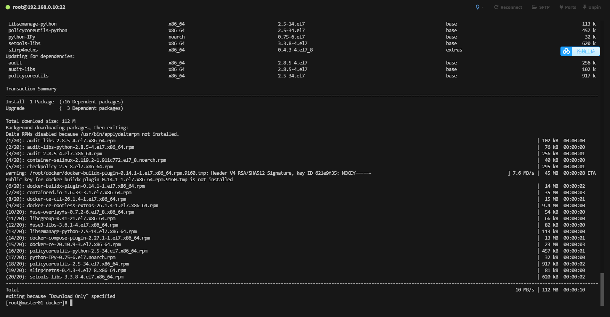
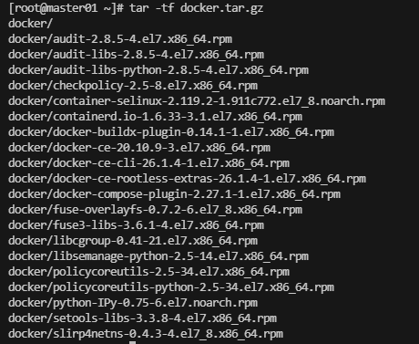

# 生成 Docker 離線安裝包

必須先確認當前環境乾淨沒有安裝過 Docker 接著使用下述命令先配置 Docker 安裝地址

```shell
# 配置下載 Docker 地址
yum install -y yum-utils
yum-config-manager --add-repo https://download.docker.com/linux/centos/docker-ce.repo
```

接著使用下述命令準備下載離線包

```shell
mkdir docker
cd docker
yum install --downloadonly --downloaddir=./ docker-ce-20.10.9-3.el7
```



接著我們退出當前下載目錄準備打包

```shell
cd ..
tar -zcf docker.tar.gz docker
```

最後使用 `tar -tf docker.tar.gz`查看結果




