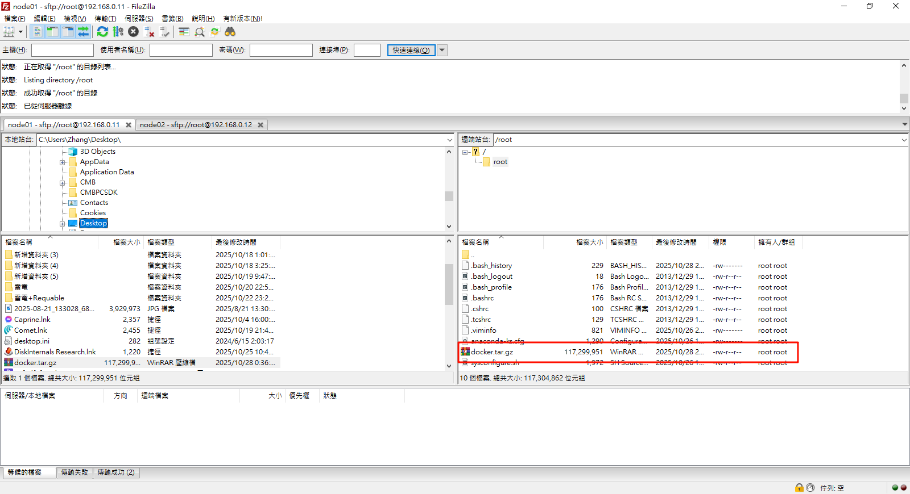
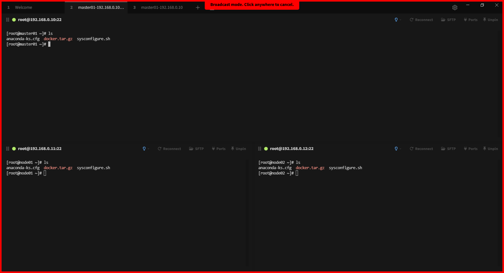
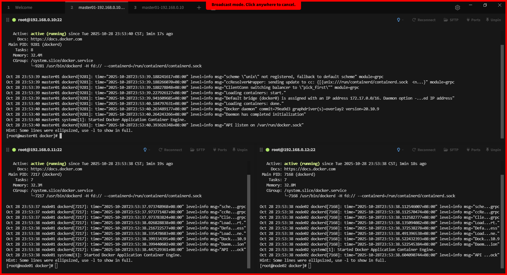
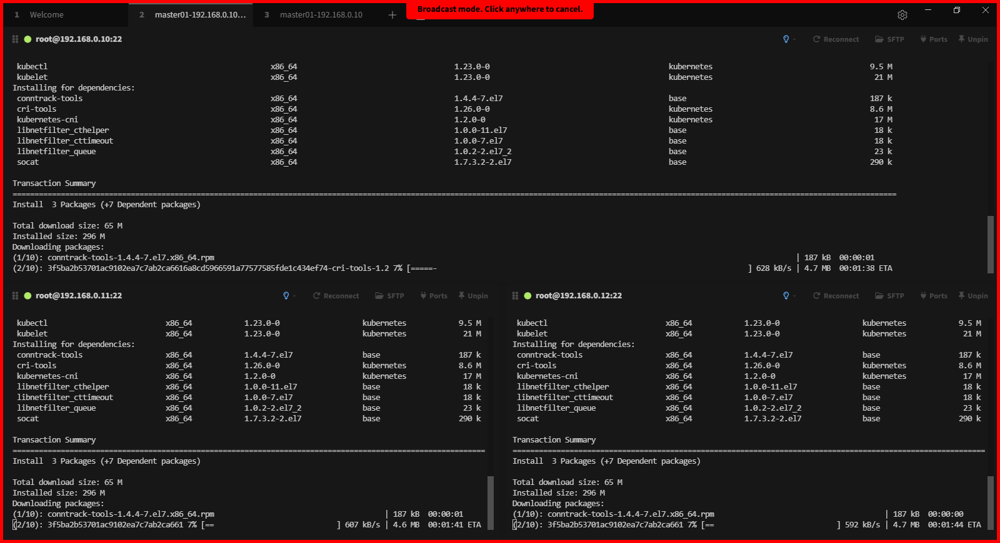
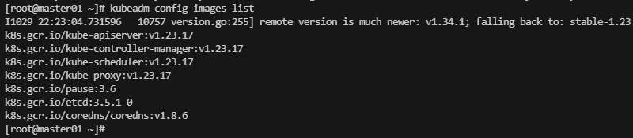
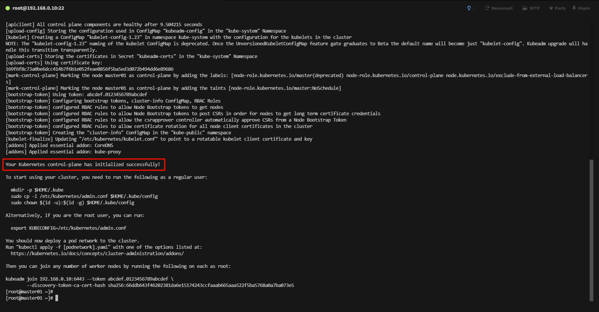
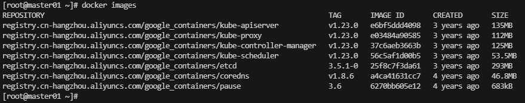

# 部署K8S節點集群

## Docker 環境準備

先將準備好的離線包使用 FileZilla 上傳到不同的 node 節點如下圖先配置站點


接著連線上去上傳即可



確認每台機器都有安裝包



接著先解壓縮 `tar -xf docker.tar.gz`如下圖


接著我們進去目錄中輸入指令安裝 `yum install -y ./*.rpm`


安裝完成後輸入指令 `systemctl status docker` 驗證如下圖



## 安裝K8S

配置K8S軟件包來安裝，這邊使用阿里雲，因為Google我測試不支持舊版

```shell
cat > /etc/yum.repos.d/k8s.repo <<EOF
[kubernetes]
name=Kubernetes
baseurl=https://packages.cloud.google.com/yum/repos/kubernetes-el7-x86_64
enabled=1
gpgcheck=1
repo_gpgcheck=1
gpgkey=https://packages.cloud.google.com/yum/doc/yum-key.gpg https://packages.cloud.google.com/yum/doc/rpm-package-key.gpg
exclude=ku
EOF
```

接著輸入下面指令

```shell
yum install -y --nogpgcheck kubeadm-1.23.0-0  kubelet-1.23.0-0 kubectl-1.23.0-0
```

- kubeadm：用於初始化集群，並配置集群所需的組件並生成對應的安全證書和令牌；
- kubelet：負責與 Master 節點通信，並根據 Master 節點的調度決策來創建、更新和刪除 Pod，同時維護 Node 節點上的容器狀態；
- kubectl：用於管理k8集群的一個命令行工具；



### Cgroup控制組

配置kubelet啟用Cgroup控制組，用於限制進程的資源使用量，如CPU、記憶體等

```shell
tee > /etc/sysconfig/kubelet <<EOF
KUBELET_EXTRA_ARGS="--cgroup-driver=systemd"
EOF
```

配置開機自動啟動

```shell
systemctl enable kubelet
```

## 集群初始化

查看集群所需鏡像文件

```shell
kubeadm config images list
```



接著執行命令，用來生成初始化配置的文件

```shell
kubeadm config print init-defaults > kubeadm-config.yaml
```

接著修改這個文件，主要幾點如下

```yaml
#本機的IP地址
advertiseAddress: 192.168.0.10

#本機名稱
name: master01

#集群鏡像下載地址，修改為阿里雲
imageRepository: registry.cn-hangzhou.aliyuncs.com/google_containers
```


在master主機上執行集群初始化命令如下

```shell
kubeadm init --config /root/kubeadm-config.yaml --upload-certs
```

拉取鏡像會花些時間，完成如下圖



接著查看拉取結果 `docker images`


