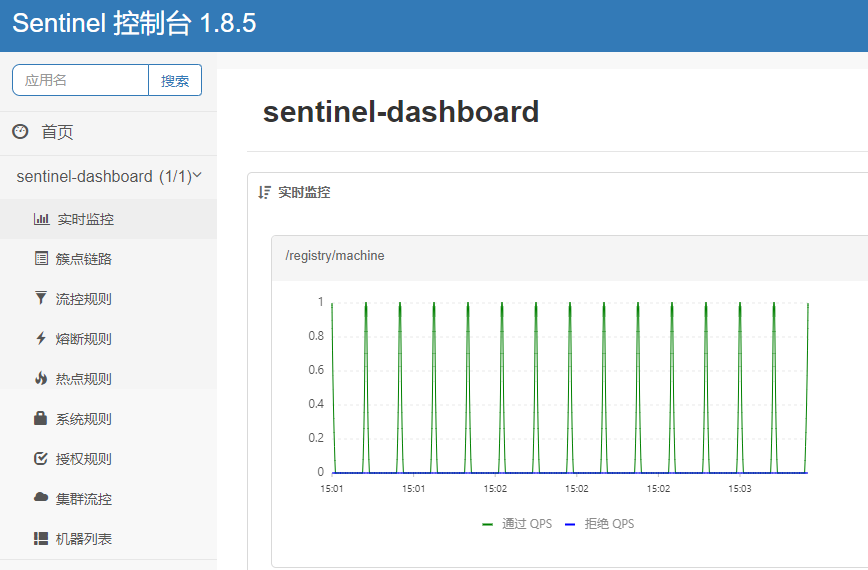
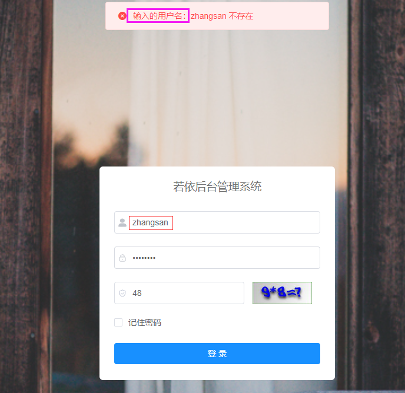

# PHP项目部署

#### 项目部署思路

传统项目的部署都是通过下载项目包，然后在服务器或虚拟机中准备项目所需的运行环境（如：LNMP）环境，然后在将项目发布到运行环境中。


但如果是将项目部署到k8s中运行，思路如下：

1. 准备镜像仓库，用于存储镜像。
2. 公司提供项目，项目运行在什么环境中，需要将运行环境打包到镜像中。
3. 准备项目所需的数据库，并配置好项目连接数据库的信息。
4. 在k8s中部署项目，并通过Ingress发布项目。


#### 准备Harbor镜像仓库

| 主机名 | IP地址 | 系统版本   | 硬件配置 |
| ------ | ------ | ---------- | -------- |
| harbor | 自定义 | CentOS 7.6 | 2C/4G    |


安装docker

```shell
#下载阿里Base仓库（有docker的依赖包）
wget -O /etc/yum.repos.d/CentOS-Base.repo https://mirrors.aliyun.com/repo/Centos-7.repo

#阿里docker-ce仓库
wget https://mirrors.aliyun.com/docker-ce/linux/centos/docker-ce.repo -O /etc/yum.repos.d/docker-ce.repo

#安装docker
yum -y install docker-ce-20.10.15-3.el7.x86_64  && systemctl enable --now docker
```


准备Docker Compose程序

~~~powershell
#移动二进制文件到/usr/bin目录
mv docker-compose /usr/bin/

#添加执行权限
chmod +x /usr/bin/docker-compose

#查看docker-compse版本
docker-compose version
~~~


下载harbor离线安装包

~~~powershell
wget https://github.com/goharbor/harbor/releases/download/v2.5.1/harbor-offline-installer-v2.5.1.tgz
~~~

~~~powershell
#解压harbor
tar xf harbor-offline-installer-v2.5.1.tgz  -C /

#创建配置文件
cd harbor/
mv harbor.yml.tmpl harbor.yml

#导入Harbor镜像文件
docker load -i harbor.v2.5.1.tar.gz
~~~

~~~powershell
#修改配置文件中的如下内容
cat harbor.yml

#上述内容省略...
hostname: 192.168.0.25		#访问管理界面的IP或主机名

http:                     	#访问方式为http（不用修改）
  port: 80                	#默认端口（不用修改）

#https:                    	注释https访问方式（需要有效证书才可以使用）
# port: 443                	注释https端口
 
# certificate: /root/harbor/6864844_kubemsb.com.pem  注释证书文件
# private_key: /root/harbor/6864844_kubemsb.com.key  注释证书密钥文件
 
harbor_admin_password: 12345 #访问密码
~~~

~~~powershell
#执行安装脚本
./install.sh

...

✔ ----Harbor has been installed and started successfully.----
~~~

```shell
#查看Harbor容器
docker ps
```


指定Harbor仓库地址

```powershell
tee /etc/docker/daemon.json <<EOF
{							
  "insecure-registries": ["http://192.168.0.25"]		
}
EOF
```

```powershell
#停止harbor后重启docker（需要在Harbor路径执行），应为Harbor的很多组件不会随着docker自动重启，如果docker重启后，会导致很多组件没有运行起来，仓库无法使用
docker-compose down

#重启docker
systemctl daemon-reload && systemctl restart docker

#启动harbor并放入后台
docker-compose up -d
```


#### 案例需求介绍

WordPress是PHP语言开发的博客平台，是运行在典型的LNMP/LAMP环境中，本案例需要将wordpress部署在k8s集群中，并实现外部访问。


#### 部署方案一

本方案是将wordpress的数据库也部署在k8s集群中。


##### 部署wordpress数据库

创建wordpress名称空间

```shell
kubectl create ns wordpress
```


通过StatefulSet部署数据库（需要依赖StorageClass动态存储来创建PV）

```yaml
# cat wordpress-mysql.yml

#headless service
apiVersion: v1
kind: Service
metadata:
  namespace: wordpress          #名称空间
  name: mysql-svc               #SVC名称
spec:
  clusterIP: None               #不分配ClusterIP
  selector:
    app: mysql                  #代理的Pod标签
  ports:
  - port: 3306
    targetPort: 3306

---
# statefulset
apiVersion: apps/v1
kind: StatefulSet
metadata:
  namespace: wordpress          #名称空间
  name: mysql                   #StatefulSet名称
spec:
  serviceName: "mysql-svc"      #声明它属于哪个Service
  replicas: 1                   #副本数量
  selector:
    matchLabels:
      app: mysql                
  template:
    metadata:
      labels:
        app: mysql
    spec:
      containers:
      - name: db
        image: mysql:5.7                #镜像
        env:
        - name: MYSQL_ROOT_PASSWORD     #默认MySQL root密码的环境变量
          value: admin123456            #设置MySQL root密码
        - name: MYSQL_DATABASE          #创建wordpress库
          value: wordpress              #存储数据的库名称
        ports:
        - containerPort: 3306           
        volumeMounts:
        - name: data                    #挂载的PVC名称
          mountPath: /var/lib/mysql/    #挂载到容器的路径

  volumeClaimTemplates:                 #PVC模板
  - metadata:
      name: data                        #PVC名称
    spec:
      accessModes: ["ReadWriteOnce"]    #访问权限(读、写)
      storageClassName: "nfs-client"    #动态存储名称,通过kubectl get sc查看
      resources:
        requests:
          storage: 10Gi                 #申请存储空间大小
```

```shell
#创建Pod
kubectl create -f wordpress-mysql.yml

#查看Pod
kubectl get pod -n wordpress

#查看PV
kubectl get pv

#查看PVC
kubectl get pvc -n wordpress

#解析mysql-0域名
dig mysql-0.mysql-svc.wordpress.svc.cluster.local @10.96.0.2 +short
```


##### 准备wordpress镜像

下载wordpress项目包

```shell
wget https://cn.wordpress.org/wordpress-6.0-zh_CN.tar.gz
tar -xf wordpress-6.0-zh_CN.tar.gz

cd wordpress
```


准备wordpress的wp-config.php文件，需要修改里边连接数据库的信息和身份认证信息

```shell
#拷贝样本文件，改名为wp-config.php
cp wp-config-sample.php wp-config.php

#修改文件内容，定义wordpress连接数据库和身份认证信息，以下是需要修改的内容
vim wp-config.php

#...
#定义wordpress连接数据库的信息
define( 'DB_NAME', 'wordpress' );

/** Database username */
define( 'DB_USER', 'root' );

/** Database password */
define( 'DB_PASSWORD', 'admin123456' );

/** Database hostname */
define( 'DB_HOST', 'mysql-0.mysql-svc.wordpress.svc.cluster.local' );


#...
#wordpress身份认证的信息通过该地址获取：https://api.wordpress.org/secret-key/1.1/salt/

define('AUTH_KEY',         'YEv=?HU<*71$8LtF/>s7!e9+${T]]+H0T>-v04+eJ P>)|Sb1dFCyWZ#~&#+.KSr');
define('SECURE_AUTH_KEY',  '~{V<n8|z:+o-qJ{M.PccT1^)axR;DBI`Cs./,/O/l,{KW{_7}`i^ZCm`spS4Pmh(');
define('LOGGED_IN_KEY',    '<P(HVgwFIi6*1ket[;!g&PWU5/XDhBnI{diS!LL!+ cg~)Xw!y2`%#^/%7xcq~m~');
define('NONCE_KEY',        'E-.(~xzIh//CNut*w85EQI4Oh5(|10j0!:+|142Jzx-L*cyL{k$macug+aHyH9l@');
define('AUTH_SALT',        'I$8sy|5G#qi}SM,9W/3{tR&%ZpY+#Jr0(au,jSmls+Iyh]4Sw):FsJg%_yuNGG3.');
define('SECURE_AUTH_SALT', '9JA/N7(R`5~F?xbY*!$ghLJ4}`B[^^!9rjrh|2oXKF;ce(Ll4av9ci!fXdQ/b2<s');
define('LOGGED_IN_SALT',   'b`K-=d(8(92}yHcX!R!|DtV^8D+ped&18sIJ{~P#7Uh}F<8gQKj3(ehdCs`^vwkT');
define('NONCE_SALT',       '|N7Miq3Z|HIBb4M_GRI/mtHsIPe,-qPyJLYf12K{8L5w9>l2Tx:YSimI? }0rWN[');
```


通过Dockerfile来构建wordpress镜像

```shell
#在wordpress项目路径编写dockerfile文件
cat dockerfile

#定义基础镜像
FROM centos:7.9.2009

#定义wordpress站点路径
ENV Web_Dir="/usr/share/nginx/html/"

#在镜像中安装项目环境(准备Base、epel、Webtatic仓库，用于安装项目所需的nginx和php相关软件)
RUN curl -o /etc/yum.repos.d/CentOS-Base.repo http://mirrors.aliyun.com/repo/Centos-7.repo && \
    rpm -Uvh https://mirror.webtatic.com/yum/el7/epel-release.rpm && \
    rpm -Uvh https://mirror.webtatic.com/yum/el7/webtatic-release.rpm && \
    echo "sslverify=false" >> /etc/yum.conf

#安装Nginx、PHP环境
RUN yum -y install --nogpgcheck nginx php72w-fpm php72w-xsl php72w php72w-ldap php72w-cli php72w-common php72w-devel php72w-gd php72w-pdo php72w-mysql php72-mbstring php72w-bcmath php72w-mcrypt

#清除yum的缓存数据
RUN yum clean all && rm -rf /var/cache/yum/*

#删除默认的 nginx 配置文件
RUN rm -rf /etc/nginx/nginx.conf

#拷贝优化后的配置文件
COPY ./nginx.conf /etc/nginx/

#删除站点目录默认文件，将wordpress项目文件拷贝到站点路径
RUN rm -rf ${Web_Dir}
COPY . ${Web_Dir}

#删除站点目录的多余文件
RUN rm -rf ${Web_Dir}nginx.conf
RUN rm -rf ${Web_Dir}dockerfile

#修改PHP相关文件,定义运行用户为www
RUN useradd -M www && \
    sed -i '/^user/c user = www' /etc/php-fpm.d/www.conf && \
    sed -i '/^group/c group = www' /etc/php-fpm.d/www.conf && \
    chown -R www.www ${Web_Dir} /var/lib/nginx/

#暴露容器的端口
EXPOSE 80

#启动PHP、Nginx
CMD /usr/sbin/php-fpm -D && nginx -g "daemon off;"
```


构建wordpress镜像（提示：nginx.conf文件放到当前目录在构建镜像）

```shell
docker build -f dockerfile -t wordpress:v6.0 .
```


推送wordpress镜像到harbor仓库

**提示：**在harbor中创建一个名为wordpress的项目仓库。

```shell
#登录仓库
docker login 192.168.0.25
Username: admin
Password: 12345
```

```shell
#修改镜像标签
docker tag wordpress:v6.0 192.168.0.25/wordpress/wordpress:v6.0
```

```shell
#上传镜像到仓库
docker push 192.168.0.25/wordpress/wordpress:v6.0
```


在集群节点指定Harbor仓库地址

```shell
# cat /etc/docker/daemon.json

{
  "exec-opts": ["native.cgroupdriver=systemd"],
  "insecure-registries": ["http://192.168.0.25"]
}
```

```shell
systemctl restart docker
```


##### 部署wordpress项目

在wordpress空间中创建Secret存储Harbor仓库信息

```shell
kubectl create secret docker-registry registry \
  --docker-server=192.168.0.25 \
  --docker-username=admin \
  --docker-password=12345 \
  --namespace=wordpress
```

```shell
kubectl get secret -n wordpress
```


创建ConfigMap保存wordpress的站点配置文件

```shell
# cat wordpress-nginx.conf

server {
	listen 80;
	server_name _;
	root /usr/share/nginx/html;

	location / {
		index index.php;
	}

        #设置静态资源缓存30天
        location ~* \.(jpg|jpeg|gif|png|css|js|ico|xml)$ {
            access_log off;
            log_not_found off;
            expires 30d;
        }

        #连接PHP
	location ~ \.php$ {
		fastcgi_pass 127.0.0.1:9000;
		fastcgi_param SCRIPT_FILENAME $document_root$fastcgi_script_name;
		include fastcgi_params;
	}
}
```

```shell
#创建ConfigMap
kubectl -n wordpress create configmap wordpress-config --from-file=/root/wordpress/wordpress-nginx.conf

#查看ConfigMap
kubectl get cm -n wordpress
```


如果项目要求把某些数据持久化保存下来，例如，nginx日志文件需要持久化保存，可通过创建PVC来实现（需要依赖StorageClass动态存储来创建PV）

```yaml
# cat ngxlog-pvc.yml

apiVersion: v1
kind: PersistentVolumeClaim
metadata:
  name: nginx-log
  namespace: wordpress
spec:
  storageClassName: "nfs-client"
  accessModes:
  - ReadWriteMany
  resources:
   requests:
     storage: 5Gi
```

```shell
#创建PVC
kubectl create -f  ngxlog-pvc.yml

#查看PV
kubectl get pv

#查看PVC
kubectl get pvc -n wordpress
```


创建PVC存储wordpress文章中的图片

> 用户在wordpress发表文章时，如果文章中带有图片，图片是保存到Pod中，后期在扩容Pod时，新扩容的Pod中默认没有这些图片，所以需要把图片存储到一个外部存储设备中，然后挂载到Pod中，后续新扩容的Pod也就有这些图片了

```yaml
cat wordpress-pvc.yml

apiVersion: v1
kind: PersistentVolumeClaim
metadata:
  name: wordpress-data
  namespace: wordpress
spec:
  storageClassName: "nfs-client"
  accessModes:
  - ReadWriteMany
  resources:
   requests:
     storage: 5Gi
```

```shell
#创建PVC
kubectl create -f cat wordpress-pvc.yml

#查看PV
kubectl get pv

#查看PVC
kubectl get pvc -n wordpress
```


通过Deployment部署wordpress项目

```yaml
# cat wordpress-pod.yml

apiVersion: apps/v1
kind: Deployment
metadata:
  name: wordpress-deploy
  namespace: wordpress
spec:
  replicas: 1
  selector:
    matchLabels:
      app: wordpress
  template:
    metadata:
      labels:
        app: wordpress
    spec:
      imagePullSecrets:         	    #镜像仓库的secret
      - name: registry
      containers:
      - name: wordpress
        image: 192.168.0.25/wordpress/wordpress:v6.0
        ports:
        - containerPort: 80

        volumeMounts:
        - name: config                  #挂载config存储卷
          mountPath: /etc/nginx/conf.d/	#挂载到容器的路径
        - name: log                  	#挂载log存储卷
          mountPath: /var/log/nginx/ 	#挂载到容器的目录
        - name: data					#挂载data存储卷
          mountPath: /usr/share/nginx/html/wp-content/uploads/
      
      volumes:                          #定义存储卷
      - name: config                    #卷名称
        configMap:                      #类型ConfigMap
          name: wordpress-config        #ConfigMap名称，存储站点配置文件
      - name: log                       #卷名称
        persistentVolumeClaim:          #类型PVC
          claimName: nginx-log          #PVC名字，存储nginx日志
      - name: data                      #卷名称
        persistentVolumeClaim:          #类型PVC
          claimName: wordpress-data     #PVC名字，存储wordpress文章图片

---
#Service
apiVersion: v1
kind: Service
metadata:
  name: wordpress-svc
  namespace: wordpress
spec:
  selector:
    app: wordpress
  ports:
  - port: 80
    targetPort: 80
```

```shell
#创建Pod
kubectl create -f wordpress-pod.yml

#查看Pod
kubectl get pod -n wordpress
```


创建Ingress发布wordpress提供外部访问

```yaml
# cat wordpress-ingress.yml

apiVersion: networking.k8s.io/v1
kind: Ingress
metadata:
  name: wordpress-ingress         #自定义ingress名称
  namespace: wordpress
  annotations:
    #指定控制器的类别为nginx
    kubernetes.io/ingress.class: nginx
spec:
  rules:                         #定义主机列表
  - host: web.wordpress.com      #自定义域名
    http:
      paths:
      - pathType: Prefix         #路径类型
        path: "/"                #定义站点路径
        backend:                 #定义后端引用的服务
          service:               #关联service
            name: wordpress-svc  #对应上面创建的service名称
            port:
              number: 80         #service端口
```

```shell
#创建Ingress
kubectl create -f wordpress-ingress.yml

#查看Ingress
kubectl get ing -n wordpress
```


##### 访问wordpress测试

在windows中配置本地解析，访问wordpress：[web.wordpress.com]()

|  |
| --------------------------------------------- |
|  |
|  |

提示，安装后的wordpress，下次进入登录页面需要在地址后边加上wp-login.php：http://web.wordpress.com/wp-login.php


提示：在wordpress中发表一篇文章，来验证wordpress的可用性。


#### 部署方案二

将数据库也部署在k8s集群中，但通过Secret保存wordpress连接数据库的信息，不在构建镜像时定义固定的连接信息，这样后续如果需要更新wordpress连接数据库的信息时，只需要更新Secret即可，无需重新构建镜像。

**提示：**wordpress的数据库不需要修改，清理掉上一个实验的数据，重新创建数据库。

**提示：**保存wordpress的站点配置文件的ConfigMap不需要修改。

**提示：**保存nginx日志文件的PVC不需要修改，清理掉上一个实验的数据，重新创建PVC。

**提示：**保存wordpress文章图片的PVC不需要修改，清理掉上一个实验的数据，重新创建PVC。

**提示：**Ingress不需要修改。


##### 准备wordpress镜像

准备wordpress的wp-config.php文件，需要修改里边连接数据库的信息和身份认证信息

```shell
#拷贝样本文件，改名为wp-config.php
cp wp-config-sample.php wp-config.php

#修改文件内容，定义wordpress连接数据库和身份认证信息，以下是需要修改的内容
vim wp-config.php

#...
#wordpress连接数据库的信息先不定义，先定义成变量名，后续通过Secret为变量赋值
define( 'DB_NAME', '{DB_NAME}' );

/** Database username */
define( 'DB_USER', '{DB_USER}' );

/** Database password */
define( 'DB_PASSWORD', '{DB_PASSWORD}' );

/** Database hostname */
define( 'DB_HOST', '{DB_HOST}' );


#...
#wordpress身份认证的信息通过该地址获取：https://api.wordpress.org/secret-key/1.1/salt/

define('AUTH_KEY',         'YEv=?HU<*71$8LtF/>s7!e9+${T]]+H0T>-v04+eJ P>)|Sb1dFCyWZ#~&#+.KSr');
define('SECURE_AUTH_KEY',  '~{V<n8|z:+o-qJ{M.PccT1^)axR;DBI`Cs./,/O/l,{KW{_7}`i^ZCm`spS4Pmh(');
define('LOGGED_IN_KEY',    '<P(HVgwFIi6*1ket[;!g&PWU5/XDhBnI{diS!LL!+ cg~)Xw!y2`%#^/%7xcq~m~');
define('NONCE_KEY',        'E-.(~xzIh//CNut*w85EQI4Oh5(|10j0!:+|142Jzx-L*cyL{k$macug+aHyH9l@');
define('AUTH_SALT',        'I$8sy|5G#qi}SM,9W/3{tR&%ZpY+#Jr0(au,jSmls+Iyh]4Sw):FsJg%_yuNGG3.');
define('SECURE_AUTH_SALT', '9JA/N7(R`5~F?xbY*!$ghLJ4}`B[^^!9rjrh|2oXKF;ce(Ll4av9ci!fXdQ/b2<s');
define('LOGGED_IN_SALT',   'b`K-=d(8(92}yHcX!R!|DtV^8D+ped&18sIJ{~P#7Uh}F<8gQKj3(ehdCs`^vwkT');
define('NONCE_SALT',       '|N7Miq3Z|HIBb4M_GRI/mtHsIPe,-qPyJLYf12K{8L5w9>l2Tx:YSimI? }0rWN[');
```


通过Dockerfile来构建wordpress镜像

**提示：**dockerfile中定义了一个脚本，在脚本里定义连接数据库的信息

```shell
#在wordpress项目路径编写dockerfile文件
cat dockerfile

#定义基础镜像
FROM centos:7.9.2009

#定义wordpress站点路径
ENV Web_Dir="/usr/share/nginx/html/"

#在镜像中安装项目环境(准备Base、epel、Webtatic仓库，用于安装项目所需的nginx和php相关软件)
RUN curl -o /etc/yum.repos.d/CentOS-Base.repo http://mirrors.aliyun.com/repo/Centos-7.repo && \
    rpm -Uvh https://mirror.webtatic.com/yum/el7/epel-release.rpm && \
    rpm -Uvh https://mirror.webtatic.com/yum/el7/webtatic-release.rpm && \
    echo "sslverify=false" >> /etc/yum.conf

#安装Nginx、PHP环境
RUN yum -y install --nogpgcheck nginx php72w-fpm php72w-xsl php72w php72w-ldap php72w-cli php72w-common php72w-devel php72w-gd php72w-pdo php72w-mysql php72-mbstring php72w-bcmath php72w-mcrypt

#清除yum的缓存数据
RUN yum clean all && rm -rf /var/cache/yum/*

#删除默认的 nginx 配置文件
RUN rm -rf /etc/nginx/nginx.conf

#拷贝优化后的配置文件
COPY ./nginx.conf /etc/nginx/

#删除站点目录默认文件，将wordpress项目文件拷贝到站点路径
RUN rm -rf ${Web_Dir}
COPY . ${Web_Dir}

#删除站点目录的多余文件
RUN rm -rf ${Web_Dir}nginx.conf
RUN rm -rf ${Web_Dir}dockerfile

#修改PHP相关文件,定义运行用户为www
RUN useradd -M www && \
    sed -i '/^user/c user = www' /etc/php-fpm.d/www.conf && \
    sed -i '/^group/c group = www' /etc/php-fpm.d/www.conf && \
    chown -R www.www ${Web_Dir} /var/lib/nginx/

#暴露容器的端口
EXPOSE 80

#在Dockerfile中,可以使用CMD或者ENTRYPOINT指令来定义容器启动时运行的命令,但是这两个指令只能运行一个命令,如果需要启动NGINX和PH，又需要执行一个脚本，可以把这些步骤放到一个文件中，然后在容器中执行这个文件
COPY ./entrypoint.sh /entrypoint.sh
RUN chmod +x /entrypoint.sh
ENTRYPOINT ["bash","-c","/entrypoint.sh"]
```


定义entrypoint.sh脚本，启动Nginx、PHP

**提示：**在脚本中定义连接数据库的信息

```shell
# cat entrypoint.sh

#定义wp-config.php文件
Wordpress_File=/usr/share/nginx/html/wp-config.php

#在启动容器之前，通过Secret提前定义好连接数据的信息，当容器启动时通过sed来替换变量中的值即可
sed -i s/{DB_NAME}/${DB_NAME:-}/g ${Wordpress_File}
sed -i s/{DB_USER}/${DB_USER:-}/g ${Wordpress_File}
sed -i s/{DB_PASSWORD}/${DB_PASSWORD:-}/g ${Wordpress_File}
sed -i s/{DB_HOST}/${DB_HOST:-}/g ${Wordpress_File}

#启动nginx和php
php-fpm && \
nginx -g "daemon off;"
```


构建wordpress镜像

```shell
docker build -f dockerfile -t wordpress:v6.0 .
```


推送wordpress镜像到harbor仓库

**提示：**在harbor中删除原有的wordpress镜像。

```shell
#登录仓库
docker login 192.168.0.25
Username: admin
Password: 12345
```

```shell
#修改镜像标签
docker tag wordpress:v6.0 192.168.0.25/wordpress/wordpress:v6.0
```

```shell
#上传镜像到仓库
docker push 192.168.0.25/wordpress/wordpress:v6.0
```


##### Secret存储数据库信息

创建Secret保存wordpress连接数据库信息

```yaml
# cat wordpress-mysql-secret.yml

apiVersion: v1
kind: Secret
metadata:
  name: wordpress-secret
  namespace: wordpress
#stringData不需要对数据进行加密
stringData:
  DB_NAME: wordpress
  DB_USER: root
  DB_PASSWORD: admin123456
  DB_HOST: mysql-0.mysql-svc.wordpress.svc.cluster.local
```

```shell
#创建Secret
kubectl create -f wordpress-mysql-secret.yml

#查看Secret
kubectl get secret -n wordpress
```


##### 部署wordpress数据库

通过StatefulSet部署数据库（需要依赖StorageClass动态存储来创建PV）

```yaml
# cat wordpress-mysql.yml

#headless service
apiVersion: v1
kind: Service
metadata:
  namespace: wordpress          #名称空间
  name: mysql-svc               #SVC名称
spec:
  clusterIP: None               #不分配ClusterIP
  selector:
    app: mysql                  #代理的Pod标签
  ports:
  - port: 3306
    targetPort: 3306

---
# statefulset
apiVersion: apps/v1
kind: StatefulSet
metadata:
  namespace: wordpress          #名称空间
  name: mysql                   #StatefulSet名称
spec:
  serviceName: "mysql-svc"      #声明它属于哪个Service
  replicas: 1                   #副本数量
  selector:
    matchLabels:
      app: mysql                
  template:
    metadata:
      labels:
        app: mysql
    spec:
      containers:
      - name: db
        image: mysql:5.7                #镜像
        env:
        - name: MYSQL_ROOT_PASSWORD     #默认MySQL root密码的环境变量
          value: admin123456            #设置MySQL root密码
        - name: MYSQL_DATABASE          #创建wordpress库
          value: wordpress              #存储数据的库名称
        ports:
        - containerPort: 3306           
        volumeMounts:
        - name: data                    #挂载的PVC名称
          mountPath: /var/lib/mysql/    #挂载到容器的路径

  volumeClaimTemplates:                 #PVC模板
  - metadata:
      name: data                        #PVC名称
    spec:
      accessModes: ["ReadWriteOnce"]    #访问权限(读、写)
      storageClassName: "nfs-client"    #动态存储名称,通过kubectl get sc查看
      resources:
        requests:
          storage: 10Gi                 #申请存储空间大小
```

```shell
#创建Pod
kubectl create -f wordpress-mysql.yml

#查看Pod
kubectl get pod -n wordpress

#查看PV
kubectl get pv

#查看PVC
kubectl get pvc -n wordpress

#解析mysql-0域名
dig mysql-0.mysql-svc.wordpress.svc.cluster.local @10.96.0.2 +short
```


创建ConfigMap保存wordpress的站点配置文件

```shell
# cat wordpress-nginx.conf

server {
	listen 80;
	server_name _;
	root /usr/share/nginx/html;

	location / {
		index index.php;
	}

        #设置静态资源缓存30天
        location ~* \.(jpg|jpeg|gif|png|css|js|ico|xml)$ {
            access_log off;
            log_not_found off;
            expires 30d;
        }

        #连接PHP
	location ~ \.php$ {
		fastcgi_pass 127.0.0.1:9000;
		fastcgi_param SCRIPT_FILENAME $document_root$fastcgi_script_name;
		include fastcgi_params;
	}
}
```

```shell
#创建ConfigMap
kubectl -n wordpress create configmap wordpress-config --from-file=/root/wordpress/wordpress-nginx.conf

#查看ConfigMap
kubectl get cm -n wordpress
```


如果项目要求把某些数据持久化保存下来，例如，nginx日志文件需要持久化保存，可通过创建PVC来实现（需要依赖StorageClass动态存储来创建PV）

```yaml
# cat ngxlog-pvc.yml

apiVersion: v1
kind: PersistentVolumeClaim
metadata:
  name: nginx-log
  namespace: wordpress
spec:
  storageClassName: "nfs-client"
  accessModes:
  - ReadWriteMany
  resources:
   requests:
     storage: 5Gi
```

```shell
#创建PVC
kubectl create -f  ngxlog-pvc.yml

#查看PV
kubectl get pv

#查看PVC
kubectl get pvc -n wordpress
```


创建PVC存储wordpress文章中的图片

> 用户在wordpress发表文章时，如果文章中带有图片，图片是保存到Pod中，后期在扩容Pod时，新扩容的Pod中默认没有这些图片，所以需要把图片存储到一个外部存储设备中，然后挂载到Pod中，后续新扩容的Pod也就有这些图片了

```yaml
cat wordpress-pvc.yml

apiVersion: v1
kind: PersistentVolumeClaim
metadata:
  name: wordpress-data
  namespace: wordpress
spec:
  storageClassName: "nfs-client"
  accessModes:
  - ReadWriteMany
  resources:
   requests:
     storage: 5Gi
```

```shell
#创建PVC
kubectl create -f cat wordpress-pvc.yml

#查看PV
kubectl get pv

#查看PVC
kubectl get pvc -n wordpress
```


##### 部署wordpress项目

需要定义wordpress连接数据库的Secret

```yaml
# cat wordpress-pod.yml

apiVersion: apps/v1
kind: Deployment
metadata:
  name: wordpress-deploy
  namespace: wordpress
spec:
  replicas: 1
  selector:
    matchLabels:
      app: wordpress
  template:
    metadata:
      labels:
        app: wordpress
    spec:
      imagePullSecrets:
      - name: registry
      containers:
      - name: wordpress
        image: 192.168.0.25/wordpress/wordpress:v6.0
        ports:
        - containerPort: 80
        envFrom:                        #通过envFrom为容器批量生成环境变量
        - secretRef:
           name: wordpress-secret       #环境变量从Secret获取连接数据的信息

        volumeMounts:
        - name: config
          mountPath: /etc/nginx/conf.d/
        - name: log
          mountPath: /var/log/nginx/
        - name: data
          mountPath: /usr/share/nginx/html/wp-content/uploads/
      
      volumes:
      - name: config
        configMap:
          name: wordpress-config
      - name: log
        persistentVolumeClaim:
          claimName: nginx-log
      - name: data
        persistentVolumeClaim:
          claimName: wordpress-data

---
#Service
apiVersion: v1
kind: Service
metadata:
  name: wordpress-svc
  namespace: wordpress
spec:
  selector:
    app: wordpress
  ports:
  - port: 80
    targetPort: 80
```

```shell
#创建Pod
kubectl create -f wordpress-pod.yml

#查看Pod
kubectl get pod -n wordpress
```


##### 访问wordpress测试

在windows中配置本地解析，访问wordpress：[web.wordpress.com]()

|  |
| --------------------------------------------- |
|  |
|  |

提示，安装后的wordpress，下次进入登录页面需要在地址后边加上wp-login.php：http://web.wordpress.com/wp-login.php


#### 部署方案三

由于数据库的特殊性，很多企业仍然不太喜欢将数据库部署在容器中，本方案将数据部署在k8s集群外部。

**提示：**仍然使用方案二中的镜像。

**提示：**保存wordpress的站点配置文件的ConfigMap不需要修改。

**提示：**保存nginx日志文件的PVC不需要修改，清理掉上一个实验的数据，重新创建PVC。

**提示：**保存wordpress文章图片的PVC不需要修改，清理掉上一个实验的数据，重新创建PVC。

**提示：**Ingress不需要修改。


##### 部署wordpress数据库

| 主机名    | IP地址       | 操作系统   |
| --------- | ------------ | ---------- |
| db-node01 | 192.168.0.26 | CentOS 7.6 |


通过二进制方式安装MySQL5.7数据库

```shell
#解压软件包并安装
tar -xf mysql-5.7.17.tar.gz
cd mysql-5.7.17
yum install ./*.rpm -y
```

```shell
#启动MySQL
systemctl start mysqld
systemctl status mysqld
systemctl enable mysqld
```

```shell
#查看MySQL的root初始密码
grep -i password /var/log/mysqld.log
```

```shell
#通过初始密码登录到数据库进行修改
mysql -uroot -p'&W)Copu&<3HC'
```

```shell
#设置密码策略只验证长度
set global validate_password_policy=0;

#设置root本机登录密码（长度须满足8位）
alter user root@"localhost" identified by "admin123456";

#创建root远程登录（长度须满足8位）
create user root@"%" identified by "admin123456";

#授权远程root用户权限
grant all on *.* to root@'%' identified by "admin123456";

#查看用户
select user,host from mysql.user;
```


退出数据库，修改my.cnf文件，在文件中定义密码策略，让策略永久生效

```shell
vim /etc/my.cnf
#...
[mysqld]
validate_password_policy=0
```

```shell
#重启MySQL
systemctl restart mysqld
```


进入MySQL创建wordpress库

```shell
create database wordpress;
```


创建Secret保存wordpress连接数据库信息

**提示：**需要修改MySQL服务器的IP地址

```yaml
# cat wordpress-mysql-secret.yml

apiVersion: v1
kind: Secret
metadata:
  name: wordpress-secret
  namespace: wordpress
#stringData不需要对数据进行加密
stringData:
  DB_NAME: wordpress
  DB_USER: root
  DB_PASSWORD: admin123456
  DB_HOST: 192.168.0.26
```

```shell
#创建Secret
kubectl create -f wordpress-mysql-secret.yml

#查看Secret
kubectl get secret -n wordpress
```


##### 创建Service连接外部MySQL

创建一个Service和一个Endpoints（端点），允许集群内的Pod通过该服务连接到集群外部的MySQL数据库。 

> 当创建一个Service时，k8s会自动创建一个对应的Endpoints资源。Endpoints中包含了Service在标签选择器（selector）中定义的所有Pod的IP地址和端口。
>
> 手动创建`Endpoints`资源以满足特定的需求，例如连接到集群外部的服务。通过这种方式，可以将集群外的IP地址添加到`Endpoints`中，使得Pod可以通过服务名称连接到集群外的服务。 

```yaml
cat wordpress-mysql-svc.yml

#headless service
apiVersion: v1
kind: Service
metadata:
  name: mysql                   #service名称，要与Endpoints名称保持一致
  namespace: wordpress
spec:
  type: ClusterIP               #service类型
  clusterIP: None               #类型headless service
  ports:
  - name: mysql                 #service端口名称
    port: 3306                  #service端口号
    protocol: TCP
    targetPort: 3306            #目标端口
---
apiVersion: v1
kind: Endpoints                 #Endpoints用于表示Service可以路由到的后端信息
metadata:
  name: mysql                   #Endpoints名称，要与service名称保持一致
  namespace: wordpress
subsets:                        #定义后端的信息
- addresses:                    #后端的IP地址
  - ip: 192.168.0.26            #MySQL数据库的IP地址
  ports:                        #后端的端口信息
  - name: mysql                 #端口名称，要与Service中的端口名称相匹配
    port: 3306                  #目标端口，要与Service中的目标端口相匹配
    protocol: TCP
```

```shell
#创建service
kubectl create -f wordpress-mysql-svc.yml

#解析service名称，验证是否可以访问到后端的MySQL
dig mysql.wordpress.svc.cluster.local @10.96.0.2 +short
```


##### 部署wordpress项目

**提示：**wordpress的Pod内容不需要修改

```yaml
# cat wordpress-pod.yml

apiVersion: apps/v1
kind: Deployment
metadata:
  name: wordpress-deploy
  namespace: wordpress
spec:
  replicas: 1
  selector:
    matchLabels:
      app: wordpress
  template:
    metadata:
      labels:
        app: wordpress
    spec:
      imagePullSecrets:
      - name: registry
      containers:
      - name: wordpress
        image: 192.168.0.25/wordpress/wordpress:v6.0
        ports:
        - containerPort: 80
        envFrom:                        #通过envFrom为容器批量生成环境变量
        - secretRef:
           name: wordpress-secret       #环境变量从Secret获取连接数据的信息

        volumeMounts:
        - name: config
          mountPath: /etc/nginx/conf.d/
        - name: log
          mountPath: /var/log/nginx/
        - name: data
          mountPath: /usr/share/nginx/html/wp-content/uploads/
      
      volumes:
      - name: config
        configMap:
          name: wordpress-config
      - name: log
        persistentVolumeClaim:
          claimName: nginx-log
      - name: data
        persistentVolumeClaim:
          claimName: wordpress-data

---
#Service
apiVersion: v1
kind: Service
metadata:
  name: wordpress-svc
  namespace: wordpress
spec:
  selector:
    app: wordpress
  ports:
  - port: 80
    targetPort: 80
```

```shell
#创建Pod
kubectl create -f wordpress-pod.yml

#查看Pod
kubectl get pod -n wordpress
```


##### 访问wordpress测试

在windows中配置本地解析，访问wordpress：[web.wordpress.com]()

|  |
| --------------------------------------------- |
|  |
|  |

提示，安装后的wordpress，下次进入登录页面需要在地址后边加上wp-login.php：http://web.wordpress.com/wp-login.php


# Java项目部署

#### 案例需求介绍

ZrLog是使用 Java 开发的博客平台，运行在tomcat环境中，本案例需要将ZrLog部署在k8s集群中，并实现外部访问。


部署思路如下：

1. 准备镜像仓库，用于存储镜像。
2. 将Java项目提前打包好，项目运行在什么环境中，需要将运行环境打包到镜像中。
3. 准备项目所需的数据库，并配置好项目连接数据库的信息。
4. 在k8s中部署项目，并通过Ingress发布项目。


#### 部署zrlog数据库

本方案将数据部署在k8s集群外部。可以直接使用前边项目的数据库。

```shell
#登录数据库
mysql -uroot -padmin123456

#创建zrlog数据库
create database zrlog;

#创建zrlog用户（密码长度须满足8位）
create user zrlog@'%' identified by "zrlog123456";

#授权用户权限
grant all on zrlog.* to zrlog@'%' identified by "zrlog123456";

#查看用户
select user,host from mysql.user;
```


#### 准备zrlog镜像

通过Dockerfile来构建zrlog镜像

```shell
mkdir zrlog
cd zrlog
```

```shell
cat dockerfile

#定义基础镜像
FROM centos:7.9.2009

#配置阿里仓库安装openJDK
RUN yum install --nogpgcheck java-1.8.0-openjdk.x86_64 -y && \
    yum clean all && rm -rf /var/cache/yum/*

#拷贝tomcat二进制包
COPY ./apache-tomcat-8.0.30.tar /

#安装tomcat
RUN tar -xf /apache-tomcat-8.0.30.tar -C /usr/local/ && \
    mv /usr/local/apache-tomcat-8.0.30/ /usr/local/tomcat

#清空webapps目录默认数据
RUN rm -rf /usr/local/tomcat/webapps/*

#拷贝zrlog.war到webapps目录
COPY ./zrlog.war /usr/local/tomcat/webapps/

#将zrlog目录改名为ROOT作为tomcat的默认一级访问目录
RUN mv /usr/local/tomcat/webapps/zrlog.war /usr/local/tomcat/webapps/ROOT.war

#暴露容器的端口
EXPOSE 8080

#启动tomcat(该脚本tomcat自带)
CMD ["/usr/local/tomcat/bin/catalina.sh","run"]
```

```shell
#构建镜像（准备好需要拷贝的tomcat二进制包和zrlog.war包到当前构建目录）
docker build -f dockerfile -t zrlog:v1.0 .
```


推送zrlog镜像到harbor仓库

**提示：**在harbor中创建一个名为zrlog的项目仓库。

```shell
#登录仓库
docker login 192.168.0.25
Username: admin
Password: 12345
```

```shell
#修改镜像标签
docker tag zrlog:v1.0 192.168.0.25/zrlog/zrlog:v1.0
```

```shell
#上传镜像到仓库
docker push 192.168.0.25/zrlog/zrlog:v1.0
```


#### 部署zrlog项目

创建zrlog名称空间

```shell
kubectl create ns zrlog
```


在zrlog空间中创建Secret存储Harbor仓库信息

```shell
kubectl create secret docker-registry registry \
  --docker-server=192.168.0.25 \
  --docker-username=admin \
  --docker-password=12345 \
  --namespace=zrlog
```


创建PVC存储tomcat日志文件

```yaml
# cat tomcatlog-pvc.yml

apiVersion: v1
kind: PersistentVolumeClaim
metadata:
  name: tomcat-log
  namespace: zrlog
spec:
  storageClassName: "nfs-client"
  accessModes:
  - ReadWriteMany
  resources:
   requests:
     storage: 5Gi
```

```shell
#创建PVC
kubectl create -f tomcatlog-pvc.yml
```


通过Deployment部署zrlog

```yaml
cat zrlog-pod.yml

apiVersion: apps/v1
kind: Deployment
metadata:
  name: zrlog-deploy
  namespace: zrlog
spec:
  replicas: 1
  selector:
    matchLabels:
      app: zrlog
  template:
    metadata:
      labels:
        app: zrlog
    spec:
      imagePullSecrets:         #镜像仓库的secret
      - name: registry
      containers:
      - name: zrlog
        image: 192.168.0.25/zrlog/zrlog:v1.0
        ports:
        - containerPort: 8080
        env:
        - name: JAVA_TOOL_OPTIONS              #设置程序编码为UTF8
          value: "-Dfile.encoding=UTF-8"

        volumeMounts:
        - name: log                             #挂载卷
          mountPath: /usr/local/tomcat/logs/    #挂载到容器的目录

      volumes:                                  #定义存储卷
      - name: log                               #卷名称
        persistentVolumeClaim:                  #卷类型PVC
          claimName: tomcat-log                 #PVC名字

---
#Service
apiVersion: v1
kind: Service
metadata:
  name: zrlog-svc
  namespace: zrlog
spec:
  selector:
    app: zrlog
  ports:
  - port: 8080
    targetPort: 8080
```

```shell
#创建Pod
kubectl create -f zrlog-pod.yml
```


创建Ingress发布zrlog提供外部访问

```yaml
cat zrlog-ingress.yml

apiVersion: networking.k8s.io/v1
kind: Ingress
metadata:
  name: zrlog-ingress         #自定义ingress名称
  namespace: zrlog
  annotations:
    #指定控制器的类别为nginx
    kubernetes.io/ingress.class: nginx
spec:
  rules:                         #定义主机列表
  - host: web.zrlog.com          #自定义域名
    http:
      paths:
      - pathType: Prefix         #路径类型
        path: "/"                #定义站点路径
        backend:                 #定义后端引用的服务
          service:               #关联service
            name: zrlog-svc      #对应上面创建的service名称
            port:
              number: 8080       #service端口
```

```shell
#创建Ingress
kubectl create -f zrlog-ingress.yml
```


提示：windows配置域名解析


访问：http://web.zrlog.com

|  |
| ---------------------------------------------------------- |
|  |
|               |


发表一篇文章验证博客平台可用性！


扩容zrlog的Pod数量后再次验证

```yaml
kubectl edit deploy zrlog-deploy -n zrlog
...
replicas: 3
```


**问题**：默认新扩容的Pod都需要指定数据库的连接信息。解决方法可以通过在原有的镜像基础上，直接定义好数据库的连接信息，在重新构建一个新的镜像即可。


删除zrlog的Pod

```shell
kubectl delete -f zrlog-pod.yml
```


在MySQL中删除zrlog数据库并重新创建

```shell
drop database zrlog;
create database zrlog;
```


在Harbor主机基于上一个镜像创建容器，并指定连接数据库的信息，然后在重新构建新的镜像

```shell
docker run -id --name=zrlog -p 8080:8080 zrlog:v1.0
```


访问zrlog：http://192.168.0.25:8080

|               |
| ---------------------------------------------------------- |
|               |
|  |


数据库连接成功后，通过docker将该容器重新导成新镜像

```shell
docker commit zrlog zrlog:v2.0
```


修改镜像标签上传到仓库

```shell
docker tag zrlog:v2.0 192.168.0.25/zrlog/zrlog:v2.0
docker push 192.168.0.25/zrlog/zrlog:v2.0
```


在k8s中创建PVC存储zrlog文章中的图片

```yaml
cat zrlog-pvc.yml

apiVersion: v1
kind: PersistentVolumeClaim
metadata:
  name: zrlog-data
  namespace: zrlog
spec:
  storageClassName: "nfs-client"
  accessModes:
  - ReadWriteMany
  resources:
   requests:
     storage: 5Gi
```

```shell
#创建PVC
kubectl create -f zrlog-pvc.yml
```


通过Deployment部署zrlog:v2.0版本镜像，并挂载PVC

```yaml
cat zrlog-pod.yml

apiVersion: apps/v1
kind: Deployment
metadata:
  name: zrlog-deploy
  namespace: zrlog
spec:
  replicas: 1
  selector:
    matchLabels:
      app: zrlog
  template:
    metadata:
      labels:
        app: zrlog
    spec:
      imagePullSecrets:         #镜像仓库的secret
      - name: registry
      containers:
      - name: zrlog
        image: 192.168.0.25/zrlog/zrlog:v2.0
        ports:
        - containerPort: 8080
        env:
        - name: JAVA_TOOL_OPTIONS              #设置程序编码为UTF8
          value: "-Dfile.encoding=UTF-8"

        volumeMounts:
        - name: log                             #挂载卷
          mountPath: /usr/local/tomcat/logs/    #挂载到容器的目录
        - name: data                            #挂载卷
          mountPath: /usr/local/tomcat/webapps/ROOT/attached/

      volumes:                                  #定义存储卷
      - name: log                               #卷名称
        persistentVolumeClaim:                  #卷类型PVC
          claimName: tomcat-log                 #PVC名字
      - name: data
        persistentVolumeClaim:                  #卷类型PVC
          claimName: zrlog-data                 #PVC名字

---
#Service
apiVersion: v1
kind: Service
metadata:
  name: zrlog-svc
  namespace: zrlog
spec:
  selector:
    app: zrlog
  ports:
  - port: 8080
    targetPort: 8080
```

```shell
#创建Pod
kubectl create -f zrlog-pod.yml
```


登录zrlog发表一篇带图片的文章：http://web.zrlog.com


扩容zrlog验证新的Pod是否需要重新配置连接数据库

```yaml
kubectl edit deploy zrlog-deploy -n zrlog
...
  replicas: 3
```


# Python项目部署

#### 案例需求介绍

syscmdb是使用 Python / Django开发的资产管理系统，本案例需要将syscmdb部署在k8s集群中，并实现外部访问。

项目地址：https://github.com/heyangguang/syscmdb


部署思路如下：

1. 准备镜像仓库，用于存储镜像。
2. 准备项目的运行环境，将运行环境打包到镜像中。
3. 准备项目所需的数据库，并配置好项目连接数据库的信息。
4. 在k8s中部署项目，并通过Ingress发布项目。


#### 部署syscmdb数据库

本方案将数据部署在k8s集群外部。可以直接使用前边项目的数据库。

```shell
#登录数据库
mysql -uroot -padmin123456

#创建syscmdb数据库
create database syscmdb;

#创建syscmdb用户（密码长度须满足8位）
create user syscmdb@'%' identified by "syscmdb123456";

#授权用户权限
grant all on syscmdb.* to syscmdb@'%' identified by "syscmdb123456";

#查看用户
select user,host from mysql.user;
```


在harbor主机解压项目包，然后把数据库表文件拷贝到数据库主机

```shell
unzip syscmdb.zip
cd syscmdb
scp syscmdb.sql 192.168.0.26:/root
```


导入syscmdb数据表

```shell
mysql -usyscmdb -p"syscmdb123456" syscmdb < syscmdb.sql
```


#### 准备syscmdb镜像

通过Dockerfile来构建syscmdb的基础镜像，基础镜像中包含python环境，以及syscmdb项目所需的依赖

```shell
cat dockerfile
FROM centos:7.9.2009

#在大多数python项目中,requirements.txt文件中保存的是项目运行所需要的所有依赖项信息
ADD ./requirement.txt /

#安装python环境
RUN yum install -y gcc gcc-c++ python3 python3-devel

#指定python依赖下载地址,并基于requirement.txt文件下载项目所需的依赖
RUN pip3 install -i https://pypi.tuna.tsinghua.edu.cn/simple -r /requirement.txt
```

```shell
#构建镜像
docker build -f dockerfile-centos -t centos:syscmdb .
```


通过基础镜像，构建syscmdb的业务镜像

```shell
#先修改syscmdb项目连接数据库信息
vim syscmdb/settings.py
#...
DATABASES = {
    'default': {
        'ENGINE': 'django.db.backends.mysql',
        'NAME': 'syscmdb',
        'USER': 'syscmdb',
        'PASSWORD': 'syscmdb123456',
        'HOST': '192.168.0.26',
        'PORT': '3306',
    }
}
```

```shell
cat dockerfile-syscmdb
#定义基础镜像
FROM centos:syscmdb

#添加项目到镜像中
ADD ./ /syscmdb

#定义容器端口
EXPOSE 8080

#通过python3启动程序
CMD ["python3","/syscmdb/manage.py","runserver","0.0.0.0:8080"]
```

```shell
docker build -f dockerfile-syscmdb -t syscmdb:v1.0 .
```


构建好镜像可以在docker环境先验证是否可以使用

```shell
docker run -id --name=syscmdb -p 8080:8080 syscmdb:v1.0
```


访问项目：http://ip:8080 (用户名：admin，密码：123456)


上传镜像到Harbor仓库（创建一个syscmdb项目仓库）

```shell
#修改镜像标签
docker tag syscmdb:v1.0 192.168.0.25/syscmdb/syscmdb:v1.0

#上传镜像
docker push 192.168.0.25/syscmdb/syscmdb:v1.0
```


#### 部署syscmdb项目

创建名称空间

```shell
kubectl create ns syscmdb
```


在syscmdb空间中创建Secret存储Harbor仓库信息

```shell
kubectl create secret docker-registry registry \
  --docker-server=192.168.0.25 \
  --docker-username=admin \
  --docker-password=12345 \
  --namespace=syscmdb
```


通过Deployment部署syscmdb

```shell
mkdir syscmdb && cd syscmdb
```

```yaml
cat deploy-syscmdb.yml

apiVersion: apps/v1
kind: Deployment
metadata:
  name: cmdb
  namespace: syscmdb

spec:
  selector:
    matchLabels:
      app: syscmdb

  template:
    metadata:
      labels:
        app: syscmdb

    spec:
      imagePullSecrets:
      - name: registry
      containers:
      - name: syscmdb
        image: 192.168.0.25/syscmdb/syscmdb:v1.0
        ports:
        - containerPort: 8080
        readinessProbe:               #定义探针
          tcpSocket:                  #定义探测方式
            port: 8080                #探测一个不存在的端口
          initialDelaySeconds: 3      #容器启动后等待3秒执行探测
          periodSeconds: 3            #执行探测频率为3秒 

---
apiVersion: v1
kind: Service
metadata:
  name: syscmdb-svc
  namespace: syscmdb
spec:
  selector:
    app: syscmdb
  ports:
  - port: 8080
    targetPort: 8080
```

```shell
kubectl create -f deploy-syscmdb.yml
```


创建Ingress发布zrlog提供外部访问

```yaml
cat ingress-syscmdb.yml
apiVersion: networking.k8s.io/v1
kind: Ingress
metadata:
  name: ingress-syscmdb         #自定义ingress名称
  namespace: syscmdb
  annotations:
    #指定控制器的类别为nginx
    kubernetes.io/ingress.class: nginx
spec:
  rules:                         #定义主机列表
  - host: web.syscmdb.com        #自定义域名
    http:
      paths:
      - pathType: Prefix         #路径类型
        path: "/"                #定义站点路径
        backend:                 #定义后端引用的服务
          service:               #关联service
            name: syscmdb-svc    #对应上面创建的service名称
            port:
              number: 8080       #service端口
```

```shell
kubectl create -f ingress-syscmdb.yml
```


访问项目：http://web.syscmdb (用户名：admin，密码：123456)


# Go项目部署

#### 案例需求介绍

ginchart是一个基于Golang开发的多人群聊系统，本案例需要将ginchart部署在k8s集群中，并实现外部访问。

项目地址：https://gitee.com/RoseKissYou/go-gin-chat


部署思路如下：

1. 准备镜像仓库，用于存储镜像。
2. 准备项目的运行环境，将运行环境打包到镜像中。
3. 准备项目所需的数据库，并配置好项目连接数据库的信息。
4. 在k8s中部署项目，并通过Ingress发布项目。


#### 部署ginchart数据库

本方案将数据部署在k8s集群外部。可以直接使用前边项目的数据库。

```shell
#登录数据库
mysql -uroot -padmin123456

#创建syscmdb数据库
create database ginchart;

#创建syscmdb用户（密码长度须满足8位）
create user ginchart@'%' identified by "ginchart123456";

#授权用户权限
grant all on ginchart.* to ginchart@'%' identified by "ginchart123456";

#查看用户
select user,host from mysql.user;
```


在harbor主机解压后把表文件拷贝到数据库主机

```shell
unzip go-gin-chat-master.zip
cd cd go-gin-chat-master
scp sql/go_gin_chat.sql 192.168.0.26:/root
```


导入ginchart数据表

```shell
mysql -uginchart -p"ginchart123456" ginchart < go_gin_chat.sql
```


#### 准备ginchart镜像

ginchat项目需要依赖Go编译环境，所以第一步制作一个Go编译环境的基础镜像

```shell
cat dockerfile
FROM centos:7.9.2009
RUN yum install -y epel-release
RUN yum install -y go go-bindata
RUN yum clean all
```

```shell
#构建镜像
docker build -f dockerfile -t centos:ginchart .
```


修改ginchat项目连接数据库相关信息，在文件中mysql.dsn位置：用户名:密码@tcp(数据库IP:端口)/库名?

```shell
cp conf/config.go.env conf/config.go

cat conf/config.go
package conf

/*参数说明
app.port // 应用端口
app.upload_file_path // 图片上传的临时文件夹目录，绝对路径！
app.cookie_key // 生成加密session
mysql.dsn // mysql 连接地址dsn
*/

var AppJsonConfig = []byte(`
{
  "app": {
    "port": "8322",
    "upload_file_path": "e:\\golang\\www\\go-gin-chat\\tmp_images\\",
    "cookie_key": "4238uihfieh49r3453kjdfg"
  },
  "mysql": {
    "dsn": "ginchart:ginchart123456@tcp(192.168.0.26:3306)/ginchart?charset=utf8mb4&parseTime=True&loc=Local"
  }
}
`)
```


构建业务镜像

```shell
cat dockerfile-ginchart

#指定基础镜像(go编译环境)
FROM centos:ginchart

#拷贝项目到对应目录
COPY . /go-gin-chat

#定义工作目录
WORKDIR /go-gin-chat

#使用七牛CDN代理下载项目依赖(大多数依赖都在GitHub上)
RUN go env -w GO111MODULE=on && \
    go env -w GOPROXY=https://goproxy.cn,direct

#编译go代码(不同的项目编译方式可能有所不同)
RUN go-bindata -o=bindata/bindata.go -pkg=bindata ./static/... ./views/...

#下载项目依赖
RUN go get

#定义容器暴露端口(该端口是程序默认监听的端口)
EXPOSE 8322

#启动程序
CMD go run main.go
```

```shell
#构建镜像
docker build -f dockerfile-ginchart -t ginchart:v1.0 .
```


提示：构建成功可以在本机通过docker运行镜像，测试是否可以使用

```shell
docker run -id --name=ginchart -p 8322:8322 ginchart:v1.0
```


访问：http://192.168.0.25:8322


上传镜像到仓库（创建一个ginchart项目仓库）

```shell
#修改镜像标签
docker tag ginchart:v1.0 192.168.0.25/ginchart/ginchart:v1.0

#上传镜像到仓库
docker push 192.168.0.25/ginchart/ginchart:v1.0
```


#### 部署ginchart项目

创建名称空间

```shell
kubectl create ns ginchart
```


在ginchart空间中创建Secret存储Harbor仓库信息

```shell
kubectl create secret docker-registry registry \
  --docker-server=192.168.0.25 \
  --docker-username=admin \
  --docker-password=12345 \
  --namespace=ginchart
```


通过Deployment部署ginchart

```yaml
cat deploy-ginchart.yml

apiVersion: apps/v1
kind: Deployment
metadata:
  name: ginchart
  namespace: ginchart

spec:
  selector:
    matchLabels:
      app: ginchart

  template:
    metadata:
      labels:
        app: ginchart

    spec:
      imagePullSecrets:
      - name: registry
      containers:
      - name: ginchart
        image: 192.168.0.25/ginchart/ginchart:v1.0
        ports:
        - containerPort: 8322

---
apiVersion: v1
kind: Service
metadata:
  name: ginchart-svc
  namespace: ginchart
spec:
  selector:
    app: ginchart
  ports:
  - port: 80
    targetPort: 8322

---
apiVersion: networking.k8s.io/v1
kind: Ingress
metadata:
  name: ingress-ginchart
  namespace: ginchart
  annotations:
    kubernetes.io/ingress.class: nginx
spec:
  rules:
  - host: web.ginchart.com
    http:
      paths:
      - pathType: Prefix
        path: "/"
        backend:
          service:
            name: ginchart-svc
            port:
              number: 80
```

```shell
kubectl create -f deploy-ginchart.yml 
```


访问：http://web.ginchart.com


# 微服务项目部署

#### 什么是微服务？

传统项目特点：传统项目就是把所有的业务功能写在一个项目中，最终打包成一个war包，然后进行部署运行。如下图：


传统项目是一个进程包含了所有的业务功能，功能越多，项目就复杂。随着代码的增多，构建和部署的时间也会增加，每次功能的变更或Bug的修复，甚至添加一个简单的功能，都需要重新打包整个项目代码。某个功能出现问题可能影响整个应用。


微服务项目特点：微服务是一种将一个完整的项目拆分成一个个独立的小应用（微服务）每个应用运行在自己进程中。如下图：


一个微服务只关注一个特定的业务功能，所以它业务清晰、代码量较少，易于维护，启动更快。 传统项目只要有修改，就得重新部署整个应用，微服务解决了这样的问题。一般来说，对某个微服务进行修改，只需要重新部署这个服务即可。 


主流微服务架构图：https://www.processon.com/view/5ec290195653bb6f2a18504e


1.通过接入层接收用户请求前端UI界面；

2.前端UI通过API调用Gateway网关，Gateway网关通过Nacos获取到各个微服务的地址、端口、URL等注册信息，将用户请求路由到正确的微服务。

4.存储层提供微服务的数据存储。

5.微服务治理层是微服务架构中用于协调、管理和监控各个微服务的层。


#### 微服务项目介绍

**RuoYi-Cloud** 是通过 Java EE (Java企业版) 开发的微服务架构权限管理系统。基于经典技术组合（Spring Boot、Spring Cloud & Alibaba），内置模块如：部门管理、角色用户、菜单及按钮授权、数据权限、系统参数、日志管理、代码生成等。在线定时任务配置；支持集群，支持多数据源。 

> 简单来说：基于Spring Boot、Spring Cloud & Alibaba的分布式微服务架构权限管理系统。

文档地址：http://doc.ruoyi.vip/ruoyi-cloud/

代码下载：https://gitee.com/y_project/RuoYi-Cloud 

+++

Spring是什么？是一个开源的Java开发框架，用于简化Java程序的开发。 

Spring Boot是什么？是基于Spring的全新框架，对比于Spring框架更加的简洁高效，目的是以最快的速度来启动和运行Java项目。

Spring Cloud是什么？是一套微服务开发框架。

Spring Cloud Alibaba是什么？是阿里巴巴推出的微服务一站式开发框架。

+++


#### 微服务组件介绍

- Gateway网关组件：在微服务架构中，网关起到了路由的作用，例如，用户需要请求一个特定的微服务，而这个请求会先通过网关，然后网关会将其路由到正确的微服务。

- Auth认证组件：负责处理身份认证和权限授权，在微服务架构中，起到以下作用：

  > 1. **身份认证（Authentication）**：在用户使用系统之前，系统需要验证用户的身份，以确保他们是谁。身份认证通常通过用户名和密码、令牌（Token）、多因素认证等方式进行。认证成功后，用户可以进一步使用系统。
  > 2. **权限授权（Authorization）**：在用户的身份被认证后，系统还需要确定用户可以访问哪些资源，执行哪些操作。这就是授权的过程。授权是基于用户的角色、权限列表等进行的。
  >
  > 在微服务架构中，通常会有一个专门的Auth服务，负责处理所有微服务的认证和授权。这样，每个微服务不需要自己处理认证和授权，只需要向Auth服务询问用户是否已经认证，以及他们是否有权限访问特定的资源或执行特定的操作。

- Nacos服务注册组件：由阿里巴巴开发并开源的服务发现和服务配置平台，在微服务架构中，起到以下作用：

  >1. **服务发现和服务注册**：在微服务架构中，由于有大量的微服务，并且它们都需要互相通信，因此服务发现和服务注册成为必不可少的部分。Nacos提供了一个服务注册中心，可以让微服务在启动时注册自己的信息，例如服务的名称、IP地址、端口号等。同时，Nacos也提供了服务发现的功能，允许微服务找到并调用其他的微服务。
  >2. **动态服务配置**：在微服务架构中，微服务的配置信息（如数据库连接参数、外部API接口地址等）可能需要根据环境或业务需求进行变动。Nacos允许将这些配置信息集中存储和管理，并在配置信息发生变动时，动态地推送给相应的微服务，无需重启服务即可更新配置。
  >
  >Nacos在微服务架构中起到了至关重要的作用，它让服务之间的通信和配置管理变得更加简单、灵活和高效。

- Sentinel熔断和降级组件：由阿里巴巴开源的一款轻量级的流量控制、熔断和降级组件，在微服务架构中，起到以下作用：

  >1. **流量控制**：在微服务环境中，由于服务之间存在大量的通信，因此需要对这些通信的流量进行控制，以防止因为流量过大而导致服务崩溃。Sentinel可以通过定义一些流量控制规则（例如，限制单位时间内的请求次数）来实现流量控制。
  >2. **熔断机制**：当某个服务出现问题（例如，响应时间过长或者失败率过高）时，为了防止问题扩大，可以通过熔断机制将这个服务“断开”，即停止向这个服务发送请求。这可以避免问题服务影响到其他服务或整个系统。
  >3. **降级处理**：降级处理是指当某个服务出现问题或者系统负载过高时，暂时停止提供部分功能，只提供核心功能，以此来保护系统的稳定。Sentinel可以通过定义一些降级规则来实现降级处理。
  >
  >Sentinel在微服务架构中起到了保护系统稳定性和可用性的重要作用，它可以帮助微服务系统在面临流量过大、服务出问题等情况时，做出相应的处理，防止整个系统的瘫痪。 

- Ribbon服务调用组件：是开源的一个云中间件，在微服务架构中，一个微服务可能会有多个实例在运行。Ribbon可以将客户端的请求分发到不同的微服务实例上，实现负载均衡。 

- Sidecar是一种架构的设计模式，是指为主应用程序提供了额外的附加功能，如监控、配置、网络通信、代理等。 

- 异构服务：在微服务架构中，"异构服务"指的是使用不同的技术栈（如编程语言、数据库、框架等）创建的服务。因为它可以让每个微服务根据自己的业务需求和技术需求选择最适合的技术栈。

  > 例如，一些服务可能更适合使用Java和Spring Boot来开发，而其他服务可能更适合使用Python和Django。同样，一些服务可能更适合使用关系型数据库如MySQL，而其他服务可能更适合使用非关系型数据库如MongoDB。
  >
  > 异构性的优点包括更大的灵活性。开发团队可以根据每个服务的具体需求选择最适合的技术，而不是被迫使用一个统一的技术栈。 

- Zipkin/SkyWalking链路追踪组件：Apache SkyWalking在微服务架构中提供了链路追踪的功能，起到以下作用：

  > 1. **分布式追踪**：SkyWalking可以为微服务架构中的每个服务调用提供追踪数据，帮助开发者理解各个服务之间的交互和依赖关系，找出性能瓶颈或故障源头。
  > 2. **性能监控**：SkyWalking收集各种性能指标，包括服务、服务实例和端点的响应时间、吞吐量等，使开发者能够实时掌握系统的性能状态。
  > 3. **拓扑图分析**：SkyWalking能够展示微服务架构中服务之间的拓扑关系，使系统的调用关系一目了然。
  > 4. **告警**：SkyWalking可以根据预设的规则生成告警，及时通知开发者系统存在的问题。
  > 5. **度量聚合**：SkyWalking不仅可以收集和展示实时的监控数据，还可以聚合这些数据，提供更长时间范围内的性能趋势分析。
  > 6. **支持服务网格**：SkyWalking可以与服务网格（如Istio等）集成，为服务网格提供观察性分析。
  >
  > 总的来说，SkyWalking是一个强大的观察性工具，能够帮助开发者更好地理解和优化微服务系统的性能和稳定性。 

- Spring Boot Admin服务监控组件：用于管理和监控Spring Boot应用程序，但是Spring Boot Admin Server并不适用于生产环境，因为它会暴露一些敏感信息，可能会带来安全风险。在生产环境中，应该使用更专业的监控系统，如Prometheus、Grafana等。 

- Quartz任务调度组件：主要用于管理和调度后台任务，可以集成到任何Java应用程序中，在微服务架构中，起到以下作用： 

  > 1. **定时任务**：Quartz可以用于执行定时任务，例如每天凌晨清理日志，每小时汇总统计数据等。
  > 2. **重复任务**：Quartz也可以用于执行重复的任务，例如每隔5分钟检查系统状态，每隔10分钟同步数据等。
  > 3. **长时间运行的任务**：对于一些需要运行很长时间的任务，例如数据处理和分析，也可以使用Quartz来调度和管理。
  > 4. **集群任务调度**：Quartz还提供了集群支持，可以在多个节点上均衡执行任务，提高系统的可用性和性能。
  > 5. **作业持久化**：Quartz支持作业的持久化，即使应用程序重启，持久化的作业也不会丢失，会在合适的时候继续执行。
  > 6. **灵活的调度策略**：Quartz提供了丰富的调度策略，例如简单的定时调度，也可以使用Cron表达式进行复杂的调度。
  >
  > 因此，在微服务架构中，Quartz可以作为一个重要的组件，帮助你管理和调度各种后台任务。 

- RabbitMQ、KAFKA消息队列：在高并发场景下，直接的服务调用可能会导致被调用服务的负载过大，而消息队列可以作为一个缓冲，暂存大量的请求，通过调整消费者的处理能力，实现流量的平滑处理。 在微服务架构中，各个服务可能需要共享一些数据，这些数据可以通过消息队列进行传递，实现数据的共享。 

- ELK：日志收集、过滤、展示。

- Minio和FastDFS都是分布式文件存储系统， 主要用于处理大量的非结构化数据，例如图片、视频、日志文件等。

- Elasticsearch数据库：任何需要进行快速搜索和分析的数据都可以存储在Elasticsearch中，例如：电子邮件、论坛帖子、文章、、网站访问记录等等。 

- Redis提供数据的缓存，加速用户的访问。

- Apache NiFi是一个开源的数据流自动化工具，在微服务架构中，可以帮助数据流动于不同的系统之间，帮助各个服务之间进行数据的交互。

- MySQL提供关系型数据的持久化存储。


#### 微服务部署思路

先部署微服务治理层，比如：Nacos、sentinel、Skywalking等；在部署微服务层各个模块，最后接入前端UI； 


#### 微服务注册中心Nacos

| 主机名     | 部署组件                           | 说明         |
| ---------- | ---------------------------------- | ------------ |
| ruoyi-base | Nacos、Sentinel、Skywalking、MySQL | 微服务治理层 |


部署Nacos注册中心组件，Nacos需要MySQL数据库，先安装MySQL数据库

```shell
#下载MySQL仓库
[root@ruoyi-base ~]# rpm -ivh https://dev.mysql.com/get/mysql57-community-release-el7-10.noarch.rpm

#导入GPG密钥文件
[root@ruoyi-base ~]# rpm --import https://repo.mysql.com/RPM-GPG-KEY-mysql-2022

#安装MySQL
[root@ruoyi-base ~]# yum install mysql-server mysql -y

#启动MySQL
[root@ruoyi-base ~]# systemctl enable mysqld --now

#查看MySQL的root初始密码
[root@ruoyi-base ~]# grep -i password /var/log/mysqld.log

#通过初始密码登录到数据库进行修改
[root@ruoyi-base ~]# mysql -uroot -p'&W)Copu&<3HC'

#设置密码策略只验证长度
[root@ruoyi-base ~]# set global validate_password_policy=0;

#设置root本机登录密码（长度须满足8位）
[root@ruoyi-base ~]# alter user root@"localhost" identified by "admin123456";
```


退出数据库，修改my.cnf文件，在文件中定义密码策略，让策略永久生效

```shell
[root@ruoyi-base ~]# vim /etc/my.cnf
#...
[mysqld]
validate_password_policy=0
```

```shell
#重启MySQL
[root@ruoyi-base ~]# systemctl restart mysqld
```


官方地址：https://nacos.io/zh-cn/

项目地址：https://github.com/alibaba/nacos

配置文件修改参考地址：http://doc.ruoyi.vip/ruoyi-cloud/document/hjbs.html#%E5%90%8E%E7%AB%AF%E8%BF%90%E8%A1%8C

```shell
#Nacos需要Java环境，安装jdk 1.8+
[root@ruoyi-base ~]# yum install java-1.8.0-openjdk.x86_64 -y

#需要通过maven打包nacos，下载maven 3.2.x+版本
[root@ruoyi-base ~]# wget https://repos.fedorapeople.org/repos/dchen/apache-maven/epel-7/x86_64/apache-maven-3.5.2-1.el7.noarch.rpm --no-check-certificate

#安装maven
[root@ruoyi-base ~]# yum install -y apache-maven-3.5.2-1.el7.noarch.rpm
```


下载nacos-server项目包

```shell
[root@ruoyi-base ~]# wget https://github.com/alibaba/nacos/releases/download/2.1.1/nacos-server-2.1.1.tar.gz

#解压nacos
[root@ruoyi-base ~]# tar -xf nacos-server-2.1.1.tar.gz
[root@ruoyi-base ~]# cd nacos

###配置nacos连接数据库
[root@ruoyi-base nacos]# vim conf/application.properties
#...
###nacos的默认访问路径（不需要修改）
server.servlet.contextPath=/nacos
#nacos默认端口（不需要修改）
server.port=8848

###使用MySQL作为数据源（取消注释）
spring.datasource.platform=mysql

### 数据库数量（取消注释）
db.num=1

###连接数据库的信息（连接本机数据库不需要修改）
db.url.0=jdbc:mysql://127.0.0.1:3306/nacos?characterEncoding=utf8&connectTimeout=1000&socketTimeout=3000&autoReconnect=true&useUnicode=true&useSSL=false&serverTimezone=UTC

###连接数据库的用户名（需要指定用户名）
db.user.0=root

###连接数据库的用户密码（需要指定用户名密码）
db.password.0=admin123456
```


在MySQL中创建nacos库，并导入nacos的表文件

```shell
#创建nacos库
[root@ruoyi-base nacos]# mysql -uroot -padmin123456 -e "create database nacos;"

#导入nacos表文件
[root@ruoyi-base nacos]# mysql -uroot -padmin123456 nacos < conf/nacos-mysql.sql
```


启动Nacos组件

```shell
[root@ruoyi-base nacos]# bin/startup.sh -m standalone
...
/root/nacos/logs/start.out  #日志文件位置

#查看日志文件（看到如下提示启动成功）
[root@ruoyi-base nacos]# cat /root/nacos/logs/start.out
...
INFO Nacos started successfully in stand alone mode. use external storage
```


访问Nacos的web界面：http://IP:8848/nacos/，默认的用户名和密码是 nacos


#### 微服务流量控制Sentinel

Sentinel在微服务架构中起到了保护系统稳定性和可用性的重要作用，它可以帮助微服务系统在面临流量过大、服务出问题等情况时，做出相应的处理，防止整个系统的瘫痪。 

官方地址：http://sentinelguard.io/zh-cn/docs/introduction.html

项目地址：https://github.com/alibaba/Sentinel


下载Sentinel的jar包

```shell
#下载jar包
[root@ruoyi-base ~]# wget https://github.com/alibaba/Sentinel/releases/download/1.8.5/sentinel-dashboard-1.8.5.jar
```


运行Sentinel组件，参考地址: http://doc.ruoyi.vip/ruoyi-cloud/cloud/sentinel.html#%E5%9F%BA%E6%9C%AC%E4%BB%8B%E7%BB%8D

```powershell
java -Dserver.port=8718 \
-Dcsp.sentinel.dashboard.server=localhost:8718 \
-Dproject.name=sentinel-dashboard \
-Dcsp.sentinel.api.port=8719 \
-jar sentinel-dashboard-1.8.5.jar &> /var/log/sentinel.log &

#命令解释
java							  //这是Java运行命令，用来启动一个Java程序
-Dserver.port			          //定义程序的端口号
-Dcsp.sentinel.dashboard.server	  //定义Sentinel控制台的主机名和端口
-Dproject.name 				      //定义程序的项目名称
-Dcsp.sentinel.api.port           //定义了Sentinel API端口
-jar sentinel-dashboard-1.8.5.jar //启动的程序jar包

提示：以上是通过程序的系统属性来定义程序的配置信息，属性名称是由应用程序或库决定，并不是随便定义的，程序会自动获取这些系统属性的值，使程序能够在运行时动态地根据这些属性的值进行配置。
```

提示：查看日志/var/log/sentinel.log文件检查服务是否启动成功。


访问Sentinel的web界面：http://IP:8718，默认的用户名和密码是 sentinel



在网站流量中，QPS 通常用来描述服务器每秒钟能够处理的请求或查询的数量。 


#### 微服务链路追踪Skywalking

SkyWalking是一个强大的观察性工具，能够帮助开发者更好地理解和优化微服务系统的性能和稳定性。 

Skywalking作为链路追踪组件，它所采集的数据需要存储下来提供给相关人员查看系统链路信息。支持的存储有H2、MySQL、Elasticsearch。

Skywalking自带了H2内存数据库作为存储，我们无需额外配置其他存储。


官方地址：https://skywalking.apache.org/

项目地址：https://github.com/apache/skywalking

部署文档：http://doc.ruoyi.vip/ruoyi-cloud/cloud/skywalking.html#%E5%9F%BA%E6%9C%AC%E4%BB%8B%E7%BB%8D


下载skywalking服务端

```shell
[root@ruoyi-base ~]# wget https://archive.apache.org/dist/skywalking/9.0.0/apache-skywalking-apm-9.0.0.tar.gz
```


运行skywalking

```shell
[root@ruoyi-base ~]# tar -xf apache-skywalking-apm-9.0.0.tar.gz
[root@ruoyi-base ~]# apache-skywalking-apm-bin/bin/startup.sh

#它会运行两个组件，OAP是收集器，端口11800端口，用于收集微服务的信息
SkyWalking OAP started successfully!
#web页面，端口8080
SkyWalking Web Application started successfully!
```


访问skywalking的web界面：http://IP:8080


到此为止，微服务治理层组件部署完毕。


#### 部署微服务层

| 主机名     | 部署组件                                          | 说明     |
| ---------- | ------------------------------------------------- | -------- |
| ruoyi-demo | MySQL,Redis,system,GateWay,Auth,Nginx,UI,,monitor | 微服务层 |


安装MySQL与Redis数据库

```shell
#下载MySQL仓库
[root@ruoyi-base ~]# rpm -ivh https://dev.mysql.com/get/mysql57-community-release-el7-10.noarch.rpm

#导入GPG密钥文件
[root@ruoyi-base ~]# rpm --import https://repo.mysql.com/RPM-GPG-KEY-mysql-2022

#安装MySQL
[root@ruoyi-base ~]# yum install mysql-server mysql -y

#启动MySQL
[root@ruoyi-base ~]# systemctl enable mysqld --now

#查看MySQL的root初始密码
[root@ruoyi-base ~]# grep -i password /var/log/mysqld.log

#通过初始密码登录到数据库进行修改
[root@ruoyi-base ~]# mysql -uroot -p'&W)Copu&<3HC'

#设置密码策略只验证长度
[root@ruoyi-base ~]# set global validate_password_policy=0;

#设置root本机登录密码（长度须满足8位）
[root@ruoyi-base ~]# alter user root@"localhost" identified by "admin123456";
```


退出数据库，修改my.cnf文件，在文件中定义密码策略，让策略永久生效

```shell
[root@ruoyi-base ~]# vim /etc/my.cnf
#...
[mysqld]
validate_password_policy=0
```

```shell
#重启MySQL
[root@ruoyi-base ~]# systemctl restart mysqld
```


安装Redis数据库

```shell
[root@ruoyi-demo ~]# yum install redis -y
[root@ruoyi-demo ~]# systemctl enable redis --now
```


#### 微服务RuoYi-Cloud组件部署

下载RuoYi-Cloud.zip项目

```shell
[root@ruoyi-demo ~]# yum install git -y
[root@ruoyi-demo ~]# git clone https://gitee.com/y_project/RuoYi-Cloud.git
[root@ruoyi-demo ~]# ll RuoYi-Cloud/
总用量 28
drwxr-xr-x  2 root root   220 7月  28 13:48 bin
drwxr-xr-x  7 root root   129 7月  28 13:48 docker
-rw-r--r--  1 root root  1063 7月  28 13:48 LICENSE
-rw-r--r--  1 root root 10627 7月  28 13:48 pom.xml
-rw-r--r--  1 root root  8998 7月  28 13:48 README.md
drwxr-xr-x  3 root root    45 7月  28 13:48 ruoyi-api
drwxr-xr-x  4 root root    46 7月  28 13:58 ruoyi-auth
drwxr-xr-x 10 root root   240 7月  28 13:48 ruoyi-common
drwxr-xr-x  4 root root    46 7月  28 13:58 ruoyi-gateway
drwxr-xr-x  6 root root    93 7月  28 13:48 ruoyi-modules
drwxr-xr-x  6 root root   283 7月  28 13:48 ruoyi-ui
drwxr-xr-x  3 root root    42 7月  28 13:48 ruoyi-visual
drwxr-xr-x  2 root root   106 7月  28 13:48 sql
```


在MySQL中创建RuoYi-Cloud业务数据库

```shell
[root@ruoyi-demo ~]# mysql -uroot -padmin123456

mysql> create database `ry-cloud` charset utf8;
```


将RuoYi-Cloud项目的sql文件导入到ry-cloud库中

```shell
[root@ruoyi-demo ~]# mysql -uroot -padmin123456 ry-cloud < RuoYi-Cloud/sql/ry_20230706.sql
```


为nacos导入RuoYi-Cloud项目所需的配置文件信息，创建ry-config库，然后导入ry_config_2022xxxx.sql 表

**提示：**在Nacos节点的数据库中创建库

```shell
[root@ruoyi-base ~]# mysql -uroot -padmin123456

#创建RuoYi-Cloud配置文件数据库
mysql> create database `ry-config` charset utf8;

#拷贝RuoYi-Cloud配置文件表到nacos节点并导入（在微服务节点拷贝）
[root@ruoyi-demo ~]# scp RuoYi-Cloud/sql/ry_config_20220929.sql 192.168.0.32:/root

[root@ruoyi-base ~]#  mysql -uroot -padmin123456 ry-config < ry_config_20220929.sql
```


修改nacos的application.properties文件，将默认的nacos库指向新的ry-config库，这样nacos就可以管理项目的配置文件

```shell
[root@ruoyi-base ~]# vim nacos/conf/application.properties
#...
db.url.0=jdbc:mysql://127.0.0.1:3306/ry-config?characterEncoding=utf8&connectTimeout=1000&socketTimeout=3000&autoReconnect=true&useUnicode=true&useSSL=false&serverTimezone=UTC
db.user.0=root
db.password.0=admin123456
```


重启nacos组件

```shell
[root@ruoyi-base ~]# nacos/bin/shutdown.sh
[root@ruoyi-base ~]# nacos/bin/startup.sh -m standalone
```

提示：查看日志文件是否启动成功。


登录nacos界面查看是否已经获取到RuoYi-Cloud相关的微服务配置文件

http://IP:8848/nacos/，默认的用户名和密码是 nacos


此时nacos已经获取到RuoYi-Cloud各个组件的配置文件，后续修改微服务的配置文件，在nacos中修改即可。


打包RuoYi-Cloud项目，需要先安装jdk和maven环境（在微服务节点）

```shell
#Nacos需要Java环境，安装jdk 1.8+
[root@ruoyi-demo ~]# yum install java-1.8.0-openjdk.x86_64 -y

#需要通过maven打包nacos，下载maven 3.2.x+版本
[root@ruoyi-demo ~]# wget https://repos.fedorapeople.org/repos/dchen/apache-maven/epel-7/x86_64/apache-maven-3.5.2-1.el7.noarch.rpm --no-check-certificate

#安装maven
[root@ruoyi-demo ~]# yum install -y apache-maven-3.5.2-1.el7.noarch.rpm
```


进入RuoYi-Cloud目录打包项目

```shell
[root@ruoyi-demo ~]# cd RuoYi-Cloud
[root@ruoyi-demo RuoYi-Cloud]# mvn clean package -Dmaven.test.skip=true
...
[INFO] ruoyi ............................................. SUCCESS [0.116s]
[INFO] ruoyi-common ...................................... SUCCESS [0.003s]
[INFO] ruoyi-common-core ................................. SUCCESS [24.848s]
[INFO] ruoyi-api ......................................... SUCCESS [0.002s]
[INFO] ruoyi-api-system .................................. SUCCESS [0.694s]
[INFO] ruoyi-common-redis ................................ SUCCESS [4.738s]
[INFO] ruoyi-common-security ............................. SUCCESS [1.525s]
[INFO] ruoyi-auth ........................................ SUCCESS [17.660s]
[INFO] ruoyi-gateway ..................................... SUCCESS [14.733s]
[INFO] ruoyi-visual ...................................... SUCCESS [0.002s]
[INFO] ruoyi-visual-monitor .............................. SUCCESS [5.329s]
[INFO] ruoyi-common-datasource ........................... SUCCESS [5.230s]
[INFO] ruoyi-common-datascope ............................ SUCCESS [0.427s]
[INFO] ruoyi-common-log .................................. SUCCESS [0.591s]
[INFO] ruoyi-common-swagger .............................. SUCCESS [0.449s]
[INFO] ruoyi-modules ..................................... SUCCESS [0.003s]
[INFO] ruoyi-modules-system .............................. SUCCESS [2.563s]
[INFO] ruoyi-modules-gen ................................. SUCCESS [2.946s]
[INFO] ruoyi-modules-job ................................. SUCCESS [2.422s]
[INFO] ruoyi-modules-file ................................ SUCCESS [10.174s]
[INFO] ruoyi-common-seata ................................ SUCCESS [19.509s]
```


Ruoyi-Cloud系统模块介绍

```shell
com.ruoyi     
├── ruoyi-ui              // 前端框架 [80]
├── ruoyi-gateway         // 网关模块 [8080]
├── ruoyi-auth            // 认证中心 [9200]
├── ruoyi-api             // 接口模块
│       └── ruoyi-api-system                          // 系统接口
├── ruoyi-common          // 通用模块
│       └── ruoyi-common-core                         // 核心模块
│       └── ruoyi-common-datascope                    // 权限范围
│       └── ruoyi-common-datasource                   // 多数据源
│       └── ruoyi-common-log                          // 日志记录
│       └── ruoyi-common-redis                        // 缓存服务
│       └── ruoyi-common-seata                        // 分布式事务
│       └── ruoyi-common-security                     // 安全模块
│       └── ruoyi-common-swagger                      // 系统接口
├── ruoyi-modules         // 业务模块
│       └── ruoyi-system                              // 系统模块 [9201]
│       └── ruoyi-gen                                 // 代码生成 [9202]
│       └── ruoyi-job                                 // 定时任务 [9203]
│       └── ruoyi-file                                // 文件服务 [9300]
├── ruoyi-visual          // 图形化管理模块
│       └── ruoyi-visual-monitor                      // 监控中心 [9100]
├──pom.xml                // 公共依赖
```


提示：如果只打包一个微服务，可以使用以下方式

```shell
[root@ruoyi-demo RuoYi-Cloud]# mvn package -Dmaven.test.skip=true -pl ruoyi-modules/ruoyi-system/ -am
```


##### 部署ruoyi-system模块

ruoyi-system是项目的系统模块，需要指定连接数据库、连接Sentinel（流量控制）的信息，信息都存储在nacos中，需要登录到nacos修改 ruoyi-system-dev.yml 文件

添加Sentinel信息参考地址：http://doc.ruoyi.vip/ruoyi-cloud/cloud/sentinel.html#%E4%B8%8B%E8%BD%BD%E6%96%B9%E5%BC%8F

```yaml
# spring配置
spring:
  redis:
    # 定义连接Redis的主机(默认本机不需要改)
    host: localhost
    port: 6379
    password:
  # 手动添加连接Sentinel的信息
  cloud:
    sentinel:
      # 取消控制台懒加载
      eager: true
      transport:
        # 控制台地址
        dashboard: 192.168.0.32:8718
#...........
      datasource:
         # 主库数据源,连接MySQL数据库的用户名和密码需要修改
          master:
            driver-class-name: com.mysql.cj.jdbc.Driver
            url: jdbc:mysql://localhost:3306/ry-cloud?useUnicode=true&characterEncoding=utf8&zeroDateTimeBehavior=convertToNull&useSSL=true&serverTimezone=GMT%2B8
            username: root
            password: admin123456
```

添加配置后，点击右下角的【发布】即可。


提前下载 SkyWalking Agent客户端程序，SkyWalking Agent用于收集应用程序的运行时信息，并进行监视，然后SkyWalking服务端通过连接客户端获取微服务信息，实现链路追踪

```shell
[root@ruoyi-demo ~]# wget https://archive.apache.org/dist/skywalking/java-agent/8.15.0/apache-skywalking-java-agent-8.15.0.tgz

[root@ruoyi-demo ~]# tar -xf apache-skywalking-java-agent-8.15.0.tgz
```


启动ruoyi-system系统接口模块

```powershell
java -javaagent:./skywalking-agent/skywalking-agent.jar \
-Dskywalking.agent.service_name=ruoyi-system \
-Dskywalking.collector.backend_service=192.168.0.32:11800 \
-Dspring.profiles.active=dev \
-Dspring.cloud.nacos.config.file-extension=yml \
-Dspring.cloud.nacos.discovery.server-addr=192.168.0.32:8848 \
-Dspring.cloud.nacos.config.server-addr=192.168.0.32:8848 \
-jar RuoYi-Cloud/ruoyi-modules/ruoyi-system/target/ruoyi-modules-system.jar &> /var/log/ruoyi-system.log &

#命令解释：
-javaagent	                               //表示这是一个Java Agent，指定SkyWalking的代理jar包
-Dskywalking.agent.service_name            //表示agent所代理的服务名称叫ruoyi-system
-Dskywalking.collector.backend_service     //指定skywalking服务端地址和端口
-Dspring.profiles.active                   //在spring中用于设置程序的配置环境（dev开发，test测试，prod生产）
-Dspring.cloud.nacos.config.file-extension //指定了程序的配置文件在Nacos中的扩展名为yml
-Dspring.cloud.nacos.discovery.server-addr //指定了Nacos服务发现的服务器地址和端口
-Dspring.cloud.nacos.config.server-addr    //指定了Nacos配置服务器的地址和端口
-jar   	                                   //指定ruoyi-api-system的jar包
```


提示：查看日志文件是否启动成功。

```shell
[root@ruoyi-demo ~]# tail -f /var/log/ruoyi-system.log

(♥◠‿◠)ﾉﾞ  系统模块启动成功   ლ(´ڡ`ლ)ﾞ
 .-------.       ____     __
 |  _ _   \      \   \   /  /
 | ( ' )  |       \  _. /  '
 |(_ o _) /        _( )_ .'
 | (_,_).' __  ___(_ o _)'
 |  |\ \  |  ||   |(_,_)'
 |  | \ `'   /|   `-'  /
 |  |  \    /  \      /
 ''-'   `'-'    `-..-'
```


在nacos的服务列表中可以查看到已经注册成功，后续网关就可以通过nacos获取到该服务的信息，来调用该服务


提示：可通过详情查看服务具体的信息。


##### 部署ruoyi-auth认证中心

修改ruoy-auth配置，需要指定连接Redis、连接Sentinel（限流）的信息，信息都存储在nacos组件中，需要登录nacos修改ruoyi-auth-dev.yml 

```yaml
spring:
  redis:
    host: localhost
    port: 6379
    password:
  cloud:
    sentinel:
      # 取消控制台懒加载
      eager: true
      transport:
        # 控制台地址
        dashboard: 192.168.0.32:8718
```

添加配置后，点击右下角的【发布】即可。


启动ruoy-auth模块

```shell
java -javaagent:./skywalking-agent/skywalking-agent.jar \
-Dskywalking.agent.service_name=ruoyi-auth \
-Dskywalking.collector.backend_service=192.168.0.32:11800 \
-Dspring.profiles.active=dev \
-Dspring.cloud.nacos.config.file-extension=yml \
-Dspring.cloud.nacos.discovery.server-addr=192.168.0.32:8848 \
-Dspring.cloud.nacos.config.server-addr=192.168.0.32:8848 \
-jar RuoYi-Cloud/ruoyi-auth/target/ruoyi-auth.jar &> /var/log/ruoyi-auth.log &
```


提示：查看日志文件是否启动成功。

```shell
[root@ruoyi-demo ~]# tail -f /var/log/ruoyi-auth.log

(♥◠‿◠)ﾉﾞ  认证授权中心启动成功   ლ(´ڡ`ლ)ﾞ
 .-------.       ____     __
 |  _ _   \      \   \   /  /
 | ( ' )  |       \  _. /  '
 |(_ o _) /        _( )_ .'
 | (_,_).' __  ___(_ o _)'
 |  |\ \  |  ||   |(_,_)'
 |  | \ `'   /|   `-'  /
 |  |  \    /  \      /
 ''-'   `'-'    `-..-'
```


在nacos的服务列表中可以查看到已经注册成功


提示：可通过详情查看服务具体的信息。


##### 部署ruoyi-gateway网关模块

修改ruoyi-gateway配置，需要指定连接Redis、连接Sentinel（限流）的信息，信息都存储在nacos组件中， 需要登录nacos修改ruoyi-gateway-dev.yml 

```yaml
spring:
  redis:
    host: localhost
    port: 6379
    password:
  cloud:
    sentinel:
      # 取消控制台懒加载
      eager: true
      transport:
        # 控制台地址
        dashboard: 192.168.0.32:8718
    gateway:
```

添加配置后，点击右下角的【发布】即可。


启动ruoyi-gateway网关

```shell
java -javaagent:./skywalking-agent/skywalking-agent.jar \
-Dskywalking.agent.service_name=ruoyi-gateway \
-Dskywalking.collector.backend_service=192.168.0.32:11800 \
-Dspring.profiles.active=dev \
-Dspring.cloud.nacos.config.file-extension=yml \
-Dspring.cloud.nacos.discovery.server-addr=192.168.0.32:8848 \
-Dspring.cloud.nacos.config.server-addr=192.168.0.32:8848 \
-jar RuoYi-Cloud/ruoyi-gateway/target/ruoyi-gateway.jar &> /var/log/ruoyi-gateway.log &
```


提示：查看日志文件是否启动成功。

```shell
[root@ruoyi-demo ~]# tail -f /var/log/ruoyi-gateway.log

(♥◠‿◠)ﾉﾞ  若依网关启动成功   ლ(´ڡ`ლ)ﾞ
 .-------.       ____     __
 |  _ _   \      \   \   /  /
 | ( ' )  |       \  _. /  '
 |(_ o _) /        _( )_ .'
 | (_,_).' __  ___(_ o _)'
 |  |\ \  |  ||   |(_,_)'
 |  | \ `'   /|   `-'  /
 |  |  \    /  \      /
 ''-'   `'-'    `-..-'
```


在nacos的服务列表中可以查看到已经注册成功


##### 部署ruoyi-monitor监控中心

monitor配置信息存储在nacos中，文件为ruoyi-monitor-dev.yml，这个文件不需要修改。

> 提示：如果想修改用户名和密码，修改name、password。

```yaml
# spring
spring:
  security:
    user:
      name: ruoyi
      password: 123456
  boot:
    admin:
      ui:
        title: 若依服务状态监控
```


启动ruoyi-monitor监控

```shell
java -javaagent:./skywalking-agent/skywalking-agent.jar \
-Dskywalking.agent.service_name=ruoyi-monitor \
-Dskywalking.collector.backend_service=192.168.0.32:11800 \
-Dspring.profiles.active=dev \
-Dspring.cloud.nacos.config.file-extension=yml \
-Dspring.cloud.nacos.discovery.server-addr=192.168.0.32:8848 \
-Dspring.cloud.nacos.config.server-addr=192.168.0.32:8848 \
-jar RuoYi-Cloud/ruoyi-visual/ruoyi-monitor/target/ruoyi-visual-monitor.jar &> /var/log/ruoyi-monitor.log &
```


提示：查看日志文件是否启动成功。

```shell
[root@ruoyi-demo ~]# tail -f /var/log/ruoyi-monitor.log

(♥◠‿◠)ﾉﾞ  监控中心启动成功   ლ(´ڡ`ლ)ﾞ
 .-------.       ____     __
 |  _ _   \      \   \   /  /
 | ( ' )  |       \  _. /  '
 |(_ o _) /        _( )_ .'
 | (_,_).' __  ___(_ o _)'
 |  |\ \  |  ||   |(_,_)'
 |  | \ `'   /|   `-'  /
 |  |  \    /  \      /
 ''-'   `'-'    `-..-'
```


访问ruoyi-monitor的页面，用户名：ruoyi，密码123456：http://IP:9100

|  |
| --------------------------------------------- |
|  |


##### 部署ruoyi-ui前端框架

部署手册：http://doc.ruoyi.vip/ruoyi-cloud/document/hjbs.html#%E5%89%8D%E7%AB%AF%E9%83%A8%E7%BD%B2

修改ruoyi-ui连接gateway的地址（本环境网关与ruoyi-ui部署在同一节点，无需修改）

```shell
[root@ruoyi-demo ~]# vim RuoYi-Cloud/ruoyi-ui/vue.config.js
#...
  devServer: {
    host: '0.0.0.0',
    port: port,
    open: true,
    proxy: {
      // detail: https://cli.vuejs.org/config/#devserver-proxy
      [process.env.VUE_APP_BASE_API]: {
        target: `http://localhost:8080`,  #连接网关地址及端口
```


构建ruoyi-ui前端框架

```shell
#构建和打包vue前端项目需要安装npm、nodejs来安装、更新和管理项目的第三方库或工具。
[root@ruoyi-demo ~]# yum install npm nodejs -y

#安装当前项目的所有依赖，指定依赖的仓库地址
[root@ruoyi-demo ~]# cd RuoYi-Cloud/ruoyi-ui/

[root@ruoyi-demo ruoyi-ui]# npm install --registry=https://registry.npmmirror.com

#构建项目
[root@ruoyi-demo ruoyi-ui]# npm run build:prod
...
Build complete. The dist directory is ready to be deployed.
```


部署nginx参考：http://doc.ruoyi.vip/ruoyi-vue/document/hjbs.html#nginx%E9%85%8D%E7%BD%AE

```shell
[root@ruoyi-demo ruoyi-ui]# yum install nginx -y

#准备ui的站点配置文件
[root@ruoyi-demo ruoyi-ui]# vim /etc/nginx/conf.d/ruoyi.conf
server {
    listen 80;
    server_name web.ruoyi.com;
    charset utf-8;
    root /code;

    location / {
        try_files $uri $uri/ /index.html;
        index  index.html index.htm;
    }

    location /prod-api/ {
        proxy_set_header Host $http_host;
        proxy_set_header X-Real-IP $remote_addr;
        proxy_set_header REMOTE-HOST $remote_addr;
        proxy_set_header X-Forwarded-For $proxy_add_x_forwarded_for;
        proxy_pass http://localhost:8080/;
    }
}
```


创建code目录并拷贝代码

```shell
[root@ruoyi-demo ruoyi-ui]# mkdir /code
[root@ruoyi-demo ruoyi-ui]# cp -r dist/* /code
[root@ruoyi-demo ruoyi-ui]# chown -R nginx:nginx /code
```


启动nginx

```shell
[root@ruoyi-demo ruoyi-ui]# systemctl enable nginx --now
```


访问测试http://web.ruoyi.com/（windows配置本地解析）用户名admin,密码admin123


##### 更新微服务特定模块

更新ruoyi-auth模块，修改登录时的提示信息

```shell
[root@ruoyi-demo ~]# vim /root/RuoYi-Cloud/ruoyi-auth/src/main/java/com/ruoyi/auth/service/SysLoginService.java
#...

        {
            recordLogService.recordLogininfor(username, Constants.LOGIN_FAIL, "登录用户不存在");
            throw new ServiceException("输入的用户名：" + username + " 不存在");
        }
```


重新打包ruoyi-auth模块

```shell
[root@ruoyi-demo ~]# cd RuoYi-Cloud/
[root@ruoyi-demo RuoYi-Cloud]# mvn package -Dmaven.test.skip=true -pl ruoyi-auth -am

[INFO] ruoyi .............................................. SUCCESS [  1.266 s]
[INFO] ruoyi-common ....................................... SUCCESS [  0.001 s]
[INFO] ruoyi-common-core .................................. SUCCESS [  1.962 s]
[INFO] ruoyi-api .......................................... SUCCESS [  0.001 s]
[INFO] ruoyi-api-system ................................... SUCCESS [  0.051 s]
[INFO] ruoyi-common-redis ................................. SUCCESS [  0.128 s]
[INFO] ruoyi-common-security .............................. SUCCESS [  0.056 s]
[INFO] ruoyi-auth ......................................... SUCCESS [  3.560 s]
```

提示：同一个项目中，如果其他微服务依赖于被更新的微服务， 那么在更新这个微服务时，也会重新打包和部署那些相关的微服务。


停止ruoyi-auth重新运行

```shell
[root@ruoyi-demo RuoYi-Cloud]# jps
...
9462 ruoyi-auth.jar

[root@ruoyi-demo RuoYi-Cloud]# kill 9462
```


重启ruoyi-auth模块（注意路径）

```shell
java -javaagent:./skywalking-agent/skywalking-agent.jar \
-Dskywalking.agent.service_name=ruoyi-auth \
-Dskywalking.collector.backend_service=192.168.0.32:11800 \
-Dspring.profiles.active=dev \
-Dspring.cloud.nacos.config.file-extension=yml \
-Dspring.cloud.nacos.discovery.server-addr=192.168.0.32:8848 \
-Dspring.cloud.nacos.config.server-addr=192.168.0.32:8848 \
-jar RuoYi-Cloud/ruoyi-auth/target/ruoyi-auth.jar &> /var/log/ruoyi-auth.log &
```


登录ruoyi，输入一个不存在的用户来验证更新结果




# k8s中部署微服务项目

部署思路与在Linux主机基本一样，先部署微服务治理层，在部署微服务层，只不过这些服务需要先构建成镜像在进行部署。


#### 微服务注册中心Nacos

创建名称空间

```shell
[root@k8s-master01 ~]# kubectl create ns ruoyi-cloud
```


部署nacos数据库

```shell
mkdir ruoyi-cloud
cd ruoyi-cloud/
```

```yaml
vim nacos-mysql.yml

apiVersion: v1
kind: Service
metadata:
  name: nacos-mysql-svc
  namespace: ruoyi-cloud
spec:
  clusterIP: None
  selector:
    app: nacos-mysql
  ports:
  - port: 3306
    targetPort: 3306
---
apiVersion: apps/v1
kind: StatefulSet
metadata:
  name: nacos-mysql
  namespace: ruoyi-cloud
spec:
  serviceName: "nacos-mysql-svc"
  replicas: 1
  selector:
    matchLabels:
      app: nacos-mysql
  template:
    metadata:
      labels:
        app: nacos-mysql
    spec:
      containers:
      - name: db
        image: mysql:5.7
        args:
        - "--character-set-server=utf8"
        env:
        - name: MYSQL_ROOT_PASSWORD
          value: admin123456
        - name: MYSQL_DATABASE
          value: ry-config
        ports:
        - containerPort: 3306

        volumeMounts:
        - name: data
          mountPath: /var/lib/mysql/

  volumeClaimTemplates:
  - metadata:
      name: data
    spec:
      accessModes: ["ReadWriteMany"]
      storageClassName: "nfs-client"
      resources:
        requests:
          storage: 5Gi
```

```shell
#创建MySQL
kubectl create -f nacos-mysql.yml
```

```shell
#查看MySQL
kubectl get pod -n ruoyi-cloud
NAME            READY   STATUS    RESTARTS   AGE
nacos-mysql-0   0/1     Pending   0          7s
```

```shell
#查看MySQL的SVC
kubectl get svc -n ruoyi-cloud
NAME              TYPE        CLUSTER-IP   EXTERNAL-IP   PORT(S)    AGE
nacos-mysql-svc   ClusterIP   None         <none>        3306/TCP   15s
```

```shell
#查看MySQL的PVC
kubectl get pvc -n ruoyi-cloud
```

```shell
#解析MySQL的域名
dig nacos-mysql-0.nacos-mysql-svc.ruoyi-cloud.svc.cluster.local @172.16.85.196 +short

172.16.85.198
```


导入RuoYi-Cloud配置文件ry_config_2022xxxx.sql至ry-config库中 

```shell
#在harbor节点克隆项目然后把表文件拷贝到当前master节点导入
[root@harbor ~]# yum install git -y
[root@harbor ~]# git clone https://gitee.com/y_project/RuoYi-Cloud.git
[root@harbor ~]# scp RuoYi-Cloud/sql/ry_config_20220929.sql 192.168.0.10:/root/ruoyi-cloud
```

```shell
#如果没有MySQL的客户端工具需要提前安装
#下载MySQL仓库
[root@k8s-master01 ruoyi-cloud]# rpm -ivh https://dev.mysql.com/get/mysql57-community-release-el7-10.noarch.rpm

#导入GPG密钥文件
[root@k8s-master01 ruoyi-cloud]# rpm --import https://repo.mysql.com/RPM-GPG-KEY-mysql-2022

#卸载mariadb-libs，否则安装会冲突
[root@k8s-master01 ruoyi-cloud]# yum remove mariadb-libs -y

#安装MySQL客户端工具包
[root@k8s-master01 ruoyi-cloud]# yum install -y mysql-community-client-5.7.43-1.el7.x86_64
```

```shell
#导入表文件到ry_config库中
[root@k8s-master01 ruoyi-cloud]# mysql -h172.16.85.198 -uroot -padmin123456 ry-config < ry_config_20220929.sql
```

```shell
#进入数据库验证
kubectl exec -it nacos-mysql-0 -n ruoyi-cloud -- /bin/bash
mysql> use ry-config
mysql> show tables;
+----------------------+
| Tables_in_ry-config  |
+----------------------+
| config_info          |
| config_info_aggr     |
| config_info_beta     |
| config_info_tag      |
| config_tags_relation |
| group_capacity       |
| his_config_info      |
| permissions          |
| roles                |
| tenant_capacity      |
| tenant_info          |
| users                |
+----------------------+
```


部署Nacos可参考官方提供的方案：https://github.com/nacos-group/nacos-k8s/tree/master/deploy/nacos


```yaml
vim nacos.yml

#通过configMap保存数据库的信息,数据库信息根据根据实际情况修改
apiVersion: v1
kind: ConfigMap
metadata:
  namespace: ruoyi-cloud
  name: nacos-cm
data:
  mysql.host: "nacos-mysql-0.nacos-mysql-svc.ruoyi-cloud.svc.cluster.local"
  mysql.db.name: "ry-config"
  mysql.port: "3306"
  mysql.user: "root"
  mysql.password: "admin123456"
---
#headless service
apiVersion: v1
kind: Service
metadata:
  name: nacos-svc
  namespace: ruoyi-cloud
spec:
  clusterIP: None
  selector:
    app: nacos
  ports:
  #8848是Nacos服务的默认端口,用于处理客户端的请求
  - name: server
    port: 8848
    targetPort: 8848
  #9848端口在Nacos集群模式下用于节点间的心跳检测以及负载均衡
  - name: client-rpc
    port: 9848
    targetPort: 9848
  #9849端口主要用于Nacos集群模式下内部节点间进行数据复制等操作
  - name: raft-rpc
    port: 9849
    targetPort: 9849
  #兼容1.4.x版本的选举端口
  - name: old-raft-rpc
    port: 7848
    targetPort: 7848

---
#Nacos作为服务注册与配置中心,必须要有一个稳定的地址,通过StatefulSet进行部署最佳
apiVersion: apps/v1
kind: StatefulSet
metadata:
  name: nacos
  namespace: ruoyi-cloud
spec:
  serviceName: "nacos-svc"
  replicas: 3
  selector:
    matchLabels:
      app: nacos
  template:
    metadata:
      labels:
        app: nacos
    spec:
      #设置Pod亲和性或反亲调度
      affinity:
        #设置反亲和性规则,即不希望Pod被调度到同一节点上
        podAntiAffinity:
          #这个属性表示调度时必须满足的反亲和性规则,如果这些条件不能满足Pod将无法被调度
          requiredDuringSchedulingIgnoredDuringExecution:
            #选择具有特定标签的 Pod
            - labelSelector:
                matchExpressions:
                  - key: app
                    operator: In
                    values: ["nacos"]
              #在同一个环境下避免Pod被调度到同一节点上
              topologyKey: "kubernetes.io/hostname"
      #添加容忍,本集群节点数量不够,Master节点如果有污点那么该Pod仍然无法被调度到这个节点上 
      tolerations:
      #污点的key(必须引起来)根据自己实际情况定义
      - key: "master"
        #value: ""            
        #污点的类型
        effect: NoSchedule
      #initContainers用于初始化Pod的环境,例如设置网络,安装软件包等,它们在Pod的主容器启动之前运行,并且必须在主容器启动之前成功完成
      initContainers:
      - name: peer-finder-plugin-install
        image: nacos/nacos-peer-finder-plugin:1.1
        imagePullPolicy: Always
        volumeMounts:
          - name: data
            mountPath: /home/nacos/plugins/peer-finder
            subPath: peer-finder
      containers:
      - name: nacos
        image: nacos/nacos-server:v2.1.1
        resources:
          requests:
            memory: "800Mi"
            cpu: "500m"
        ports:
        - name: client-port
          containerPort: 8848
        - name: client-rpc
          containerPort: 9848
        - name: raft-rpc
          containerPort: 9849
        - name: old-raft-rpc
          containerPort: 7848
        env:
        #设置Nacos的运行模式,"cluster"表示Nacos在集群模式下运行
        - name: MODE
          value: "cluster"
        #表示Nacos的版本号
        - name: NACOS_VERSION
          value: 2.1.1
        #表示Nacos集群的副本数量
        - name: NACOS_REPLICAS
          value: "3"
        #表示Nacos的service名称
        - name: SERVICE_NAME 
          value: "nacos-svc"
        #表示Nacos服务的域名
        - name: DOMAIN_NAME 
          value: "cluster.local"
        #表示Nacos服务的端口号
        - name: NACOS_SERVER_PORT   
          value: "8848"
        #表示Nacos应用的端口号
        - name: NACOS_APPLICATION_PORT
          value: "8848"
        #表示Nacos集群中的节点通信使用主机名而非IP地址
        - name: PREFER_HOST_MODE
          value: "hostname"
        #这段代码将POD_NAMESPACE环境变量的值设置为当前Pod的namespace名称
        - name: POD_NAMESPACE      
          valueFrom:
            fieldRef:
              apiVersion: v1
              fieldPath: metadata.namespace
        #MySQL主机地址从configMap的key中获取
        - name: MYSQL_SERVICE_HOST
          valueFrom:
            configMapKeyRef:
              name: nacos-cm
              key: mysql.host
        #MySQL的库名称从configMap的key中获取
        - name: MYSQL_SERVICE_DB_NAME
          valueFrom:
            configMapKeyRef:
              name: nacos-cm
              key: mysql.db.name
        #MySQL的端口从configMap的key中获取
        - name: MYSQL_SERVICE_PORT
          valueFrom:
            configMapKeyRef:
              name: nacos-cm
              key: mysql.port
        #MySQL的用户名从configMap的key中获取
        - name: MYSQL_SERVICE_USER
          valueFrom:
            configMapKeyRef:
              name: nacos-cm
              key: mysql.user
        #MySQL的用户密码从configMap的key中获取
        - name: MYSQL_SERVICE_PASSWORD
          valueFrom:
            configMapKeyRef:
              name: nacos-cm
              key: mysql.password
        volumeMounts:
        - name: data
          mountPath: /home/nacos/plugins/peer-finder
          subPath: peer-finder
        - name: data
          mountPath: /home/nacos/data
          subPath: data
        - name: data
          mountPath: /home/nacos/logs
          subPath: logs
  #在pvc模板中按照实际情况指定动态存储的名称
  volumeClaimTemplates:
    - metadata:
        name: data
      spec:
        storageClassName: "nfs-client"
        accessModes: ["ReadWriteMany"]
        resources:
          requests:
            storage: 20Gi
```

```shell
#创建Pod
kubectl create -f nacos-sts-pvc.yml

#查看Pod
kubectl get pod -n ruoyi-cloud
NAME            READY   STATUS    RESTARTS      AGE
nacos-0         1/1     Running   0             5m45s
nacos-1         1/1     Running   0             5m31s
nacos-2         1/1     Running   0             5m20s
nacos-mysql-0   1/1     Running   5 (23h ago)   3d23h
```


创建ingress实现外部域名访问

```yaml
vim nacos-ingress.yml

apiVersion: networking.k8s.io/v1
kind: Ingress
metadata:
  #指定名称空间
  namespace: ruoyi-cloud
  name: nacos-ingress
spec:
  ingressClassName: "nginx"
  rules:
  - host: web.nacos-demo.com
    http:
      paths:
      - path: /nacos
        pathType: Prefix
        backend:
          service:
            name: nacos-svc
            port:
              name: server
```

```shell
#创建ingress
kubectl create -f nacos-ingress.yml

#查看ingress
kubectl get ing -n ruoyi-cloud
NAME            CLASS    HOSTS                ADDRESS        PORTS
nacos-ingress   <none>   web.nacos-demo.com   10.96.104.68   80   
```


配置本地解析，访问nacos：http://web.nacos-demo.com/nacos/，用户名/密码：nacos

|  |
| --------------------------------------------- |
|  |


#### 微服务流量控制Sentinel

如果需要自己制作镜像也很简单（在harbor主机制作）

```shell
#下载Sentinel的jar包
[root@harbor ~]# mkdir sentinel
[root@harbor ~]# cd sentinel
[root@harbor ~]# wget https://github.com/alibaba/Sentinel/releases/download/1.8.5/sentinel-dashboard-1.8.5.jar
```

```shell
#编写dockerfile
[root@harbor sentinel]# cat dockerfile 
FROM openjdk:8-jre-alpine
COPY ./sentinel-dashboard-1.8.5.jar /sentinel-dashboard.jar
#定义启动jar包脚本
COPY ./entrypoint.sh /
RUN chmod +x /entrypoint.sh
#暴露程序的端口号、API端口
EXPOSE 8718 8719
CMD ["/bin/sh","-c","/entrypoint.sh"]
```

```shell
#编写启动脚本
[root@harbor sentinel]# cat entrypoint.sh
java -Xms100m -Xmx100m -Dserver.port=8718 \
-Dcsp.sentinel.dashboard.server=localhost:8718 \
-Dproject.name=sentinel-dashboard \
-Dcsp.sentinel.api.port=8719 \
-jar sentinel-dashboard.jar
```

```shell
#构建镜像
[root@harbor sentinel]# docker build -f dockerfile -t sentinel:v1.8.5 .
```

```shell
#上传镜像到仓库（在harbor中创建一个名为sentinel的公开仓库）
[root@harbor harbor]# docker tag sentinel:v1.8.5 192.168.0.25/sentinel/sentinel:v1.8.5
[root@harbor harbor]# docker push 192.168.0.25/sentinel/sentinel:v1.8.5
```


在k8s中通过Deployment部署Sentinel

```yaml
vim sentinel.yml 

apiVersion: apps/v1
kind: Deployment
metadata:
  name: sentinel-server
  namespace: ruoyi-cloud
spec:
  replicas: 1
  selector:
    matchLabels:
      app: sentinel
  template:
    metadata:
      labels:
        app: sentinel
    spec:
      containers:
      - name: sentinel
        image: 192.168.0.25/sentinel/sentinel:v1.8.5
        ports:
        - name: server
          containerPort: 8718
        - name: api
          containerPort: 8719

---

apiVersion: v1
kind: Service
metadata:
  name: sentinel-svc
  namespace: ruoyi-cloud
spec:
  selector:
    app: sentinel
  ports:
  - name: server
    port: 8718
    targetPort: 8718
  - name: api
    port: 8719
    targetPort: 8719

---

apiVersion: networking.k8s.io/v1
kind: Ingress
metadata:
  name: sentinel-ingress
  namespace: ruoyi-cloud
spec:
  ingressClassName: "nginx"
  rules:
  - host: web.sentinel-demo.com
    http:
      paths:
      - path: /
        pathType: Prefix
        backend:
          service:
            name: sentinel-svc
            port:
              name: server
```

```shell
#创建Pod
kubectl create -f sentinel.yml

#查看Pod
kubectl get pod -n ruoyi-cloud
NAME                               READY   STATUS    RESTARTS      AGE
sentinel-server-5dfb86bfc5-bs62b   1/1     Running   0             2m35s
```


配置本地解析，访问sentinel：http://web.sentinel-demo.com/，用户名/密码：sentinel


#### 微服务链路追踪Skywalking


先部署SkyWalking OAP收集器

```yaml
vim skywalking-oap.yml 

apiVersion: apps/v1
kind: Deployment
metadata:
  name: skywalking-oap
  namespace: ruoyi-cloud
spec:
  replicas: 1
  selector:
    matchLabels:
      app: sky-oap
  template:
    metadata:
      labels:
        app: sky-oap
    spec:
      containers:
      - name: oap
        image: apache/skywalking-oap-server:9.0.0
        ports:
        #OAP收集器端口11800
        - name: agent
          containerPort: 11800
        #接收前端UI请求的端口
        - name: oap
          containerPort: 12800

---
apiVersion: v1
kind: Service
metadata:
  name: skywalking-oap-svc
  namespace: ruoyi-cloud
spec:
  selector:
    app: sky-oap
  ports:
  - name: oap
    port: 12800
    targetPort: 12800
  - name: agent
    port: 11800
    targetPort: 11800
```

```shell
#创建Pod
kubectl create -f skywalking-oap.yml

#查看Pod
kubectl get pod -n ruoyi-cloud
NAME                               READY   STATUS     
nacos-0                            1/1     Running    
nacos-1                            1/1     Running    
nacos-2                            1/1     Running     
nacos-mysql-0                      1/1     Running    
sentinel-server-5dfb86bfc5-bs62b   1/1     Running   
skywalking-oap-648d8dff65-cr8tc    1/1     Running   
```


部署SkyWalking UI

```yaml
vim skywalking-ui.yml

apiVersion: apps/v1
kind: Deployment
metadata:
  name: skywalking-ui
  namespace: ruoyi-cloud
spec:
  replicas: 1
  selector:
    matchLabels:
      app: sky-ui
  template:
    metadata:
      labels:
        app: sky-ui
    spec:
      containers:
      - name: ui
        image: apache/skywalking-ui:9.0.0
        ports:
        - containerPort: 8080
        env:
        #传递skywalking-OAP的svc地址,这样即使Pod怎么变化通过svc地址都可以找到它
        - name: SW_OAP_ADDRESS
          value: "http://skywalking-oap-svc:12800"

---
apiVersion: v1
kind: Service
metadata:
  name: skywalking-ui-svc
  namespace: ruoyi-cloud
spec:
  selector:
    app: sky-ui
  ports:
  - name: ui
    port: 8080
    targetPort: 8080
```

```shell
#创建Pod
kubectl create -f skywalking-ui.yml

#查看Pod信息
kubectl get pod -n ruoyi-cloud
NAME                               READY   STATUS   
nacos-0                            1/1     Running  
nacos-1                            1/1     Running  
nacos-2                            1/1     Running   
nacos-mysql-0                      1/1     Running   
sentinel-server-5dfb86bfc5-bs62b   1/1     Running  
skywalking-oap-648d8dff65-cr8tc    1/1     Running   
skywalking-ui-587478d558-9724j     1/1     Running  
```


创建Ingress发布skywalking-ui提供外部访问

```yaml
vim skywalking-ingress.yml 

apiVersion: networking.k8s.io/v1
kind: Ingress
metadata:
  name: skywalking-ingress
  namespace: ruoyi-cloud

spec:
  ingressClassName: "nginx"
  rules:
  - host: web.skywalking-demo.com
    http:
      paths:
      - path: /
        pathType: Prefix
        backend:
          service:
            name: skywalking-ui-svc
            port:
              name: ui
```

```shell
#创建ingress
kubectl create -f skywalking-ingress.yml

#查看ingress
kubectl get ing -n ruoyi-cloud
NAME                 CLASS    HOSTS                     ADDRESS        PORTS   
nacos-ingress        <none>   web.nacos-demo.com        10.96.104.68   
sentinel-ingress     <none>   web.sentinel-demo.com     10.96.104.68   
skywalking-ingress   <none>   web.skywalking-demo.com   10.96.104.68   
```


配置本地解析，访问skywalking：http://web.skywalking-demo.com


#### 部署微服务数据层

在k8s集群中部署MySQL与Redis数据库

```yaml
#部署MySQL
vim ruoyi-mysql.yml 

apiVersion: v1
kind: Service
metadata:
  name: ruoyi-mysql-svc
  namespace: ruoyi-cloud
spec:
  clusterIP: None
  selector:
    app: ruoyi-mysql
  ports:
  - port: 3306
    targetPort: 3306

---

apiVersion: apps/v1
kind: StatefulSet
metadata:
  name: ruoyi-mysql
  namespace: ruoyi-cloud
spec:
  serviceName: "ruoyi-mysql-svc"
  replicas: 1
  selector:
    matchLabels:
      app: ruoyi-mysql
  template:
    metadata:
      labels:
        app: ruoyi-mysql
    spec:
      containers:
      - name: db
        image: mysql:5.7
        args:
        - "--character-set-server=utf8"
        env:
        - name: MYSQL_ROOT_PASSWORD
          value: admin123456
        - name: MYSQL_DATABASE
          value: ry-cloud
        ports:
        - containerPort: 3306

        volumeMounts:
        - name: data
          mountPath: /var/lib/mysql/

  volumeClaimTemplates:
  - metadata:
      name: data
    spec:
      accessModes: ["ReadWriteMany"]
      storageClassName: "nfs-client"
      resources:
        requests:
          storage: 5Gi
```

```shell
#创建Pod
kubectl create -f ruoyi-mysql.yml

#查看Pod信息
kubectl get pod -n ruoyi-cloud
NAME                               READY   STATUS    
nacos-0                            1/1     Running    
nacos-1                            1/1     Running    
nacos-2                            1/1     Running   
nacos-mysql-0                      1/1     Running   
ruoyi-mysql-0                      1/1     Running   
sentinel-server-5dfb86bfc5-bs62b   1/1     Running   
skywalking-oap-757b55888b-kcvcd    1/1     Running   
skywalking-ui-7f7fbf5789-phpdt     1/1     Running   
```

```shell
#解析MySQL域名
dig ruoyi-mysql-0.ruoyi-mysql-svc.ruoyi-cloud.svc.cluster.local @172.16.85.246 +short

172.16.85.250
```


部署Redis数据库

```yaml
vim ruoyi-redis.yml 

apiVersion: v1
kind: Service
metadata:
  name: ruoyi-redis-svc
  namespace: ruoyi-cloud
spec:
  selector:
    app: redis
  ports:
  - port: 6379
    targetPort: 6379

---

apiVersion: apps/v1
kind: Deployment
metadata:
  name: ruoyi-redis
  namespace: ruoyi-cloud
spec:
  replicas: 1
  selector:
    matchLabels:
      app: redis
  template:
    metadata:
      labels:
        app: redis
    spec:
      containers:
      - name: redis-cache
        image: redis:6.2-alpine
        ports:
        - containerPort: 6379
```

```shell
#创建Pod
kubectl create -f ruoyi-redis.yml

#查看Pod
kubectl get pod -n ruoyi-cloud
NAME                               READY   STATUS    
nacos-0                            1/1     Running  
nacos-1                            1/1     Running   
nacos-2                            1/1     Running   
nacos-mysql-0                      1/1     Running  
ruoyi-mysql-0                      1/1     Running   
ruoyi-redis-685cccbb84-9r2wd       1/1     Running  
sentinel-server-5dfb86bfc5-bs62b   1/1     Running   
skywalking-oap-757b55888b-kcvcd    1/1     Running  
skywalking-ui-7f7fbf5789-phpdt     1/1     Running  
```

```shell
#解析Redis域名(不加Pod名称，通过svc名称解析即可)
dig @172.16.85.246 ruoyi-redis-svc.ruoyi-cloud.svc.cluster.local +short
```


 将RuoYi-Cloud项目所需的数据文件 ry_2022xxxx.sql 表文件导入到ry-cloud库中

```shell
#在harbor节点拷贝表文件到k8s-master01节点
[root@harbor ~]# scp RuoYi-Cloud/sql/ry_20230706.sql 192.168.0.10:/root/ruoyi-cloud

#解析MySQL域名
dig ruoyi-mysql-0.ruoyi-mysql-svc.ruoyi-cloud.svc.cluster.local @172.16.85.246 +short

172.16.85.250
```

```shell
#导入表文件
[root@k8s-master01 ruoyi-cloud]# mysql -h172.16.85.250 -uroot -padmin123456 ry-cloud < ry_20230706.sq
```


#### 微服务Ruoyi-Cloud组件部署

打包RuoYi-Cloud项目，需要先安装jdk和maven环境（在harbor节点）

```shell
#需要Java环境，安装jdk 1.8+
[root@harbor ~]# yum install java-1.8.0-openjdk.x86_64 -y

#下载maven 3.2.x+版本
[root@harbor ~]# wget https://repos.fedorapeople.org/repos/dchen/apache-maven/epel-7/x86_64/apache-maven-3.5.2-1.el7.noarch.rpm --no-check-certificate

#安装maven
[root@harbor ~]# yum install -y apache-maven-3.5.2-1.el7.noarch.rpm
```


##### 部署ruoyi-api-system模块

进入RuoYi-Cloud目录打包ruoyi-system项目

```shell
[root@harbor ~]# cd RuoYi-Cloud
[root@harbor RuoYi-Cloud]# mvn package -Dmaven.test.skip=true -pl ruoyi-modules/ruoyi-system/ -am

[INFO] ruoyi .............................................. SUCCESS 
[INFO] ruoyi-common ....................................... SUCCESS 
[INFO] ruoyi-common-core .................................. SUCCESS 
[INFO] ruoyi-api .......................................... SUCCESS 
[INFO] ruoyi-api-system ................................... SUCCESS 
[INFO] ruoyi-common-redis ................................. SUCCESS 
[INFO] ruoyi-common-security .............................. SUCCESS 
[INFO] ruoyi-common-datasource ............................ SUCCESS 
[INFO] ruoyi-common-datascope ............................. SUCCESS 
[INFO] ruoyi-common-log ................................... SUCCESS 
[INFO] ruoyi-common-swagger ............................... SUCCESS 
[INFO] ruoyi-modules ...................................... SUCCESS 
[INFO] ruoyi-modules-system ............................... SUCCESS 
[INFO] ------------------------------------------------------------
[INFO] BUILD SUCCESS
```


制作ruoyi-system镜像

```shell
[root@harbor RuoYi-Cloud]# cd ruoyi-modules/ruoyi-system/
[root@harbor ruoyi-system]# cat dockerfile 
#定义基础镜像
FROM openjdk:8-jre-alpine

#拷贝编译后的jar包
COPY ./target/*.jar /ruoyi-modules-system.jar

#拷贝启动脚本
COPY ./entrypoint.sh /

#添加脚本执行权限
RUN chmod +x /entrypoint.sh

#添加SkyWalking Agent客户端程序到容器中，ADD添加宿主机文件到容器中会自动解压tar.gz的压缩文件，而COPY不会自动解压
ADD ./apache-skywalking-java-agent-8.15.0.tgz /

#暴露ruoyi-system端口
EXPOSE 9201

#执行脚本启动程序
CMD ["/bin/sh","-c","/entrypoint.sh"]
```


准备SkyWalking Agent客户端程序，SkyWalking Agent用于收集应用程序的运行时信息，并进行监视，然后SkyWalking服务端通过连接客户端获取微服务信息，实现链路追踪。

```shell
[root@harbor ruoyi-system]# wget https://archive.apache.org/dist/skywalking/java-agent/8.15.0/apache-skywalking-java-agent-8.15.0.tgz
```


定义entrypoint.sh启动脚本

```shell
[root@harbor ruoyi-system]# cat entrypoint.sh 
java -javaagent:/skywalking-agent/skywalking-agent.jar \
-Dskywalking.agent.service_name=ruoyi-system \
-Dskywalking.collector.backend_service=skywalking-oap-svc.ruoyi-cloud.svc.cluster.local:11800 \
-Dspring.profiles.active=dev \
-Dspring.cloud.nacos.config.file-extension=yml \
-Dspring.cloud.nacos.discovery.server-addr=nacos-svc.ruoyi-cloud.svc.cluster.local:8848 \
-Dspring.cloud.nacos.config.server-addr=nacos-svc.ruoyi-cloud.svc.cluster.local:8848 \
-jar /ruoyi-modules-system.jar
```


构建镜像并上传镜像到仓库（创建ruoyi-system公开仓库）

```shell
[root@harbor ruoyi-system]# docker build -f dockerfile -t ruoyi-system:v1.0 .
```

```shell
[root@harbor ruoyi-system]# docker tag ruoyi-system:v1.0 192.168.0.25/ruoyi-system/ruoyi-system:v1.0

[root@harbor ruoyi-system]# docker push 192.168.0.25/ruoyi-system/ruoyi-system:v1.0
```


修改ruoyi-system连接数据库信息，登录nacos修改ruoyi-system-dev.yml配置文件

```yaml
# spring配置
spring:
  redis:
    # 连接redis
    host: ruoyi-redis-svc.ruoyi-cloud.svc.cluster.local
    port: 6379
    password:
  cloud:
    # 增加连接sentinel信息
    sentinel:
      # 取消控制台懒加载
      eager: true
      transport:
        # sentinel控制台地址
        dashboard: sentinel-svc.ruoyi-cloud.svc.cluster.local:8718
#...........
      datasource:
          # 连接MySQL，指定MySQL地址、库名、用户名、密码
          master:
            driver-class-name: com.mysql.cj.jdbc.Driver
            url: jdbc:mysql://ruoyi-mysql-svc.ruoyi-cloud.svc.cluster.local:3306/ry-cloud?useUnicode=true&characterEncoding=utf8&zeroDateTimeBehavior=convertToNull&useSSL=true&serverTimezone=GMT%2B8
            username: root
            password: admin123456
```

添加配置后，点击右下角的【发布】即可。


通过deployment部署ruoyi-system

```yaml
[root@k8s-master01 ruoyi-cloud]# cat ruoyi-system.yml 
apiVersion: apps/v1
kind: Deployment
metadata:
  name: ruoyi-system
  namespace: ruoyi-cloud
spec:
  # 可以运行多个副本
  replicas: 1
  selector:
    matchLabels:
      app: system
  template:
    metadata:
      labels:
        app: system
    spec:
      containers:
      - name: system
        image: 192.168.0.25/ruoyi-system/ruoyi-system:v1.0
        ports:
        - containerPort: 9201
        readinessProbe:       	    #定义就绪探针
          tcpSocket:         		#通过端口探测
            port: 9201       		#端口
          initialDelaySeconds: 30	#容器启动后等待30秒执行探测
          periodSeconds: 3	 	    #执行探测频率为3秒
```

提示：微服务组件如果不直接对外提供访问是不需要service代理的，由gateway从nacos中获取到微服务的地址，然后将请求路由到微服务组件即可。


```shell
#创建Pod
kubectl create -f ruoyi-system.yml

#查看Pod
kubectl get pod -n ruoyi-cloud
NAME                               READY   STATUS    
nacos-0                            1/1     Running 
nacos-1                            1/1     Running 
nacos-2                            1/1     Running 
nacos-mysql-0                      1/1     Running   
ruoyi-mysql-0                      1/1     Running   
ruoyi-redis-685cccbb84-9r2wd       1/1     Running  
ruoyi-system-8646469d-nn7f2        1/1     Running   
sentinel-server-5dfb86bfc5-bs62b   1/1     Running   
skywalking-oap-757b55888b-kcvcd    1/1     Running   
skywalking-ui-7f7fbf5789-phpdt     1/1     Running 
```


查看ruoyi-system日志检查是否启动成功

```shell
kubectl logs ruoyi-system-8646469d-nn7f2 -n ruoyi-cloud

(♥◠‿◠)ﾉﾞ  系统模块启动成功   ლ(´ڡ`ლ)ﾞ  
 .-------.       ____     __        
 |  _ _   \      \   \   /  /    
 | ( ' )  |       \  _. /  '       
 |(_ o _) /        _( )_ .'         
 | (_,_).' __  ___(_ o _)'          
 |  |\ \  |  ||   |(_,_)'         
 |  | \ `'   /|   `-'  /           
 |  |  \    /  \      /           
 ''-'   `'-'    `-..-' 
```


在nacos中验证是否注册成功


在sentinel中查看是否监控到ruoyi-system信息


##### 部署ruoyi-auth认证中心

进入RuoYi-Cloud目录打包ruoyi-auth项目

```shell
[root@harbor ~]# cd RuoYi-Cloud/
[root@harbor RuoYi-Cloud]# mvn package -Dmaven.test.skip=true -pl ruoyi-auth/ -am
...
[INFO] ruoyi .............................................. SUCCESS
[INFO] ruoyi-common ....................................... SUCCESS
[INFO] ruoyi-common-core .................................. SUCCESS
[INFO] ruoyi-api .......................................... SUCCESS
[INFO] ruoyi-api-system ................................... SUCCESS
[INFO] ruoyi-common-redis ................................. SUCCESS
[INFO] ruoyi-common-security .............................. SUCCESS
[INFO] ruoyi-auth ......................................... SUCCESS
[INFO] ------------------------------------------------------------
[INFO] BUILD SUCCESS
```


制作ruoyi-auth镜像

```shell
[root@harbor RuoYi-Cloud]# cd ruoyi-auth/

[root@harbor ruoyi-auth]# cat dockerfile 
FROM openjdk:8-jre-alpine
COPY ./target/*.jar /ruoyi-auth.jar
COPY ./entrypoint.sh /
RUN chmod +x /entrypoint.sh
ADD ./apache-skywalking-java-agent-8.15.0.tgz /
EXPOSE 9200
CMD ["/bin/sh","-c","/entrypoint.sh"]
```


在当前目录准备SkyWalking Agent客户端程序

```shell
[root@harbor ruoyi-auth]# ls
apache-skywalking-java-agent-8.15.0.tgz
```


定义entrypoint.sh启动脚本

```shell
[root@harbor ruoyi-auth]# cat entrypoint.sh 
java -javaagent:/skywalking-agent/skywalking-agent.jar \
-Dskywalking.agent.service_name=ruoyi-auth \
-Dskywalking.collector.backend_service=skywalking-oap-svc.ruoyi-cloud.svc.cluster.local:11800 \
-Dspring.profiles.active=dev \
-Dspring.cloud.nacos.config.file-extension=yml \
-Dspring.cloud.nacos.discovery.server-addr=nacos-svc.ruoyi-cloud.svc.cluster.local:8848 \
-Dspring.cloud.nacos.config.server-addr=nacos-svc.ruoyi-cloud.svc.cluster.local:8848 \
-jar /ruoyi-auth.jar
```


构建镜像并上传镜像到仓库（创建ruoyi-auth公开仓库）

```shell
[root@harbor ruoyi-auth]# docker build -f dockerfile -t ruoyi-auth:v1.0 .
```

```shell
[root@harbor ruoyi-auth]# docker tag ruoyi-auth:v1.0 192.168.0.25/ruoyi-auth/ruoyi-auth:v1.0

[root@harbor ruoyi-auth]# docker push 192.168.0.25/ruoyi-auth/ruoyi-auth:v1.0
```


修改ruoyi-auth连接数据库信息，登录nacos修改 ruoyi-auth-dev.yml 配置文件

```yaml
spring:
  redis:
    # 连接Redis
    host: ruoyi-redis-svc.ruoyi-cloud.svc.cluster.local
    port: 6379
    password:
  cloud:
    # 增加连接sentinel信息
    sentinel:
      # 取消控制台懒加载
      eager: true
      transport:
        # sentinel控制台地址
        dashboard: sentinel-svc.ruoyi-cloud.svc.cluster.local:8718
```

添加配置后，点击右下角的【发布】即可。


通过deployment部署ruoyi-auth

```yaml
cat ruoyi-auth.yml 

apiVersion: apps/v1
kind: Deployment
metadata:
  name: ruoyi-auth
  namespace: ruoyi-cloud
spec:
  replicas: 1
  selector:
    matchLabels:
      app: auth
  template:
    metadata:
      labels:
        app: auth
    spec:
      containers:
      - name: auth
        image: 192.168.0.25/ruoyi-auth/ruoyi-auth:v1.0
        ports:
        - containerPort: 9200
        readinessProbe:       	    #定义就绪探针
          tcpSocket:         		#通过端口探测
            port: 9200       		#端口
          initialDelaySeconds: 30	#容器启动后等待30秒执行探测
          periodSeconds: 3	 	    #执行探测频率为3秒
```

```shell
#创建Pod
kubectl create -f ruoyi-auth.yml

#查看Pod
kubectl get pod -n ruoyi-cloud
NAME                               READY   STATUS   
nacos-0                            1/1     Running  
nacos-1                            1/1     Running  
nacos-2                            1/1     Running  
nacos-mysql-0                      1/1     Running  
ruoyi-auth-ddbd78896-r6mgn         1/1     Running   
ruoyi-mysql-0                      1/1     Running   
ruoyi-redis-685cccbb84-9r2wd       1/1     Running   
ruoyi-system-8646469d-nn7f2        1/1     Running   
sentinel-server-5dfb86bfc5-bs62b   1/1     Running   
skywalking-oap-757b55888b-kcvcd    1/1     Running   
skywalking-ui-7f7fbf5789-phpdt     1/1     Running   
```


查看ruoyi-auth日志检查是否启动成功

```shell
kubectl logs ruoyi-auth-ddbd78896-r6mgn -n ruoyi-cloud

(♥◠‿◠)ﾉﾞ  认证授权中心启动成功   ლ(´ڡ`ლ)ﾞ  
 .-------.       ____     __        
 |  _ _   \      \   \   /  /    
 | ( ' )  |       \  _. /  '       
 |(_ o _) /        _( )_ .'         
 | (_,_).' __  ___(_ o _)'          
 |  |\ \  |  ||   |(_,_)'         
 |  | \ `'   /|   `-'  /           
 |  |  \    /  \      /           
 ''-'   `'-'    `-..-' 
```


在nacos中验证是否注册成功


在sentinel中查看是否监控到ruoyi-auth信息


##### 部署ruoyi-gateway网关模块

进入RuoYi-Cloud目录打包ruoyi-gateway项目

```shell
[root@harbor ~]# cd RuoYi-Cloud/
[root@harbor RuoYi-Cloud]# mvn package -Dmaven.test.skip=true -pl ruoyi-gateway/ -am
...
[INFO] ruoyi .............................................. SUCCESS 
[INFO] ruoyi-common ....................................... SUCCESS 
[INFO] ruoyi-common-core .................................. SUCCESS 
[INFO] ruoyi-common-redis ................................. SUCCESS 
[INFO] ruoyi-gateway ...................................... SUCCESS 
[INFO] ------------------------------------------------------------
[INFO] BUILD SUCCESS
```


制作ruoyi-gateway镜像

```shell
[root@harbor RuoYi-Cloud]# cd ruoyi-gateway/

[root@harbor ruoyi-gateway]# cat dockerfile 
#不要使用alpine镜像，会出现[网关异常处理]请求路径:/code的报错，后续访问ui出现程序异常
FROM openjdk:8-jre
COPY ./target/*.jar /ruoyi-gateway.jar
COPY ./entrypoint.sh /
RUN chmod +x /entrypoint.sh
ADD ./apache-skywalking-java-agent-8.15.0.tgz /
EXPOSE 8080
CMD ["/bin/sh","-c","/entrypoint.sh"]
```


在当前目录准备SkyWalking Agent客户端程序

```shell
[root@harbor ruoyi-gateway]# ls
apache-skywalking-java-agent-8.15.0.tgz
```


定义entrypoint.sh启动脚本

```shell
[root@harbor ruoyi-gateway]# cat entrypoint.sh 
java -javaagent:/skywalking-agent/skywalking-agent.jar \
-Dskywalking.agent.service_name=ruoyi-gateway \
-Dskywalking.collector.backend_service=skywalking-oap-svc.ruoyi-cloud.svc.cluster.local:11800 \
-Dspring.profiles.active=dev \
-Dspring.cloud.nacos.config.file-extension=yml \
-Dspring.cloud.nacos.discovery.server-addr=nacos-svc.ruoyi-cloud.svc.cluster.local:8848 \
-Dspring.cloud.nacos.config.server-addr=nacos-svc.ruoyi-cloud.svc.cluster.local:8848 \
-jar /ruoyi-gateway.jar
```


构建镜像并上传镜像到仓库（创建ruoyi-gateway公开仓库）

```shell
[root@harbor ruoyi-gateway]# docker build -f dockerfile -t ruoyi-gateway:v1.0 .
```

```shell
[root@harbor ruoyi-gateway]# docker tag ruoyi-gateway:v1.0 192.168.0.25/ruoyi-gateway/ruoyi-gateway:v1.0

[root@harbor ruoyi-gateway]# docker push 192.168.0.25/ruoyi-gateway/ruoyi-gateway:v1.0
```


修改ruoyi-gateway连接数据库信息，登录nacos修改 ruoyi-gateway-dev.yml 配置文件

```yaml
spring:
  redis:
    host: ruoyi-redis-svc.ruoyi-cloud.svc.cluster.local
    port: 6379
    password:
  cloud:
    # 增加连接sentinel信息，一定注意该文件自带cloud，不要在增加cloud字段了
    sentinel:
      # 取消控制台懒加载
      eager: true
      transport:
        # sentinel控制台地址
        dashboard: sentinel-svc.ruoyi-cloud.svc.cluster.local:8718
    gateway:
```

添加配置后，点击右下角的【发布】即可。


通过deployment部署ruoyi-gateway

```yaml
cat ruoyi-gateway.yml 

apiVersion: apps/v1
kind: Deployment
metadata:
  name: ruoyi-gateway
  namespace: ruoyi-cloud
spec:
  replicas: 1
  selector:
    matchLabels:
      app: gateway
  template:
    metadata:
      labels:
        app: gateway
    spec:
      containers:
      - name: gateway
        image: 192.168.0.25/ruoyi-gateway/ruoyi-gateway:v1.0
        ports:
        - containerPort: 8080
        readinessProbe:       	    #定义就绪探针
          tcpSocket:         		#通过端口探测
            port: 8080       		#端口
          initialDelaySeconds: 30	#容器启动后等待30秒执行探测
          periodSeconds: 3	 	    #执行探测频率为3秒

---
apiVersion: v1
kind: Service
metadata:
  name: gateway-svc
  namespace: ruoyi-cloud
spec:
  selector:
    app: gateway
  ports:
  - port: 8080
    targetPort: 8080
```

提示：gateway需要service是应为UI不会通过nacos中获取到gateway地址（UI无法访问nacos，UI直接将请求给网关，网关从nacos中获取各个微服务地址信息），所以需要配置代理给UI连接。


```shell
#创建Pod
kubectl create -f ruoyi-gateway.yml

#查看Pod
kubectl get pod -n ruoyi-cloud
NAME                               READY   STATUS    
nacos-0                            1/1     Running   
nacos-1                            1/1     Running   
nacos-2                            1/1     Running   
nacos-mysql-0                      1/1     Running   
ruoyi-auth-ddbd78896-r6mgn         1/1     Running   
ruoyi-gateway-54b55d669b-pml8p     1/1     Running   
ruoyi-mysql-0                      1/1     Running   
ruoyi-redis-685cccbb84-9r2wd       1/1     Running   
ruoyi-system-8646469d-nn7f2        1/1     Running   
sentinel-server-5dfb86bfc5-bs62b   1/1     Running   
skywalking-oap-757b55888b-kcvcd    1/1     Running   
skywalking-ui-7f7fbf5789-phpdt     1/1     Running  
```


查看ruoyi-auth日志检查是否启动成功

```shell
kubectl logs ruoyi-gateway-54b55d669b-pml8p -n ruoyi-cloud

(♥◠‿◠)ﾉﾞ  若依网关启动成功   ლ(´ڡ`ლ)ﾞ  
 .-------.       ____     __        
 |  _ _   \      \   \   /  /    
 | ( ' )  |       \  _. /  '       
 |(_ o _) /        _( )_ .'         
 | (_,_).' __  ___(_ o _)'          
 |  |\ \  |  ||   |(_,_)'         
 |  | \ `'   /|   `-'  /           
 |  |  \    /  \      /           
 ''-'   `'-'    `-..-' 
```


在nacos中验证是否注册成功


在sentinel中查看是否监控到ruoyi-gateway信息


在skywalking中查看是否追踪到个组件信息


##### 部署ruoyi-monitor监控中心

进入RuoYi-Cloud目录打包ruoyi-monitor项目

```shell
[root@harbor ~]# cd RuoYi-Cloud/
[root@harbor RuoYi-Cloud]# mvn package -Dmaven.test.skip=true -pl ruoyi-visual/ruoyi-monitor/ -am
...
[INFO] ruoyi .............................................. SUCCESS 
[INFO] ruoyi-visual ....................................... SUCCESS 
[INFO] ruoyi-visual-monitor ............................... SUCCESS 
[INFO] ------------------------------------------------------------
[INFO] BUILD SUCCESS
```


制作ruoyi-monitor镜像

```shell
[root@harbor RuoYi-Cloud]# cd ruoyi-visual/ruoyi-monitor/

[root@harbor ruoyi-monitor]# cat dockerfile 
FROM openjdk:8-jre-alpine
COPY ./target/*.jar /ruoyi-monitor.jar 
COPY ./entrypoint.sh /
RUN chmod +x /entrypoint.sh
ADD ./apache-skywalking-java-agent-8.15.0.tgz /
EXPOSE 9100
CMD ["/bin/sh","-c","/entrypoint.sh"]
```


在当前目录准备SkyWalking Agent客户端程序

```shell
[root@harbor ruoyi-gateway]# ls
apache-skywalking-java-agent-8.15.0.tgz
```


定义entrypoint.sh启动脚本

```shell
[root@harbor ruoyi-monitor]# cat entrypoint.sh 
java -javaagent:/skywalking-agent/skywalking-agent.jar \
-Dskywalking.agent.service_name=ruoyi-monitor \
-Dskywalking.collector.backend_service=skywalking-oap-svc.ruoyi-cloud.svc.cluster.local:11800 \
-Dspring.profiles.active=dev \
-Dspring.cloud.nacos.config.file-extension=yml \
-Dspring.cloud.nacos.discovery.server-addr=nacos-svc.ruoyi-cloud.svc.cluster.local:8848 \
-Dspring.cloud.nacos.config.server-addr=nacos-svc.ruoyi-cloud.svc.cluster.local:8848 \
-jar /ruoyi-monitor.jar
```


构建镜像并上传镜像到仓库（创建ruoyi-monitor公开仓库）

```shell
[root@harbor ruoyi-monitor]# docker build -f dockerfile -t ruoyi-monitor:v1.0 .
```

```shell
[root@harbor ruoyi-monitor]# docker tag ruoyi-monitor:v1.0 192.168.0.25/ruoyi-monitor/ruoyi-monitor:v1.0

[root@harbor ruoyi-monitor]# docker push 192.168.0.25/ruoyi-monitor/ruoyi-monitor:v1.0
```


修改ruoyi-monitor用户名与密码，登录nacos修改 ruoyi-monitor-dev.yml 配置文件 (默认不用改)。

```yaml
# spring
spring:
  security:
    user:
      name: ruoyi
      password: 123456
  boot:
    admin:
      ui:
        title: 若依服务状态监控
```


通过deployment部署ruoyi-monitor

```yaml
cat ruoyi-monitor.yml

apiVersion: apps/v1
kind: Deployment
metadata:
  name: ruoyi-monitor
  namespace: ruoyi-cloud
spec:
  replicas: 1
  selector:
    matchLabels:
      app: monitor
  template:
    metadata:
      labels:
        app: monitor
    spec:
      containers:
      - name: monitor
        image: 192.168.0.25/ruoyi-monitor/ruoyi-monitor:v1.0
        ports:
        - containerPort: 9100
        readinessProbe:       	    #定义就绪探针
          tcpSocket:         		#通过端口探测
            port: 9100       		#端口
          initialDelaySeconds: 30	#容器启动后等待30秒执行探测
          periodSeconds: 3	 	    #执行探测频率为3秒
---
apiVersion: v1
kind: Service
metadata:
  name: monitor-svc
  namespace: ruoyi-cloud
spec:
  selector:
    app: monitor
  ports:
  - port: 9100
    targetPort: 9100

---
apiVersion: networking.k8s.io/v1
kind: Ingress
metadata:
  name: monitor-ingress
  namespace: ruoyi-cloud
spec:
  ingressClassName: "nginx"
  rules:
  - host: "web.monitor.com"
    http:
      paths:
      - path: /
        pathType: Prefix
        backend:
          service:
            name: monitor-svc
            port:
              number: 9100
```

```shell
#创建Pod
kubectl create -f ruoyi-monitor.yml

#查看Pod
kubectl get pod -n ruoyi-cloud
NAME                               READY   STATUS    
nacos-0                            1/1     Running   
nacos-1                            1/1     Running   
nacos-2                            1/1     Running   
nacos-mysql-0                      1/1     Running   
ruoyi-auth-ddbd78896-r6mgn         1/1     Running   
ruoyi-gateway-54b55d669b-pml8p     1/1     Running   
ruoyi-monitor-5766b9784f-c4tzx     1/1     Running   
ruoyi-mysql-0                      1/1     Running   
ruoyi-redis-685cccbb84-9r2wd       1/1     Running   
ruoyi-system-8646469d-nn7f2        1/1     Running   
sentinel-server-5dfb86bfc5-bs62b   1/1     Running   
skywalking-oap-757b55888b-kcvcd    1/1     Running   
skywalking-ui-7f7fbf5789-phpdt     1/1     Running   
```


查看ruoyi-monitor日志检查是否启动成功

```shell
kubectl logs ruoyi-monitor-5766b9784f-c4tzx -n ruoyi-cloud

(♥◠‿◠)ﾉﾞ  监控中心启动成功   ლ(´ڡ`ლ)ﾞ  
 .-------.       ____     __        
 |  _ _   \      \   \   /  /    
 | ( ' )  |       \  _. /  '       
 |(_ o _) /        _( )_ .'         
 | (_,_).' __  ___(_ o _)'          
 |  |\ \  |  ||   |(_,_)'         
 |  | \ `'   /|   `-'  /           
 |  |  \    /  \      /           
 ''-'   `'-'    `-..-'     
```


配置本地解析后，访问：http://web.ruoyi-monitor.com

|  |
| --------------------------------------------- |
|  |


##### 部署ruoyi-ui前端框架

修改ruoyi-ui连接gateway的地址（在k8s中解析gateway地址然后修改）

```shell
dig @172.16.85.223 gateway-svc.ruoyi-cloud.svc.cluster.local +short
10.96.58.113
```

```shell
[root@harbor ~]# cd RuoYi-Cloud/ruoyi-ui/
[root@harbor ruoyi-ui]# vim vue.config.js
#...
  devServer: {
    host: '0.0.0.0',
    port: port,
    open: true,
    proxy: {
      // detail: https://cli.vuejs.org/config/#devserver-proxy
      [process.env.VUE_APP_BASE_API]: {
        target: `http://gateway-svc.ruoyi-cloud.svc.cluster.local:8080`, #连接网关地址及端口
```


构建ruoyi-ui前端框架

```shell
#构建和打包vue前端项目需要安装npm、nodejs来安装、更新和管理项目的第三方库或工具。
[root@harbor ruoyi-ui]# yum install npm nodejs -y

#安装当前项目的所有依赖，指定依赖的仓库地址
[root@harbor ruoyi-ui]# npm install --registry=https://registry.npmmirror.com

#构建并打包
[root@harbor ruoyi-ui]# npm run build:prod
...
Build complete. The dist directory is ready to be deployed.
```


制作ruoyi-ui镜像

```shell
[root@harbor ruoyi-ui]# cat dockerfile 
#定义基础镜像
FROM nginx:1.20.0
#拷贝./dist目录下内容到/code目录即可,端口和启动命令无需定义,nginx镜像本身已经定义好了
COPY ./dist/ /code/
```


构建镜像并上传镜像到仓库（创建ruoyi-ui公开仓库）

```shell
[root@harbor ruoyi-ui]# docker build -f dockerfile -t ruoyi-ui:v1.0 .
```

```shell
[root@harbor ruoyi-ui]# docker tag ruoyi-ui:v1.0 192.168.0.25/ruoyi-ui/ruoyi-ui:v1.0

[root@harbor ruoyi-ui]# docker push 192.168.0.25/ruoyi-ui/ruoyi-ui:v1.0
```


创建configMap存储ruoyi-ui站点文件

```shell
[root@k8s-master01 ruoyi-cloud]# vim ruoyi-ui.conf
server {
    listen 80;
    server_name web.ruoyi.com;	#定义访问的域名
    charset utf-8;
    root /code;					#定义站点目录

    location / {
        try_files $uri $uri/ /index.html;
        index  index.html index.htm;
    }

    location /prod-api/ {
        proxy_set_header Host $http_host;
        proxy_set_header X-Real-IP $remote_addr;
        proxy_set_header REMOTE-HOST $remote_addr;
        proxy_set_header X-Forwarded-For $proxy_add_x_forwarded_for;
        proxy_pass http://gateway-svc.ruoyi-cloud.svc.cluster.local:8080/;  #需要修改连接网关地址
    }
}
```

```shell
[root@k8s-master01 ruoyi-cloud]# kubectl -n ruoyi-cloud create configmap ruoyi-ui-conf --from-file=./ruoyi-ui.conf
```


通过deployment部署ruoyi-ui

```yaml
cat ruoyi-ui.yml 

apiVersion: apps/v1
kind: Deployment
metadata:
  name: ruoyi-ui
  namespace: ruoyi-cloud
spec:
  replicas: 1
  selector:
    matchLabels:
      app: ui
  template:
    metadata:
      labels:
        app: ui
    spec:
      containers:
      - name: ui
        image: 192.168.0.25/ruoyi-ui/ruoyi-ui:v1.0
        ports:
        - containerPort: 80
        readinessProbe:       	    #定义就绪探针
          tcpSocket:         		#通过端口探测
            port: 80       		    #端口
          initialDelaySeconds: 10	#容器启动后等待10秒执行探测
          periodSeconds: 3	 	    #执行探测频率为3秒
        volumeMounts:
        - name: config
          mountPath: /etc/nginx/conf.d/
      volumes:
      - name: config
        configMap:
          name: ruoyi-ui-conf

---
apiVersion: v1
kind: Service
metadata:
  name: ui-svc
  namespace: ruoyi-cloud
spec:
  selector:
    app: ui
  ports:
  - port: 80
    targetPort: 80

---
apiVersion: networking.k8s.io/v1
kind: Ingress
metadata:
  name: ui-ingress
  namespace: ruoyi-cloud
spec:
  ingressClassName: "nginx"
  rules:
  - host: "web.ruoyi.com"
    http:
      paths:
      - path: /
        pathType: Prefix
        backend:
          service:
            name: ui-svc
            port:
              number: 80
```

```shell
#创建Pod
kubectl create -f ruoyi-ui.yml

#查看Pod
kubectl get pod -n ruoyi-cloud
NAME                               READY   STATUS    
nacos-0                            1/1     Running   
nacos-1                            1/1     Running   
nacos-2                            1/1     Running   
nacos-mysql-0                      1/1     Running   
ruoyi-auth-ddbd78896-r6mgn         1/1     Running   
ruoyi-gateway-54b55d669b-pml8p     1/1     Running   
ruoyi-monitor-5766b9784f-c4tzx     1/1     Running   
ruoyi-mysql-0                      1/1     Running   
ruoyi-redis-685cccbb84-9r2wd       1/1     Running   
ruoyi-system-8646469d-nn7f2        1/1     Running   
ruoyi-ui-c4f9bd964-l8dxt           1/1     Running   
sentinel-server-5dfb86bfc5-bs62b   1/1     Running   
skywalking-oap-757b55888b-kcvcd    1/1     Running   
skywalking-ui-7f7fbf5789-phpdt     1/1     Running   
```


配置本地解析后，访问：http://web.ruoyi.com

|  |
| --------------------------------------------- |
|  |

