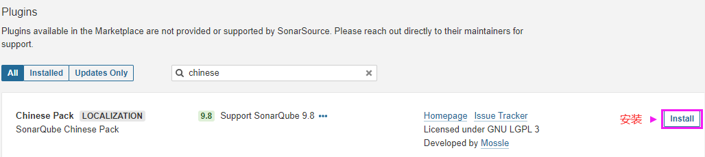
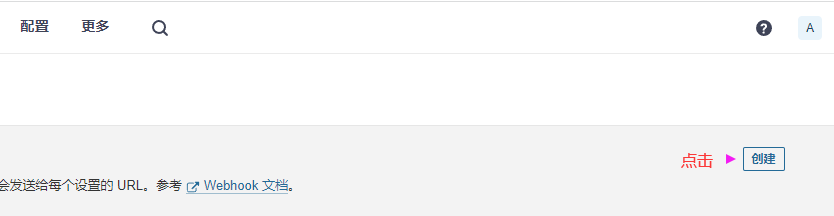
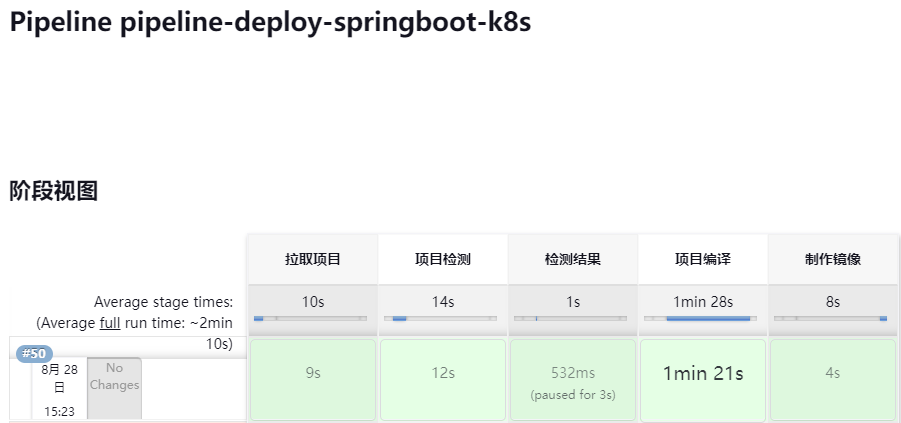
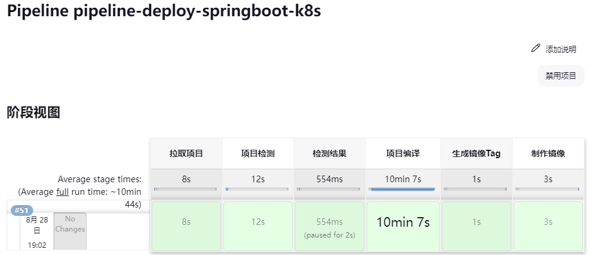
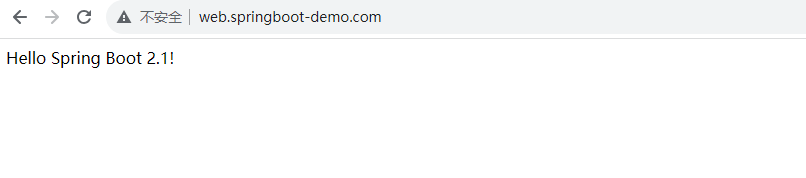
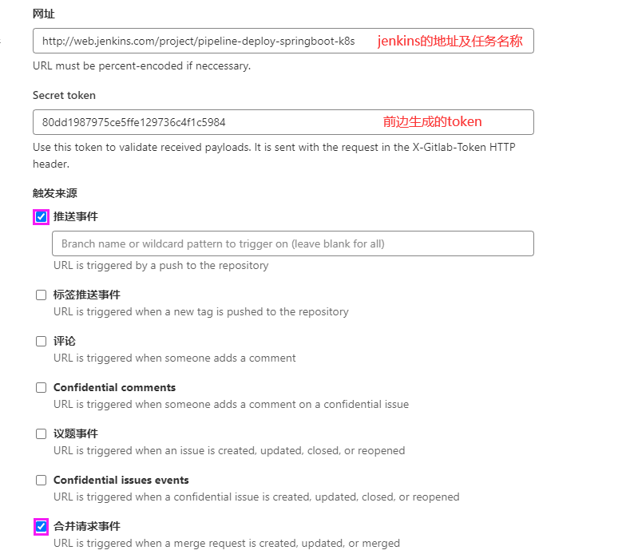

### 本资源由 itjc8.com 收集整理
# k8s集群部署CICD环境


#### 部署GitLab仓库

GitLab以容器方式运行需要持久化以下几个目录的数据

| 本地位置      | 容器位置          | 使用                   |
| :------------ | :---------------- | :--------------------- |
| `$PVC/data`   | `/var/opt/gitlab` | 用于存储应用程序数据   |
| `$PVC/logs`   | `/var/log/gitlab` | 用于存储日志           |
| `$PVC/config` | `/etc/gitlab`     | 用于存储GitLab配置文件 |


参考地址：https://docs.gitlab.com/ee/install/docker.html

```yaml
[root@k8s-master01 ~]# kubectl create ns ops
[root@k8s-master01 ~]# mkdir cicd
[root@k8s-master01 ~]# cd cicd

#部署GitLab
cat gitlab.yml 

apiVersion: v1
kind: Service
metadata:
  name: gitlab-svc
  namespace: ops
spec:
  clusterIP: None
  selector:
    app: gitlab
  ports:
  - name: http
    port: 80
    targetPort: 80
  - name: https
    port: 443
    targetPort: 443
---
apiVersion: apps/v1
kind: StatefulSet
metadata:
  name: gitlab
  namespace: ops
spec:
  serviceName: "gitlab-svc"               # 关联的headlessService
  selector:
    matchLabels:
      app: gitlab
  template:
    metadata:
      labels:
        app: gitlab
    spec:
      containers:
      - name: gitlab-ce
        image: gitlab/gitlab-ce:14.1.0-ce.0
        env:
        - name: GITLAB_ROOT_PASSWORD      # 设置GitLab的root密码
          value: "admin123"
        - name: GITLAB_OMNIBUS_CONFIG     # 需要修改gitlab.rb文件中的配置可以在这里配置，每个配置一行，需要定义GitLab的URL，关闭无用组件
          value: |
            external_url "http://web.gitlab.com"
            gitlab_rails['time_zone'] = 'Asia/Shanghai'
            node_exporter['enable'] = false
            redis_exporter['enable'] = false
            postgres_exporter['enable'] = false
            gitlab_exporter['enable'] = false
            grafana['enable'] = false
            grafana['reporting_enabled'] = false
            prometheus['enable'] = false
            prometheus['monitor_kubernetes'] = false
        ports:
        - name: http
          containerPort: 80
        - name: https
          containerPort: 443
        volumeMounts:
        - name: data
          mountPath: /etc/gitlab
          subPath: config
        - name: data
          mountPath: /var/opt/gitlab
          subPath: data
        - name: data
          mountPath: /var/log/gitlab
          subPath: logs

  volumeClaimTemplates:
  - metadata:
      name: data
    spec:
      accessModes: ["ReadWriteMany"]
      storageClassName: "nfs-client"
      resources:
        requests:
          storage: 50Gi
---
apiVersion: networking.k8s.io/v1
kind: Ingress
metadata:
  name: gitlab-ingress
  namespace: ops
spec:
  ingressClassName: "nginx"
  rules:
  - host: "web.gitlab.com"
    http:
      paths:
      - path: /
        pathType: Prefix
        backend:
          service:
            name: gitlab-svc
            port:
              name: http
```

```shell
#创建Pod
kubectl create -f gitlab.yml

#查看Pod
kubectl get pod -n ops
NAME       READY   STATUS    RESTARTS   AGE
gitlab-0   1/1     Running   0          3m24s
```


配置本地解析，访问GitLab：http://web.gitlab.com/

|  |
| ------------------------------------------------------------ |
|  |
|  |


#### 部署SonarQube

官方地址https://docs.sonarsource.com/sonarqube/latest/setup-and-upgrade/deploy-on-kubernetes/deploy-sonarqube-on-kubernetes/

sonarqube需要postgresql存储数据，先部署postgresql

```yaml
cat sonar-pgsql.yml

apiVersion: v1
kind: Service
metadata:
  name: pgsql-svc
  namespace: ops
spec:
  clusterIP: None
  selector:
    app: pgsql
  ports:
  - port: 5432

---
apiVersion: apps/v1
kind: StatefulSet
metadata:
  name: postgresql
  namespace: ops
spec:
  serviceName: "pgsql-svc"
  selector:
    matchLabels:
      app: pgsql
  template:
    metadata:
      labels:
        app: pgsql
    spec:
      containers:
      - name: postgresql
        image: postgres:13.8
        env:
        - name: POSTGRES_DB                   # 数据库
          value: sonardb
        - name: POSTGRES_USER                 # 用户
          value: sonar
        - name: POSTGRES_PASSWORD             # 密码
          value: "123456"
        ports:
        - containerPort: 5432
        volumeMounts:
        - name: db
          mountPath: /var/lib/postgresql/data

  volumeClaimTemplates:         
  - metadata:
      name: db
    spec:
      accessModes: ["ReadWriteOnce"]
      storageClassName: "nfs-client"
      resources:
        requests:
          storage: 50Gi
```

```shell
#创建Pod
kubectl create -f sonar-pgsql.yml

#查看Pod
kubectl get pod -n ops
NAME           READY   STATUS    RESTARTS   AGE
gitlab-0       1/1     Running   0          33m
postgresql-0   1/1     Running   0          2m9s
```

```shell
#进入到pgsql容器
kubectl exec -it postgresql-0 -n ops -- /bin/bash

#登录pgsql
root@postgresql-0:/# psql -Usonar -d sonardb

#查看库
sonardb-# \l

                             List of databases
   Name    | Owner | Encoding |  Collate   |   Ctype    | 
-----------+-------+----------+------------+------------+
 postgres  | sonar | UTF8     | en_US.utf8 | en_US.utf8 | 
 sonardb   | sonar | UTF8     | en_US.utf8 | en_US.utf8 | 
 template0 | sonar | UTF8     | en_US.utf8 | en_US.utf8 | 
           |       |          |            |            | 
 template1 | sonar | UTF8     | en_US.utf8 | en_US.utf8 | 
           |       |          |            |            | 
```


**部署sonarqube**

sonarqube以容器方式运行需要持久化以下几个目录的数据

| 本地位置      | 容器位置                    | 使用                 |
| :------------ | :-------------------------- | :------------------- |
| `$PVC/data`   | `/opt/sonarqube/data`       | 用于存储应用程序数据 |
| `$PVC/logs`   | `/opt/sonarqube/logs`       | 用于存储日志         |
| `$PVC/config` | `/opt/sonarqube/extensions` | 用于存储第三方插件   |

```yaml
cat sonarqube.yml

apiVersion: v1
kind: Service
metadata:
  name: sonarqube-svc
  namespace: ops
spec:
  clusterIP: None
  selector:
    app: sonarqube
  ports:
  - name: web
    port: 9000
    targetPort: 9000
---
apiVersion: apps/v1
kind: StatefulSet
metadata:
  name: sonarqube
  namespace: ops
spec:
  serviceName: "sonarqube-svc"
  selector:
    matchLabels:
      app: sonarqube
  template:
    metadata:
      labels:
        app: sonarqube
    spec:
      initContainers:          # 通过初始容器设置SonarQube的建议值
      - name: set-kernel       # 容器名称
        image: busybox         # 镜像
        command: ["sh", "-c", "sysctl -w vm.max_map_count=524288 ; sysctl -w fs.file-max=131072 ; ulimit -n 131072 ; ulimit -u 8192"]
        securityContext:       # 用来控制容器的权限，允许容器在主机操作系统上执行更高权限的操作
          privileged: true     # 当 privileged 属性设置为 true 时，容器将被授予主机操作系统的完全权限，包括对底层硬件和内核的访问
      containers:
      - name: sonarqube
        image: sonarqube:10.1.0-community
        env:
        - name: JAVA_OPTS                             # 设置时区
          value: -Duser.timezone=Asia/Shanghai
        - name: SONARQUBE_JDBC_USERNAME               # 连接pgsql用户名
          value: sonar
        - name: SONARQUBE_JDBC_PASSWORD               # 连接pgsql密码
          value: "123456"
        - name: SONARQUBE_JDBC_URL                    # 连接pgsql地址/数据库
          value: jdbc:postgresql://pgsql-svc.ops.svc.cluster.local:5432/sonardb
        ports:
        - name: web
          containerPort: 9000
        volumeMounts:
        - name: data
          mountPath: /opt/sonarqube/data
          subPath: data
        - name: data
          mountPath: /opt/sonarqube/logs
          subPath: logs
        - name: data
          mountPath: /opt/sonarqube/extensions
          subPath: extensions

  volumeClaimTemplates:         
  - metadata:
      name: data
    spec:
      accessModes: ["ReadWriteOnce"]
      storageClassName: "nfs-client"
      resources:
        requests:
          storage: 50Gi
---
apiVersion: networking.k8s.io/v1
kind: Ingress
metadata:
  name: sonarqube-ingress
  namespace: ops
spec:
  ingressClassName: "nginx"
  rules:
  - host: "web.sonarqube.com"
    http:
      paths:
      - path: /
        pathType: Prefix
        backend:
          service:
            name: sonarqube-svc
            port:
              name: web
```

```shell
#创建Pod
kubectl create -f sonarqube.yml

#查看Pod
kubectl get pod -n ops
NAME           READY   STATUS    RESTARTS   AGE
gitlab-0       1/1     Running   0          86m
postgresql-0   1/1     Running   0          55m
sonarqube-0    1/1     Running   0          80s
```


配置本地解析，访问sonarqube：http://web.sonarqube.com/，用户名admin，密码admin

|          |
| ------------------------------------------------------------ |
|          |
|  |
|  |


删除当前Pod在重新创建使插件生效（删除Pod即可，控制器会自动重新拉起新的Pod）

```shell
kubectl delete pod sonarqube-0 -n ops
```


验证插件是否生效


#### 部署Jenkins

参考地址：https://www.jenkins.io/doc/book/installing/kubernetes/

先创建RBAC， 后期Jenkins需要创建 Slave Pod来完成流水线的执行，Slave Pod需要集群一些权限； 

```yaml
cat jenkins-rbac.yml

# serviceaccount
apiVersion: v1
kind: ServiceAccount
metadata:
  name: jenkins
  namespace: ops

---
# clusterRole
kind: ClusterRole
apiVersion: rbac.authorization.k8s.io/v1
metadata:
  name: jenkins
rules:
  - apiGroups: ["extensions", "apps"]
    resources: ["deployments", "ingresses"]
    verbs: ["create", "delete", "get", "list", "watch", "patch", "update"]
  - apiGroups: [""]
    resources: ["services"]
    verbs: ["create", "delete", "get", "list", "watch", "patch", "update"]
  - apiGroups: [""]
    resources: ["pods"]
    verbs: ["create", "delete", "get", "list", "patch", "update", "watch"]
  - apiGroups: [""]
    resources: ["pods/exec"]
    verbs: ["create", "delete", "get", "list", "patch", "update", "watch"]
  - apiGroups: [""]
    resources: ["pods/log", "events"]
    verbs: ["get", "list", "watch"]
  - apiGroups: [""]
    resources: ["secrets"]
    verbs: ["get"]

---
# clusterrolebinding
apiVersion: rbac.authorization.k8s.io/v1
kind: ClusterRoleBinding
metadata:
  name: jenkins
  namespace: ops
roleRef:
  apiGroup: rbac.authorization.k8s.io
  kind: ClusterRole
  name: jenkins
subjects:
  - kind: ServiceAccount
    name: jenkins
    namespace: ops
```

```shell
#创建RBAC
kubectl create -f jenkins-rbac.yml
```


**部署Jenkins**

```yaml
cat jenkins.yml

---
apiVersion: v1
kind: Service
metadata:
  name: jenkins-svc
  namespace: ops
spec:
  clusterIP: None
  selector:
    app: jenkins
  ports:
    - name: http
      port: 8080
      targetPort: 8080
    - name: agent
      port: 50000
      targetPort: 50000
---
apiVersion: apps/v1
kind: StatefulSet
metadata:
  name: jenkins
  namespace: ops
spec:
  serviceName: "jenkins-svc"
  selector:
    matchLabels:
      app: jenkins
  template:
    metadata:
      labels:
        app: jenkins
    spec:
      serviceAccount: jenkins
      containers:
        - name: jenkins
          image: jenkins/jenkins:2.401.3-lts
          securityContext:      # 用来控制容器的权限，允许容器在主机操作系统上执行更高权限的操作
            privileged: true    # 当 privileged 属性设置为 true 时，容器将被授予主机操作系统的完全权限，包括对底层硬件和内核的访问
            runAsUser: 0        # root身份运行
          env:
          - name: JAVA_OPTS     
            value: -Duser.timezone=Asia/Shanghai
          ports:
            - name: http
              containerPort: 8080
            - name: agent
              containerPort: 50000 
          readinessProbe:              # 就绪探针
            httpGet:
              path: /login
              port: 8080
            initialDelaySeconds: 60    # 首次探测时间
            timeoutSeconds: 5          # 超时时间
          volumeMounts:
            - name: data
              mountPath: /var/jenkins_home  # Jenkins的家目录

  volumeClaimTemplates:
  - metadata:
      name: data
    spec:
      accessModes: ["ReadWriteOnce"]
      storageClassName: "nfs-client"
      resources:
        requests:
          storage: 50Gi
---
apiVersion: networking.k8s.io/v1
kind: Ingress
metadata:
  name: jenkins-ingress
  namespace: ops
spec:
  ingressClassName: "nginx"
  rules:
  - host: "web.jenkins.com"
    http:
      paths:
      - path: /
        pathType: Prefix
        backend:
          service:
            name: jenkins-svc 
            port:
              name: http
```

```shell
#创建Pod
kubectl create -f jenkins.yml

#查看Pod
kubectl get pod -n ops
NAME           READY   STATUS    RESTARTS   AGE
gitlab-0       1/1     Running   0          3h14m
jenkins-0      1/1     Running   0          89s
postgresql-0   1/1     Running   0          162m
sonarqube-0    1/1     Running   0          76m
```

```shell
#查看日志获取jenkins密码
kubectl logs jenkins-0 -n ops
...
9a6eb67701964e67a0ce0fe2b8c92e81
```


配置本地解析，访问Jenkins：http://web.jenkins.com/

|  |
| ------------------------------------------------------------ |
|  |
|  |

先安装一个 中文插件，点击下方【安装】。


|  |
| ------------------------------------------------------------ |
|  |
|  |


**安装Jenkins插件**

- 中文插件： Localization: Chinese 

- Git插件： git、gitlab（实现Jenkins与GitLab的webhook） 

- Sonar插件： SonarQube Scanner（支持与sonarqube集成插件）

- Pipeline插件： pipeline、pipeline Stage View、Blue Ocean（查看流水线阶段视图插件）

- Kubernetes插件： Kubernetes（支持与k8s集成的插件）


通过左侧【Manage Jenkins】【插件管理】【Available】安装以上插件，当插件安装完成后，重启Jenkins。

|  |
| ------------------------------------------------------------ |
|  |
|  |


#### Pipeline流水线

Pipeline 就是通过“ 代码的方式 ” 将多个步骤的任务连接起来共同完成一件事；比如：获取代码->代码扫描->代码编译->制作镜像->推送仓库->部署应用 ，将这些步骤通过代码的方式组织在一起完成这次应用发布，这个就可以称为流水线； 

流水线语法：https://www.jenkins.io/zh/doc/book/pipeline/syntax/

Vs Code软件下载地址：https://code.visualstudio.com/Download

```json
pipeline {
    //指定任务在哪个集群节点上执行(any表示任意节点)
    agent any
	//声明全局环境变量，方便后面使用
	environment {
	    key='value'
	}
	
	//一个流水线任务的集合，所有任务步骤都在stages中定义
    stages {
        //一个stage就是一个步骤
        stage('拉取git仓库代码') {
            //在steps中定义执行的命令
            steps {
                echo '拉取git仓库代码-SUCCESS'
            }
        }
		stage('通过sonarqube做代码质量检测') {
            steps {
                echo '代码质量检测-SUCCESS'
            }
        }
		stage('通过maven构建项目') {
            steps {
                echo '通过maven构建项目-SUCCESS'
            }
        }
		stage('通过docker制作自定义镜像') {
            steps {
                echo 'docker制作自定义镜像-SUCCESS'
            }
        }
		stage('将自定义镜像推送到harbor仓库中') {
            steps {
                echo '推送到harbor仓库-SUCCESS'
            }
        }
		stage('在kubernetes执行部署') {
            steps {
                echo '在kubernetes执行部署-SUCCESS'
            }
        }
    }
}
```


# Jenkins Slave环境部署

所谓 Jenkins Master/Slave 架构，及在Master上进行任务分配。然后由Slave来完成，不过Slave运行方式有两种： 

- 静态SLave：Jenkins Master 和 Jenkins Slave 部署在物理机或者VM中，手动注册到 Master，然后执行任务，任务完成节点处于空闲等待状态； 

- 动态Slave：Jenkins Master 和 Jenkins Slave 以容器形式运行在 Kubernetes 集中，由Master动态创建Slave的Pod，自动注册到 Master，然后执行任务，任务结束Pod自动销毁； 


这种方式带来的好处有很多： 

- 服务高可用，当 Jenkins Master 出现故障时，Kubernetes 会自动创建一个新的 Jenkins Master 容器，并且将 Volume 分配给新创建的容器，保证数据不丢失，从而达到集群服务高可用。 
- 动态伸缩，合理使用资源，每次运行 Job 时，会自动创建一个 Jenkins Slave，Job 完成后，Slave 自动注销并删除容器，资源自动释放，而且 Kubernetes 会根据每个资源的使用情况，动态分配 Slave 到空闲的节点上创建，降低出现因某节点资源利用率高，还排队等待在该节点的情况。 


#### 配置Jenkins动态Slave

在Jenkins的【系统管理】【节点和云管理】【Configure Clouds】

|  |
| ------------------------------------------------------------ |
|  |
|  |

其他配置无需定义，点击下方【Save】即可。


#### 测试动态Slave Pod

在jenkins创建一个流水线，测试能否在k8s集群中拉起一个动态的Slave Pod

|  |
| ------------------------------------------------------------ |
|  |
|  |
|  |
|  |
|  |
|  |

```json
pipeline {
    //在名为kubernetes的Agent中执行流水线，会拉起一个Slave Pod
    agent {
        kubernetes {
            cloud 'kubernetes'
        }
    }
    stages {
        //会显示Pod的名称
        stage('输出主机名称') {
            steps {
                sh 'hostname'
            }
        }
		//由于Pod执行完任务就销毁，所以等待一段时间验证Pod是否成功运行
        stage('等待20秒') {
            steps{
            	sh 'sleep 20s'
        	}
        }
    }
}
```


#### 制作Pod模板镜像

jnlp镜像是用来连接Jenkins Master以及共享Master的 WORKSPACE，但该镜像并没有maven、docker、kubectl等常用命令，为此我们需要准备几个镜像，后期通过Pipeline将不同的任务交由同一个Pod的不同的容器来执行。 


**在harbor主机准备以下镜像**

准备maven镜像（需要修改镜像里的一些配置）

```shell
[root@harbor ~]# mkdir maven
[root@harbor maven]# cat dockerfile
FROM maven:3.8.6-openjdk-8

#添加maven配置文件,该文件指向的maven仓库地址是阿里云地址
ADD ./settings_docker.xml /usr/share/maven/conf/settings.xml

#调整系统时区
FROM maven:3.8.6-openjdk-8
ADD ./settings_docker.xml /usr/share/maven/conf/settings.xml
COPY ./Shanghai /etc/localtime
RUN echo 'Asia/Shanghai' >/etc/timezone
```

```shell
#拷贝系统时区文件到当前路径
[root@harbor maven]# cp /usr/share/zoneinfo/Asia/Shanghai .

#构建镜像
[root@harbor maven]# docker build -f dockerfile -t maven:3.8.6 .
```

```shell
#上传镜像到仓库（提前在harbor创建一个ops公开仓库）
[root@harbor ~]# docker tag maven:3.8.6 192.168.0.25/ops/maven:3.8.6
[root@harbor ~]# docker push 192.168.0.25/ops/maven:3.8.6
```


准备sonar-scanner客户端镜像，sonar-scanner的作用是将拉取过来的代码推送给服务端进行检测（该镜像无需修改，下载后直接上传到harbor仓库即可）

```shell
[root@harbor ~]# docker pull emeraldsquad/sonar-scanner:2.3.0
[root@harbor ~]# docker tag 'emeraldsquad/sonar-scanner:2.3.0' '192.168.0.25/ops/sonar-scanner:2.3.0'
[root@harbor ~]# docker push '192.168.0.25/ops/sonar-scanner:2.3.0'
```


准备nodejs镜像，用于构建java前端项目

```shell
[root@harbor ~]# mkdir nodejs
[root@harbor nodejs]# cat dockerfile 
FROM centos:7

#调整系统时区
COPY ./Shanghai /etc/localtime
RUN echo 'Asia/Shanghai' >/etc/timezone

#准备nodejs仓库(--silent不显示进度条，--location遇到HTTP重定向时自动跟随，bash - 直接执行前边访问的脚本)
RUN curl --silent --location https://rpm.nodesource.com/setup_14.x |bash -

#安装nodejs
RUN yum install nodejs gcc-c++ make vim -y && \
    yum clean all
```

```shell
##拷贝系统时区文件到当前路径
[root@harbor nodejs]# cp /usr/share/zoneinfo/Asia/Shanghai .

#构建镜像并上传到仓库
[root@harbor nodejs]# docker build -f dockerfile -t 192.168.0.25/ops/nodejs:14.20 .
[root@harbor nodejs]# docker push 192.168.0.25/ops/nodejs:14.20
```


准备docker客户端镜像，用于构建项目镜像等功能，如：build、push等（该镜像无需修改）

```shell
[root@harbor ~]# docker pull docker:20.10
[root@harbor ~]# docker tag docker:20.10 192.168.0.25/ops/docker:20.10
[root@harbor ~]# docker push 192.168.0.25/ops/docker:20.10
```


准备kubectl镜像

```shell
[root@harbor ~]# mkdir kubectl
[root@harbor kubectl]# cat dockerfile
FROM centos:7

#调整系统时区
COPY ./Shanghai /etc/localtime
RUN echo 'Asia/Shanghai' >/etc/timezone

#添加kubernetes源
ADD ./kubernetes.repo /etc/yum.repos.d/kubernetes.repo

#安装Kubectl
RUN yum makecache && yum install kubectl-1.23.0 -y && \
    yum clean all
```

```shell
#拷贝系统时区文件到当前路径
[root@harbor kubectl]#  cp /usr/share/zoneinfo/Asia/Shanghai .

#构建镜像并上传到仓库
[root@harbor kubectl]# docker build -f dockerfile
-t 192.168.0.25/ops/kubectl:1.23.0 .

[root@harbor kubectl]# docker push 192.168.0.25/ops/kubectl:1.23.0
```


#### 测试Pod模板

在Jenkins中运行一个流水线任务，定义Pod模板中的容器名称以及容器镜像地址，然后定义不同的任务由不同的容器来执行。

```json
pipeline {
    //在名为kubernetes的Agent中执行流水线，会拉起一个Slave Pod
    agent {
        kubernetes {
            cloud 'kubernetes'
            yaml '''
            apiVersion: v1
            kind: Pod
            spec:
              volumes:
              - name: data
                nfs:
                  server: 192.168.0.15
                  path: /data/maven
              - name: dockersocket
                hostPath:
                  path: /run/docker.sock
              containers:
              - name: maven
                image: 192.168.0.25/ops/maven:3.8.6
                imagePullPolicy: IfNotPresent
                command: ["cat"]
                tty: true
                volumeMounts:
                - name: data
                  mountPath: /root/.m2
              - name: nodejs
                image: 192.168.0.25/ops/nodejs:14.20
                imagePullPolicy: IfNotPresent
                command: ["cat"]
                tty: true
              - name: sonar
                image: 192.168.0.25/ops/sonar-scanner:2.3.0
                imagePullPolicy: IfNotPresent
                command: ["cat"]
                tty: true
              - name: docker
                image: 192.168.0.25/ops/docker:20.10
                imagePullPolicy: IfNotPresent
                command: ["cat"]
                tty: true
                volumeMounts:
                - name: dockersocket
                  mountPath: /run/docker.sock
              - name: kubectl
                image: 192.168.0.25/ops/kubectl:1.23.0
                imagePullPolicy: IfNotPresent
                command: ["cat"]
                tty: true
            '''
        }
    }
    stages {
        stage('maven测试') {
            steps {
              container('maven'){
                sh 'mvn --version'
              }
            }
        }
        stage('nodejs测试'){
            steps{
              container('nodejs'){
                sh 'node -v'
              }
        	}
        }
        stage('docker测试'){
          steps{
            container('docker'){
              sh 'docker ps'
            }
          }
        }
        stage('kubectl测试'){
          steps{
            container('kubectl'){
              sh 'kubectl version'
            }
          }
        }
    }
}
```


在nfs中准备共享存储目录：/data/maven

```shell
[root@k8s-nfs ~]# vim /etc/exports
#...
/data/maven 192.168.0.0/24(rw,no_root_squash)
```

```shell
[root@k8s-nfs ~]# systemctl restart nfs
```


在任务中执行流水线，验证结果

|  |
| ------------------------------------------------------------ |
|  |


# Pipeline部署SprinBoot项目

#### CICD流程介绍

- 获取代码
- 漏洞扫描
- 检测漏洞扫描结果，如果正常则继续，否则就终止
- 使用maven进行编译、打包
- 通过dockerfile制作镜像，推送到镜像仓库
- 手动交付应用到k8s
- 自动的交付应用到k8s
- 如果项目有问题则回滚


#### 上传项目到仓库

在GitLab提前创建一个名称为springboot项目仓库

|  |
| ------------------------------------------------------------ |
|  |


在Harbor主机上传项目到仓库

```shell
#需要配置本地解析
[root@harbor ~]# vim /etc/hosts
#...
192.168.0.13 web.gitlab.com    #地址是Ingress代理节点的IP
```

```shell
#解压项目
[root@harbor ~]# unzip spring-boot-helloWorld.zip
[root@harbor ~]# cd spring-boot-helloWorld

#设置Git用户与邮箱
git config --global user.name "yesir"
git config --global user.email "yesir@example.com"

#初始化本地仓库并上传项目
git init
git add .
git commit -m '测试1'
git remote add origin http://web.gitlab.com/root/sbringboot.git
git push -u origin master
```


#### 添加GitLab域名解析

首先在k8s集群添加一个DNS解析记录，用于让Slave Pod可以方便访问GitLab仓库，默认Slave Pod无法访问GitLab

```shell
#查看coredns的configMap
[root@k8s-master01 ~]# kubectl get cm -n kube-system
...
coredns


#查看Ingress的地址及对应的GitLab域名，并将该地址及域名添加到coredns中解析
[root@k8s-master01 ~]# kubectl get ing -n ops
NAME                CLASS   HOSTS               ADDRESS        PORTS   
gitlab-ingress      nginx   web.gitlab.com      10.96.104.68   80      


#编辑coredns的configMap，增加DNS解析
[root@k8s-master01 ~]# kubectl edit cm coredns -n kube-system
#...缩进别用tab键
        hosts {
          10.96.104.68 web.gitlab.com
          fallthrough
        }
#...
```


提示：如果添加失败，就删除当前的coredns重新部署。


登录到任意容器中测试是否可以解析到该地址

```shell
[root@k8s-master01 ~]# kubectl exec -it jenkins-0 -n ops -- /bin/bash
[root@jenkins-0 /]# ping web.gitlab.com
64 bytes from web.gitlab.com (10.96.104.68): icmp_seq=1 ttl=64 time=0.036 ms
```


#### 添加Jenkins凭据

在Jenkins中添加一个全局凭据，用于让Slave Pod可以访问GitLab的**私有**仓库，在：【系统管理】【凭据管理】

|  |
| ------------------------------------------------------------ |
|  |
|  |


#### Pipeline拉取项目

在Jenkins中新建任务，通过流水线发布Spring-boot项目

|  |
| ------------------------------------------------------------ |
|  |
|  |
|  |
|  |


定义拉取代码的流水线，参考【拉取项目】步骤

```json
pipeline {
    //在名为kubernetes的Agent中执行流水线
    agent {
        kubernetes {
            cloud 'kubernetes'
            yaml '''
            apiVersion: v1
            kind: Pod
            spec:
              volumes:
              - name: data
                nfs:
                server: 192.168.0.15
                path: /data/maven
              - name: dockersocket
                hostPath:
                  path: /run/docker.sock
              containers:
              - name: maven
                image: 192.168.0.25/ops/maven:3.8.6
                imagePullPolicy: IfNotPresent
                command: ["cat"]
                tty: true
                volumeMounts:
                - name: data
                  mountPath: /root/.m2
              - name: nodejs
                image: 192.168.0.25/ops/nodejs:14.20
                imagePullPolicy: IfNotPresent
                command: ["cat"]
                tty: true
              - name: sonar
                image: 192.168.0.25/ops/sonar-scanner:2.3.0
                imagePullPolicy: IfNotPresent
                command: ["cat"]
                tty: true
              - name: docker
                image: 192.168.0.25/ops/docker:20.10
                imagePullPolicy: IfNotPresent
                command: ["cat"]
                tty: true
                volumeMounts:
                - name: dockersocket
                  mountPath: /run/docker.sock
              - name: kubectl
                image: 192.168.0.25/ops/kubectl:1.23.0
                imagePullPolicy: IfNotPresent
                command: ["cat"]
                tty: true
            '''
        }
    }

    //定义全局变量
    environment{
      //把GitLab仓库地址定义成变量更加灵活一些，注意引用变量时用双引号
      Gitlab_URL = 'http://web.gitlab.com/root/sbringboot.git'
  
      //把认证的token定义成变量更加灵活一些，注意引用变量时用双引号
      Gitlab_token = 'gitlab-root-token'
    }

    stages {
        stage('拉取项目') {
            steps {
              container('maven'){
                checkout scmGit(branches: [[name: '*/master']], extensions: [], userRemoteConfigs: [[credentialsId: "$Gitlab_token", url: "$Gitlab_URL"]])

                //查看项目文件
                sh 'ls -l'

                //查看当前项目所在路径
                sh 'pwd'
              }
            }
        }
    }
}
```


在Jenkins的 pipeline-deploy-springboot-k8s 项目中测试语法

|  |
| ------------------------------------------------------------ |
|  |
|  |

到此为止代拉取项目测试成功。


#### 添加Sonar及Jenkins域名解析

在k8s集群添加SonarQube与Jenkins的DNS解析记录，用于让Slave Pod可以方便访问SonarQube进行项目漏洞检查，后续Jenkins需要与Sonarqube集成也需要相互访问

```shell
#查看Ingress的地址及对应的GitLab域名，并将该地址及域名添加到coredns中解析
[root@k8s-master01 ~]# kubectl get ing -n ops
NAME                CLASS   HOSTS               ADDRESS        PORTS   
sonarqube-ingress   nginx   web.sonarqube.com   10.96.104.68   80     
jenkins-ingress     nginx   web.jenkins.com     10.96.104.68   80


#编辑coredns的configMap，增加DNS解析，添加到hosts中
[root@k8s-master01 ~]# kubectl edit cm coredns -n kube-system
#...
        hosts {
          10.96.104.68 web.sonarqube.com
          10.96.104.68 web.jenkins.com
          10.96.104.68 web.sonarqube.com
          fallthrough
        }
#...
```


登录到Jenkiins容器中测试是否可以解析到该地址

```shell
[root@k8s-master01 ~]# kubectl exec -it jenkins-0 -n ops -- /bin/bash
[root@jenkins-0 /]# ping web.sonarqube.com
64 bytes from web.gitlab.com (10.96.104.68): icmp_seq=1 ttl=64 time=0.034 ms
```


#### Jenkins集成SonarQube

Jenkins将获取的代码交给SonarQube检测，需要在jenkins中配置集成SonarQube，在【系统管理】【系统配置】

|  |
| ------------------------------------------------------------ |
|  |
|  |
|  |
|  |
|  |
|  |
|  |

到此为止，Jenkins就可以集成Sonarqube进行代码检测。


#### Pipeline项目检测

接下来通过SonarQube进行代码检测，需要让sonar-scanner客户端可以访问SonarQube的服务端，将代码推送到服务端进行检测

|  |
| ------------------------------------------------------------ |
|  |
|  |
|  |
|  |
|  |
|  |
|  |


定义项目检测的流水线，参考【项目检测】步骤

参考地址：https://docs.sonarsource.com/sonarqube/latest/analyzing-source-code/scanners/jenkins-extension-sonarqube/

```json
pipeline {
    //在名为kubernetes的Agent中执行流水线
    agent {
        kubernetes {
            cloud 'kubernetes'
            yaml '''
            apiVersion: v1
            kind: Pod
            spec:
              volumes:
              - name: data
                nfs:
                server: 192.168.0.15
                path: /data/maven
              - name: dockersocket
                hostPath:
                  path: /run/docker.sock
              containers:
              - name: maven
                image: 192.168.0.25/ops/maven:3.8.6
                imagePullPolicy: IfNotPresent
                command: ["cat"]
                tty: true
                volumeMounts:
                - name: data
                  mountPath: /root/.m2
              - name: nodejs
                image: 192.168.0.25/ops/nodejs:14.20
                imagePullPolicy: IfNotPresent
                command: ["cat"]
                tty: true
              - name: sonar
                image: 192.168.0.25/ops/sonar-scanner:2.3.0
                imagePullPolicy: IfNotPresent
                command: ["cat"]
                tty: true
              - name: docker
                image: 192.168.0.25/ops/docker:20.10
                imagePullPolicy: IfNotPresent
                command: ["cat"]
                tty: true
                volumeMounts:
                - name: dockersocket
                  mountPath: /run/docker.sock
              - name: kubectl
                image: 192.168.0.25/ops/kubectl:1.23.0
                imagePullPolicy: IfNotPresent
                command: ["cat"]
                tty: true
            '''
        }
    }

    //定义全局变量
    environment{
      //把GitLab仓库地址定义成变量更加灵活一些，注意引用变量时用双引号
      Gitlab_URL = 'http://web.gitlab.com/root/sbringboot.git'
  
      //把认证的token定义成变量更加灵活一些，注意引用变量时用双引号
      Gitlab_token = 'gitlab-root-token'
    }

    stages {
        stage('拉取项目') {
            steps {
              container('maven'){
                checkout scmGit(branches: [[name: '*/master']], extensions: [], userRemoteConfigs: [[credentialsId: "$Gitlab_token", url: "$Gitlab_URL"]])

                //查看项目文件
                sh 'ls -l'

                //查看当前项目所在路径
                sh 'pwd'
              }
            }
        }
        stage('项目检测'){
            steps{
              //withSonarQubeEnv是集成SonarQube属性，用于设置一组环境变量，并引用前边在jenkins中创建的sonar-k8s令牌就可以访问SonarQube，并通过以下方式对项目进行检测
              withSonarQubeEnv('sonar-k8s'){
                container('sonar'){
                  sh 'sonar-scanner \
                    -Dsonar.projectKey=Pipeline-pipeline-deploy-springboot-k8s \
                    -Dsonar.sources=.'
                }
              }
            }
        }
    }
}
```


在Jenkins的 pipeline-deploy-springboot-k8s 项目中测试语法

|  |
| ------------------------------------------------------------ |
|  |


在SonarQube的pipeline中添加 `-Dsonar.java.binaries=src` ，src是源码目录名称

```json
pipeline {
    //在名为kubernetes的Agent中执行流水线
    agent {
        kubernetes {
            cloud 'kubernetes'
            yaml '''
            apiVersion: v1
            kind: Pod
            spec:
              volumes:
              - name: data
                nfs:
                server: 192.168.0.15
                path: /data/maven
              - name: dockersocket
                hostPath:
                  path: /run/docker.sock
              containers:
              - name: maven
                image: 192.168.0.25/ops/maven:3.8.6
                imagePullPolicy: IfNotPresent
                command: ["cat"]
                tty: true
                volumeMounts:
                - name: data
                  mountPath: /root/.m2
              - name: nodejs
                image: 192.168.0.25/ops/nodejs:14.20
                imagePullPolicy: IfNotPresent
                command: ["cat"]
                tty: true
              - name: sonar
                image: 192.168.0.25/ops/sonar-scanner:2.3.0
                imagePullPolicy: IfNotPresent
                command: ["cat"]
                tty: true
              - name: docker
                image: 192.168.0.25/ops/docker:20.10
                imagePullPolicy: IfNotPresent
                command: ["cat"]
                tty: true
                volumeMounts:
                - name: dockersocket
                  mountPath: /run/docker.sock
              - name: kubectl
                image: 192.168.0.25/ops/kubectl:1.23.0
                imagePullPolicy: IfNotPresent
                command: ["cat"]
                tty: true
            '''
        }
    }

    //定义全局变量
    environment{
      //把GitLab仓库地址定义成变量更加灵活一些，注意引用变量时用双引号
      Gitlab_URL = 'http://web.gitlab.com/root/sbringboot.git'
  
      //把认证的token定义成变量更加灵活一些，注意引用变量时用双引号
      Gitlab_token = 'gitlab-root-token'
    }

    stages {
        stage('拉取项目') {
            steps {
              container('maven'){
                checkout scmGit(branches: [[name: '*/master']], extensions: [], userRemoteConfigs: [[credentialsId: "$Gitlab_token", url: "$Gitlab_URL"]])

                //查看项目文件
                sh 'ls -l'

                //查看当前项目所在路径
                sh 'pwd'
              }
            }
        }
        stage('项目检测'){
            steps{
              //withSonarQubeEnv是集成SonarQube属性，用于设置一组环境变量，并引用前边在jenkins中创建的sonar-k8s令牌就可以访问SonarQube，并通过以下方式对项目进行检测
              withSonarQubeEnv('sonar-k8s'){
                container('sonar'){
                  sh 'sonar-scanner \
                    -Dsonar.projectKey=Pipeline-pipeline-deploy-springboot-k8s \
                    -Dsonar.sources=. \
                    -Dsonar.java.binaries=src'
                }
              }
            }
        }
    }
}
```


|  |
| ------------------------------------------------------------ |
|  |


登录SonarQube查看检测结果

|  |
| ------------------------------------------------------------ |
|  |
|  |


#### Pipelin获取检测结果

当SonarQube检测完成后，Jenkins需要获取检测的结果是否合格，如果检测不合格，则不执行后续的部署，合格则继续执行后续的流水线任务。


先在SonarQube中配置webhook，通过webhook将检测结果发送至Jenkins

|  |
| ------------------------------------------------------------ |
|  |
|  |
|  |

**提示：** 最后的"sonarqube-webhook" 不是自定义的，而是一个特定的路径（endpoint），用于接收来自 SonarQube 的 Webhook 请求， 这个路径是 SonarQube 预定义的用于通知外部系统的 Webhook 端点。 


定义项目检测的流水线，参考【检测结果】步骤，参考地址在官方这个位置


```json
pipeline {
    //在名为kubernetes的Agent中执行流水线
    agent {
        kubernetes {
            cloud 'kubernetes'
            yaml '''
            apiVersion: v1
            kind: Pod
            spec:
              volumes:
              - name: data
                nfs:
                server: 192.168.0.15
                path: /data/maven
              - name: dockersocket
                hostPath:
                  path: /run/docker.sock
              containers:
              - name: maven
                image: 192.168.0.25/ops/maven:3.8.6
                imagePullPolicy: IfNotPresent
                command: ["cat"]
                tty: true
                volumeMounts:
                - name: data
                  mountPath: /root/.m2
              - name: nodejs
                image: 192.168.0.25/ops/nodejs:14.20
                imagePullPolicy: IfNotPresent
                command: ["cat"]
                tty: true
              - name: sonar
                image: 192.168.0.25/ops/sonar-scanner:2.3.0
                imagePullPolicy: IfNotPresent
                command: ["cat"]
                tty: true
              - name: docker
                image: 192.168.0.25/ops/docker:20.10
                imagePullPolicy: IfNotPresent
                command: ["cat"]
                tty: true
                volumeMounts:
                - name: dockersocket
                  mountPath: /run/docker.sock
              - name: kubectl
                image: 192.168.0.25/ops/kubectl:1.23.0
                imagePullPolicy: IfNotPresent
                command: ["cat"]
                tty: true
            '''
        }
    }

    //定义全局变量
    environment{
      //把GitLab仓库地址定义成变量更加灵活一些，注意引用变量时用双引号
      Gitlab_URL = 'http://web.gitlab.com/root/sbringboot.git'
  
      //把认证的token定义成变量更加灵活一些，注意引用变量时用双引号
      Gitlab_token = 'gitlab-root-token'
    }

    stages {
        stage('拉取项目') {
            steps {
              container('maven'){
                checkout scmGit(branches: [[name: '*/master']], extensions: [], userRemoteConfigs: [[credentialsId: "$Gitlab_token", url: "$Gitlab_URL"]])

                //查看项目文件
                sh 'ls -l'

                //查看当前项目所在路径
                sh 'pwd'
              }
            }
        }
        stage('项目检测'){
            steps{
              //withSonarQubeEnv是集成SonarQube属性，用于设置一组环境变量，并引用前边在jenkins中创建的sonar-k8s令牌就可以访问SonarQube，并通过以下方式对项目进行检测
              withSonarQubeEnv('sonar-k8s'){
                container('sonar'){
                  sh 'sonar-scanner \
                    -Dsonar.projectKey=Pipeline-pipeline-deploy-springboot-k8s \
                    -Dsonar.sources=. \
                    -Dsonar.java.binaries=src'
                }
              }
            }
        }
        stage('检测结果'){
          steps{
              container('sonar'){
                script{
                  timeout(5){
                    def qg = waitForQualityGate()
                    if (qg.status != 'OK'){
                      error "检测失败，失败的原因: ${qg.status}"
                    }
                  }
                }
              }
          }
        }
    }
}
```


在Jenkins的 pipeline-deploy-springboot-k8s 项目中测试语法

|  |
| ------------------------------------------------------------ |
|  |
|  |


#### Pipeline项目编译

定义项目的流水线，通过Maven对项目编译打包，参考【项目编译】步骤

```json
pipeline {
    //在名为kubernetes的Agent中执行流水线
    agent {
        kubernetes {
            cloud 'kubernetes'
            yaml '''
            apiVersion: v1
            kind: Pod
            spec:
              volumes:
              - name: data
                nfs:
                server: 192.168.0.15
                path: /data/maven
              - name: dockersocket
                hostPath:
                  path: /run/docker.sock
              containers:
              - name: maven
                image: 192.168.0.25/ops/maven:3.8.6
                imagePullPolicy: IfNotPresent
                command: ["cat"]
                tty: true
                volumeMounts:
                - name: data
                  mountPath: /root/.m2
              - name: nodejs
                image: 192.168.0.25/ops/nodejs:14.20
                imagePullPolicy: IfNotPresent
                command: ["cat"]
                tty: true
              - name: sonar
                image: 192.168.0.25/ops/sonar-scanner:2.3.0
                imagePullPolicy: IfNotPresent
                command: ["cat"]
                tty: true
              - name: docker
                image: 192.168.0.25/ops/docker:20.10
                imagePullPolicy: IfNotPresent
                command: ["cat"]
                tty: true
                volumeMounts:
                - name: dockersocket
                  mountPath: /run/docker.sock
              - name: kubectl
                image: 192.168.0.25/ops/kubectl:1.23.0
                imagePullPolicy: IfNotPresent
                command: ["cat"]
                tty: true
            '''
        }
    }

    //定义全局变量
    environment{
      //把GitLab仓库地址定义成变量更加灵活一些，注意引用变量时用双引号
      Gitlab_URL = 'http://web.gitlab.com/root/sbringboot.git'
  
      //把认证的token定义成变量更加灵活一些，注意引用变量时用双引号
      Gitlab_token = 'gitlab-root-token'
    }

    stages {
        stage('拉取项目') {
            steps {
              container('maven'){
                checkout scmGit(branches: [[name: '*/master']], extensions: [], userRemoteConfigs: [[credentialsId: "$Gitlab_token", url: "$Gitlab_URL"]])

                //查看项目文件
                sh 'ls -l'

                //查看当前项目所在路径
                sh 'pwd'
              }
            }
        }
        stage('项目检测'){
            steps{
              //withSonarQubeEnv是集成SonarQube属性，用于设置一组环境变量，并引用前边在jenkins中创建的sonar-k8s令牌就可以访问SonarQube，并通过以下方式对项目进行检测
              withSonarQubeEnv('sonar-k8s'){
                container('sonar'){
                  sh 'sonar-scanner \
                    -Dsonar.projectKey=Pipeline-pipeline-deploy-springboot-k8s \
                    -Dsonar.sources=. \
                    -Dsonar.java.binaries=src'
                }
              }
            }
        }
        stage('检测结果'){
          steps{
              container('sonar'){
                script{
                  timeout(5){
                    def qg = waitForQualityGate()
                    if (qg.status != 'OK'){
                      error "检测失败，失败的原因: ${qg.status}"
                    }
                  }
                }
              }
          }
        }
        stage('项目编译'){
          steps{
            container('maven'){
              sh 'pwd && ls -l'
              sh 'mvn package -Dmaven.test.skip=true'
            }
          }
        }
    }
}
```


在Jenkins的 pipeline-deploy-springboot-k8s 项目中测试语法

|  |
| ------------------------------------------------------------ |
|  |
|  |


#### Pipeline制作镜像

提示1：如果Harbor仓库是通过IP地址访问，先进到容器中测试容器是否可以访问到Harbor仓库地址。

提示2：如果Harbor仓库是通过域名访问，在k8s集群中添加私有仓库的域名解析，后续Slave Pod才可以通过域名访问到仓库。

```shell
#编辑coredns的configMap，增加DNS解析，添加到hosts中
[root@k8s-master01 ~]# kubectl edit cm coredns -n kube-system
#...
        hosts {
          192.168.0.25 web.harbor.com
          10.96.104.68 web.gitlab.com
          10.96.104.68 web.jenkins.com
          10.96.104.68 web.sonarqube.com
          fallthrough
        }
#...
```


进到容器中验证是否可以访问

```shell
[root@k8s-master01 ~]# kubectl exec -it jenkins-0 -n ops -- /bin/bash
[root@jenkins-0 /]# ping web.harbor.com
PING web.harbor.com (192.168.0.25) 56(84) bytes of data.
64 bytes from web.harbor.com (192.168.0.25): icmp_seq=1 ttl=63 time=0.474 ms

[root@jenkins-0 /]# ping 192.168.0.25
PING 192.168.0.25 (192.168.0.25) 56(84) bytes of data.
64 bytes from 192.168.0.25: icmp_seq=1 ttl=63 time=0.294 ms
```


定义项目的流水线，通过docker构建项目镜像，参考【制作镜像】步骤

```json
pipeline {
    //在名为kubernetes的Agent中执行流水线
    agent {
        kubernetes {
            cloud 'kubernetes'
            yaml '''
            apiVersion: v1
            kind: Pod
            spec:
              volumes:
              - name: data
                nfs:
                server: 192.168.0.15
                path: /data/maven
              - name: dockersocket
                hostPath:
                  path: /run/docker.sock
              containers:
              - name: maven
                image: 192.168.0.25/ops/maven:3.8.6
                imagePullPolicy: IfNotPresent
                command: ["cat"]
                tty: true
                volumeMounts:
                - name: data
                  mountPath: /root/.m2
              - name: nodejs
                image: 192.168.0.25/ops/nodejs:14.20
                imagePullPolicy: IfNotPresent
                command: ["cat"]
                tty: true
              - name: sonar
                image: 192.168.0.25/ops/sonar-scanner:2.3.0
                imagePullPolicy: IfNotPresent
                command: ["cat"]
                tty: true
              - name: docker
                image: 192.168.0.25/ops/docker:20.10
                imagePullPolicy: IfNotPresent
                command: ["cat"]
                tty: true
                volumeMounts:
                - name: dockersocket
                  mountPath: /run/docker.sock
              - name: kubectl
                image: 192.168.0.25/ops/kubectl:1.23.0
                imagePullPolicy: IfNotPresent
                command: ["cat"]
                tty: true
            '''
        }
    }

    //定义全局变量
    environment{
      //把GitLab仓库地址定义成变量更加灵活一些，注意引用变量时用双引号
      Gitlab_URL = 'http://web.gitlab.com/root/sbringboot.git'
  
      //把认证的token定义成变量更加灵活一些，注意引用变量时用双引号
      Gitlab_token = 'gitlab-root-token'
    }

    stages {
        stage('拉取项目') {
            steps {
              container('maven'){
                checkout scmGit(branches: [[name: '*/master']], extensions: [], userRemoteConfigs: [[credentialsId: "$Gitlab_token", url: "$Gitlab_URL"]])

                //查看项目文件
                sh 'ls -l'

                //查看当前项目所在路径
                sh 'pwd'
              }
            }
        }
        stage('项目检测'){
            steps{
              //withSonarQubeEnv是集成SonarQube属性，用于设置一组环境变量，并引用前边在jenkins中创建的sonar-k8s令牌就可以访问SonarQube，并通过以下方式对项目进行检测
              withSonarQubeEnv('sonar-k8s'){
                container('sonar'){
                  sh 'sonar-scanner \
                    -Dsonar.projectKey=Pipeline-pipeline-deploy-springboot-k8s \
                    -Dsonar.sources=. \
                    -Dsonar.java.binaries=src'
                }
              }
            }
        }
        stage('检测结果'){
          steps{
              container('sonar'){
                script{
                  timeout(5){
                    def qg = waitForQualityGate()
                    if (qg.status != 'OK'){
                      error "检测失败，失败的原因: ${qg.status}"
                    }
                  }
                }
              }
          }
        }
        stage('项目编译'){
          steps{
            container('maven'){
              sh 'pwd && ls -l'
              sh 'mvn package -Dmaven.test.skip=true'
            }
          }
        }
        stage('制作镜像'){
          steps{
            container('docker'){
              //登录仓库
              sh 'docker login 192.168.0.25 -u admin -p 12345'
              //构建镜像,提前创建好springboot公开仓库,构建镜像时在项目仓库有提前准备好的Dockerfile文件
              sh 'docker build -f Dockerfile -t 192.168.0.25/springboot/springboot:v1 .'
              //上传镜像到仓库,提前在harbor中创建好对应的仓库
              sh 'docker push 192.168.0.25/springboot/springboot:v1'
              //删除镜像,镜像是在节点上构建,上传到仓库后删除即可
              sh 'docker rmi 192.168.0.25/springboot/springboot:v1'
            }
          }
        }
    }
}
```


在Jenkins的 pipeline-deploy-springboot-k8s 项目中测试语法

|  |
| ------------------------------------------------------------ |
|  |
|  |

问题：每次发布项目，镜像的标签都是固定的怎么办？


在流水线中在增加一个步骤，用于生成镜像的Tag，参考【生成镜像Tag】步骤

```json
pipeline {
    //在名为kubernetes的Agent中执行流水线
    agent {
        kubernetes {
            cloud 'kubernetes'
            yaml '''
            apiVersion: v1
            kind: Pod
            spec:
              volumes:
              - name: data
                nfs:
                server: 192.168.0.15
                path: /data/maven
              - name: dockersocket
                hostPath:
                  path: /run/docker.sock
              containers:
              - name: maven
                image: 192.168.0.25/ops/maven:3.8.6
                imagePullPolicy: IfNotPresent
                command: ["cat"]
                tty: true
                volumeMounts:
                - name: data
                  mountPath: /root/.m2
              - name: nodejs
                image: 192.168.0.25/ops/nodejs:14.20
                imagePullPolicy: IfNotPresent
                command: ["cat"]
                tty: true
              - name: sonar
                image: 192.168.0.25/ops/sonar-scanner:2.3.0
                imagePullPolicy: IfNotPresent
                command: ["cat"]
                tty: true
              - name: docker
                image: 192.168.0.25/ops/docker:20.10
                imagePullPolicy: IfNotPresent
                command: ["cat"]
                tty: true
                volumeMounts:
                - name: dockersocket
                  mountPath: /run/docker.sock
              - name: kubectl
                image: 192.168.0.25/ops/kubectl:1.23.0
                imagePullPolicy: IfNotPresent
                command: ["cat"]
                tty: true
            '''
        }
    }

    //定义全局变量
    environment{
      //把GitLab仓库地址定义成变量更加灵活一些，注意引用变量时用双引号
      Gitlab_URL = 'http://web.gitlab.com/root/sbringboot.git'
  
      //把认证的token定义成变量更加灵活一些，注意引用变量时用双引号
      Gitlab_token = 'gitlab-root-token'
    }

    stages {
        stage('拉取项目') {
            steps {
              container('maven'){
                checkout scmGit(branches: [[name: '*/master']], extensions: [], userRemoteConfigs: [[credentialsId: "$Gitlab_token", url: "$Gitlab_URL"]])

                //查看项目文件
                sh 'ls -l'

                //查看当前项目所在路径
                sh 'pwd'
              }
            }
        }
        stage('项目检测'){
            steps{
              //withSonarQubeEnv是集成SonarQube属性，用于设置一组环境变量，并引用前边在jenkins中创建的sonar-k8s令牌就可以访问SonarQube，并通过以下方式对项目进行检测
              withSonarQubeEnv('sonar-k8s'){
                container('sonar'){
                  sh 'sonar-scanner \
                    -Dsonar.projectKey=Pipeline-pipeline-deploy-springboot-k8s \
                    -Dsonar.sources=. \
                    -Dsonar.java.binaries=src'
                }
              }
            }
        }
        stage('检测结果'){
          steps{
              container('sonar'){
                script{
                  timeout(5){
                    def qg = waitForQualityGate()
                    if (qg.status != 'OK'){
                      error "检测失败，失败的原因: ${qg.status}"
                    }
                  }
                }
              }
          }
        }
        stage('项目编译'){
          steps{
            container('maven'){
              sh 'pwd && ls -l'
              sh 'mvn package -Dmaven.test.skip=true'
            }
          }
        }
        stage('生成镜像Tag'){
          steps{
            container('maven'){
              script{
                //获取本次git提交的commit的ID（git log -n1 --pretty=format:%h），并把ID存储到变量中
                env.COMMITID = sh(returnStdout: true, script: "git log -n1 --pretty=format:%h").trim()
                //获取本次镜像的构建时间（date +%Y%m%d_%H%M）,并把时间存储到变量中
                env.BuildTime = sh(returnStdout: true, script: "date +%Y%m%d_%H%M").trim()
                //完整的镜像Tag
                env.ImageTag = COMMITID + "_" + BuildTime
              }
            }
          }
        }
        stage('制作镜像'){
          steps{
            container('docker'){
              //登录仓库
              sh 'docker login 192.168.0.25 -u admin -p 12345'
              //构建镜像,提前创建好springboot公开仓库,构建镜像时在项目仓库有提前准备好的Dockerfile文件
              sh 'docker build -f Dockerfile -t 192.168.0.25/springboot/springboot:${ImageTag} .'
              //上传镜像到仓库,提前在harbor中创建好对应的仓库
              sh 'docker push 192.168.0.25/springboot/springboot:${ImageTag}'
              //删除镜像,镜像是在节点上构建,上传到仓库后删除即可
              sh 'docker rmi 192.168.0.25/springboot/springboot:${ImageTag}'
            }
          }
        }
    }
}
```


在Jenkins的 pipeline-deploy-springboot-k8s 项目中测试语法

|  |
| ------------------------------------------------------------ |
|  |
|  |


#### Pipeline部署项目到k8s

首先要让Slave Pod在集群中可以执行kubectl命令来部署应用，这个我们在前边Pod模板中已经准备了kubectl命令行工具，但是Slave Pod没有管理集群的权限，需要先将集群管理员的配置文件`~/.kube/config` 在jenkins中创建成凭据，然后在流水线中调用这个凭据


在jenkins中的【系统管理】【凭据管理】添加凭据

|  |
| ------------------------------------------------------------ |
|  |
|  |
|  |


在【流水线语法】中将该凭据存储到变量中，然后在流水线中引用变量即可，在【片段生成器】生成语法

|  |
| ------------------------------------------------------------ |
|  |
|  |


定义项目的流水线，通过kubectl部署项目，参考【项目部署】步骤

```json
pipeline {
    //在名为kubernetes的Agent中执行流水线
    agent {
        kubernetes {
            cloud 'kubernetes'
            yaml '''
            apiVersion: v1
            kind: Pod
            spec:
              volumes:
              - name: data
                nfs:
                server: 192.168.0.15
                path: /data/maven
              - name: dockersocket
                hostPath:
                  path: /run/docker.sock
              containers:
              - name: maven
                image: 192.168.0.25/ops/maven:3.8.6
                imagePullPolicy: IfNotPresent
                command: ["cat"]
                tty: true
                volumeMounts:
                - name: data
                  mountPath: /root/.m2
              - name: nodejs
                image: 192.168.0.25/ops/nodejs:14.20
                imagePullPolicy: IfNotPresent
                command: ["cat"]
                tty: true
              - name: sonar
                image: 192.168.0.25/ops/sonar-scanner:2.3.0
                imagePullPolicy: IfNotPresent
                command: ["cat"]
                tty: true
              - name: docker
                image: 192.168.0.25/ops/docker:20.10
                imagePullPolicy: IfNotPresent
                command: ["cat"]
                tty: true
                volumeMounts:
                - name: dockersocket
                  mountPath: /run/docker.sock
              - name: kubectl
                image: 192.168.0.25/ops/kubectl:1.23.0
                imagePullPolicy: IfNotPresent
                command: ["cat"]
                tty: true
            '''
        }
    }

    //定义全局变量
    environment{
      //把GitLab仓库地址定义成变量更加灵活一些，注意引用变量时用双引号
      Gitlab_URL = 'http://web.gitlab.com/root/sbringboot.git'
  
      //把认证的token定义成变量更加灵活一些，注意引用变量时用双引号
      Gitlab_token = 'gitlab-root-token'
    }

    stages {
        stage('拉取项目') {
            steps {
              container('maven'){
                checkout scmGit(branches: [[name: '*/master']], extensions: [], userRemoteConfigs: [[credentialsId: "$Gitlab_token", url: "$Gitlab_URL"]])

                //查看项目文件
                sh 'ls -l'

                //查看当前项目所在路径
                sh 'pwd'
              }
            }
        }
        stage('项目检测'){
            steps{
              //withSonarQubeEnv是集成SonarQube属性，用于设置一组环境变量，并引用前边在jenkins中创建的sonar-k8s令牌就可以访问SonarQube，并通过以下方式对项目进行检测
              withSonarQubeEnv('sonar-k8s'){
                container('sonar'){
                  sh 'sonar-scanner \
                    -Dsonar.projectKey=Pipeline-pipeline-deploy-springboot-k8s \
                    -Dsonar.sources=. \
                    -Dsonar.java.binaries=src'
                }
              }
            }
        }
        stage('检测结果'){
          steps{
              container('sonar'){
                script{
                  timeout(5){
                    def qg = waitForQualityGate()
                    if (qg.status != 'OK'){
                      error "检测失败，失败的原因: ${qg.status}"
                    }
                  }
                }
              }
          }
        }
        stage('项目编译'){
          steps{
            container('maven'){
              sh 'pwd && ls -l'
              sh 'mvn package -Dmaven.test.skip=true'
            }
          }
        }
        stage('生成镜像Tag'){
          steps{
            container('maven'){
              script{
                //获取本次git提交的commit的ID（git log -n1 --pretty=format:%h），并把ID存储到变量中
                env.COMMITID = sh(returnStdout: true, script: "git log -n1 --pretty=format:%h").trim()
                //获取本次镜像的构建时间（date +%Y%m%d_%H%M）,并把时间存储到变量中
                env.BuildTime = sh(returnStdout: true, script: "date +%Y%m%d_%H%M").trim()
                //完整的镜像Tag
                env.ImageTag = COMMITID + "_" + BuildTime
              }
            }
          }
        }
        stage('制作镜像'){
          steps{
            container('docker'){
              //登录仓库
              sh 'docker login 192.168.0.25 -u admin -p 12345'
              //构建镜像,提前创建好springboot公开仓库,构建镜像时在项目仓库有提前准备好的Dockerfile文件
              sh 'docker build -f Dockerfile -t 192.168.0.25/springboot/springboot:${ImageTag} .'
              //上传镜像到仓库,提前在harbor中创建好对应的仓库
              sh 'docker push 192.168.0.25/springboot/springboot:${ImageTag}'
              //删除镜像,镜像是在节点上构建,上传到仓库后删除即可
              sh 'docker rmi 192.168.0.25/springboot/springboot:${ImageTag}'
            }
          }
        }
        stage('项目部署'){
          steps{
            container('kubectl'){
              withCredentials([file(credentialsId: 'kubernetes-admin-config', variable: 'KUBECONFIG')]) {
                sh 'mkdir -p ~./kube && cp ${KUBECONFIG} ~./kube/config'
                //替换deploy.yaml文件中的{NameSpace}部分，替换成实际的名称空间,名称空间提前创建好
                sh 'sed -i "s#{NameSpace}#springboot#g" deploy.yaml'
                //替换deploy.yaml文件中的{Image}部分，替换成实际的镜像名称
                sh 'sed -i "s#{Image}#192.168.0.25/springboot/springboot:${ImageTag}#g" deploy.yaml'
                //部署应用
                sh 'kubectl apply -f deploy.yaml'
              }
            }
          }
        }
    }
}
```


在Jenkins的 pipeline-deploy-springboot-k8s 项目中测试语法

|  |
| ------------------------------------------------------------ |
|  |


在k8s集群确认项目

```shell
[root@k8s-master01 ~]# kubectl get pod -n springboot
NAME                          READY   STATUS    RESTARTS   AGE
springboot-84fd4dbdc5-xjdlb   1/1     Running   0          4m17s
```

```shell
[root@k8s-master01 ~]# kubectl get ing -n springboot
NAME                 CLASS   HOSTS                     ADDRESS        PORTS   AGE
springboot-ingress   nginx   web.springboot-demo.com   10.96.104.68   80      9m48s

```


配置域名解析后，访问项目验证：http://web.springboot-demo.com/




在GitLab修改代码，测试后续的项目部署

```shell
[root@harbor controller]# pwd
/root/spring-boot-helloWorld/src/main/java/com/neo/controller
```

```shell
[root@harbor controller]# vim HelloWorldController.java
package com.neo.controller;

import org.springframework.web.bind.annotation.RequestMapping;
import org.springframework.web.bind.annotation.RestController;

@RestController
public class HelloWorldController {

    @RequestMapping("/")
    public String index() {
        return "Hello Spring Boot 2.2!";
    }
}
```

```shell
#提交代码到仓库
[root@harbor spring-boot-helloWorld]# pwd
/root/spring-boot-helloWorld

[root@harbor spring-boot-helloWorld]# git add .
[root@harbor spring-boot-helloWorld]# git commit -m '测试2'
[root@harbor spring-boot-helloWorld]# git push -u origin master
```


确认项目推送成功后，在Jenkins中再次构建项目验证，并访问确认是否发布成功

|  |
| ------------------------------------------------------------ |
|  |
|  |


#### Jenkins自动发布项目

本实验实现只要GitLab的master分支有新代码提交，Jenkins自动触发**Build Now**（立即构建）功能，实现代码自动发布。


在任务中，增加 **构建触发器** 的功能，选择它并设置对应触发事件，具体配置如下图：

|  |
| ------------------------------------------------------------ |
|  |


在GitLab中设置webhook通知，webhook 是一种程序之间进行实时通信的方式，它能在某个事件发生时，一个程序可以立即通知另一个程序。回到GitLab的 **springboot** 项目中点击左侧 **设置→webhooks** 

|  |
| ------------------------------------------------------------ |
|  |
|  |


解决方法：通过 **Menu→Admin→设置→网络→外发请求** ，勾选 **允许Webhook和服务对本地网络的请求** 如下图

|  |
| ------------------------------------------------------------ |
|  |
|  |
|  |
|  |
|  |


接下来可以将本地代码修改后push到GitLab仓库，检测是否会触发自动构建

```shell
[root@harbor controller]# pwd
/root/spring-boot-helloWorld/src/main/java/com/neo/controller
```

```shell
[root@harbor controller]# vim HelloWorldController.java 
package com.neo.controller;

import org.springframework.web.bind.annotation.RequestMapping;
import org.springframework.web.bind.annotation.RestController;

@RestController
public class HelloWorldController {

    @RequestMapping("/")
    public String index() {
        return "Hello Spring Boot 2.3!";
    }
}
```

```shell
[root@harbor spring-boot-helloWorld]# pwd
/root/spring-boot-helloWorld

[root@harbor spring-boot-helloWorld]# git add .
[root@harbor spring-boot-helloWorld]# git commit -m '测试3'
[root@harbor spring-boot-helloWorld]# git push -u origin master
```


确认项目推送成功后，在Jenkins中查看是否自动触发构建动作，并访问确认是否发布成功

|  |
| ------------------------------------------------------------ |
|  |
|  |

提示：后续部署应用到其他名称空间，只需要在Pipeline中修改名称空间即可（删除重复的Ingress解析）。


#### Pipeline项目回滚

对于部署的到生产环境的项目，一旦出现问题，我们可以在流水线中增加一个快速回滚的步骤，这样即使出现问题，我们可以快速回滚到上一个版本。


在jenkins流水线语法中，【片段生成器】生成流水线步骤，如下图：

|  |
| ------------------------------------------------------------ |
|  |
|  |


定义项目的流水线，增加版本回退功能，参考【快速回滚】步骤。

```json
pipeline {
    //在名为kubernetes的Agent中执行流水线
    agent {
        kubernetes {
            cloud 'kubernetes'
            yaml '''
            apiVersion: v1
            kind: Pod
            spec:
              volumes:
              - name: data
                nfs:
                server: 192.168.0.15
                path: /data/maven
              - name: dockersocket
                hostPath:
                  path: /run/docker.sock
              containers:
              - name: maven
                image: 192.168.0.25/ops/maven:3.8.6
                imagePullPolicy: IfNotPresent
                command: ["cat"]
                tty: true
                volumeMounts:
                - name: data
                  mountPath: /root/.m2
              - name: nodejs
                image: 192.168.0.25/ops/nodejs:14.20
                imagePullPolicy: IfNotPresent
                command: ["cat"]
                tty: true
              - name: sonar
                image: 192.168.0.25/ops/sonar-scanner:2.3.0
                imagePullPolicy: IfNotPresent
                command: ["cat"]
                tty: true
              - name: docker
                image: 192.168.0.25/ops/docker:20.10
                imagePullPolicy: IfNotPresent
                command: ["cat"]
                tty: true
                volumeMounts:
                - name: dockersocket
                  mountPath: /run/docker.sock
              - name: kubectl
                image: 192.168.0.25/ops/kubectl:1.23.0
                imagePullPolicy: IfNotPresent
                command: ["cat"]
                tty: true
            '''
        }
    }

    //定义全局变量
    environment{
      //把GitLab仓库地址定义成变量更加灵活一些，注意引用变量时用双引号
      Gitlab_URL = 'http://web.gitlab.com/root/sbringboot.git'
  
      //把认证的token定义成变量更加灵活一些，注意引用变量时用双引号
      Gitlab_token = 'gitlab-root-token'
    }

    stages {
        stage('拉取项目') {
            steps {
              container('maven'){
                checkout scmGit(branches: [[name: '*/master']], extensions: [], userRemoteConfigs: [[credentialsId: "$Gitlab_token", url: "$Gitlab_URL"]])

                //查看项目文件
                sh 'ls -l'

                //查看当前项目所在路径
                sh 'pwd'
              }
            }
        }
        stage('项目检测'){
            steps{
              //withSonarQubeEnv是集成SonarQube属性，用于设置一组环境变量，并引用前边在jenkins中创建的sonar-k8s令牌就可以访问SonarQube，并通过以下方式对项目进行检测
              withSonarQubeEnv('sonar-k8s'){
                container('sonar'){
                  sh 'sonar-scanner \
                    -Dsonar.projectKey=Pipeline-pipeline-deploy-springboot-k8s \
                    -Dsonar.sources=. \
                    -Dsonar.java.binaries=src'
                }
              }
            }
        }
        stage('检测结果'){
          steps{
              container('sonar'){
                script{
                  timeout(5){
                    def qg = waitForQualityGate()
                    if (qg.status != 'OK'){
                      error "检测失败，失败的原因: ${qg.status}"
                    }
                  }
                }
              }
          }
        }
        stage('项目编译'){
          steps{
            container('maven'){
              sh 'pwd && ls -l'
              sh 'mvn package -Dmaven.test.skip=true'
            }
          }
        }
        stage('生成镜像Tag'){
          steps{
            container('maven'){
              script{
                //获取本次git提交的commit的ID（git log -n1 --pretty=format:%h），并把ID存储到变量中
                env.COMMITID = sh(returnStdout: true, script: "git log -n1 --pretty=format:%h").trim()
                //获取本次镜像的构建时间（date +%Y%m%d_%H%M）,并把时间存储到变量中
                env.BuildTime = sh(returnStdout: true, script: "date +%Y%m%d_%H%M").trim()
                //完整的镜像Tag
                env.ImageTag = COMMITID + "_" + BuildTime
              }
            }
          }
        }
        stage('制作镜像'){
          steps{
            container('docker'){
              //登录仓库
              sh 'docker login 192.168.0.25 -u admin -p 12345'
              //构建镜像,提前创建好springboot公开仓库,构建镜像时在项目仓库有提前准备好的Dockerfile文件
              sh 'docker build -f Dockerfile -t 192.168.0.25/springboot/springboot:${ImageTag} .'
              //上传镜像到仓库,提前在harbor中创建好对应的仓库
              sh 'docker push 192.168.0.25/springboot/springboot:${ImageTag}'
              //删除镜像,镜像是在节点上构建,上传到仓库后删除即可
              sh 'docker rmi 192.168.0.25/springboot/springboot:${ImageTag}'
            }
          }
        }
        stage('项目部署'){
          steps{
            container('kubectl'){
              withCredentials([file(credentialsId: 'kubernetes-admin-config', variable: 'KUBECONFIG')]) {
                sh 'mkdir -p ~./kube && cp ${KUBECONFIG} ~./kube/config'
                //替换deploy.yaml文件中的{NameSpace}部分，替换成实际的名称空间,名称空间提前创建好
                sh 'sed -i "s#{NameSpace}#springboot#g" deploy.yaml'
                //替换deploy.yaml文件中的{Image}部分，替换成实际的镜像名称
                sh 'sed -i "s#{Image}#192.168.0.25/springboot/springboot:${ImageTag}#g" deploy.yaml'
                //部署应用
                sh 'kubectl apply -f deploy.yaml'
              }
            }
          }
        }
        stage('快速回滚'){
          steps{
            container('kubectl'){
              withCredentials([file(credentialsId: 'kubernetes-admin-config', variable: 'KUBECONFIG')]) {
                sh 'mkdir -p ~./kube && cp ${KUBECONFIG} ~./kube/config'
                //在步骤中定义脚本
                script{
                  //定义回滚的超时时间为1小时，意为1小时之内可以执行回滚动作
                  timeout(time:1 ,unit: 'HOURS'){
                  //def用于定义函数，函数名是自定义的，函数里的参数是流水线语法中生成的
                  def UserInput = input message: '是否回退到上一个版本', parameters: [choice(choices: ['No', 'Yes'], name: 'rollback')]
                    //增加条件判断，如果输入Yes则执行回滚动作
                    if (UserInput == 'Yes'){
                      //如果选择Yes则执行回滚到上一个版本的命令
                      sh 'kubectl rollout undo deploy springboot -n springboot'
                    }
                    //如果没有输入Yes，则不执行回滚
                    else{
                      sh 'echo 没有选择回滚'
                    }
                  }
                }
              }
            }
          }
        }
    }
}
```


在Jenkins的 pipeline-deploy-springboot-k8s 项目中测试语法

|  |
| ------------------------------------------------------------ |
|  |


# Pipeline部署SpringCloud项目

通过Pipeline部署Ruoyi-Cloud微服务项目。


#### 准备Nacos数据库

用前边部署过的文件在重新`apply`即可，如果前边已经部署过，清理掉前边的Pod和PVC。

```shell
#准备Nacos数据库
kubectl apply -f nacos-mysql.yml

#查看Pod
kubectl get pod -n ruoyi-cloud
NAME            READY   STATUS    RESTARTS   AGE
nacos-mysql-0   1/1     Running   0          27s

#查看SVC
kubectl get svc -n ruoyi-cloud
NAME              TYPE        CLUSTER-IP   EXTERNAL-IP   PORT(S)    
nacos-mysql-svc   ClusterIP   None         <none>        3306/TCP   

#解析MySQL域名
dig @172.16.85.227 nacos-mysql-svc.ruoyi-cloud.svc.cluster.local +short
172.16.85.248
```


导入RuoYi-Cloud配置文件ry_config_2022xxxx.sql至ry-config库中 

```shell
#在harbor节点把表文件拷贝到当前master节点导入
[root@harbor ~]# scp RuoYi-Cloud/sql/ry_config_20220929.sql 192.168.0.10:/root/ruoyi-cloud
```

```shell
#如果没有MySQL的客户端工具需要提前安装
#下载MySQL仓库
[root@k8s-master01 ruoyi-cloud]# rpm -ivh https://dev.mysql.com/get/mysql57-community-release-el7-10.noarch.rpm

#导入GPG密钥文件
[root@k8s-master01 ruoyi-cloud]# rpm --import https://repo.mysql.com/RPM-GPG-KEY-mysql-2022

#安装MySQL客户端工具包
[root@k8s-master01 ruoyi-cloud]# yum install -y mysql-community-client-5.7.43-1.el7.x86_64
```

```shell
#导入表文件到ry_config库中
[root@k8s-master01 ruoyi-cloud]# mysql -h172.16.85.198 -uroot -padmin123456 ry-config < ry_config_20220929.sql
```

```shell
#进入数据库验证
kubectl exec -it nacos-mysql-0 -n ruoyi-cloud -- /bin/bash
mysql> use ry-config
mysql> show tables;
+----------------------+
| Tables_in_ry-config  |
+----------------------+
| config_info          |
| config_info_aggr     |
| config_info_beta     |
| config_info_tag      |
| config_tags_relation |
| group_capacity       |
| his_config_info      |
| permissions          |
| roles                |
| tenant_capacity      |
| tenant_info          |
| users                |
+----------------------+
```


#### 准备Nacos注册中心

用前边部署过的文件在重新`apply`即可，如果前边已经部署过，清理掉前边的Pod和PVC。

```shell
#创建Pod
kubectl apply -f nacos.yml

#查看Pod
kubectl get pod -n ruoyi-cloud
NAME            READY   STATUS    RESTARTS   AGE
nacos-0         1/1     Running   0          36s
nacos-1         1/1     Running   0          29s
nacos-2         1/1     Running   0          22s
nacos-mysql-0   1/1     Running   0          20m
```


创建ingress实现外部域名访问，用前边部署过的文件在重新`apply`即可

```shell
#创建Ingress
kubectl apply -f nacos-ingress.yml

#查看Ingress
kubectl get ing -n ruoyi-cloud
NAME            CLASS    HOSTS                ADDRESS        PORTS   AGE
nacos-ingress   <none>   web.nacos-demo.com   10.96.104.68   80      
```


配置本地解析，访问nacos：http://web.nacos-demo.com/nacos/，用户名/密码：nacos

|  |
| ----------------------------------------------------- |
|   |


#### 准备Sentinel流量控制

首先确认Sentinel镜像是否在Harbor仓库中，应为Sentinel是自己构建的镜像，用前边部署过的文件在重新`apply`即可

```shell
#创建Pod
kubectl apply -f sentinel.yml

#查看Pod
kubectl get pod -n ruoyi-cloud
NAME                               READY   STATUS    RESTARTS   AGE
nacos-0                            1/1     Running   0          33m
nacos-1                            1/1     Running   0          33m
nacos-2                            1/1     Running   0          33m
nacos-mysql-0                      1/1     Running   0          54m
sentinel-server-5dfb86bfc5-r9zhw   1/1     Running   0          11s

#查看Ingress
kubectl get ing -n ruoyi-cloud
NAME               CLASS    HOSTS                   ADDRESS        PORTS   AGE
nacos-ingress      <none>   web.nacos-demo.com      10.96.104.68   80   
sentinel-ingress   <none>   web.sentinel-demo.com   10.96.104.68   80 
```


配置本地解析，访问sentinel：http://web.sentinel-demo.com/，用户名/密码：sentinel


#### 准备SkyWalking OAP

OAP收集器用前边部署过的文件在重新`apply`即可

```shell
#创建Pod
kubectl apply -f skywalking-oap.yml

#查看Pod
kubectl get pod -n ruoyi-cloud
NAME                               READY   STATUS    RESTARTS   AGE
nacos-0                            1/1     Running   0          38m
nacos-1                            1/1     Running   0          38m
nacos-2                            1/1     Running   0          38m
nacos-mysql-0                      1/1     Running   0          58m
sentinel-server-5dfb86bfc5-r9zhw   1/1     Running   0          4m31s
skywalking-oap-757b55888b-m5s9s    1/1     Running   0          5s
```


#### 准备SkyWalking UI

用前边部署过的文件在重新`apply`即可，如果前边已经部署过，删除在重新部署。

```shell
#创建Pod
kubectl apply -f skywalking-ui.yml

#查看Pod
kubectl get pod -n ruoyi-cloud
NAME                               READY   STATUS    RESTARTS   AGE
nacos-0                            1/1     Running   0          46m
nacos-1                            1/1     Running   0          46m
nacos-2                            1/1     Running   0          46m
nacos-mysql-0                      1/1     Running   0          67m
sentinel-server-5dfb86bfc5-r9zhw   1/1     Running   0          13m
skywalking-oap-757b55888b-m5s9s    1/1     Running   0          8m42s
skywalking-ui-7f7fbf5789-b562b     1/1     Running   0          5m47s
```


创建Ingress发布skywalking-ui提供外部访问，用前边部署过的文件在重新`apply`即可

```shell
#创建Ingress
kubectl create -f skywalking-ingress.yml

#查看Ingress
kubectl get ing -n ruoyi-cloud
NAME               CLASS    HOSTS                   ADDRESS        PORTS   AGE
nacos-ingress      <none>   web.nacos-demo.com      10.96.104.68   80   
sentinel-ingress   <none>   web.sentinel-demo.com   10.96.104.68   80   
skywalking-ingress <none>   web.skywalking-demo.com 10.96.104.68   80   
```


配置本地解析，访问skywalking：http://web.skywalking-demo.com


#### 准备微服务数据库

用前边部署过的文件在重新`apply`即可，如果前边已经部署过，清理掉前边的Pod和PVC。

```shell
#创建Pod
kubectl apply -f ruoyi-mysql.yml 

#查看Pod
kubectl get pod -n ruoyi-cloud
NAME                               READY   STATUS    RESTARTS   AGE
nacos-0                            1/1     Running   0          55m
nacos-1                            1/1     Running   0          55m
nacos-2                            1/1     Running   0          55m
nacos-mysql-0                      1/1     Running   0          75m
ruoyi-mysql-0                      1/1     Running   0          41s
sentinel-server-5dfb86bfc5-r9zhw   1/1     Running   0          22m
skywalking-oap-757b55888b-m5s9s    1/1     Running   0          17m
skywalking-ui-7f7fbf5789-b562b     1/1     Running   0          14m
```

```shell
#解析MySQL域名
dig @172.16.85.227 ruoyi-mysql-0.ruoyi-mysql-svc.ruoyi-cloud.svc.cluster.local +short
172.16.85.251
```


 将RuoYi-Cloud项目所需的数据文件 ry_2022xxxx.sql 表文件导入到ry-cloud库中

```shell
#在harbor节点拷贝表文件到k8s-master01节点
[root@harbor ~]# scp RuoYi-Cloud/sql/ry_20230706.sql 192.168.0.10:/root/ruoyi-cloud
```

```shell
#导入表文件
[root@k8s-master01 ruoyi-cloud]# mysql -h172.16.85.250 -uroot -padmin123456 ry-cloud < ry_20230706.sq
```

```shell
#进入数据库验证
kubectl exec -it ruoyi-mysql-0 -n ruoyi-cloud -- /bin/bash

#登录数据库并查看表文件
bash-4.2# mysql -uroot -padmin123456
mysql> use ry-cloud
mysql> show tables;
```


#### 准备Redis数据库

用前边部署过的文件在重新`apply`即可，如果前边已经部署过，删除重新部署。

```shell
#创建Pod
kubectl apply -f ruoyi-redis.yml

#查看Pod
kubectl get pod -n ruoyi-cloud
NAME                               READY   STATUS    RESTARTS   AGE
nacos-0                            1/1     Running   0          61m
nacos-1                            1/1     Running   0          61m
nacos-2                            1/1     Running   0          60m
nacos-mysql-0                      1/1     Running   0          81m
ruoyi-mysql-0                      1/1     Running   0          5m59s
ruoyi-redis-685cccbb84-zvn5s       1/1     Running   0          30s
sentinel-server-5dfb86bfc5-r9zhw   1/1     Running   0          27m
skywalking-oap-757b55888b-m5s9s    1/1     Running   0          22m
skywalking-ui-7f7fbf5789-b562b     1/1     Running   0          20m
```

```shell
#解析Redis域名(不加Pod名称，通过svc名称解析即可)
dig @172.16.85.227 ruoyi-redis-svc.ruoyi-cloud.svc.cluster.local +short
10.96.26.176
```


#### 配置微服务连接数据库

在Nacos中配置好微服务组件连接Sentinel和数据库的信息。


登录nacos修改ruoyi-system-dev.yml配置文件，定义ruoyi-system连接Sentinel和数据库信息

```yaml
# spring配置
spring:
  redis:
    # 连接redis
    host: ruoyi-redis-svc.ruoyi-cloud.svc.cluster.local
    port: 6379
    password:
  cloud:
    # 增加连接sentinel信息
    sentinel:
      # 取消控制台懒加载
      eager: true
      transport:
        # sentinel控制台地址
        dashboard: sentinel-svc.ruoyi-cloud.svc.cluster.local:8718
#...........
      datasource:
          # 连接MySQL，指定MySQL地址、用户名、密码
          master:
            driver-class-name: com.mysql.cj.jdbc.Driver
            url: jdbc:mysql://ruoyi-mysql-svc.ruoyi-cloud.svc.cluster.local:3306/ry-cloud?useUnicode=true&characterEncoding=utf8&zeroDateTimeBehavior=convertToNull&useSSL=true&serverTimezone=GMT%2B8
            username: root
            password: admin123456
```

添加配置后，点击右下角的【发布】即可。


修改 ruoyi-auth-dev.yml 配置文件，定义ruoyi-auth连接Sentinel和数据库信息

```yaml
spring:
  redis:
    # 连接Redis
    host: ruoyi-redis-svc.ruoyi-cloud.svc.cluster.local
    port: 6379
    password:
  cloud:
    # 增加连接sentinel信息
    sentinel:
      # 取消控制台懒加载
      eager: true
      transport:
        # sentinel控制台地址
        dashboard: sentinel-svc.ruoyi-cloud.svc.cluster.local:8718
```

添加配置后，点击右下角的【发布】即可。


修改 ruoyi-gateway-dev.yml 配置文件，定义ruoyi-gateway连接Sentinel和数据库信息

```yaml
spring:
  redis:
    host: ruoyi-redis-svc.ruoyi-cloud.svc.cluster.local
    port: 6379
    password:
  cloud:
    # 增加连接sentinel信息，一定注意该文件自带cloud，不要在增加cloud字段了
    sentinel:
      # 取消控制台懒加载
      eager: true
      transport:
        # sentinel控制台地址
        dashboard: sentinel-svc.ruoyi-cloud.svc.cluster.local:8718
    gateway:
```

添加配置后，点击右下角的【发布】即可。


#### 上传项目到GitLab仓库

|  |
| ------------------------------------------------------------ |
|  |


在Harbor节点上传项目到仓库中，但是提前在需要部署的项目路径准备相关的dockerfile、skywalking-agent、entrypoint.sh、yml文件

**ruoyi-gateway**

```shell
[root@harbor ~]# cd RuoYi-Cloud/ruoyi-gateway/
```

```shell
#dockerfile无需修改
[root@harbor ruoyi-gateway]# cat dockerfile 
#不要使用alpine镜像，会出现[网关异常处理]请求路径:/code的报错，后续访问ui出现程序异常
FROM openjdk:8-jre
COPY ./target/*.jar /
COPY ./entrypoint.sh /
RUN chmod +x /entrypoint.sh
ADD ./apache-skywalking-java-agent-8.15.0.tgz /
EXPOSE 8080
CMD ["/bin/sh","-c","/entrypoint.sh"]
```

```shell
#在当前目录准备SkyWalking Agent客户端程序
[root@harbor ruoyi-gateway]# ls
apache-skywalking-java-agent-8.15.0.tgz
```

```shell
#entrypoint.sh启动脚本无需修改
[root@harbor ruoyi-gateway]# cat entrypoint.sh 
java -javaagent:/skywalking-agent/skywalking-agent.jar \
-Dskywalking.agent.service_name=ruoyi-gateway \
-Dskywalking.collector.backend_service=skywalking-oap-svc.ruoyi-cloud.svc.cluster.local:11800 \
-Dspring.profiles.active=dev \
-Dspring.cloud.nacos.config.file-extension=yml \
-Dspring.cloud.nacos.discovery.server-addr=nacos-svc.ruoyi-cloud.svc.cluster.local:8848 \
-Dspring.cloud.nacos.config.server-addr=nacos-svc.ruoyi-cloud.svc.cluster.local:8848 \
-jar /ruoyi-gateway.jar
```

```yml
#ruoyi-gateway的yml文件，不定义固定的名称空间和镜像，后续替换
[root@harbor ruoyi-gateway]# cat deploy.yml 
apiVersion: apps/v1
kind: Deployment
metadata:
  name: ruoyi-gateway
  namespace: {NameSpace}			#名称空间后续替换
spec:
  replicas: 1
  selector:
    matchLabels:
      app: gateway
  template:
    metadata:
      labels:
        app: gateway
    spec:
      containers:
      - name: gateway
        image: {Image}				#镜像后续替换
        ports:
        - containerPort: 8080
        readinessProbe:       	    #定义就绪探针
          tcpSocket:         		#通过端口探测
            port: 8080       		#端口
          initialDelaySeconds: 30	#容器启动后等待30秒执行探测
          periodSeconds: 3	 	    #执行探测频率为3秒

---
apiVersion: v1
kind: Service
metadata:
  name: gateway-svc
  namespace: {NameSpace}			#名称空间后续替换
spec:
  selector:
    app: gateway
  ports:
  - port: 8080
    targetPort: 8080
```


**ruoyi-auth**

```shell
[root@harbor ~]# cd RuoYi-Cloud/ruoyi-auth/
```

```shell
#dockerfile无需修改
[root@harbor ruoyi-auth]# cat dockerfile 
FROM openjdk:8-jre-alpine
COPY ./target/*.jar /
COPY ./entrypoint.sh /
RUN chmod +x /entrypoint.sh
ADD ./apache-skywalking-java-agent-8.15.0.tgz /
EXPOSE 9200
CMD ["/bin/sh","-c","/entrypoint.sh"]
```

```shell
#在当前目录准备SkyWalking Agent客户端程序
[root@harbor ruoyi-auth]# ls
apache-skywalking-java-agent-8.15.0.tgz
```

```shell
#entrypoint.sh启动脚本无需修改
[root@harbor ruoyi-auth]# cat entrypoint.sh 
java -javaagent:/skywalking-agent/skywalking-agent.jar \
-Dskywalking.agent.service_name=ruoyi-auth \
-Dskywalking.collector.backend_service=skywalking-oap-svc.ruoyi-cloud.svc.cluster.local:11800 \
-Dspring.profiles.active=dev \
-Dspring.cloud.nacos.config.file-extension=yml \
-Dspring.cloud.nacos.discovery.server-addr=nacos-svc.ruoyi-cloud.svc.cluster.local:8848 \
-Dspring.cloud.nacos.config.server-addr=nacos-svc.ruoyi-cloud.svc.cluster.local:8848 \
-jar /ruoyi-auth.jar
```

```yaml
#ruoyi-auth的yml文件，不定义固定的名称空间和镜像，后续替换
[root@harbor ruoyi-auth]# cat deploy.yml 
apiVersion: apps/v1
kind: Deployment
metadata:
  name: ruoyi-auth
  namespace: {NameSpace}
spec:
  replicas: 1
  selector:
    matchLabels:
      app: auth
  template:
    metadata:
      labels:
        app: auth
    spec:
      containers:
      - name: auth
        image: {Image}
        ports:
        - containerPort: 9200
```


**ruoyi-system**

```shell
[root@harbor ~]# cd RuoYi-Cloud/ruoyi-modules/ruoyi-system/
```

```shell
#dockerfile无需修改
[root@harbor ruoyi-system]# cat dockerfile 
#定义基础镜像
FROM openjdk:8-jre-alpine

#拷贝编译后的jar包
COPY ./target/*.jar /

#拷贝启动脚本
COPY ./entrypoint.sh /

#添加脚本执行权限
RUN chmod +x /entrypoint.sh

#添加SkyWalking Agent客户端程序到容器中，ADD添加宿主机文件到容器中会自动解压tar.gz的压缩文件，而COPY不会自动解压
ADD ./apache-skywalking-java-agent-8.15.0.tgz /

#暴露ruoyi-system端口
EXPOSE 9201

#执行脚本启动程序
CMD ["/bin/sh","-c","/entrypoint.sh"]
```

```shell
#在当前目录准备SkyWalking Agent客户端程序
[root@harbor ruoyi-system]# ls
apache-skywalking-java-agent-8.15.0.tgz
```

```shell
#entrypoint.sh启动脚本无需修改
[root@harbor ruoyi-system]# cat entrypoint.sh 
java -javaagent:/skywalking-agent/skywalking-agent.jar \
-Dskywalking.agent.service_name=ruoyi-system \
-Dskywalking.collector.backend_service=skywalking-oap-svc.ruoyi-cloud.svc.cluster.local:11800 \
-Dspring.profiles.active=dev \
-Dspring.cloud.nacos.config.file-extension=yml \
-Dspring.cloud.nacos.discovery.server-addr=nacos-svc.ruoyi-cloud.svc.cluster.local:8848 \
-Dspring.cloud.nacos.config.server-addr=nacos-svc.ruoyi-cloud.svc.cluster.local:8848 \
-jar /ruoyi-modules-system.jar
```

```yaml
#ruoyi-system的yml文件，不定义固定的名称空间和镜像，后续替换
[root@harbor ruoyi-system]# cat deploy.yml 
apiVersion: apps/v1
kind: Deployment
metadata:
  name: ruoyi-system
  namespace: {NameSpace}
spec:
  replicas: 1
  selector:
    matchLabels:
      app: system
  template:
    metadata:
      labels:
        app: system
    spec:
      containers:
      - name: system
        image: {Image}
        ports:
        - containerPort: 9201
```


**ruoyi-monitor**

```shell
[root@harbor ~]# cd RuoYi-Cloud/ruoyi-visual/ruoyi-monitor/
```

```shell
#dockerfile无需修改
[root@harbor ruoyi-monitor]# cat dockerfile 
FROM openjdk:8-jre-alpine
COPY ./target/*.jar /ruoyi-monitor.jar 
COPY ./entrypoint.sh /
RUN chmod +x /entrypoint.sh
ADD ./apache-skywalking-java-agent-8.15.0.tgz /
EXPOSE 9100
CMD ["/bin/sh","-c","/entrypoint.sh"]
```

```shell
#在当前目录准备SkyWalking Agent客户端程序
[root@harbor ruoyi-monitor]# ls
apache-skywalking-java-agent-8.15.0.tgz
```

```shell
#entrypoint.sh启动脚本无需修改
[root@harbor ruoyi-monitor]# cat entrypoint.sh 
java -javaagent:/skywalking-agent/skywalking-agent.jar \
-Dskywalking.agent.service_name=ruoyi-monitor \
-Dskywalking.collector.backend_service=skywalking-oap-svc.ruoyi-cloud.svc.cluster.local:11800 \
-Dspring.profiles.active=dev \
-Dspring.cloud.nacos.config.file-extension=yml \
-Dspring.cloud.nacos.discovery.server-addr=nacos-svc.ruoyi-cloud.svc.cluster.local:8848 \
-Dspring.cloud.nacos.config.server-addr=nacos-svc.ruoyi-cloud.svc.cluster.local:8848 \
-jar /ruoyi-monitor.jar
```

```yaml
#ruoyi-monitor的yml文件，不定义固定的名称空间和镜像，后续替换
[root@harbor ruoyi-monitor]# cat deploy.yml 
apiVersion: apps/v1
kind: Deployment
metadata:
  name: ruoyi-monitor
  namespace: {NameSpace}
spec:
  replicas: 1
  selector:
    matchLabels:
      app: monitor
  template:
    metadata:
      labels:
        app: monitor
    spec:
      containers:
      - name: monitor
        image: {Image}
        ports:
        - containerPort: 9100
---
apiVersion: v1
kind: Service
metadata:
  name: monitor-svc
  namespace: {NameSpace}
spec:
  selector:
    app: monitor
  ports:
  - port: 9100
    targetPort: 9100

---
apiVersion: networking.k8s.io/v1
kind: Ingress
metadata:
  name: monitor-ingress
  namespace: {NameSpace}
spec:
  ingressClassName: "nginx"
  rules:
  - host: "web.monitor.com"
    http:
      paths:
      - path: /
        pathType: Prefix
        backend:
          service:
            name: monitor-svc
            port:
              number: 9100
```


**ruoyi-ui**

```shell
[root@harbor ~]# cd RuoYi-Cloud/ruoyi-ui/
```

```shell
#修改ruoyi-ui连接gateway的地址（后续部署gateway时，确保地址要一致）
[root@harbor ruoyi-ui]# vim vue.config.js
#...
  devServer: {
    host: '0.0.0.0',
    port: port,
    open: true,
    proxy: {
      // detail: https://cli.vuejs.org/config/#devserver-proxy
      [process.env.VUE_APP_BASE_API]: {
        target: `http://gateway-svc.ruoyi-cloud.svc.cluster.local:8080`, #连接网关地址及端口
```

```shell
#ruoyi-ui的web主机文件不需要修改
[root@k8s-master01 ruoyi-cloud]# cat ruoyi-ui.conf
server {
    listen 80;
    server_name web.ruoyi.com;	#定义访问的域名
    charset utf-8;
    root /code;					#定义站点目录

    location / {
        try_files $uri $uri/ /index.html;
        index  index.html index.htm;
    }

    location /prod-api/ {
        proxy_set_header Host $http_host;
        proxy_set_header X-Real-IP $remote_addr;
        proxy_set_header REMOTE-HOST $remote_addr;
        proxy_set_header X-Forwarded-For $proxy_add_x_forwarded_for;
        proxy_pass http://gateway-svc.ruoyi-cloud.svc.cluster.local:8080/;  #需要修改连接网关地址
    }
}
```

```shell
#dockerfile需要把ruoyi-ui的web主机配置文件拷贝到容器中
[root@harbor ruoyi-ui]# cat dockerfile 
#定义基础镜像
FROM nginx:1.20.0
#拷贝./dist目录下内容到/code目录即可,端口和启动命令无需定义,nginx镜像本身已经定义好了
COPY ./dist/ /code/
COPY ./ruoyi-ui.conf /etc/nginx/conf.d/
```

```yaml
#ruoyi-ui的yml文件，不定义固定的名称空间和镜像，后续替换
[root@harbor ruoyi-ui]# cat deploy.yml 
apiVersion: apps/v1
kind: Deployment
metadata:
  name: ruoyi-ui
  namespace: {NameSpace}
spec:
  replicas: 1
  selector:
    matchLabels:
      app: ui
  template:
    metadata:
      labels:
        app: ui
    spec:
      containers:
      - name: ui
        image: {Image}
        ports:
        - containerPort: 80
---
apiVersion: v1
kind: Service
metadata:
  name: ui-svc
  namespace: {NameSpace}
spec:
  selector:
    app: ui
  ports:
  - port: 80
    targetPort: 80

---
apiVersion: networking.k8s.io/v1
kind: Ingress
metadata:
  name: ui-ingress
  namespace: {NameSpace}
spec:
  ingressClassName: "nginx"
  rules:
  - host: "web.ruoyi.com"
    http:
      paths:
      - path: /
        pathType: Prefix
        backend:
          service:
            name: ui-svc
            port:
              number: 80
```


推动项目到仓库中

```shell
[root@harbor RuoYi-Cloud]# rm -rf .git
[root@harbor RuoYi-Cloud]# git init
[root@harbor RuoYi-Cloud]# git remote add origin http://web.gitlab.com/root/ruoyi-cloud.git

#推送项目到仓库
[root@harbor RuoYi-Cloud]# git push -u origin master

#...如果报以下错误
fatal: The remote end hung up unexpectedly
```


修改gitlab的ingress-nginx，因为ingress-nginx默认传输大小是1m，如超过1m，则出现以上问题。

```yaml
[root@k8s-master01 gitlab]# vim gitlab.yml
#...以上内容省略
---
apiVersion: networking.k8s.io/v1
kind: Ingress
metadata:
  name: gitlab-ingress
  namespace: ops
  annotations:
    nginx.ingress.kubernetes.io/proxy-body-size: "1024m"  #此时传输到gitlab的文件最大可为1024MB
spec:
  ingressClassName: "nginx"
  rules:
  - host: "web.gitlab.com"
    http:
      paths:
      - path: /
        pathType: Prefix
        backend:
          service:
            name: gitlab-svc
            port:
              name: http
```

```shell
#重新apply
[root@k8s-master01 gitlab]# kubectl apply -f gitlab.yml
```


在重新推送项目

```shell
[root@harbor RuoYi-Cloud]# git push -u origin master
```


#### Pipeline拉取项目

定义拉取代码的流水线，参考【拉取项目】步骤，需要修改的部分是仓库地址

```json
pipeline {
    //在名为kubernetes的Agent中执行流水线
    agent {
        kubernetes {
            cloud 'kubernetes'
            yaml '''
            apiVersion: v1
            kind: Pod
            spec:
              volumes:
              - name: data
                nfs:
                server: 192.168.0.15
                path: /data/maven
              - name: dockersocket
                hostPath:
                  path: /run/docker.sock
              containers:
              - name: maven
                image: 192.168.0.25/ops/maven:3.8.6
                imagePullPolicy: IfNotPresent
                command: ["cat"]
                tty: true
                volumeMounts:
                - name: data
                  mountPath: /root/.m2
              - name: nodejs
                image: 192.168.0.25/ops/nodejs:14.20
                imagePullPolicy: IfNotPresent
                command: ["cat"]
                tty: true
              - name: sonar
                image: 192.168.0.25/ops/sonar-scanner:2.3.0
                imagePullPolicy: IfNotPresent
                command: ["cat"]
                tty: true
              - name: docker
                image: 192.168.0.25/ops/docker:20.10
                imagePullPolicy: IfNotPresent
                command: ["cat"]
                tty: true
                volumeMounts:
                - name: dockersocket
                  mountPath: /run/docker.sock
              - name: kubectl
                image: 192.168.0.25/ops/kubectl:1.23.0
                imagePullPolicy: IfNotPresent
                command: ["cat"]
                tty: true
            '''
        }
    }

    //定义全局变量
    environment{
      //修改仓库地址
      Gitlab_URL = 'http://web.gitlab.com/root/ruoyi-cloud.git'
  
      //认证的token无需修改，这个token前边创建的是全局token
      Gitlab_token = 'gitlab-root-token'
    }

    stages {
        stage('拉取项目') {
            steps {
              container('maven'){
                checkout scmGit(branches: [[name: '*/master']], extensions: [], userRemoteConfigs: [[credentialsId: "$Gitlab_token", url: "$Gitlab_URL"]])

                //查看项目文件
                sh 'ls -l'

                //查看当前项目所在路径
                sh 'pwd'
              }
            }
        }
    }
}
```


在Jenkins中创建一个ruoyi-cloud流水线任务，并通过以下流水线拉取项目验证

|  |
| ------------------------------------------------------------ |
|  |
|  |
|  |


#### Pipeline项目检测

定义项目检测的流水线，参考【项目检测】步骤

```json
pipeline {
    //在名为kubernetes的Agent中执行流水线
    agent {
        kubernetes {
            cloud 'kubernetes'
            yaml '''
            apiVersion: v1
            kind: Pod
            spec:
              volumes:
              - name: data
                nfs:
                server: 192.168.0.15
                path: /data/maven
              - name: dockersocket
                hostPath:
                  path: /run/docker.sock
              containers:
              - name: maven
                image: 192.168.0.25/ops/maven:3.8.6
                imagePullPolicy: IfNotPresent
                command: ["cat"]
                tty: true
                volumeMounts:
                - name: data
                  mountPath: /root/.m2
              - name: nodejs
                image: 192.168.0.25/ops/nodejs:14.20
                imagePullPolicy: IfNotPresent
                command: ["cat"]
                tty: true
              - name: sonar
                image: 192.168.0.25/ops/sonar-scanner:2.3.0
                imagePullPolicy: IfNotPresent
                command: ["cat"]
                tty: true
              - name: docker
                image: 192.168.0.25/ops/docker:20.10
                imagePullPolicy: IfNotPresent
                command: ["cat"]
                tty: true
                volumeMounts:
                - name: dockersocket
                  mountPath: /run/docker.sock
              - name: kubectl
                image: 192.168.0.25/ops/kubectl:1.23.0
                imagePullPolicy: IfNotPresent
                command: ["cat"]
                tty: true
            '''
        }
    }

    //定义全局变量
    environment{
      //修改仓库地址
      Gitlab_URL = 'http://web.gitlab.com/root/ruoyi-cloud.git'
  
      //认证的token无需修改，这个token前边创建时是全局token
      Gitlab_token = 'gitlab-root-token'
    }

    stages {
        stage('拉取项目') {
            steps {
              container('maven'){
                checkout scmGit(branches: [[name: '*/master']], extensions: [], userRemoteConfigs: [[credentialsId: "$Gitlab_token", url: "$Gitlab_URL"]])

                //查看项目文件
                sh 'ls -l'

                //查看当前项目所在路径
                sh 'pwd'
              }
            }
        }
        stage('项目检测'){
          //通过parallel属性同时执行多个步骤来检测代码
          parallel{
            //定义步骤
            stage('检测Gateway'){
              //把需要检测的项目名称定义到环境变量中在下边调用，项目名称要与实际检测的项目目录保持一致，最终要切换到该目录内，才能对该目录下的项目进行检测
              environment{
                AppName="ruoyi-gateway"
              }
              //在步骤中执行的指令
              steps{
                //withSonarQubeEnv是集成SonarQube属性，引用前边在jenkins中创建的sonar-k8s令牌就可以访问SonarQube，并通过以下方式对项目进行检测
                withSonarQubeEnv('sonar-k8s'){
                  container('sonar'){
                    sh 'cd $(find ./ -type d -name "${AppName}") && \
                        sonar-scanner \
                        -Dsonar.projectKey=${AppName} \
                        -Dsonar.sources=. \
                        -Dsonar.java.binaries=src'
                  }
                }
              }
            }
            stage('检测Auth'){
              //把需要检测的项目名称定义到环境变量中在下边调用，项目名称要与实际检测的项目目录保持一致，最终要切换到该目录内，才能对该目录下的项目进行检测
              environment{
                AppName="ruoyi-auth"
              }
              //在步骤中执行的指令
              steps{
                //withSonarQubeEnv是集成SonarQube属性，引用前边在jenkins中创建的sonar-k8s令牌就可以访问SonarQube，并通过以下方式对项目进行检测
                withSonarQubeEnv('sonar-k8s'){
                  container('sonar'){
                    sh 'cd $(find ./ -type d -name "${AppName}") && \
                        sonar-scanner \
                        -Dsonar.projectKey=${AppName} \
                        -Dsonar.sources=. \
                        -Dsonar.java.binaries=src'
                  }
                }
              }
            }
            stage('检测System'){
              //把需要检测的项目名称定义到环境变量中在下边调用，项目名称要与实际检测的项目目录保持一致，最终要切换到该目录内，才能对该目录下的项目进行检测
              environment{
                AppName="ruoyi-system"
              }
              //在步骤中执行的指令
              steps{
                //withSonarQubeEnv是集成SonarQube属性，引用前边在jenkins中创建的sonar-k8s令牌就可以访问SonarQube，并通过以下方式对项目进行检测
                withSonarQubeEnv('sonar-k8s'){
                  container('sonar'){
                    sh 'cd $(find ./ -type d -name "${AppName}") && \
                        sonar-scanner \
                        -Dsonar.projectKey=${AppName} \
                        -Dsonar.sources=. \
                        -Dsonar.java.binaries=src'
                  }
                }
              }
            }
            stage('检测Monitor'){
              //把需要检测的项目名称定义到环境变量中在下边调用，项目名称要与实际检测的项目目录保持一致，最终要切换到该目录内，才能对该目录下的项目进行检测
              environment{
                AppName="ruoyi-monitor"
              }
              //在步骤中执行的指令
              steps{
                //withSonarQubeEnv是集成SonarQube属性，引用前边在jenkins中创建的sonar-k8s令牌就可以访问SonarQube，并通过以下方式对项目进行检测
                withSonarQubeEnv('sonar-k8s'){
                  container('sonar'){
                    sh 'cd $(find ./ -type d -name "${AppName}") && \
                        sonar-scanner \
                        -Dsonar.projectKey=${AppName} \
                        -Dsonar.sources=. \
                        -Dsonar.java.binaries=src'
                  }
                }
              }
            }
          }
        }
    }
}
```


在Jenkins的 ruoyi-cloud任务中测试语法

|  |
| ------------------------------------------------------------ |
|  |
|  |
|  |


#### Pipeline获取检测结果

定义获取检测结果的流水线，参考【检测结果】步骤，该步骤许需要修改

```json
pipeline {
    //在名为kubernetes的Agent中执行流水线
    agent {
        kubernetes {
            cloud 'kubernetes'
            yaml '''
            apiVersion: v1
            kind: Pod
            spec:
              volumes:
              - name: data
                nfs:
                server: 192.168.0.15
                path: /data/maven
              - name: dockersocket
                hostPath:
                  path: /run/docker.sock
              containers:
              - name: maven
                image: 192.168.0.25/ops/maven:3.8.6
                imagePullPolicy: IfNotPresent
                command: ["cat"]
                tty: true
                volumeMounts:
                - name: data
                  mountPath: /root/.m2
              - name: nodejs
                image: 192.168.0.25/ops/nodejs:14.20
                imagePullPolicy: IfNotPresent
                command: ["cat"]
                tty: true
              - name: sonar
                image: 192.168.0.25/ops/sonar-scanner:2.3.0
                imagePullPolicy: IfNotPresent
                command: ["cat"]
                tty: true
              - name: docker
                image: 192.168.0.25/ops/docker:20.10
                imagePullPolicy: IfNotPresent
                command: ["cat"]
                tty: true
                volumeMounts:
                - name: dockersocket
                  mountPath: /run/docker.sock
              - name: kubectl
                image: 192.168.0.25/ops/kubectl:1.23.0
                imagePullPolicy: IfNotPresent
                command: ["cat"]
                tty: true
            '''
        }
    }

    //定义全局变量
    environment{
      //修改仓库地址
      Gitlab_URL = 'http://web.gitlab.com/root/ruoyi-cloud.git'
  
      //认证的token无需修改，这个token前边创建时是全局token
      Gitlab_token = 'gitlab-root-token'
    }

    stages {
        stage('拉取项目') {
            steps {
              container('maven'){
                checkout scmGit(branches: [[name: '*/master']], extensions: [], userRemoteConfigs: [[credentialsId: "$Gitlab_token", url: "$Gitlab_URL"]])

                //查看项目文件
                sh 'ls -l'

                //查看当前项目所在路径
                sh 'pwd'
              }
            }
        }
        stage('项目检测'){
          //通过parallel属性同时执行多个步骤来检测代码
          parallel{
            //定义步骤
            stage('检测Gateway'){
              //把需要检测的项目名称定义到环境变量中在下边调用，项目名称要与实际检测的项目目录保持一致，最终要切换到该目录内，才能对该目录下的项目进行检测
              environment{
                AppName="ruoyi-gateway"
              }
              //在步骤中执行的指令
              steps{
                //withSonarQubeEnv是集成SonarQube属性，引用前边在jenkins中创建的sonar-k8s令牌就可以访问SonarQube，最终要切换到该目录内，才能对该目录下的项目进行检测
                withSonarQubeEnv('sonar-k8s'){
                  container('sonar'){
                    sh 'cd $(find ./ -type d -name "${AppName}") && \
                        sonar-scanner \
                        -Dsonar.projectKey=${AppName} \
                        -Dsonar.sources=. \
                        -Dsonar.java.binaries=src'
                  }
                }
              }
            }
            stage('检测Auth'){
              //把需要检测的项目名称定义到环境变量中在下边调用，项目名称要与实际检测的项目目录保持一致，最终要切换到该目录内，才能对该目录下的项目进行检测
              environment{
                AppName="ruoyi-auth"
              }
              //在步骤中执行的指令
              steps{
                //withSonarQubeEnv是集成SonarQube属性，引用前边在jenkins中创建的sonar-k8s令牌就可以访问SonarQube，才能对该目录下的项目进行检测
                withSonarQubeEnv('sonar-k8s'){
                  container('sonar'){
                    sh 'cd $(find ./ -type d -name "${AppName}") && \
                        sonar-scanner \
                        -Dsonar.projectKey=${AppName} \
                        -Dsonar.sources=. \
                        -Dsonar.java.binaries=src'
                  }
                }
              }
            }
            stage('检测System'){
              //把需要检测的项目名称定义到环境变量中在下边调用，项目名称要与实际检测的项目目录保持一致，最终要切换到该目录内，才能对该目录下的项目进行检测
              environment{
                AppName="ruoyi-system"
              }
              //在步骤中执行的指令
              steps{
                //withSonarQubeEnv是集成SonarQube属性，引用前边在jenkins中创建的sonar-k8s令牌就可以访问SonarQube，并通过以下方式对项目进行检测
                withSonarQubeEnv('sonar-k8s'){
                  container('sonar'){
                    sh 'cd $(find ./ -type d -name "${AppName}") && \
                        sonar-scanner \
                        -Dsonar.projectKey=${AppName} \
                        -Dsonar.sources=. \
                        -Dsonar.java.binaries=src'
                  }
                }
              }
            }
            stage('检测Monitor'){
              //把需要检测的项目名称定义到环境变量中在下边调用，项目名称要与实际检测的项目目录保持一致，最终要切换到该目录内，才能对该目录下的项目进行检测
              environment{
                AppName="ruoyi-monitor"
              }
              //在步骤中执行的指令
              steps{
                //withSonarQubeEnv是集成SonarQube属性，引用前边在jenkins中创建的sonar-k8s令牌就可以访问SonarQube，并通过以下方式对项目进行检测
                withSonarQubeEnv('sonar-k8s'){
                  container('sonar'){
                    sh 'cd $(find ./ -type d -name "${AppName}") && \
                        sonar-scanner \
                        -Dsonar.projectKey=${AppName} \
                        -Dsonar.sources=. \
                        -Dsonar.java.binaries=src'
                  }
                }
              }
            }
          }
        }
        stage('检测结果'){
          steps{
              container('sonar'){
                script{
                  timeout(5){
                    def qg = waitForQualityGate()
                    if (qg.status != 'OK'){
                      error "检测失败，失败的原因: ${qg.status}"
                    }
                  }
                }
              }
          }
        }
    }
}
```


在Jenkins的 ruoyi-cloud任务中测试语法

|  |
| ------------------------------------------------------------ |
|  |


#### Pipeline项目编译

定义编译项目的流水线，参考【项目编译】步骤

```json
pipeline {
    //在名为kubernetes的Agent中执行流水线
    agent {
        kubernetes {
            cloud 'kubernetes'
            yaml '''
            apiVersion: v1
            kind: Pod
            spec:
              volumes:
              - name: data
                nfs:
                server: 192.168.0.15
                path: /data/maven
              - name: dockersocket
                hostPath:
                  path: /run/docker.sock
              containers:
              - name: maven
                image: 192.168.0.25/ops/maven:3.8.6
                imagePullPolicy: IfNotPresent
                command: ["cat"]
                tty: true
                volumeMounts:
                - name: data
                  mountPath: /root/.m2
              - name: nodejs
                image: 192.168.0.25/ops/nodejs:14.20
                imagePullPolicy: IfNotPresent
                command: ["cat"]
                tty: true
              - name: sonar
                image: 192.168.0.25/ops/sonar-scanner:2.3.0
                imagePullPolicy: IfNotPresent
                command: ["cat"]
                tty: true
              - name: docker
                image: 192.168.0.25/ops/docker:20.10
                imagePullPolicy: IfNotPresent
                command: ["cat"]
                tty: true
                volumeMounts:
                - name: dockersocket
                  mountPath: /run/docker.sock
              - name: kubectl
                image: 192.168.0.25/ops/kubectl:1.23.0
                imagePullPolicy: IfNotPresent
                command: ["cat"]
                tty: true
            '''
        }
    }

    //定义全局变量
    environment{
      //修改仓库地址
      Gitlab_URL = 'http://web.gitlab.com/root/ruoyi-cloud.git'
  
      //认证的token无需修改，这个token前边创建时是全局token
      Gitlab_token = 'gitlab-root-token'
    }

    stages {
        stage('拉取项目') {
            steps {
              container('maven'){
                checkout scmGit(branches: [[name: '*/master']], extensions: [], userRemoteConfigs: [[credentialsId: "$Gitlab_token", url: "$Gitlab_URL"]])

                //查看项目文件
                sh 'ls -l'

                //查看当前项目所在路径
                sh 'pwd'
              }
            }
        }
        stage('项目检测'){
          //通过parallel属性同时执行多个步骤来检测代码
          parallel{
            //定义步骤
            stage('检测Gateway'){
              //把需要检测的项目名称定义到环境变量中在下边调用，项目名称要与实际检测的项目目录保持一致，最终要切换到该目录内，才能对该目录下的项目进行检测
              environment{
                AppName="ruoyi-gateway"
              }
              //在步骤中执行的指令
              steps{
                //withSonarQubeEnv是集成SonarQube属性，引用前边在jenkins中创建的sonar-k8s令牌就可以访问SonarQube，并通过以下方式对项目进行检测
                withSonarQubeEnv('sonar-k8s'){
                  container('sonar'){
                    sh 'cd $(find ./ -type d -name "${AppName}") && \
                        sonar-scanner \
                        -Dsonar.projectKey=${AppName} \
                        -Dsonar.sources=. \
                        -Dsonar.java.binaries=src'
                  }
                }
              }
            }
            stage('检测Auth'){
              //把需要检测的项目名称定义到环境变量中在下边调用，项目名称要与实际检测的项目目录保持一致，最终要切换到该目录内，才能对该目录下的项目进行检测
              environment{
                AppName="ruoyi-auth"
              }
              //在步骤中执行的指令
              steps{
                //withSonarQubeEnv是集成SonarQube属性，引用前边在jenkins中创建的sonar-k8s令牌就可以访问SonarQube，并通过以下方式对项目进行检测
                withSonarQubeEnv('sonar-k8s'){
                  container('sonar'){
                    sh 'cd $(find ./ -type d -name "${AppName}") && \
                        sonar-scanner \
                        -Dsonar.projectKey=${AppName} \
                        -Dsonar.sources=. \
                        -Dsonar.java.binaries=src'
                  }
                }
              }
            }
            stage('检测System'){
              //把需要检测的项目名称定义到环境变量中在下边调用，项目名称要与实际检测的项目目录保持一致，最终要切换到该目录内，才能对该目录下的项目进行检测
              environment{
                AppName="ruoyi-system"
              }
              //在步骤中执行的指令
              steps{
                //withSonarQubeEnv是集成SonarQube属性，引用前边在jenkins中创建的sonar-k8s令牌就可以访问SonarQube，并通过以下方式对项目进行检测
                withSonarQubeEnv('sonar-k8s'){
                  container('sonar'){
                    sh 'cd $(find ./ -type d -name "${AppName}") && \
                        sonar-scanner \
                        -Dsonar.projectKey=${AppName} \
                        -Dsonar.sources=. \
                        -Dsonar.java.binaries=src'
                  }
                }
              }
            }
            stage('检测Monitor'){
              //把需要检测的项目名称定义到环境变量中在下边调用，项目名称要与实际检测的项目目录保持一致，最终要切换到该目录内，才能对该目录下的项目进行检测
              environment{
                AppName="ruoyi-monitor"
              }
              //在步骤中执行的指令
              steps{
                //withSonarQubeEnv是集成SonarQube属性，引用前边在jenkins中创建的sonar-k8s令牌就可以访问SonarQube，并通过以下方式对项目进行检测
                withSonarQubeEnv('sonar-k8s'){
                  container('sonar'){
                    sh 'cd $(find ./ -type d -name "${AppName}") && \
                        sonar-scanner \
                        -Dsonar.projectKey=${AppName} \
                        -Dsonar.sources=. \
                        -Dsonar.java.binaries=src'
                  }
                }
              }
            }
          }
        }
        stage('检测结果'){
          steps{
              container('sonar'){
                script{
                  timeout(5){
                    def qg = waitForQualityGate()
                    if (qg.status != 'OK'){
                      error "检测失败，失败的原因: ${qg.status}"
                    }
                  }
                }
              }
          }
        }
        stage('项目编译'){
          //通过parallel属性同时执行多个步骤来构建项目
          parallel{
            //定义步骤
            stage('编译Gateway'){
              //把需要编译的项目名称定义到环境变量中在下边调用，项目名称要与实际检测的项目目录保持一致
              environment{
                AppName="ruoyi-gateway"
              }
              steps{
                container('maven'){
                  //把需要编译的项目路径存储到变量中，然后在下边调用变量对目录下的项目进行编译(不需要切换到路径内)
                sh 'Build_Path=$(find ./ -type d -name "${AppName}") && \
                    mvn package -Dmaven.test.skip=true -pl ${Build_Path} -am'
                }
              }
            }
            //定义步骤
            stage('编译Auth'){
              //把需要编译的项目名称定义到环境变量中在下边调用，项目名称要与实际检测的项目目录保持一致
              environment{
                AppName="ruoyi-auth"
              }
              steps{
                container('maven'){
                  //把需要编译的项目路径存储到变量中，然后在下边调用变量对目录下的项目进行编译(不需要切换到路径内)
                sh 'Build_Path=$(find ./ -type d -name "${AppName}") && \
                    mvn package -Dmaven.test.skip=true -pl ${Build_Path} -am'
                }
              }
            }
            //定义步骤
            stage('编译System'){
              //把需要编译的项目名称定义到环境变量中在下边调用，项目名称要与实际检测的项目目录保持一致
              environment{
                AppName="ruoyi-system"
              }
              steps{
                container('maven'){
                  //把需要编译的项目路径存储到变量中，然后在下边调用变量对目录下的项目进行编译(不需要切换到路径内)
                sh 'Build_Path=$(find ./ -type d -name "${AppName}") && \
                    mvn package -Dmaven.test.skip=true -pl ${Build_Path} -am'
                }
              }
            }
            //定义步骤
            stage('编译Monitor'){
              //把需要编译的项目名称定义到环境变量中在下边调用，项目名称要与实际检测的项目目录保持一致
              environment{
                AppName="ruoyi-monitor"
              }
              steps{
                container('maven'){
                //把需要编译的项目路径存储到变量中，然后在下边调用变量对目录下的项目进行编译(不需要切换到路径内)
                sh 'Build_Path=$(find ./ -type d -name "${AppName}") && \
                    mvn package -Dmaven.test.skip=true -pl ${Build_Path} -am'
                }
              }
            }
            //定义步骤
            stage('编译UI'){
              environment{
                AppName = "ruoyi-ui"
              }
              steps {
                container('nodejs'){
                  sh 'cd $(find ./ -type d -name "${AppName}") && \
                      npm install --registry=https://registry.npmmirror.com && \
                      npm run build:prod'
                }
              }
            }
          }
        }
    }
}
```


在Jenkins的 ruoyi-cloud任务中测试语法

|  |
| ------------------------------------------------------------ |
|  |
|  |


#### Pipeline构建镜像

定义制作镜像的流水线，参考【生成镜像Tag】【构建镜像】步骤

```json
pipeline {
    //在名为kubernetes的Agent中执行流水线
    agent {
        kubernetes {
            cloud 'kubernetes'
            yaml '''
            apiVersion: v1
            kind: Pod
            spec:
              volumes:
              - name: data
                nfs:
                server: 192.168.0.15
                path: /data/maven
              - name: dockersocket
                hostPath:
                  path: /run/docker.sock
              containers:
              - name: maven
                image: 192.168.0.25/ops/maven:3.8.6
                imagePullPolicy: IfNotPresent
                command: ["cat"]
                tty: true
                volumeMounts:
                - name: data
                  mountPath: /root/.m2
              - name: nodejs
                image: 192.168.0.25/ops/nodejs:14.20
                imagePullPolicy: IfNotPresent
                command: ["cat"]
                tty: true
              - name: sonar
                image: 192.168.0.25/ops/sonar-scanner:2.3.0
                imagePullPolicy: IfNotPresent
                command: ["cat"]
                tty: true
              - name: docker
                image: 192.168.0.25/ops/docker:20.10
                imagePullPolicy: IfNotPresent
                command: ["cat"]
                tty: true
                volumeMounts:
                - name: dockersocket
                  mountPath: /run/docker.sock
              - name: kubectl
                image: 192.168.0.25/ops/kubectl:1.23.0
                imagePullPolicy: IfNotPresent
                command: ["cat"]
                tty: true
            '''
        }
    }

    //定义全局变量
    environment{
      //修改仓库地址
      Gitlab_URL = 'http://web.gitlab.com/root/ruoyi-cloud.git'
  
      //认证的token无需修改，这个token前边创建时是全局token
      Gitlab_token = 'gitlab-root-token'
    }

    stages {
        stage('拉取项目') {
            steps {
              container('maven'){
                checkout scmGit(branches: [[name: '*/master']], extensions: [], userRemoteConfigs: [[credentialsId: "$Gitlab_token", url: "$Gitlab_URL"]])

                //查看项目文件
                sh 'ls -l'

                //查看当前项目所在路径
                sh 'pwd'
              }
            }
        }
        stage('项目检测'){
          //通过parallel属性同时执行多个步骤来检测代码
          parallel{
            //定义步骤
            stage('检测Gateway'){
              //把需要检测的项目名称定义到环境变量中在下边调用，项目名称要与实际检测的项目目录保持一致，最终要切换到该目录内，才能对该目录下的项目进行检测
              environment{
                AppName="ruoyi-gateway"
              }
              //在步骤中执行的指令
              steps{
                //withSonarQubeEnv是集成SonarQube属性，引用前边在jenkins中创建的sonar-k8s令牌就可以访问SonarQube，并通过以下方式对项目进行检测
                withSonarQubeEnv('sonar-k8s'){
                  container('sonar'){
                    sh 'cd $(find ./ -type d -name "${AppName}") && \
                        sonar-scanner \
                        -Dsonar.projectKey=${AppName} \
                        -Dsonar.sources=. \
                        -Dsonar.java.binaries=src'
                  }
                }
              }
            }
            stage('检测Auth'){
              //把需要检测的项目名称定义到环境变量中在下边调用，项目名称要与实际检测的项目目录保持一致，最终要切换到该目录内，才能对该目录下的项目进行检测
              environment{
                AppName="ruoyi-auth"
              }
              //在步骤中执行的指令
              steps{
                //withSonarQubeEnv是集成SonarQube属性，引用前边在jenkins中创建的sonar-k8s令牌就可以访问SonarQube，并通过以下方式对项目进行检测
                withSonarQubeEnv('sonar-k8s'){
                  container('sonar'){
                    sh 'cd $(find ./ -type d -name "${AppName}") && \
                        sonar-scanner \
                        -Dsonar.projectKey=${AppName} \
                        -Dsonar.sources=. \
                        -Dsonar.java.binaries=src'
                  }
                }
              }
            }
            stage('检测System'){
              //把需要检测的项目名称定义到环境变量中在下边调用，项目名称要与实际检测的项目目录保持一致，最终要切换到该目录内，才能对该目录下的项目进行检测
              environment{
                AppName="ruoyi-system"
              }
              //在步骤中执行的指令
              steps{
                //withSonarQubeEnv是集成SonarQube属性，引用前边在jenkins中创建的sonar-k8s令牌就可以访问SonarQube，并通过以下方式对项目进行检测
                withSonarQubeEnv('sonar-k8s'){
                  container('sonar'){
                    sh 'cd $(find ./ -type d -name "${AppName}") && \
                        sonar-scanner \
                        -Dsonar.projectKey=${AppName} \
                        -Dsonar.sources=. \
                        -Dsonar.java.binaries=src'
                  }
                }
              }
            }
            stage('检测Monitor'){
              //把需要检测的项目名称定义到环境变量中在下边调用，项目名称要与实际检测的项目目录保持一致，最终要切换到该目录内，才能对该目录下的项目进行检测
              environment{
                AppName="ruoyi-monitor"
              }
              //在步骤中执行的指令
              steps{
                //withSonarQubeEnv是集成SonarQube属性，引用前边在jenkins中创建的sonar-k8s令牌就可以访问SonarQube，并通过以下方式对项目进行检测
                withSonarQubeEnv('sonar-k8s'){
                  container('sonar'){
                    sh 'cd $(find ./ -type d -name "${AppName}") && \
                        sonar-scanner \
                        -Dsonar.projectKey=${AppName} \
                        -Dsonar.sources=. \
                        -Dsonar.java.binaries=src'
                  }
                }
              }
            }
          }
        }
        stage('检测结果'){
          steps{
              container('sonar'){
                script{
                  timeout(5){
                    def qg = waitForQualityGate()
                    if (qg.status != 'OK'){
                      error "检测失败，失败的原因: ${qg.status}"
                    }
                  }
                }
              }
          }
        }
        stage('项目编译'){
          //通过parallel属性同时执行多个步骤来构建项目
          parallel{
            //定义步骤
            stage('编译Gateway'){
              //把需要编译的项目名称定义到环境变量中在下边调用，项目名称要与实际检测的项目目录保持一致
              environment{
                AppName="ruoyi-gateway"
              }
              steps{
                container('maven'){
                  //把需要编译的项目路径存储到变量中，然后在下边调用变量对目录下的项目进行编译(不需要切换到路径内)
                sh 'Build_Path=$(find ./ -type d -name "${AppName}") && \
                    mvn package -Dmaven.test.skip=true -pl ${Build_Path} -am'
                }
              }
            }
            //定义步骤
            stage('编译Auth'){
              //把需要编译的项目名称定义到环境变量中在下边调用，项目名称要与实际检测的项目目录保持一致
              environment{
                AppName="ruoyi-auth"
              }
              steps{
                container('maven'){
                  //把需要编译的项目路径存储到变量中，然后在下边调用变量对目录下的项目进行编译(不需要切换到路径内)
                sh 'Build_Path=$(find ./ -type d -name "${AppName}") && \
                    mvn package -Dmaven.test.skip=true -pl ${Build_Path} -am'
                }
              }
            }
            //定义步骤
            stage('编译System'){
              //把需要编译的项目名称定义到环境变量中在下边调用，项目名称要与实际检测的项目目录保持一致
              environment{
                AppName="ruoyi-system"
              }
              steps{
                container('maven'){
                  //把需要编译的项目路径存储到变量中，然后在下边调用变量对目录下的项目进行编译(不需要切换到路径内)
                sh 'Build_Path=$(find ./ -type d -name "${AppName}") && \
                    mvn package -Dmaven.test.skip=true -pl ${Build_Path} -am'
                }
              }
            }
            //定义步骤
            stage('编译Monitor'){
              //把需要编译的项目名称定义到环境变量中在下边调用，项目名称要与实际检测的项目目录保持一致
              environment{
                AppName="ruoyi-monitor"
              }
              steps{
                container('maven'){
                //把需要编译的项目路径存储到变量中，然后在下边调用变量对目录下的项目进行编译(不需要切换到路径内)
                sh 'Build_Path=$(find ./ -type d -name "${AppName}") && \
                    mvn package -Dmaven.test.skip=true -pl ${Build_Path} -am'
                }
              }
            }
            //定义步骤
            stage('编译UI'){
              environment{
                AppName = "ruoyi-ui"
              }
              steps {
                container('nodejs'){
                  sh 'cd $(find ./ -type d -name "${AppName}") && \
                      npm install --registry=https://registry.npmmirror.com && \
                      npm run build:prod'
                }
              }
            }
          }
        }
        //该步骤无需修改
        stage('生成镜像Tag'){
          steps{
            container('maven'){
              script{
                //获取本次git提交的commit的ID（git log -n1 --pretty=format:%h），并把ID存储到变量中
                env.COMMITID = sh(returnStdout: true, script: "git log -n1 --pretty=format:%h").trim()
                //获取本次镜像的构建时间（date +%Y%m%d_%H%M）,并把时间存储到变量中
                env.BuildTime = sh(returnStdout: true, script: "date +%Y%m%d_%H%M").trim()
                //完整的镜像Tag
                env.ImageTag = COMMITID + "_" + BuildTime
              }
            }
          }
        }
        stage('构建镜像'){
          //通过parallel属性同时执行多个步骤来构建镜像
          parallel{
            stage('构建Gateway镜像'){
              environment{
                AppName="ruoyi-gateway"
              }
              steps{
                container('docker'){
                  //登录仓库
                  sh 'docker login 192.168.0.25 -u admin -p 12345'
                  //构建镜像,提前创建好ruoyi公开仓库,构建镜像时在项目仓库有提前准备好的Dockerfile文件及Skywalking-agent
                  sh 'cd $(find ./ -type d -name "${AppName}") && \
                      docker build -f dockerfile -t 192.168.0.25/ruoyi/${AppName}:${ImageTag} .'
                  //上传镜像到仓库,提前在harbor中创建好对应的仓库
                  sh 'docker push 192.168.0.25/ruoyi/${AppName}:${ImageTag}'
                  //删除镜像,镜像是在节点上构建,上传到仓库后删除即可
                  sh 'docker rmi 192.168.0.25/ruoyi/${AppName}:${ImageTag}'
                }
              }
            }
            stage('构建Auth镜像'){
              environment{
                AppName="ruoyi-auth"
              }
              steps{
                container('docker'){
                  //登录仓库
                  sh 'docker login 192.168.0.25 -u admin -p 12345'
                  //构建镜像,提前创建好ruoyi公开仓库,构建镜像时在项目仓库有提前准备好的Dockerfile文件及Skywalking-agent
                  sh 'cd $(find ./ -type d -name "${AppName}") && \
                      docker build -f dockerfile -t 192.168.0.25/ruoyi/${AppName}:${ImageTag} .'
                  //上传镜像到仓库,提前在harbor中创建好对应的仓库
                  sh 'docker push 192.168.0.25/ruoyi/${AppName}:${ImageTag}'
                  //删除镜像,镜像是在节点上构建,上传到仓库后删除即可
                  sh 'docker rmi 192.168.0.25/ruoyi/${AppName}:${ImageTag}'
                }
              }
            }
            stage('构建System镜像'){
              environment{
                AppName="ruoyi-system"
              }
              steps{
                container('docker'){
                  //登录仓库
                  sh 'docker login 192.168.0.25 -u admin -p 12345'
                  //构建镜像,提前创建好ruoyi公开仓库,构建镜像时在项目仓库有提前准备好的Dockerfile文件及Skywalking-agent
                  sh 'cd $(find ./ -type d -name "${AppName}") && \
                      docker build -f dockerfile -t 192.168.0.25/ruoyi/${AppName}:${ImageTag} .'
                  //上传镜像到仓库,提前在harbor中创建好对应的仓库
                  sh 'docker push 192.168.0.25/ruoyi/${AppName}:${ImageTag}'
                  //删除镜像,镜像是在节点上构建,上传到仓库后删除即可
                  sh 'docker rmi 192.168.0.25/ruoyi/${AppName}:${ImageTag}'
                }
              }
            }
            stage('构建Monitor镜像'){
              environment{
                AppName="ruoyi-monitor"
              }
              steps{
                container('docker'){
                  //登录仓库
                  sh 'docker login 192.168.0.25 -u admin -p 12345'
                  //构建镜像,提前创建好ruoyi公开仓库,构建镜像时在项目仓库有提前准备好的Dockerfile文件及Skywalking-agent
                  sh 'cd $(find ./ -type d -name "${AppName}") && \
                      docker build -f dockerfile -t 192.168.0.25/ruoyi/${AppName}:${ImageTag} .'
                  //上传镜像到仓库,提前在harbor中创建好对应的仓库
                  sh 'docker push 192.168.0.25/ruoyi/${AppName}:${ImageTag}'
                  //删除镜像,镜像是在节点上构建,上传到仓库后删除即可
                  sh 'docker rmi 192.168.0.25/ruoyi/${AppName}:${ImageTag}'
                }
              }
            }
            stage('构建UI镜像'){
              environment{
                AppName="ruoyi-ui"
              }
              steps{
                container('docker'){
                  //登录仓库
                  sh 'docker login 192.168.0.25 -u admin -p 12345'
                  //构建镜像,提前创建好ruoyi公开仓库,构建镜像时在项目仓库有提前准备好的Dockerfile文件及Skywalking-agent
                  sh 'cd $(find ./ -type d -name "${AppName}") && \
                      docker build -f dockerfile -t 192.168.0.25/ruoyi/${AppName}:${ImageTag} .'
                  //上传镜像到仓库,提前在harbor中创建好对应的仓库
                  sh 'docker push 192.168.0.25/ruoyi/${AppName}:${ImageTag}'
                  //删除镜像,镜像是在节点上构建,上传到仓库后删除即可
                  sh 'docker rmi 192.168.0.25/ruoyi/${AppName}:${ImageTag}'
                }
              }
            }
          }
        }
    }
}
```

提示：在Harbor上创建ruoyi公开仓库。


在Jenkins的 ruoyi-cloud任务中测试语法

|  |
| ------------------------------------------------------------ |
|  |
|  |


#### Pipeline部署项目到k8s

定义部署项目的流水线，参考【项目部署】步骤

```json
pipeline {
    //在名为kubernetes的Agent中执行流水线
    agent {
        kubernetes {
            cloud 'kubernetes'
            yaml '''
            apiVersion: v1
            kind: Pod
            spec:
              volumes:
              - name: data
                nfs:
                server: 192.168.0.15
                path: /data/maven
              - name: dockersocket
                hostPath:
                  path: /run/docker.sock
              containers:
              - name: maven
                image: 192.168.0.25/ops/maven:3.8.6
                imagePullPolicy: IfNotPresent
                command: ["cat"]
                tty: true
                volumeMounts:
                - name: data
                  mountPath: /root/.m2
              - name: nodejs
                image: 192.168.0.25/ops/nodejs:14.20
                imagePullPolicy: IfNotPresent
                command: ["cat"]
                tty: true
              - name: sonar
                image: 192.168.0.25/ops/sonar-scanner:2.3.0
                imagePullPolicy: IfNotPresent
                command: ["cat"]
                tty: true
              - name: docker
                image: 192.168.0.25/ops/docker:20.10
                imagePullPolicy: IfNotPresent
                command: ["cat"]
                tty: true
                volumeMounts:
                - name: dockersocket
                  mountPath: /run/docker.sock
              - name: kubectl
                image: 192.168.0.25/ops/kubectl:1.23.0
                imagePullPolicy: IfNotPresent
                command: ["cat"]
                tty: true
            '''
        }
    }

    //定义全局变量
    environment{
      //修改仓库地址
      Gitlab_URL = 'http://web.gitlab.com/root/ruoyi-cloud.git'
  
      //认证的token无需修改，这个token前边创建时是全局token
      Gitlab_token = 'gitlab-root-token'
    }

    stages {
        stage('拉取项目') {
            steps {
              container('maven'){
                checkout scmGit(branches: [[name: '*/master']], extensions: [], userRemoteConfigs: [[credentialsId: "$Gitlab_token", url: "$Gitlab_URL"]])

                //查看项目文件
                sh 'ls -l'

                //查看当前项目所在路径
                sh 'pwd'
              }
            }
        }
        stage('项目检测'){
          //通过parallel属性同时执行多个步骤来检测代码
          parallel{
            //定义步骤
            stage('检测Gateway'){
              //把需要检测的项目名称定义到环境变量中在下边调用，项目名称要与实际检测的项目目录保持一致，最终要切换到该目录内，才能对该目录下的项目进行检测
              environment{
                AppName="ruoyi-gateway"
              }
              //在步骤中执行的指令
              steps{
                //withSonarQubeEnv是集成SonarQube属性，引用前边在jenkins中创建的sonar-k8s令牌就可以访问SonarQube，并通过以下方式对项目进行检测
                withSonarQubeEnv('sonar-k8s'){
                  container('sonar'){
                    sh 'cd $(find ./ -type d -name "${AppName}") && \
                        sonar-scanner \
                        -Dsonar.projectKey=${AppName} \
                        -Dsonar.sources=. \
                        -Dsonar.java.binaries=src'
                  }
                }
              }
            }
            stage('检测Auth'){
              //把需要检测的项目名称定义到环境变量中在下边调用，项目名称要与实际检测的项目目录保持一致，最终要切换到该目录内，才能对该目录下的项目进行检测
              environment{
                AppName="ruoyi-auth"
              }
              //在步骤中执行的指令
              steps{
                //withSonarQubeEnv是集成SonarQube属性，引用前边在jenkins中创建的sonar-k8s令牌就可以访问SonarQube，并通过以下方式对项目进行检测
                withSonarQubeEnv('sonar-k8s'){
                  container('sonar'){
                    sh 'cd $(find ./ -type d -name "${AppName}") && \
                        sonar-scanner \
                        -Dsonar.projectKey=${AppName} \
                        -Dsonar.sources=. \
                        -Dsonar.java.binaries=src'
                  }
                }
              }
            }
            stage('检测System'){
              //把需要检测的项目名称定义到环境变量中在下边调用，项目名称要与实际检测的项目目录保持一致，最终要切换到该目录内，才能对该目录下的项目进行检测
              environment{
                AppName="ruoyi-system"
              }
              //在步骤中执行的指令
              steps{
                //withSonarQubeEnv是集成SonarQube属性，引用前边在jenkins中创建的sonar-k8s令牌就可以访问SonarQube，并通过以下方式对项目进行检测
                withSonarQubeEnv('sonar-k8s'){
                  container('sonar'){
                    sh 'cd $(find ./ -type d -name "${AppName}") && \
                        sonar-scanner \
                        -Dsonar.projectKey=${AppName} \
                        -Dsonar.sources=. \
                        -Dsonar.java.binaries=src'
                  }
                }
              }
            }
            stage('检测Monitor'){
              //把需要检测的项目名称定义到环境变量中在下边调用，项目名称要与实际检测的项目目录保持一致，最终要切换到该目录内，才能对该目录下的项目进行检测
              environment{
                AppName="ruoyi-monitor"
              }
              //在步骤中执行的指令
              steps{
                //withSonarQubeEnv是集成SonarQube属性，引用前边在jenkins中创建的sonar-k8s令牌就可以访问SonarQube，并通过以下方式对项目进行检测
                withSonarQubeEnv('sonar-k8s'){
                  container('sonar'){
                    sh 'cd $(find ./ -type d -name "${AppName}") && \
                        sonar-scanner \
                        -Dsonar.projectKey=${AppName} \
                        -Dsonar.sources=. \
                        -Dsonar.java.binaries=src'
                  }
                }
              }
            }
          }
        }
        stage('检测结果'){
          steps{
              container('sonar'){
                script{
                  timeout(5){
                    def qg = waitForQualityGate()
                    if (qg.status != 'OK'){
                      error "检测失败，失败的原因: ${qg.status}"
                    }
                  }
                }
              }
          }
        }
        stage('项目编译'){
          //通过parallel属性同时执行多个步骤来构建项目
          parallel{
            //定义步骤
            stage('编译Gateway'){
              //把需要编译的项目名称定义到环境变量中在下边调用，项目名称要与实际检测的项目目录保持一致
              environment{
                AppName="ruoyi-gateway"
              }
              steps{
                container('maven'){
                  //把需要编译的项目路径存储到变量中，然后在下边调用变量对目录下的项目进行编译(不需要切换到路径内)
                sh 'Build_Path=$(find ./ -type d -name "${AppName}") && \
                    mvn package -Dmaven.test.skip=true -pl ${Build_Path} -am'
                }
              }
            }
            //定义步骤
            stage('编译Auth'){
              //把需要编译的项目名称定义到环境变量中在下边调用，项目名称要与实际检测的项目目录保持一致
              environment{
                AppName="ruoyi-auth"
              }
              steps{
                container('maven'){
                  //把需要编译的项目路径存储到变量中，然后在下边调用变量对目录下的项目进行编译(不需要切换到路径内)
                sh 'Build_Path=$(find ./ -type d -name "${AppName}") && \
                    mvn package -Dmaven.test.skip=true -pl ${Build_Path} -am'
                }
              }
            }
            //定义步骤
            stage('编译System'){
              //把需要编译的项目名称定义到环境变量中在下边调用，项目名称要与实际检测的项目目录保持一致
              environment{
                AppName="ruoyi-system"
              }
              steps{
                container('maven'){
                  //把需要编译的项目路径存储到变量中，然后在下边调用变量对目录下的项目进行编译(不需要切换到路径内)
                sh 'Build_Path=$(find ./ -type d -name "${AppName}") && \
                    mvn package -Dmaven.test.skip=true -pl ${Build_Path} -am'
                }
              }
            }
            //定义步骤
            stage('编译Monitor'){
              //把需要编译的项目名称定义到环境变量中在下边调用，项目名称要与实际检测的项目目录保持一致
              environment{
                AppName="ruoyi-monitor"
              }
              steps{
                container('maven'){
                //把需要编译的项目路径存储到变量中，然后在下边调用变量对目录下的项目进行编译(不需要切换到路径内)
                sh 'Build_Path=$(find ./ -type d -name "${AppName}") && \
                    mvn package -Dmaven.test.skip=true -pl ${Build_Path} -am'
                }
              }
            }
            //定义步骤
            stage('编译UI'){
              environment{
                AppName = "ruoyi-ui"
              }
              steps {
                container('nodejs'){
                  sh 'cd $(find ./ -type d -name "${AppName}") && \
                      npm install --registry=https://registry.npmmirror.com && \
                      npm run build:prod'
                }
              }
            }
          }
        }
        //该步骤无需修改
        stage('生成镜像Tag'){
          steps{
            container('maven'){
              script{
                //获取本次git提交的commit的ID（git log -n1 --pretty=format:%h），并把ID存储到变量中
                env.COMMITID = sh(returnStdout: true, script: "git log -n1 --pretty=format:%h").trim()
                //获取本次镜像的构建时间（date +%Y%m%d_%H%M）,并把时间存储到变量中
                env.BuildTime = sh(returnStdout: true, script: "date +%Y%m%d_%H%M").trim()
                //完整的镜像Tag
                env.ImageTag = COMMITID + "_" + BuildTime
              }
            }
          }
        }
        stage('构建镜像'){
          //通过parallel属性同时执行多个步骤来构建镜像
          parallel{
            stage('构建Gateway镜像'){
              environment{
                AppName="ruoyi-gateway"
              }
              steps{
                container('docker'){
                  //登录仓库
                  sh 'docker login 192.168.0.25 -u admin -p 12345'
                  //构建镜像,提前创建好ruoyi公开仓库,构建镜像时在项目仓库有提前准备好的Dockerfile文件及Skywalking-agent
                  sh 'cd $(find ./ -type d -name "${AppName}") && \
                      docker build -f dockerfile -t 192.168.0.25/ruoyi/${AppName}:${ImageTag} .'
                  //上传镜像到仓库,提前在harbor中创建好对应的仓库
                  sh 'docker push 192.168.0.25/ruoyi/${AppName}:${ImageTag}'
                  //删除镜像,镜像是在节点上构建,上传到仓库后删除即可
                  sh 'docker rmi 192.168.0.25/ruoyi/${AppName}:${ImageTag}'
                }
              }
            }
            stage('构建Auth镜像'){
              environment{
                AppName="ruoyi-auth"
              }
              steps{
                container('docker'){
                  //登录仓库
                  sh 'docker login 192.168.0.25 -u admin -p 12345'
                  //构建镜像,提前创建好ruoyi公开仓库,构建镜像时在项目仓库有提前准备好的Dockerfile文件及Skywalking-agent
                  sh 'cd $(find ./ -type d -name "${AppName}") && \
                      docker build -f dockerfile -t 192.168.0.25/ruoyi/${AppName}:${ImageTag} .'
                  //上传镜像到仓库,提前在harbor中创建好对应的仓库
                  sh 'docker push 192.168.0.25/ruoyi/${AppName}:${ImageTag}'
                  //删除镜像,镜像是在节点上构建,上传到仓库后删除即可
                  sh 'docker rmi 192.168.0.25/ruoyi/${AppName}:${ImageTag}'
                }
              }
            }
            stage('构建System镜像'){
              environment{
                AppName="ruoyi-system"
              }
              steps{
                container('docker'){
                  //登录仓库
                  sh 'docker login 192.168.0.25 -u admin -p 12345'
                  //构建镜像,提前创建好ruoyi公开仓库,构建镜像时在项目仓库有提前准备好的Dockerfile文件及Skywalking-agent
                  sh 'cd $(find ./ -type d -name "${AppName}") && \
                      docker build -f dockerfile -t 192.168.0.25/ruoyi/${AppName}:${ImageTag} .'
                  //上传镜像到仓库,提前在harbor中创建好对应的仓库
                  sh 'docker push 192.168.0.25/ruoyi/${AppName}:${ImageTag}'
                  //删除镜像,镜像是在节点上构建,上传到仓库后删除即可
                  sh 'docker rmi 192.168.0.25/ruoyi/${AppName}:${ImageTag}'
                }
              }
            }
            stage('构建Monitor镜像'){
              environment{
                AppName="ruoyi-monitor"
              }
              steps{
                container('docker'){
                  //登录仓库
                  sh 'docker login 192.168.0.25 -u admin -p 12345'
                  //构建镜像,提前创建好ruoyi公开仓库,构建镜像时在项目仓库有提前准备好的Dockerfile文件及Skywalking-agent
                  sh 'cd $(find ./ -type d -name "${AppName}") && \
                      docker build -f dockerfile -t 192.168.0.25/ruoyi/${AppName}:${ImageTag} .'
                  //上传镜像到仓库,提前在harbor中创建好对应的仓库
                  sh 'docker push 192.168.0.25/ruoyi/${AppName}:${ImageTag}'
                  //删除镜像,镜像是在节点上构建,上传到仓库后删除即可
                  sh 'docker rmi 192.168.0.25/ruoyi/${AppName}:${ImageTag}'
                }
              }
            }
            stage('构建UI镜像'){
              environment{
                AppName="ruoyi-ui"
              }
              steps{
                container('docker'){
                  //登录仓库
                  sh 'docker login 192.168.0.25 -u admin -p 12345'
                  //构建镜像,提前创建好ruoyi公开仓库,构建镜像时在项目仓库有提前准备好的Dockerfile文件及Skywalking-agent
                  sh 'cd $(find ./ -type d -name "${AppName}") && \
                      docker build -f dockerfile -t 192.168.0.25/ruoyi/${AppName}:${ImageTag} .'
                  //上传镜像到仓库,提前在harbor中创建好对应的仓库
                  sh 'docker push 192.168.0.25/ruoyi/${AppName}:${ImageTag}'
                  //删除镜像,镜像是在节点上构建,上传到仓库后删除即可
                  sh 'docker rmi 192.168.0.25/ruoyi/${AppName}:${ImageTag}'
                }
              }
            }
          }
        }
        stage('项目部署'){
          //通过parallel属性同时执行多个步骤来构建镜像
          parallel{
            stage('部署Gateway'){
              environment{
                AppName="ruoyi-gateway"
              }
              steps{
                container('kubectl'){
                  withCredentials([file(credentialsId: 'kubernetes-admin-config', variable: 'KUBECONFIG')]) {
                    sh 'mkdir -p ~./kube && cp ${KUBECONFIG} ~./kube/config'
                    //替换deploy.yaml文件中的{NameSpace}与{Image}部分，替换成实际的名称空间和镜像
                    sh 'cd $(find ./ -type d -name "${AppName}") && \
                        sed -i "s#{NameSpace}#ruoyi-cloud#g" deploy.yml && \
                        sed -i "s#{Image}#192.168.0.25/ruoyi/ruoyi-gateway:${ImageTag}#g" deploy.yml && \
                        kubectl apply -f deploy.yml'
                  }
                }
              }
            }
            stage('部署Auth'){
              environment{
                AppName="ruoyi-auth"
              }
              steps{
                container('kubectl'){
                  withCredentials([file(credentialsId: 'kubernetes-admin-config', variable: 'KUBECONFIG')]) {
                    sh 'mkdir -p ~./kube && cp ${KUBECONFIG} ~./kube/config'
                    //替换deploy.yaml文件中的{NameSpace}与{Image}部分，替换成实际的名称空间和镜像
                    sh 'cd $(find ./ -type d -name "${AppName}") && \
                        sed -i "s#{NameSpace}#ruoyi-cloud#g" deploy.yml && \
                        sed -i "s#{Image}#192.168.0.25/ruoyi/ruoyi-auth:${ImageTag}#g" deploy.yml && \
                        kubectl apply -f deploy.yml'
                  }
                }
              }
            }
            stage('部署System'){
              environment{
                AppName="ruoyi-system"
              }
              steps{
                container('kubectl'){
                  withCredentials([file(credentialsId: 'kubernetes-admin-config', variable: 'KUBECONFIG')]) {
                    sh 'mkdir -p ~./kube && cp ${KUBECONFIG} ~./kube/config'
                    //替换deploy.yaml文件中的{NameSpace}与{Image}部分，替换成实际的名称空间和镜像
                    sh 'cd $(find ./ -type d -name "${AppName}") && \
                        sed -i "s#{NameSpace}#ruoyi-cloud#g" deploy.yml && \
                        sed -i "s#{Image}#192.168.0.25/ruoyi/ruoyi-system:${ImageTag}#g" deploy.yml && \
                        kubectl apply -f deploy.yml'
                  }
                }
              }
            }
            stage('部署Monitor'){
              environment{
                AppName="ruoyi-monitor"
              }
              steps{
                container('kubectl'){
                  withCredentials([file(credentialsId: 'kubernetes-admin-config', variable: 'KUBECONFIG')]) {
                    sh 'mkdir -p ~./kube && cp ${KUBECONFIG} ~./kube/config'
                    //替换deploy.yaml文件中的{NameSpace}与{Image}部分，替换成实际的名称空间和镜像
                    sh 'cd $(find ./ -type d -name "${AppName}") && \
                        sed -i "s#{NameSpace}#ruoyi-cloud#g" deploy.yml && \
                        sed -i "s#{Image}#192.168.0.25/ruoyi/ruoyi-monitor:${ImageTag}#g" deploy.yml && \
                        kubectl apply -f deploy.yml'
                  }
                }
              }
            }
            stage('部署UI'){
              environment{
                AppName="ruoyi-ui"
              }
              steps{
                container('kubectl'){
                  withCredentials([file(credentialsId: 'kubernetes-admin-config', variable: 'KUBECONFIG')]) {
                    sh 'mkdir -p ~./kube && cp ${KUBECONFIG} ~./kube/config'
                    //替换deploy.yaml文件中的{NameSpace}与{Image}部分，替换成实际的名称空间和镜像
                    sh 'cd $(find ./ -type d -name "${AppName}") && \
                        sed -i "s#{NameSpace}#ruoyi-cloud#g" deploy.yml && \
                        sed -i "s#{Image}#192.168.0.25/ruoyi/ruoyi-ui:${ImageTag}#g" deploy.yml && \
                        kubectl apply -f deploy.yml'
                  }
                }
              }
            }
          }
        }
    }
}
```


在Jenkins的 ruoyi-cloud任务中测试语法

|  |
| ------------------------------------------------------------ |
|  |
|  |
|  |
|  |
|  |


解决微服务更新特定模块时，只发布特定的模块，参考【获取改变的模块】【打印改变的模块】步骤，以及在步骤中增加when指令的方式

```json
pipeline {
    //在名为kubernetes的Agent中执行流水线
    agent {
        kubernetes {
            cloud 'kubernetes'
            yaml '''
            apiVersion: v1
            kind: Pod
            spec:
              volumes:
              - name: data
                nfs:
                server: 192.168.0.15
                path: /data/maven
              - name: dockersocket
                hostPath:
                  path: /run/docker.sock
              containers:
              - name: maven
                image: 192.168.0.25/ops/maven:3.8.6
                imagePullPolicy: IfNotPresent
                command: ["cat"]
                tty: true
                volumeMounts:
                - name: data
                  mountPath: /root/.m2
              - name: nodejs
                image: 192.168.0.25/ops/nodejs:14.20
                imagePullPolicy: IfNotPresent
                command: ["cat"]
                tty: true
              - name: sonar
                image: 192.168.0.25/ops/sonar-scanner:2.3.0
                imagePullPolicy: IfNotPresent
                command: ["cat"]
                tty: true
              - name: docker
                image: 192.168.0.25/ops/docker:20.10
                imagePullPolicy: IfNotPresent
                command: ["cat"]
                tty: true
                volumeMounts:
                - name: dockersocket
                  mountPath: /run/docker.sock
              - name: kubectl
                image: 192.168.0.25/ops/kubectl:1.23.0
                imagePullPolicy: IfNotPresent
                command: ["cat"]
                tty: true
            '''
        }
    }
    //定义全局变量
    environment{
      //修改仓库地址
      Gitlab_URL = 'http://web.gitlab.com/root/ruoyi-cloud.git'
  
      //认证的token无需修改，这个token前边创建时是全局token
      Gitlab_token = 'gitlab-root-token'
    }

    stages {
        stage('拉取项目') {
            steps {
              container('maven'){
                checkout scmGit(branches: [[name: '*/master']], extensions: [], userRemoteConfigs: [[credentialsId: "$Gitlab_token", url: "$Gitlab_URL"]])

                //查看项目文件
                sh 'ls -l'

                //查看当前项目所在路径
                sh 'pwd'
              }
            }
        }
        stage('获取改变的模块'){
          steps{
            sh '''#!/bin/bash
                  #通过数组定义微服务模块名称
                  Init_Module=(ruoyi-gateway ruoyi-auth ruoyi-system ruoyi-monitor ruoyi-ui)

                  #获取改变的模块名称存储到变量中
                  #1.先通过 git log -n2 --pretty=format:"%h" 获取最近两次提交的commid
                  #2.在通过 git diff --name-only $(git log -n2 --pretty=format:"%h") 对比两个版本之间的差异，--name=only 只显示变化的文件名
                  #3.在管道给 cut 提取字段，-d / 指定路径分隔符，-f1,2 只提取前两个字段(提取项目所在的路径)，有些项目是在二级目录中
                  Change_Module=$(git diff --name-only $(git log -n2 --pretty=format:"%h") | cut -d / -f1,2)

                  #通过循环获取改变的模块
                  for Change in ${Change_Module}
                  do
                      #打印数组中的模块与改变的模块对比
                      for Init in ${Init_Module[@]}
                      do
                        #判断那些模块发生了变化
                        if [[ "$Change" =~ "$Init" ]];then
                          echo "改变的模块：$Init"
                          echo "$Init=ok" >> var.txt
                        fi
                      done
                  done
              '''
              //过滤文件中改变的模块状态(ok字段)，并存储到自定义变量中
              script {
                env.GATEWAY = sh(returnStdout: true, script: "grep 'ruoyi-gateway' var.txt | awk -F '=' '{print \$2}'").trim()
                env.AUTH = sh(returnStdout: true, script: "grep 'ruoyi-auth' var.txt | awk -F '=' '{print \$2}'").trim()
                env.SYSTEM = sh(returnStdout: true, script: "grep 'ruoyi-system' var.txt | awk -F '=' '{print \$2}'").trim()
                env.MONITOR = sh(returnStdout: true, script: "grep 'ruoyi-monitor' var.txt | awk -F '=' '{print \$2}'").trim()
                env.UI = sh(returnStdout: true, script: "grep 'ruoyi-ui' var.txt | awk -F '=' '{print \$2}'").trim()
             }
          }
        }
        stage('打印改变的模块'){
          steps {
            sh 'echo "gateway: ${GATEWAY}"'
            sh 'echo "auth: ${AUTH}"'
            sh 'echo "system: ${SYSTEM}"'
            sh 'echo "monitor: ${MONITOR}"'
            sh 'echo "ui: ${UI}"'
          }
        }
        stage('项目检测'){
          //通过parallel属性同时执行多个步骤来检测代码
          parallel{
            //定义步骤
            stage('检测Gateway'){
              //when指令允许流水线根据给定的条件决定是否执行该stage，when中常用的内置表达式expression表示条件符合时执行这个stage
              when { expression {GATEWAY == "ok"}}
              //把需要检测的项目名称定义到环境变量中在下边调用，项目名称要与实际检测的项目目录保持一致，最终要切换到该目录内，才能对该目录下的项目进行检测
              environment{
                AppName="ruoyi-gateway"
              }
              //在步骤中执行的指令
              steps{
                //withSonarQubeEnv是集成SonarQube属性，引用前边在jenkins中创建的sonar-k8s令牌就可以访问SonarQube，并通过以下方式对项目进行检测
                withSonarQubeEnv('sonar-k8s'){
                  container('sonar'){
                    sh 'cd $(find ./ -type d -name "${AppName}") && \
                        sonar-scanner \
                        -Dsonar.projectKey=${AppName} \
                        -Dsonar.sources=. \
                        -Dsonar.java.binaries=src'
                  }
                }
              }
            }
            stage('检测Auth'){
              //when指令允许流水线根据给定的条件决定是否执行该stage，when中常用的内置表达式expression表示条件符合时执行这个stage
              when { expression {AUTH == "ok"}}
              //把需要检测的项目名称定义到环境变量中在下边调用，项目名称要与实际检测的项目目录保持一致，最终要切换到该目录内，才能对该目录下的项目进行检测
              environment{
                AppName="ruoyi-auth"
              }
              //在步骤中执行的指令
              steps{
                //withSonarQubeEnv是集成SonarQube属性，引用前边在jenkins中创建的sonar-k8s令牌就可以访问SonarQube，并通过以下方式对项目进行检测
                withSonarQubeEnv('sonar-k8s'){
                  container('sonar'){
                    sh 'cd $(find ./ -type d -name "${AppName}") && \
                        sonar-scanner \
                        -Dsonar.projectKey=${AppName} \
                        -Dsonar.sources=. \
                        -Dsonar.java.binaries=src'
                  }
                }
              }
            }
            stage('检测System'){
              //when指令允许流水线根据给定的条件决定是否执行该stage，when中常用的内置表达式expression表示条件符合时执行这个stage
              when { expression {SYSTEM == "ok"}}
              //把需要检测的项目名称定义到环境变量中在下边调用，项目名称要与实际检测的项目目录保持一致，最终要切换到该目录内，才能对该目录下的项目进行检测
              environment{
                AppName="ruoyi-system"
              }
              //在步骤中执行的指令
              steps{
                //withSonarQubeEnv是集成SonarQube属性，引用前边在jenkins中创建的sonar-k8s令牌就可以访问SonarQube，并通过以下方式对项目进行检测
                withSonarQubeEnv('sonar-k8s'){
                  container('sonar'){
                    sh 'cd $(find ./ -type d -name "${AppName}") && \
                        sonar-scanner \
                        -Dsonar.projectKey=${AppName} \
                        -Dsonar.sources=. \
                        -Dsonar.java.binaries=src'
                  }
                }
              }
            }
            stage('检测Monitor'){
              //when指令允许流水线根据给定的条件决定是否执行该stage，when中常用的内置表达式expression表示条件符合时执行这个stage
              when { expression {MONITOR == "ok"}}
              //把需要检测的项目名称定义到环境变量中在下边调用，项目名称要与实际检测的项目目录保持一致，最终要切换到该目录内，才能对该目录下的项目进行检测
              environment{
                AppName="ruoyi-monitor"
              }
              //在步骤中执行的指令
              steps{
                //withSonarQubeEnv是集成SonarQube属性，引用前边在jenkins中创建的sonar-k8s令牌就可以访问SonarQube，并通过以下方式对项目进行检测
                withSonarQubeEnv('sonar-k8s'){
                  container('sonar'){
                    sh 'cd $(find ./ -type d -name "${AppName}") && \
                        sonar-scanner \
                        -Dsonar.projectKey=${AppName} \
                        -Dsonar.sources=. \
                        -Dsonar.java.binaries=src'
                  }
                }
              }
            }
          }
        }
        stage('检测结果'){
          steps{
              container('sonar'){
                script{
                  timeout(5){
                    def qg = waitForQualityGate()
                    if (qg.status != 'OK'){
                      error "检测失败，失败的原因: ${qg.status}"
                    }
                  }
                }
              }
          }
        }
        stage('项目编译'){
          //通过parallel属性同时执行多个步骤来构建项目
          parallel{
            //定义步骤
            stage('编译Gateway'){
              //when指令允许流水线根据给定的条件决定是否执行该stage，when中常用的内置表达式expression表示条件符合时执行这个stage
              when { expression {GATEWAY == "ok"}}
              //把需要编译的项目名称定义到环境变量中在下边调用，项目名称要与实际检测的项目目录保持一致
              environment{
                AppName="ruoyi-gateway"
              }
              steps{
                container('maven'){
                  //把需要编译的项目路径存储到变量中，然后在下边调用变量对目录下的项目进行编译(不需要切换到路径内)
                sh 'Build_Path=$(find ./ -type d -name "${AppName}") && \
                    mvn package -Dmaven.test.skip=true -pl ${Build_Path} -am'
                }
              }
            }
            //定义步骤
            stage('编译Auth'){
              //when指令允许流水线根据给定的条件决定是否执行该stage，when中常用的内置表达式expression表示条件符合时执行这个stage
              when { expression {AUTH == "ok"}}
              //把需要编译的项目名称定义到环境变量中在下边调用，项目名称要与实际检测的项目目录保持一致
              environment{
                AppName="ruoyi-auth"
              }
              steps{
                container('maven'){
                  //把需要编译的项目路径存储到变量中，然后在下边调用变量对目录下的项目进行编译(不需要切换到路径内)
                sh 'Build_Path=$(find ./ -type d -name "${AppName}") && \
                    mvn package -Dmaven.test.skip=true -pl ${Build_Path} -am'
                }
              }
            }
            //定义步骤
            stage('编译System'){
              //when指令允许流水线根据给定的条件决定是否执行该stage，when中常用的内置表达式expression表示条件符合时执行这个stage
              when { expression {SYSTEM == "ok"}}
              //把需要编译的项目名称定义到环境变量中在下边调用，项目名称要与实际检测的项目目录保持一致
              environment{
                AppName="ruoyi-system"
              }
              steps{
                container('maven'){
                  //把需要编译的项目路径存储到变量中，然后在下边调用变量对目录下的项目进行编译(不需要切换到路径内)
                sh 'Build_Path=$(find ./ -type d -name "${AppName}") && \
                    mvn package -Dmaven.test.skip=true -pl ${Build_Path} -am'
                }
              }
            }
            //定义步骤
            stage('编译Monitor'){
              //when指令允许流水线根据给定的条件决定是否执行该stage，when中常用的内置表达式expression表示条件符合时执行这个stage
              when { expression {MONITOR == "ok"}}
              //把需要编译的项目名称定义到环境变量中在下边调用，项目名称要与实际检测的项目目录保持一致
              environment{
                AppName="ruoyi-monitor"
              }
              steps{
                container('maven'){
                //把需要编译的项目路径存储到变量中，然后在下边调用变量对目录下的项目进行编译(不需要切换到路径内)
                sh 'Build_Path=$(find ./ -type d -name "${AppName}") && \
                    mvn package -Dmaven.test.skip=true -pl ${Build_Path} -am'
                }
              }
            }
            //定义步骤
            stage('编译UI'){
              //when指令允许流水线根据给定的条件决定是否执行该stage，when中常用的内置表达式expression表示条件符合时执行这个stage
              when { expression {UI == "ok"}}
              environment{
                AppName = "ruoyi-ui"
              }
              steps {
                container('nodejs'){
                  sh 'cd $(find ./ -type d -name "${AppName}") && \
                      npm install --registry=https://registry.npmmirror.com && \
                      npm run build:prod'
                }
              }
            }
          }
        }
        //该步骤无需修改
        stage('生成镜像Tag'){
          steps{
            container('maven'){
              script{
                //获取本次git提交的commit的ID（git log -n1 --pretty=format:%h），并把ID存储到变量中
                env.COMMITID = sh(returnStdout: true, script: "git log -n1 --pretty=format:%h").trim()
                //获取本次镜像的构建时间（date +%Y%m%d_%H%M）,并把时间存储到变量中
                env.BuildTime = sh(returnStdout: true, script: "date +%Y%m%d_%H%M").trim()
                //完整的镜像Tag
                env.ImageTag = COMMITID + "_" + BuildTime
              }
            }
          }
        }
        stage('构建镜像'){
          //通过parallel属性同时执行多个步骤来构建镜像
          parallel{
            stage('构建Gateway镜像'){
              //when指令允许流水线根据给定的条件决定是否执行该stage，when中常用的内置表达式expression表示条件符合时执行这个stage
              when { expression {GATEWAY == "ok"}}
              environment{
                AppName="ruoyi-gateway"
              }
              steps{
                container('docker'){
                  //登录仓库
                  sh 'docker login 192.168.0.25 -u admin -p 12345'
                  //构建镜像,提前创建好ruoyi公开仓库,构建镜像时在项目仓库有提前准备好的Dockerfile文件及Skywalking-agent
                  sh 'cd $(find ./ -type d -name "${AppName}") && \
                      docker build -f dockerfile -t 192.168.0.25/ruoyi/${AppName}:${ImageTag} .'
                  //上传镜像到仓库,提前在harbor中创建好对应的仓库
                  sh 'docker push 192.168.0.25/ruoyi/${AppName}:${ImageTag}'
                  //删除镜像,镜像是在节点上构建,上传到仓库后删除即可
                  sh 'docker rmi 192.168.0.25/ruoyi/${AppName}:${ImageTag}'
                }
              }
            }
            stage('构建Auth镜像'){
              //when指令允许流水线根据给定的条件决定是否执行该stage，when中常用的内置表达式expression表示条件符合时执行这个stage
              when { expression {AUTH == "ok"}}
              environment{
                AppName="ruoyi-auth"
              }
              steps{
                container('docker'){
                  //登录仓库
                  sh 'docker login 192.168.0.25 -u admin -p 12345'
                  //构建镜像,提前创建好ruoyi公开仓库,构建镜像时在项目仓库有提前准备好的Dockerfile文件及Skywalking-agent
                  sh 'cd $(find ./ -type d -name "${AppName}") && \
                      docker build -f dockerfile -t 192.168.0.25/ruoyi/${AppName}:${ImageTag} .'
                  //上传镜像到仓库,提前在harbor中创建好对应的仓库
                  sh 'docker push 192.168.0.25/ruoyi/${AppName}:${ImageTag}'
                  //删除镜像,镜像是在节点上构建,上传到仓库后删除即可
                  sh 'docker rmi 192.168.0.25/ruoyi/${AppName}:${ImageTag}'
                }
              }
            }
            stage('构建System镜像'){
              //when指令允许流水线根据给定的条件决定是否执行该stage，when中常用的内置表达式expression表示条件符合时执行这个stage
              when { expression {SYSTEM == "ok"}}
              environment{
                AppName="ruoyi-system"
              }
              steps{
                container('docker'){
                  //登录仓库
                  sh 'docker login 192.168.0.25 -u admin -p 12345'
                  //构建镜像,提前创建好ruoyi公开仓库,构建镜像时在项目仓库有提前准备好的Dockerfile文件及Skywalking-agent
                  sh 'cd $(find ./ -type d -name "${AppName}") && \
                      docker build -f dockerfile -t 192.168.0.25/ruoyi/${AppName}:${ImageTag} .'
                  //上传镜像到仓库,提前在harbor中创建好对应的仓库
                  sh 'docker push 192.168.0.25/ruoyi/${AppName}:${ImageTag}'
                  //删除镜像,镜像是在节点上构建,上传到仓库后删除即可
                  sh 'docker rmi 192.168.0.25/ruoyi/${AppName}:${ImageTag}'
                }
              }
            }
            stage('构建Monitor镜像'){
              //when指令允许流水线根据给定的条件决定是否执行该stage，when中常用的内置表达式expression表示条件符合时执行这个stage
              when { expression {MONITOR == "ok"}}
              environment{
                AppName="ruoyi-monitor"
              }
              steps{
                container('docker'){
                  //登录仓库
                  sh 'docker login 192.168.0.25 -u admin -p 12345'
                  //构建镜像,提前创建好ruoyi公开仓库,构建镜像时在项目仓库有提前准备好的Dockerfile文件及Skywalking-agent
                  sh 'cd $(find ./ -type d -name "${AppName}") && \
                      docker build -f dockerfile -t 192.168.0.25/ruoyi/${AppName}:${ImageTag} .'
                  //上传镜像到仓库,提前在harbor中创建好对应的仓库
                  sh 'docker push 192.168.0.25/ruoyi/${AppName}:${ImageTag}'
                  //删除镜像,镜像是在节点上构建,上传到仓库后删除即可
                  sh 'docker rmi 192.168.0.25/ruoyi/${AppName}:${ImageTag}'
                }
              }
            }
            stage('构建UI镜像'){
              //when指令允许流水线根据给定的条件决定是否执行该stage，when中常用的内置表达式expression表示条件符合时执行这个stage
              when { expression {UI == "ok"}}
              environment{
                AppName="ruoyi-ui"
              }
              steps{
                container('docker'){
                  //登录仓库
                  sh 'docker login 192.168.0.25 -u admin -p 12345'
                  //构建镜像,提前创建好ruoyi公开仓库,构建镜像时在项目仓库有提前准备好的Dockerfile文件及Skywalking-agent
                  sh 'cd $(find ./ -type d -name "${AppName}") && \
                      docker build -f dockerfile -t 192.168.0.25/ruoyi/${AppName}:${ImageTag} .'
                  //上传镜像到仓库,提前在harbor中创建好对应的仓库
                  sh 'docker push 192.168.0.25/ruoyi/${AppName}:${ImageTag}'
                  //删除镜像,镜像是在节点上构建,上传到仓库后删除即可
                  sh 'docker rmi 192.168.0.25/ruoyi/${AppName}:${ImageTag}'
                }
              }
            }
          }
        }
        stage('项目部署'){
          //通过parallel属性同时执行多个步骤来构建镜像
          parallel{
            stage('部署Gateway'){
              //when指令允许流水线根据给定的条件决定是否执行该stage，when中常用的内置表达式expression表示条件符合时执行这个stage
              when { expression {GATEWAY == "ok"}}
              environment{
                AppName="ruoyi-gateway"
              }
              steps{
                container('kubectl'){
                  withCredentials([file(credentialsId: 'kubernetes-admin-config', variable: 'KUBECONFIG')]) {
                    sh 'mkdir -p ~./kube && cp ${KUBECONFIG} ~./kube/config'
                    //替换deploy.yaml文件中的{NameSpace}与{Image}部分，替换成实际的名称空间和镜像
                    sh 'cd $(find ./ -type d -name "${AppName}") && \
                        sed -i "s#{NameSpace}#ruoyi-cloud#g" deploy.yml && \
                        sed -i "s#{Image}#192.168.0.25/ruoyi/ruoyi-gateway:${ImageTag}#g" deploy.yml && \
                        kubectl apply -f deploy.yml'
                  }
                }
              }
            }
            stage('部署Auth'){
              //when指令允许流水线根据给定的条件决定是否执行该stage，when中常用的内置表达式expression表示条件符合时执行这个stage
              when { expression {AUTH == "ok"}}
              environment{
                AppName="ruoyi-auth"
              }
              steps{
                container('kubectl'){
                  withCredentials([file(credentialsId: 'kubernetes-admin-config', variable: 'KUBECONFIG')]) {
                    sh 'mkdir -p ~./kube && cp ${KUBECONFIG} ~./kube/config'
                    //替换deploy.yaml文件中的{NameSpace}与{Image}部分，替换成实际的名称空间和镜像
                    sh 'cd $(find ./ -type d -name "${AppName}") && \
                        sed -i "s#{NameSpace}#ruoyi-cloud#g" deploy.yml && \
                        sed -i "s#{Image}#192.168.0.25/ruoyi/ruoyi-auth:${ImageTag}#g" deploy.yml && \
                        kubectl apply -f deploy.yml'
                  }
                }
              }
            }
            stage('部署System'){
              //when指令允许流水线根据给定的条件决定是否执行该stage，when中常用的内置表达式expression表示条件符合时执行这个stage
              when { expression {SYSTEM == "ok"}}
              environment{
                AppName="ruoyi-system"
              }
              steps{
                container('kubectl'){
                  withCredentials([file(credentialsId: 'kubernetes-admin-config', variable: 'KUBECONFIG')]) {
                    sh 'mkdir -p ~./kube && cp ${KUBECONFIG} ~./kube/config'
                    //替换deploy.yaml文件中的{NameSpace}与{Image}部分，替换成实际的名称空间和镜像
                    sh 'cd $(find ./ -type d -name "${AppName}") && \
                        sed -i "s#{NameSpace}#ruoyi-cloud#g" deploy.yml && \
                        sed -i "s#{Image}#192.168.0.25/ruoyi/ruoyi-system:${ImageTag}#g" deploy.yml && \
                        kubectl apply -f deploy.yml'
                  }
                }
              }
            }
            stage('部署Monitor'){
              //when指令允许流水线根据给定的条件决定是否执行该stage，when中常用的内置表达式expression表示条件符合时执行这个stage
              when { expression {MONITOR == "ok"}}
              environment{
                AppName="ruoyi-monitor"
              }
              steps{
                container('kubectl'){
                  withCredentials([file(credentialsId: 'kubernetes-admin-config', variable: 'KUBECONFIG')]) {
                    sh 'mkdir -p ~./kube && cp ${KUBECONFIG} ~./kube/config'
                    //替换deploy.yaml文件中的{NameSpace}与{Image}部分，替换成实际的名称空间和镜像
                    sh 'cd $(find ./ -type d -name "${AppName}") && \
                        sed -i "s#{NameSpace}#ruoyi-cloud#g" deploy.yml && \
                        sed -i "s#{Image}#192.168.0.25/ruoyi/ruoyi-monitor:${ImageTag}#g" deploy.yml && \
                        kubectl apply -f deploy.yml'
                  }
                }
              }
            }
            stage('部署UI'){
              //when指令允许流水线根据给定的条件决定是否执行该stage，when中常用的内置表达式expression表示条件符合时执行这个stage
              when { expression {UI == "ok"}}
              environment{
                AppName="ruoyi-ui"
              }
              steps{
                container('kubectl'){
                  withCredentials([file(credentialsId: 'kubernetes-admin-config', variable: 'KUBECONFIG')]) {
                    sh 'mkdir -p ~./kube && cp ${KUBECONFIG} ~./kube/config'
                    //替换deploy.yaml文件中的{NameSpace}与{Image}部分，替换成实际的名称空间和镜像
                    sh 'cd $(find ./ -type d -name "${AppName}") && \
                        sed -i "s#{NameSpace}#ruoyi-cloud#g" deploy.yml && \
                        sed -i "s#{Image}#192.168.0.25/ruoyi/ruoyi-ui:${ImageTag}#g" deploy.yml && \
                        kubectl apply -f deploy.yml'
                  }
                }
              }
            }
          }
        }
    }
}
```


在Harbor主机的项目路径，修改任意项目下的文件，使其发生变化，然后推送到仓库中，执行流水线验证结果

```shell
[root@harbor RuoYi-Cloud]# cd ruoyi-auth/
[root@harbor ruoyi-auth]# vim deploy.yml
##########增加注释，使文件发生变化
apiVersion: apps/v1
kind: Deployment
metadata:
  name: ruoyi-auth
  namespace: {NameSpace}
```

```shell
[root@harbor ruoyi-auth]# cd ..

#检查是否获取到变化的文件
[root@harbor RuoYi-Cloud]# git diff --name-only $(git log -n2 --pretty=format:"%h")
```

```shell
#推动项目到仓库
[root@harbor RuoYi-Cloud]# git add .
[root@harbor RuoYi-Cloud]# git commit -m 'auth'
[root@harbor RuoYi-Cloud]# git push -u origin master
```


确认推送成功后，通过Jenkins构建任务验证是否只构建auth模块

|  |
| ------------------------------------------------------------ |
|  |
|  |


