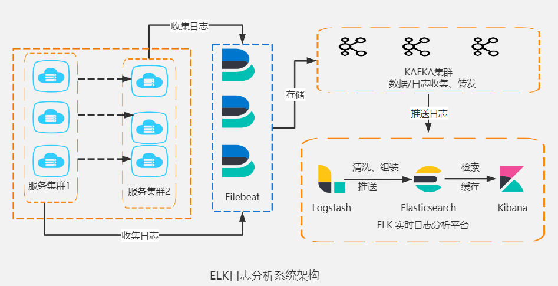
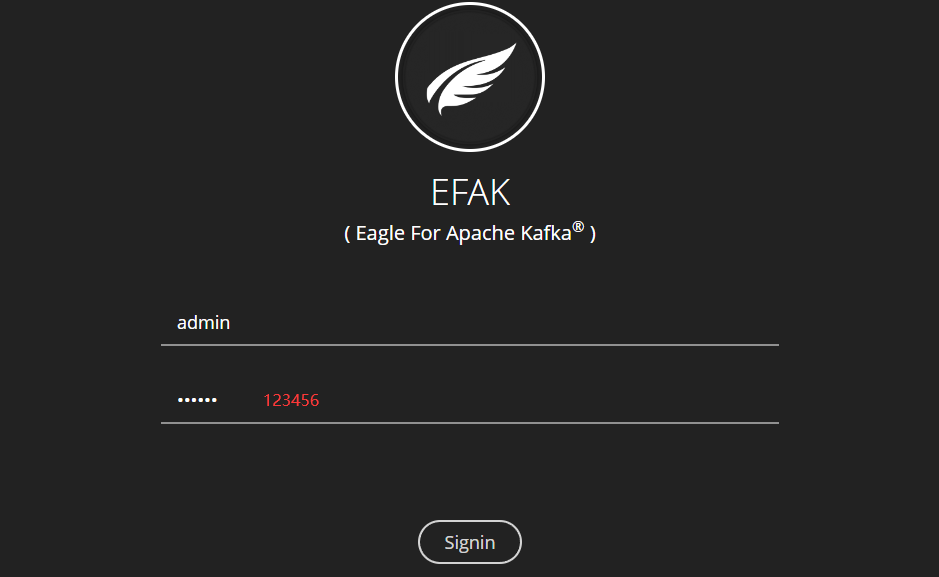

# k8s环境部署zookeeper集群

#### ELK引入消息队列

使用filebeat 或logstash 直接将日志写入ES ，如果采集的日志节点数量过多，日志量较大，那么日志频繁被写入ES 可能会造成ES 出现连接超时、数据丢失等情况。因为ES 需要处理数据，存储数据，搜索数据，所以性能会变的很缓慢；



**解决方法：**

让filebeat 或Logstash 直接将日志写入到消息队列中，因为消息队列可以起到一个缓冲作用，然后Logstash在根据ES的处理能力进行数据消费，匀速写入ES 集群，这样能有效缓解ES 写入性能瓶颈的问题；


#### Kafka介绍

消息队列软件kafka、RocketMQ、RabbitMQ等，kafka是一个MQ消息队列系统，在大数据场景下使用较多，kafka优势主要体现在吞吐量上，可以满足每秒百万级的消息的生产和消费；并且自身有一套完善的消息存储机制，确保数据的高效安全的持久化；基于分布式的扩展和容错机制，当某一台发生故障失效时，可以实现故障自动转移。  


#### ZooKeeper介绍

安装kafka之前，先部署ZK集群，ZooKeeper是一个分布式协调服务，就是为用户的分布式应用程序提供协调服务，而kafka依赖zookeeper来存储kafka的元数据信息，例如：有多少个集群节点，主题名称，以及协调kafaka的正常运行。


#### 制作zookeeper镜像

提示：在Harbor主机构建

下载zookeeper地址：https://mirrors.tuna.tsinghua.edu.cn/apache/zookeeper/

```shell
[root@harbor ~]# mkdir zookeeper
[root@harbor ~]# cd zookeeper/
```

```shell
[root@harbor zookeeper]#  wget http://mirrors.tuna.tsinghua.edu.cn/apache/zookeeper/stable/apache-zookeeper-3.8.3-bin.tar.gz
```


提前准备zk配置文件zoo.cfg

```shell
[root@harbor zookeeper]# cat zoo.cfg

# 集群之间维持心跳的时间间隔（以毫秒为单位）默认没有改。
tickTime=2000
 
# 服务器等待客户端连接的最长时间10*tickTime（20秒）默认没有改。
initLimit=10

# 集群之间在同步请求时等待响应的最长时间5*tickTime（10秒）默认没有改。
syncLimit=5
 
# 数据存储目录（构建镜像时创建）。
dataDir=/data

# 日志存储目录（构建镜像时创建）。
dataLogDir=/logs

# 客户端连接端口，默认没有改。
clientPort=2181

# 每个客户端与服务器之间的最大连接数，以防止某个客户端过多地占用服务器资源，默认没有改。
maxClientCnxns=60

# 客户端获取zk服务端当前状态及相关信息，默认没有改。
4lw.commands.whitelist=*

# 三个集群节点配置,格式为:server.节点编号=节点地址:leader和follower通信端口:集群选举端口，但是通过k8s部署zk，zk地址不可以写死，需要后期传递zk服务器地址，然后通过for循环依次写入配置文件
```

> server.1=zookeeper-0.zk-svc.default.svc.cluster.local:2888:3888
> server.2=zookeeper-1.zk-svc.default.svc.cluster.local:2888:3888
> server.3=zookeeper-2.zk-svc.default.svc.cluster.local:2888:3888


准备entrypoint.sh启动脚本

```shell
[root@harbor zookeeper]# cat entrypoint.sh

#准备zk集群地址，后期在k8s中通过ENV的方式为变量赋值
for server in ${ZOOK_SERVERS}
do
        echo ${server} >> /zookeeper/conf/zoo.cfg
done

#准备每个zk节点的myid文件，用于区分各个节点
ZOOK_MYID=$(( $(hostname | sed 's#.*-##g') +1 ))
echo ${ZOOK_MYID} > /data/myid

#启动zk（start-foreground前台运行）
cd /zookeeper/bin/ && ./zkServer.sh start-foreground
```

> zookeeper-0 
> zookeeper-1 
> zookeeper-2 


编写dockerfile

```shell
[root@harbor zookeeper]# cat dockerfile

#定义基础镜像
FROM openjdk:8-jre

#修改时区
RUN cp /usr/share/zoneinfo/Asia/Shanghai  /etc/localtime && \
    echo 'Asia/Shanghai' >/etc/timezone

#拷贝zk软件包
ADD ./apache-zookeeper-3.8.3-bin.tar.gz /

#修改目录名称
RUN mv /apache-zookeeper-3.8.3-bin /zookeeper

#拷贝zk配置文件
COPY ./zoo.cfg /zookeeper/conf/

#创建数据目录和日志目录
RUN mkdir /data /logs

#拷贝entrypoint.sh脚本，用于启动zk
COPY ./entrypoint.sh /entrypoint.sh

#暴露zk端口（2181客户端连接端口，2888leader和follower通信端口，3888集群选举端口）
EXPOSE 2181 2888 3888

#执行启动脚本
CMD ["/bin/sh","/entrypoint.sh"]
```


构建镜像

```shell
[root@harbor zookeeper]# docker build -t zookeeper:3.8.3 .
```


将镜像上传到仓库（登录harbor，创建一个zookeeper公开镜像仓库）

```shell
[root@harbor ~]# docker tag zookeeper:3.8.3 192.168.0.25/zookeeper/zookeeper:3.8.3
```

```shell
[root@harbor ~]# docker push 192.168.0.25/zookeeper/zookeeper:3.8.3
```


#### 部署ZK集群

zookeeper属于有状态应用，且集群存在角色之分，每个节点需要存储自己的数据，每个节点都需要有一个唯一的地址。


创建zookeeper的Service（在master节点）

```shell
[root@k8s-master01 ~]# mkdir zookeeper
[root@k8s-master01 ~]# cd zookeeper
```

```yaml
[root@k8s-master01 zookeeper]# cat zk-svc.yml
#headless
apiVersion: v1
kind: Service
metadata:
  name: zk-svc
spec:
  clusterIP: None
  selector:
    app: zk
  ports:
  - name: client                #客户端连接端口
    port: 2181
    targetPort: 2181
  - name: leader-fllow          #leader-fllow通讯端口
    port: 2888
    targetPort: 2888
  - name: selection             #集群选举端口
    port: 3888
    targetPort: 3888
```

```shell
[root@k8s-master01 zookeeper]# kubectl apply -f zk-svc.yml
```

```shell
[root@k8s-master01 zookeeper]# kubectl get svc
...

NAME    TYPE       CLUSTER-IP   EXTERNAL-IP  PORT(S)    
zk-svc  ClusterIP  None         <none>       2181/TCP,2888/TCP,3888/TCP 
```


通过StatefulSet部署zk集群

```yaml
[root@k8s-master01 zookeeper]# cat zk-sts.yml

#StatefulSet
apiVersion: apps/v1
kind: StatefulSet
metadata:
  name: zookeeper              #zookeeper-0
spec:
  serviceName: "zk-svc"
  replicas: 3                  #Pod副本数
  selector:
    matchLabels:
      app: zk
  template:
    metadata:
      labels:
        app: zk
    spec:
#避免三个zk都运行同一节点，可以通过Pod反亲和策略，不要让Pod运行在同一节点
      affinity:            #设置Pod亲和与反亲和调度策略
         podAntiAffinity:  #Pod反亲和调度
          requiredDuringSchedulingIgnoredDuringExecution:  #在调度时必须满足以下的规则
            - labelSelector:       #通过标签选择器匹配Pod标签
                matchExpressions:  #标签选择的表达式
                - key: app         #标签名称
                  operator: In     
                  values: ["zk"]   #标签名称的value
              topologyKey: "kubernetes.io/hostname"  #通过主机名称辨别不同节点

#如果该节点有污点，反亲和调度则无法调度，需要添加容忍，例如：我当前三台master都有NoSchedule污点，且污点的kye名称都叫master，通过以下方式添加容忍
      tolerations:            #添加容忍
      - key: "master"         #污点的key（必须引起来）
#       value: ""             #key的值,没有值无需定义
        effect: NoSchedule    #容器的污点

      containers:
      - name: zk
        image: 192.168.0.25/zookeeper/zookeeper:3.8.3
        ports:
        - name: client           #客户端连接端口
          containerPort: 2181
        - name: leader-follwer   #leader与follwer通信端口
          containerPort: 2888
        - name: selection        #集群选举端口
          containerPort: 3888
        env:
        #该变量在构建镜像时entrypoint.sh脚本中定义，但是没有赋值，此时赋值，脚本会讲值写入到zoo.cfg文件
        - name: ZOOK_SERVERS
          value: "server.1=zookeeper-0.zk-svc.default.svc.cluster.local:2888:3888 server.2=zookeeper-1.zk-svc.default.svc.cluster.local:2888:3888 server.3=zookeeper-2.zk-svc.default.svc.cluster.local:2888:3888"
        volumeMounts:
        - name: data
          mountPath: /data
  #PVC模板
  volumeClaimTemplates:
  - metadata:
      name: data
    spec:
      accessModes: ["ReadWriteMany"]
      storageClassName: "nfs-client"
      resources:
        requests:
          storage: 10G
```

```shell
[root@k8s-master01 zookeeper]# kubectl apply -f zk-sts.yml
```

```shell
[root@k8s-master01 zookeeper]# kubectl get pod
NAME                             READY   STATUS   
zookeeper-0                      1/1     Running  
zookeeper-1                      1/1     Running   
zookeeper-2                      1/1     Running  
```

提示1：查看Pod信息时，会发现Pod在不断的报错重启，因为集群之间需要找到其他的节点，但此时其他节点并没有立刻启动，sts控制器是有序启动，只需要等待一段时间，等三个Pod都运行即可。


等Pod全部运行，进入Pod中检查每个节点的myid文件和zoo.cfg文件中的集群节点信息。

```shell
[root@k8s-master01 zookeeper]# kubectl exec -it zookeeper-0 -- /bin/bash
```

```shell
root@zookeeper-0:/# cat data/myid
1
```

```shell
root@zookeeper-0:/# tail -3  zookeeper/conf/zoo.cfg
server.1=zookeeper-0.zk-svc.default.svc.cluster.local:2888:3888
server.2=zookeeper-1.zk-svc.default.svc.cluster.local:2888:3888
server.3=zookeeper-2.zk-svc.default.svc.cluster.local:2888:3888
```

```shell
#检查当前节点的身份
root@zookeeper-0:/# zookeeper/bin/zkServer.sh status
...
Mode: follower
```

提示：zookeeper-1与zookeeper-2检查方法同上。


解析每个zk地址是否可以访问

```shell
[root@k8s-master01 zookeeper]# dig @172.16.85.194 zookeeper-0.zk-svc.default.svc.cluster.local +short
172.16.85.214
```

```shell
[root@k8s-master01 zookeeper]# dig @172.16.85.194 zookeeper-1.zk-svc.default.svc.cluster.local +short
172.16.85.242
```

```shell
[root@k8s-master01 zookeeper]# dig @172.16.85.194 zookeeper-2.zk-svc.default.svc.cluster.local +short
172.16.85.244
```


# k8s环境部署Kafka集群

#### 制作kafka镜像

提示：在Harbor主机构建

下载地址：https://mirrors.tuna.tsinghua.edu.cn/apache/kafka/

```shell
[root@harbor ~]# mkdir kafka
[root@harbor ~]# cd kafka/
[root@harbor kafka]# wget http://mirrors.tuna.tsinghua.edu.cn/apache/kafka/3.4.1/kafka_2.12-3.4.1.tgz
```


提前准备kafka配置文件`server.properties`

```sh
[root@harbor kafka]# cat server.properties 

# 当前kafka节点的id号，在一个集群中不能重复
broker.id={BROKER_ID}

# kafka默认监听端口，处理来自生产者、消费者等客户端的消息
listeners=PLAINTEXT://{LISTENERS}:9092

# 处理网络请求的线程数量，通常与cpu核心数量保持一致（默认没有改）
num.network.threads=3

# 执行磁盘IO操作的线程数量（默认没有改）
num.io.threads=8

# kafka发送数据的缓冲区大小，以字节为单位，即：数据从磁盘加载到缓冲区,在提供给消费者（默认100KB没有改）
socket.send.buffer.bytes=102400

# kafka接收数据的缓冲区大小，以字节为单位，即：缓冲区达到100KB后,将数据写入到磁盘（默认100KB没有改）
socket.receive.buffer.bytes=102400

# kafka所能接收的一个请求的最大大小，以字节为单位，超出该上限无法接收（默认为100M没有改）
socket.request.max.bytes=104857600

# kafka存储消息数据的目录
log.dirs=/data

# 每个topic（主题）默认的partition（分区）数量（默认没有改）
num.partitions=1

# 分区副本数量，更高的副本数量会带来更高的可用性和存储成本
# 比如指定3副本，代表每个分区会有3个副本，1个作为首领Leader提供读写，另外2个跟随者Follower向主同步数据来保证高可用
default.replication.factor=3

# 在启动时恢复数据和关闭时刷新数据时，每个数据目录的线程数量（默认没有改）
num.recovery.threads.per.data.dir=1

# 指定了kafka读取多少条消息后，将消息写入磁盘（默认没有改）
log.flush.interval.messages=10000

# 消息刷新的时间间隔，以毫秒为单位，即1s（默认没有改）
log.flush.interval.ms=1000

# 日志保留小时数，超时会自动删除，默认为7天（默认没有改）
log.retention.hours=168

# 日志保留大小，超出大小会自动删除,默认为1G
#log.retention.bytes=1073741824

# 单个日志文件的大小最大为1G，超出后则创建一个新的日志文件，类似日志切割中的转储机制（默认没有改）
log.segment.bytes=1073741824

# 每隔多长时间检测数据是否达到删除条件，即300s（默认没有改）
log.retention.check.interval.ms=300000

# Zookeeper连接信息，如果是zookeeper集群，则以逗号隔开
zookeeper.connect={ZOOK_SERVERS}

# 连接zookeeper的超时时间，以毫秒为单位，即18s（默认没有改）
zookeeper.connection.timeout.ms=18000

# 支持彻底删除Topic,默认不会彻底删除,仅为标记删除（后增加）
delete.topic.enable=true
```


准备entrypoint.sh启动脚本

```shell
[root@harbor kafka]# cat entrypoint.sh

#定义当前kafka节点的id号
BROKER_ID=$(( $(hostname | sed 's#.*-##g') +1 ))

#通过sed替换文件中的{BROKER_ID}，sed替换时不要加引号，否则会改变数据类型为字符类型，而borker.id是数字类型
sed -i s/{BROKER_ID}/${BROKER_ID}/g /kafka/config/server.properties

#定义当前kafka节点的IP地址（通过获取当前Pod的IP，替换文件中的{LISTENERS}部分），sed替换时不要加引号，否则会改变数据类型，IP地址也是数字类型
LISTENERS=$(hostname -i)
sed -i s/{LISTENERS}/${LISTENERS}/g /kafka/config/server.properties

#定义kafka连接zk集群地址（后续在yaml文件中为变量赋值来替换文件中的{ZOOK_SERVERS}部分）
sed -i s/{ZOOK_SERVERS}/${ZOOK_SERVERS}/g /kafka/config/server.properties

#定义kafka的JMX端口，JMX可以管理、监控正在运行的Java进程（通过sed追加）
sed -i  '/export KAFKA_HEAP_OPTS/a export JMX_PORT="9999"' /kafka/bin/kafka-server-start.sh

#启动kafka
cd /kafka/bin/ && ./kafka-server-start.sh ../config/server.properties
```


编写dockerfile

```shell
[root@harbor kafka]# vim dockerfile
#定义基础镜像
FROM openjdk:8-jre

#修改时区
RUN cp /usr/share/zoneinfo/Asia/Shanghai  /etc/localtime && \
    echo 'Asia/Shanghai' >/etc/timezone

#拷贝kafak软件包
ADD ./kafka_2.12-3.4.1.tgz /
RUN mv /kafka_2.12-3.4.1 /kafka

#拷贝kafka配置文件
COPY ./server.properties /kafka/config/

#拷贝启动脚本
COPY ./entrypoint.sh /

#暴露kafka客户端端口9092，9999是JMX（JMX可以管理、监控正在运行的Java进程）端口
EXPOSE 9092 9999

#通过脚本启动kafka
CMD ["/bin/bash","/entrypoint.sh"]
```


构建镜像并上传到仓库（提前创建一个kafka的公开仓库）

```shell
[root@harbor kafka]# docker build -t kafka:2.12 .
```

```shell
[root@harbor kafka]# docker tag kafka:2.12  192.168.0.25/kafka/kafka:2.12
```

```shell
[root@harbor kafka]# docker push 192.168.0.25/kafka/kafka:2.12
```


#### 部署kafka集群

kafka属于有状态应用，kafka每个节点都要存储自己的数据，每个节点都需要有一个唯一的地址，且依赖于zookeeper。


创建kafka的Service（在master节点）

```shell
[root@k8s-master01 ~]# mkdir kafka
[root@k8s-master01 ~]# cd kafka
```

```yaml
[root@k8s-master01 kafka]# cat kafka-svc.yml
apiVersion: v1
kind: Service
metadata:
  name: kafka-svc
spec:
  clusterIP: None
  selector:
    app: kafka
  ports:
  - name: client
    port: 9092
    targetPort: 9092
  - name: jmx
    port: 9999
    targetPort: 9999
```

```shell
[root@k8s-master01 kafka]# kubectl apply -f kafka-svc.yml
```


通过StatefulSet部署zk集群

```yaml
[root@k8s-master01 kafka]# cat kafka-sts.yml
apiVersion: apps/v1
kind: StatefulSet
metadata:
  name: kafka
spec:
  serviceName: kafka-svc
  replicas: 3
  selector:
    matchLabels:
      app: kafka
  template:
    metadata:
      labels:
        app: kafka
    spec:
#避免三个kafka都运行在同一节点，可以通过Pod反亲和策略，不要让Pod运行在同一节点
      affinity:            #设置Pod亲和与反亲和调度策略
         podAntiAffinity:  #Pod反亲和调度
          requiredDuringSchedulingIgnoredDuringExecution:  #在调度时必须满足以下的规则
            - labelSelector:       #通过标签选择器匹配Pod标签
                matchExpressions:  #标签选择的表达式
                - key: app         #标签名称
                  operator: In
                  values: ["kafka"]   #标签名称的value
              topologyKey: "kubernetes.io/hostname"  #通过主机名称辨别不同节点

      #如果该节点有污点，反亲和调度则无法调度，需要添加容忍
      tolerations:            #添加容忍
      - key: "master"         #污点的key（必须引起来）
        #value: ""             #key的值,没有无需定义
        effect: NoSchedule    #污点类型

      containers:
      - name: kafka
        image: 192.168.0.25/kafka/kafka:2.12
        ports:
        - name: client
          containerPort: 9092
        - name: jmx
          containerPort: 9999
        env:
        #zookeeper连接信息,如果是zookeeper集群,则以逗号隔开
        - name: ZOOK_SERVERS
          value: "zookeeper-0.zk-svc.default.svc.cluster.local:2181,zookeeper-1.zk-svc.default.svc.cluster.local:2181,zookeeper-2.zk-svc.default.svc.cluster.local:2181"
        #kafka存储消息数据的目录
        volumeMounts:
        - name: data
          mountPath: /data

  #PVC模板
  volumeClaimTemplates:
  - metadata:
      name: data
    spec:
      accessModes: ["ReadWriteMany"]
      storageClassName: "nfs-client"
      resources:
        requests:
          storage: 10G
```

```shell
[root@k8s-master01 kafka]# kubectl apply -f kafka-sts.yml
```

```shell
[root@k8s-master01 kafka]# kubectl get pod
NAME                                      READY   STATUS     
kafka-0                                   1/1     Running   
kafka-1                                   1/1     Running 
kafka-2                                   1/1     Running 
```


进入容器确认`broker.id` 与zk连接信息

```shell
[root@k8s-master01 kafka]# kubectl exec -it kafka-0 -- /bin/bash
```

```shell
root@kafka-0:~# cat /kafka/config/server.properties
...
# 当前kafka节点的id号，在一个集群中不能重复
broker.id=1

...
# Zookeeper连接信息，如果是zookeeper集群，则以逗号隔开
zookeeper.connect=zookeeper-0.zk-svc.default.svc.cluster.local:2181,zookeeper-1.zk-svc.default.svc.cluster.local:2181,zookeeper-2.zk-svc.default.svc.cluster.local:2181
```


# k8s环境部署kafka管理界面

EFAK（Eagle For Apache Kafka，以前称为 Kafka Eagle）EFAK是开源可视化和管理软件，可以查询、可视化、监控kafka集群，是将 kafka 的集群数据转换为图形可视化的工具；

官方下载地址：http://www.kafka-eagle.org/


#### 制作efak镜像

提示：在Harbor主机构建

```shell
[root@harbor ~]# mkdir efak
[root@harbor ~]# mv efak-web-3.0.1-bin.tar.gz efak/
[root@harbor ~]# cd efak
```


提前准备zk配置文件efak配置文件system-config.properties

```shell
[root@harbor efak]# cat system-config.properties 
######################################
# 填写 zookeeper集群列表，cluster1表示只有1套集群
######################################
efak.zk.cluster.alias=cluster1
cluster1.zk.list={ZOOK_SERVERS}

######################################
# broker 最大规模数量（默认没有改）
######################################
cluster1.efak.broker.size=20

######################################
# zk 客户端线程数（默认没有改）
######################################
kafka.zk.limit.size=16

######################################
# EFAK webui 端口（默认没有改）
######################################
efak.webui.port=8048

######################################
# kafka offset storage
######################################
cluster1.efak.offset.storage=kafka

######################################
# kafka jmx uri
######################################
cluster1.efak.jmx.uri=service:jmx:rmi:///jndi/rmi://%s/jmxrmi

######################################
# kafka metrics 指标，默认存储15天（默认没有改）
######################################
efak.metrics.charts=true
efak.metrics.retain=15

######################################
# kafka sql topic records max
######################################
efak.sql.topic.records.max=5000
efak.sql.topic.preview.records.max=10

######################################
# delete kafka topic token
######################################
efak.topic.token=keadmin

######################################
# kafka sqlite 数据库地址（需要修改存储路径）
######################################
efak.driver=org.sqlite.JDBC
efak.url=jdbc:sqlite:/efak/db/ke.db
efak.username=root
efak.password=www.kafka-eagle.org
```


准备entrypoint.sh启动脚本

```shell
[root@harbor efak]# cat entrypoint.sh 

#替换配置文件zk集群的地址，后期部署时通过ENV为变量赋值
sed -i s#{ZOOK_SERVERS}#${ZOOK_SERVERS}#g /efak/conf/system-config.properties

#启动efak(默认后台运行，通过tail -f保证容器不退出)
/efak/bin/ke.sh start
tail -f /efak/conf/system-config.properties
```


编写dockerfile

```shell
[root@harbor efak]# cat dockerfile
#提示：如果使用openjdk:8-jre镜像会出现报错（/usr/local/openjdk-8/bin/jar: No such file or directory）
FROM openjdk:8

#修改时区
RUN cp /usr/share/zoneinfo/Asia/Shanghai  /etc/localtime && \
    echo 'Asia/Shanghai' >/etc/timezone

#拷贝efak软件包
ADD ./efak-web-3.0.1-bin.tar.gz /
RUN mv /efak-web-3.0.1 /efak

#拷贝efak配置文件
COPY ./system-config.properties /efak/conf/

#通过环境变量指定efak安装路径及程序路径（否则无法启动）
ENV KE_HOME=/efak
ENV PATH=$PATH:$KE_HOME/bin

#拷贝启动脚本
COPY ./entrypoint.sh /

#暴露端口
EXPOSE 8048

#通过脚本启动程序
CMD ["/bin/bash","/entrypoint.sh"]
```

```shell
[root@harbor efak]# docker build -t efak:3.0 .
```


上传镜像到Harbor仓库（提前创建一个efak公开仓库）

```shell
[root@harbor efak]# docker tag efak:3.0 192.168.0.25/efak/efak:3.0
[root@harbor efak]# docker push 192.168.0.25/efak/efak:3.0
```


#### 部署efak

通过Deployment部署efak。

```shell
[root@k8s-master01 ~]# mkdir efak
[root@k8s-master01 ~]# cd efak
```

```yaml
[root@k8s-master01 efak]# cat deploy-efak.yml
#Deployment
apiVersion: apps/v1
kind: Deployment
metadata:
  name: efak
spec:
  selector:
    matchLabels:
      app: efak
  template:
    metadata:
      labels:
        app: efak
    spec:
      containers:
      - name: efak
        image: 192.168.0.25/efak/efak:3.0
        ports:
        - containerPort: 8048
        env:
        - name: ZOOK_SERVERS        #定义zk集群地址
          value: "zookeeper-0.zk-svc.default.svc.cluster.local:2181,zookeeper-1.zk-svc.default.svc.cluster.local:2181,zookeeper-2.zk-svc.default.svc.cluster.local:2181"
---
#Service
apiVersion: v1
kind: Service
metadata:
  name: efak-svc
spec:
  selector:
    app: efak
  ports:
  - port: 8048
    targetPort: 8048
---
#Ingress
apiVersion: networking.k8s.io/v1
kind: Ingress
metadata:
  name: efak-ing
spec:
  ingressClassName: nginx
  rules:
  - host: web.efak.com
    http:
      paths:
      - path: /
        pathType: Prefix
        backend:
          service:
            name: efak-svc
            port: 
              number: 8048
```

```shell
[root@k8s-master01 efak]# kubectl apply -f deploy-efak.yml
```

```shell
[root@k8s-master01 efak]# kubectl get pod
NAME                                      READY   STATUS    RESTARTS   
efak-85996b998b-bkpcx                     1/1     Running   0
```


登录efak页面（win做好本地解析）：http://web.efak.com/

|  |
| ------------------------------------------------------------ |
|  |
|  |
|  |

提示：如果kafka的Pod删除重建，需要在删除efak的Pod让Pod重建，这样才能重新获取到kafka的信息。


# k8s环境部署elasticsearch

通过StatefulSet部署es集群

```shell
[root@k8s-master01 ~]# mkdir es
[root@k8s-master01 ~]# cd es
```

```yaml
[root@k8s-master01 es]# cat elasticsearch.yml 
# es-service.yaml
apiVersion: v1
kind: Service
metadata:
  name: es-cluster-svc
spec:
  clusterIP: None
  selector:
    app: elasticsearch
  ports:
    - name: http            #客户端访问端口
      port: 9200
    - name: transport       #集群之间通信端口  
      port: 9300
      targetPort: 9300
---
# es-cluster.yaml
apiVersion: apps/v1 
kind: StatefulSet
metadata:
  name: es-cluster
spec:
  serviceName: es-cluster-svc
  replicas: 3               #设置副本数
  selector:
    matchLabels:
      app: elasticsearch
  template:
    metadata:
      labels: 
        app: elasticsearch  #Pod标签
    spec:
      #避免三个es都运行在同一节点，通过Pod反亲和策略，不要让Pod运行在同一节点
      affinity:                        #设置Pod亲和与反亲和调度策略
         podAntiAffinity:              #Pod反亲和调度
          requiredDuringSchedulingIgnoredDuringExecution:  #在调度时必须满足以下的规则
            - labelSelector:           #通过标签选择器匹配Pod标签
                matchExpressions:      #标签选择的表达式
                - key: app             #标签名称
                  operator: In
                  values: ["elasticsearch"]          #标签名称的value
              topologyKey: "kubernetes.io/hostname"  #通过主机名称辨别不同节点

      #如果该节点有污点，反亲和调度则无法调度，需要添加容忍（根据自己实际情况修改）
      tolerations:            #添加容忍
      - key: "master"         #污点的key（必须引起来）
        #value: ""            #key的值,没有无需定义
        effect: NoSchedule    #容器的污点

      #初始化容器使用参考：ttps://kubernetes.io/zh-cn/docs/concepts/workloads/pods/init-containers/
      #初始化容器的作用是在应用容器启动之前做准备工作，每个init容器都必须在下一个启动之前成功完成
      #通过容器部署es参考：https://www.elastic.co/guide/en/elasticsearch/reference/7.5/docker.html
      #通过容器部署es，官方要求修改系统内核参数“vm.max_map_count”用于限制一个进程在虚拟内存中创建的最大文件数量，至少设置262144
      initContainers:
        - name: vm-max-map-count
          image: busybox:1.32
          command: ["sysctl", "-w", "vm.max_map_count=262144"]
          securityContext:                    #初始容器安全上下文（访问权限）
            privileged: true                  #设置为特权模式，即拥有主机上的root权限（这条命令是修改宿主机内核参数）
        #官方建议增加系统ulimit（进程在系统中可打开文件的最大数量）为65535    
        - name: ulimit
          image: busybox:1.32
          command: ["sh", "-c", "ulimit -n 65536"]
          securityContext:
            privileged: true
      #初始化容器结束后，才能继续创建下面的容器
      containers:
        - name: es-container
          image: elasticsearch:7.8.1
          ports:
            # 容器内端口
            - name: http
              containerPort: 9200
            - name: transport
              containerPort: 9300
           #限制CPU数量
          resources:               
            limits:
              cpu: 1000m
            requests:
              cpu: 100m 
          # 设置挂载目录
          volumeMounts:
            - name: elasticsearch-data
              mountPath: /usr/share/elasticsearch/data
          # 设置环境变量
          env:
            # 自定义集群名
            - name: cluster.name
              value: k8s-es
            # 定义节点名，使用metadata.name名称
            - name: node.name                 #当前节点在集群名称
              valueFrom:
                fieldRef:
                  fieldPath: metadata.name    #名称通过该属性下定义的值获取，即：es-cluster-0，es-cluster-1，es-cluster-2
            # 初始化集群时，ES从中选出master节点
            - name: cluster.initial_master_nodes
              # 对应metadata.name名称加编号，编号从0开始
              value: "es-cluster-0,es-cluster-1,es-cluster-2"
            # 发现节点的地址，discovery.seed_hosts的值应包括所有master候选节点
            - name: discovery.seed_hosts
              value: "es-cluster-svc"
             # 配置JVM堆内存
            - name: ES_JAVA_OPTS
              value: "-Xms1g -Xmx1g"
  volumeClaimTemplates:
    - metadata:
        name: elasticsearch-data
      spec:
        # 存储卷访问权限为读写
        accessModes: [ "ReadWriteOnce" ]
        # 动态存储名称
        storageClassName: "nfs-client" 
        # 申请资源的大小
        resources:
          requests:
            storage: 10Gi
```

```shell
[root@k8s-master01 es]# kubectl apply -f elasticsearch.yml 
```

```shell
[root@k8s-master01 es]# kubectl get pod
NAME                                      READY   STATUS    RESTARTS   
es-cluster-0                              1/1     Running   0           
es-cluster-1                              1/1     Running   0           
es-cluster-2                              1/1     Running   0           
```


# k8s环境部署kibana

通过Deployment部署kibana

```shell
[root@k8s-master01 ~]# mkdir kibana
[root@k8s-master01 ~]# cd kibana
```

```yaml
[root@k8s-master01 kibana]# cat kibana.yml
#Deployment kibana
apiVersion: apps/v1
kind: Deployment
metadata:
  name: kibana
spec:
  selector:
    matchLabels:
      app: kibana
  template:
    metadata:
      labels:
        app: kibana
    spec:
      containers:
      - name: kibana
        image: kibana:7.8.1
        ports:
        - containerPort: 5601
        env:
        - name: ELASTICSEARCH_HOSTS        #指定ES地址及端口
          value: http://es-cluster-svc:9200
        - name: I18N_LOCALE                #kibana汉化
          value: "zh-CN"
---
#kibana Service代理
apiVersion: v1
kind: Service
metadata:
  name: kibana-svc
spec:
  selector:
    app: kibana
  ports:
  - port: 5601
    targetPort: 5601
---
#kibana Ingress代理
apiVersion: networking.k8s.io/v1
kind: Ingress
metadata:
  name: kibana-ingress
  annotations:
    nginx.ingress.kubernetes.io/rewrite-target: /
spec:
  ingressClassName: nginx
  rules:
  - host: web.kibana.com
    http:
      paths:
      - path: /
        pathType: Prefix
        backend:
          service:
            name: kibana-svc
            port:
              number: 5601 
```

```shell
[root@k8s-master01 kibana]# kubectl apply -f kibana.yml
```

```shell
[root@k8s-master01 kibana]# kubectl get pod
NAME                                      READY   STATUS    RESTARTS         AGE
efak-85996b998b-7srkd                     1/1     Running   4
es-cluster-0                              1/1     Running   0           
es-cluster-1                              1/1     Running   0           
es-cluster-2                              1/1     Running   0           
kibana-748b58cc87-zl7j8                   1/1     Running   0           
```


提示：在windows做本地解析然后访问kibana


# k8s部署filebeat采集日志

### 部署filebeat

通过DaemonSet方式部署filebeat采集日志

参考地址：https://github.com/elastic/beats/blob/main/deploy/kubernetes/filebeat-kubernetes.yaml


```shell
[root@k8s-master01 ~]# mkdir filebeat
[root@k8s-master01 ~]# cd filebeat
```


通过RBAC授权filebeat访问集群的权限

```yaml
[root@k8s-master01 filebeat]# cat filebeat-rbac.yml 
#为filebeat创建服务账户ServiceAccount
apiVersion: v1
kind: ServiceAccount
metadata:
  name: filebeat

---
#创建集群角色
apiVersion: rbac.authorization.k8s.io/v1
kind: ClusterRole
metadata:
  name: filebeat
  labels:
    k8s-app: filebeat
rules:
- apiGroups: [""] # "" indicates the core API group
  resources:
  - namespaces
  - pods
  - nodes
  verbs:
  - get
  - watch
  - list
---
#创建集群角色绑定
apiVersion: rbac.authorization.k8s.io/v1
kind: ClusterRoleBinding
metadata:
  name: filebeat
subjects:
- kind: ServiceAccount
  name: filebeat
  namespace: default
roleRef:
  kind: ClusterRole
  name: filebeat
  apiGroup: rbac.authorization.k8s.io
```

```shell
[root@k8s-master01 filebeat]# kubectl apply -f filebeat-rbac.yml
```


filebeat configMap自动发现参考地址：https://www.elastic.co/guide/en/beats/filebeat/current/configuration-autodiscover.html


### 收集kube-system日志

创建configMap收集kube-system空间容器日志

```yaml
[root@k8s-master01 filebeat]# cat filebeat-configmap.yml
apiVersion: v1
kind: ConfigMap
metadata:
  name: filebeat-config
  namespace: default
  labels:
    k8s-app: filebeat
data:
  filebeat.yml: |-
    # =========================== Filebeat autodiscover ==============================
    filebeat.autodiscover:          #通过filebeat自动发现机制采集日志
      providers:
        - type: kubernetes          #收集kubernetes集群日志
          templates:                #自动发现模板
            # =================== 收集kube-system空间日志 ============================
            - condition:            #定义条件
                equals:             #等于
                  kubernetes.namespace: kube-system        #收集该名称空间下的日志
              config:                                      #定义配置信息
                - type: container                          #日志类型为容器日志
                  stream: all                              #收集所有日志信息
                  encoding: utf-8                          #字符集
                  paths:                                   #日志路径
                    - /var/log/containers/*-${data.kubernetes.container.id}.log  #通过自动发现的内置变量来识别容器ID
    # =========================== console Output =====================================
    # 先将日志内容输出到屏幕看看效果，容器启动后可通过 kubectl logs Pod名称 查看日志输出
    output.console:
      pretty: true
      enable: true
```

```shell
[root@k8s-master01 filebeat]# kubectl apply -f filebeat-configmap.yml
```


DaemonSet部署filebeat

```yaml
[root@k8s-master01 filebeat]# cat filebeat-ds.yml 
#通过DaemonSet部署filebeat
apiVersion: apps/v1
kind: DaemonSet
metadata:
  name: filebeat
spec:
  selector:
    matchLabels:
      app: filebeat
  template:
    metadata:
      labels:
        app: filebeat
    spec:
      #如果master节点有污点，需要添加容忍（根据自己实际情况修改）
      tolerations:                   #添加容忍
      - key: "master"                #污点的key（必须引起来）
        #value: ""                   #key的值,没有无需定义
        effect: NoSchedule           #容器的污点
      serviceAccountName: filebeat   #指定服务账户名称
      containers:
      - name: filebeat
        image: elastic/filebeat:7.8.1
        #通过args传递配置和参数到容器，command、args两项实现覆盖Dockerfile中ENTRYPOINT的功能，在Dockerfile的ENTRYPOINT中定义的filebeat配置文件路径为/usr/share/filebeat/
        args: [
          "-c", "/etc/filebeat.yml", #指定日志过滤的配置文件位置
          "-e",                      #-e是filebeat自带选项，用于将日志输出发送到标准错误（stderr）而不是syslog，以便通过kubectl logs查看filebeat日志
        ]
        #securityContext用于定义Pod或容器安全设置的属性，以确保容器在运行时具有适当的权限。
        securityContext:
          runAsUser: 0     #指定容器以UID为0的用户身份运行（root身份），后边需要该容器在节点中创建目录，以及对系统中的日志文件有访问权限
        resources:
          limits:
            memory: 200Mi
          requests:
            cpu: 100m
            memory: 100Mi
        volumeMounts:                          #挂载存储卷
        - name: config                         #卷名称
          mountPath: /etc/filebeat.yml         #挂载到容器路径
          subPath: filebeat.yml                #避免覆盖掉/etc目录下其他文件
          readOnly: true                       #权限只读，防止容器中的进程无意识地对文件进行修改
        - name: data
          mountPath: /usr/share/filebeat/data
        - name: varlibdockercontainers
          mountPath: /var/lib/docker/containers
          readOnly: true
        - name: varlog
          mountPath: /var/log
          readOnly: true
      volumes:                                 #定义存储卷
      - name: config                           #卷名称
        configMap:                             #卷类型CM
          name: filebeat-config                #CM名称，该文件用于过滤日志
      - name: varlibdockercontainers           #卷名称
        hostPath:                              #卷类型为本地目录
          path: /var/lib/docker/containers     #该路径是存储当前节点的容器元数据信息
      - name: varlog                           #卷名称
        hostPath:                              #卷类型为本地目录
          path: /var/log                       #该路径是存储当前节点的系统日志
      - name: data                             #卷名称
        hostPath:                              #卷类型为本地目录
          path: /var/lib/filebeat-data         #data文件夹存储filebeat过滤的所有文件状态信息
          type: DirectoryOrCreate              #该目录默认不存在，不存在自动创建
```

```shell
[root@k8s-master01 filebeat]# kubectl apply -f filebeat-ds.yml
```

```shell
[root@k8s-master01 filebeat]# kubectl get pod
NAME                                      READY   STATUS    RESTARTS   
efak-85996b998b-l7nl6                     1/1     Running   
es-cluster-0                              1/1     Running   
es-cluster-1                              1/1     Running   
es-cluster-2                              1/1     Running   
filebeat-42fvj                            1/1     Running   
filebeat-6fxxz                            1/1     Running   
filebeat-975nv                            1/1     Running   
filebeat-bdlxp                            1/1     Running   
kafka-0                                   1/1     Running   
kafka-1                                   1/1     Running   
kafka-2                                   1/1     Running   
kibana-748b58cc87-ttmqw                   1/1     Running   
nfs-client-provisioner-68557dcc67-drk2f   1/1     Running   
zookeeper-0                               1/1     Running   
zookeeper-1                               1/1     Running   
zookeeper-2                               1/1     Running   
```


查看filebeat的Pod日志，验证是否收集到容器日志

```shell
[root@k8s-master01 filebeat]# kubectl logs filebeat-42fvj
```

```shell
{
  "@timestamp": "2024-02-21T08:38:51.204Z",
  "@metadata": {
    "beat": "filebeat",
    "type": "_doc",
    "version": "7.8.1"
  },
  "agent": {
    "id": "bba23051-c7f3-400b-a304-26f7c083eb08",
    "name": "filebeat-9dtfd",
    "type": "filebeat",
    "version": "7.8.1",
    "hostname": "filebeat-9dtfd",
    "ephemeral_id": "89f2ccc2-aa4a-4d02-a7d2-5e34648c60de"
  },
  "message": "2024-02-21 08:38:51.204 [INFO][84] felix/iface_monitor.go 217: Netlink address update for known interface.  addr=\"fe80::ecee:eeff:feee:eeee\" exists=true ifIndex=1",
  "log": {
    "offset": 606911,
    "file": {
      "path": "/var/log/containers/calico-node-b8nxv_kube-system_calico-node-fbb3bc105b9d0970d08d093a3b133ab001a9b45936c93ddb69fcf5043cc18c73.log"
    }
  },
  "stream": "stdout",
  "input": {
    "type": "container"
  },
  "kubernetes": {
    "pod": {
      "name": "calico-node-b8nxv",
      "uid": "f68232ba-7dc4-4e1f-8633-541c89d1a932"
    },
    "namespace": "kube-system",
    "labels": {
      "k8s-app": "calico-node",
      "pod-template-generation": "1",
      "controller-revision-hash": "7c47b7dbf8"
    },
    "container": {
      "name": "calico-node",
      "image": "docker.io/calico/node:v3.24.1"
    },
    "node": {
      "name": "k8s-master01"
    }
  },
  "ecs": {
    "version": "1.5.0"
  },
  "host": {
    "name": "filebeat-9dtfd"
  }
}
```


### 收集Ingress-nginx日志

收集ingress-nginx日志，先修改nginx日志格式为json格式，方便后期分析，不修改格式收集后的日志形式如下

```shell
  "message": "192.168.0.1 - - [21/Feb/2024:07:19:29 +0000] \"POST /api/saved_objects/_bulk_get HTTP/1.1\" 200 174 \"http://web.kibana.com/app/kibana\" \"Mozilla/5.0 (Windows NT 10.0; Win64; x64) AppleWebKit/537.36 (KHTML, like Gecko) Chrome/121.0.0.0 Safari/537.36\" 480 0.028 [default-kibana-svc-5601] [] 172.16.85.229:5601 174 0.028 200 a8e14632a627ee7046facb082917a6fa",
```


通过编辑ingress-nginx的configMap修改日志格式

```shell
[root@k8s-master01 filebeat]# kubectl edit configmap -n ingress-nginx ingress-nginx-controller 
apiVersion: v1
data:
#在data下方添加
  log-format-upstream: '{"timestamp":"$time_iso8601","domain":"$server_name","hostname":"$hostname","remote_user":"$remote_user","clientip":"$remote_addr","proxy_protocol_addr":"$proxy_protocol_addr","@source":"$server_addr","host":"$http_host","request":"$request","args":"$args","upstreamaddr":"$upstream_addr","status":"$status","upstream_status":"$upstream_status","bytes":"$body_bytes_sent","responsetime":"$request_time","upstreamtime":"$upstream_response_time","proxy_upstream_name":"$proxy_upstream_name","x_forwarded":"$http_x_forwarded_for","upstream_response_length":"$upstream_response_length","referer":"$http_referer","user_agent":"$http_user_agent","request_length":"$request_length","request_method":"$request_method","scheme":"$scheme","k8s_ingress_name":"$ingress_name","k8s_service_name":"$service_name","k8s_service_port":"$service_port"}'
```


日志字段含义解释

| 原字段名称               | 字段含义                                                     | 修改后的字段名称            |
| ------------------------ | ------------------------------------------------------------ | --------------------------- |
| timestamp                | 请求的时间戳，使用 ISO 8601 格式表示                         | `$time_iso8601`             |
| domain                   | 请求的域名                                                   | `$server_name`              |
| hostname                 | 服务器的主机名                                               | `$hostname`                 |
| remote_user              | 远程用户的标识，如果启用了 Basic Auth 等身份验证方式，会显示用户名 | `$remote_user`              |
| clientip                 | 客户端的 IP 地址                                             | `$remote_addr`              |
| proxy_protocol_addr      | 如果使用了代理协议，会显示实际的客户端 IP 地址               | `$proxy_protocol_addr`      |
| @source                  | Nginx 的监听地址                                             | `$server_addr`              |
| host                     | 请求中的 Host 头信息                                         | `$http_host`                |
| request                  | 请求的 URI 和 HTTP 版本                                      | `$request`                  |
| args                     | 请求中的查询参数                                             | `$args`                     |
| upstreamaddr             | 后端服务器的 IP 地址                                         | `$upstream_addr`            |
| status                   | 请求的响应状态码                                             | `$status`                   |
| upstream_status          | 后端服务器的响应状态码                                       | `$upstream_status`          |
| bytes                    | 响应体的字节数                                               | `$body_bytes_sent`          |
| responsetime             | 请求的响应时间，单位为秒                                     | `$request_time`             |
| upstreamtime             | 请求到达后端服务器并获取响应的时间，单位为秒                 | `$upstream_response_time`   |
| proxy_upstream_name      | 使用的代理服务器名称                                         | `$proxy_upstream_name`      |
| x_forwarded              | 使用的 X-Forwarded-For 头信息，如果有代理的话                | `$http_x_forwarded_for`     |
| upstream_response_length | 后端服务器响应的内容长度                                     | `$upstream_response_length` |
| referer                  | 请求的 Referer 头信息                                        | `$http_referer`             |
| user_agent               | 请求的 User-Agent 头信息                                     | `$http_user_agent`          |
| request_length           | 请求的长度，包括请求头和请求体                               | `$request_length`           |
| request_method           | 请求的方法，比如 GET、POST 等                                | `$request_method`           |
| scheme                   | 请求的协议方案，比如 http 或 https                           | `$scheme`                   |
| k8s_ingress_name         | Kubernetes 中的 Ingress 名称                                 | `$ingress_name`             |
| k8s_service_name         | Kubernetes 中的 Service 名称                                 | `$service_name`             |
| k8s_service_port         | Kubernetes 中的 Service 端口号                               | `$service_port`             |


可以进到ingress-nginx的pod中查看nginx.conf配置文件是否被修改

```shell
[root@k8s-master01 filebeat]# kubectl exec -it ingress-nginx-controller-55d7ffbbf8-w5xqc -n ingress-nginx -- /bin/bash
```

```shell
bash-5.1$ grep "log_format upstreaminfo" /etc/nginx/nginx.conf
...
	log_format upstreaminfo '{"timestamp":"$time_iso8601","domain":"$server_name","hostname":"$hostname","remote_user":"$remote_user","clientip":"$remote_addr","proxy_protocol_addr":"$proxy_protocol_addr","@source":"$server_addr","host":"$http_host","request":"$request","args":"$args","upstreamaddr":"$upstream_addr","status":"$status","upstream_status":"$upstream_status","bytes":"$body_bytes_sent","responsetime":"$request_time","upstreamtime":"$upstream_response_time","proxy_upstream_name":"$proxy_upstream_name","x_forwarded":"$http_x_forwarded_for","upstream_response_length":"$upstream_response_length","referer":"$http_referer","user_agent":"$http_user_agent","request_length":"$request_length","request_method":"$request_method","scheme":"$scheme","k8s_ingress_name":"$ingress_name","k8s_service_name":"$service_name","k8s_service_port":"$service_port"}';
```


需要重启ingress-nginx的Pod使配置生效

```shell
[root@k8s-master01 filebeat]# kubectl get pod -n ingress-nginx
NAME                                        READY   STATUS     
ingress-nginx-controller-55d7ffbbf8-w5xqc   1/1     Running          
```

```shell
[root@k8s-master01 filebeat]# kubectl delete pod ingress-nginx-controller-55d7ffbbf8-w5xqc -n ingress-nginx
```


在configMap中增加收集ingress-nginx日志配置

```shell
[root@k8s-master01 filebeat]# cat filebeat-configmap.yml 
apiVersion: v1
kind: ConfigMap
metadata:
  name: filebeat-config
  namespace: default
  labels:
    k8s-app: filebeat
data:
  filebeat.yml: |-
    # =========================== Filebeat autodiscover ==============================
    filebeat.autodiscover:          #通过filebeat自动发现机制采集日志
      providers:
        - type: kubernetes          #收集kubernetes集群日志
          templates:                #自动发现模板
            # =================== 收集kube-system空间日志 ============================
            - condition:            #定义条件
                equals:             #等于
                  kubernetes.namespace: kube-system        #收集该名称空间下的日志
              config:                                      #定义配置信息
                - type: container                          #日志类型为容器日志
                  stream: all                              #收集所有日志信息
                  encoding: utf-8                          #字符集
                  paths:                                   #日志路径
                    - /var/log/containers/*-${data.kubernetes.container.id}.log  #通过自动发现的内置变量来识别容器ID
                  #exclude_lines: ["info"]                  #排除info相关日志
            # =================== 收集ingress-nginx 访问日志 =========================
            - condition:            #定义条件
                equals:             #等于
                  kubernetes.namespace: ingress-nginx      #收集该名称空间下的日志
              config:                                      #定义配置信息
                - type: container                          #日志类型为容器日志
                  stream: stdout                           #收集访问日志
                  encoding: utf-8                          #字符集
                  paths:                                   #日志路径
                    - /var/log/containers/*-${data.kubernetes.container.id}.log  #通过自动发现的内置变量来识别容器ID
                  json.keys_under_root: true               #默认将json解析存储至messages，true则不存储至message
                  json.overwrite_keys: true                #覆盖默认message字段，使用自定义json格式的key
            # =================== 收集ingress-nginx 错误日志 =========================
            - condition:            #定义条件
                equals:             #等于
                  kubernetes.namespace: ingress-nginx      #收集该名称空间下的日志
              config:                                      #定义配置信息
                - type: container                          #日志类型为容器日志
                  stream: stderr                           #收集错误日志
                  encoding: utf-8                          #字符集
                  paths:                                   #日志路径
                    - /var/log/containers/*-${data.kubernetes.container.id}.log  #通过自动发现的内置变量来识别容器ID
    # =========================== console Output =====================================
    # 先将日志内容输出到屏幕看看效果，容器启动后可通过 kubectl logs Pod名称 查看日志输出
    output.console:
      pretty: true
      enable: true
```

```shell
[root@k8s-master01 filebeat]# kubectl apply -f filebeat-configmap.yml 
```


重启filebeat的Pod使配置生效

```shell
[root@k8s-master01 filebeat]# kubectl delete -f filebeat-ds.yml
```

```shell
[root@k8s-master01 filebeat]# kubectl apply -f filebeat-ds.yml 
```


查看ingress-nginx-controller的Pod所在节点

```shell
[root@k8s-master01 filebeat]# kubectl get pod -n ingress-nginx -o wide
NAME                                       READY STATUS    NODE   
ingress-nginx-controller-55d7ffbbf8-mcvz8  1/1   Running   k8s-node01
```


查看node01节点的filebeat名称

```shell
[root@k8s-master01 filebeat]# kubectl get pod -o wide

NAME             READY   STATUS   IP               NODE
filebeat-ctf8t   1/1     Running  172.16.85.253    k8s-node01
```


通过浏览器访问ingress产生访问日志，例如：web.kibana.com


查看node01节点filebeat日志

```shell
[root@k8s-master01 filebeat]# kubectl logs filebeat-ctf8t
```

```shell
{
  "@timestamp": "2024-02-21T09:02:12.454Z",
  "@metadata": {
    "beat": "filebeat",
    "type": "_doc",
    "version": "7.8.1"
  },
  "bytes": "360",
  "hostname": "k8s-node01",
  "clientip": "192.168.0.1",
  "kubernetes": {
    "pod": {
      "name": "ingress-nginx-controller-55d7ffbbf8-qjv45",
      "uid": "a3ec76fb-4487-487b-ae93-5aa3029fa308"
    },
    "namespace": "ingress-nginx",
    "replicaset": {
      "name": "ingress-nginx-controller-55d7ffbbf8"
    },
    "labels": {
      "app_kubernetes_io/component": "controller",
      "app_kubernetes_io/instance": "ingress-nginx",
      "app_kubernetes_io/name": "ingress-nginx",
      "pod-template-hash": "55d7ffbbf8"
    },
    "container": {
      "image": "k8s.gcr.io/ingress-nginx/controller:v1.2.0",
      "name": "controller"
    },
    "node": {
      "name": "k8s-node01"
    }
  },
  "agent": {
    "ephemeral_id": "48fe5db2-562c-4c7d-9674-6fbae6e591ec",
    "id": "ed04294e-44a7-40bd-8db4-c3a1559d1e4a",
    "name": "filebeat-t7nj8",
    "type": "filebeat",
    "version": "7.8.1",
    "hostname": "filebeat-t7nj8"
  },
  "responsetime": "0.022",
  "request_length": "406",
  "request": "GET /api/licensing/info HTTP/1.1",
  "stream": "stdout",
  "referer": "http://web.kibana.com/app/kibana",
  "ecs": {
    "version": "1.5.0"
  },
  "upstreamaddr": "172.16.85.229:5601",
  "upstream_response_length": "360",
  "k8s_ingress_name": "kibana-ingress",
  "log": {
    "offset": 25464,
    "file": {
      "path": "/var/log/containers/ingress-nginx-controller-55d7ffbbf8-qjv45_ingress-nginx_controller-6899359aad85b22463a9e89acac77cc204adbb5c6fe908b0724b1852b1602ae4.log"
    }
  },
  "user_agent": "Mozilla/5.0 (Windows NT 10.0; Win64; x64) AppleWebKit/537.36 (KHTML, like Gecko) Chrome/121.0.0.0 Safari/537.36",
  "k8s_service_name": "kibana-svc",
  "upstream_status": "200",
  "x_forwarded": "-",
  "proxy_upstream_name": "default-kibana-svc-5601",
  "args": "-",
  "request_method": "GET",
  "remote_user": "-",
  "scheme": "http",
  "domain": "web.kibana.com",
  "timestamp": "2024-02-21T09:02:12+00:00",
  "k8s_service_port": "5601",
  "status": "200",
  "input": {
    "type": "container"
  },
  "host": {
    "name": "filebeat-ctf8t"
  },
  "upstreamtime": "0.022",
  "@source": "192.168.0.13",
  "proxy_protocol_addr": "-"
}
```


### 收集kubelet日志

创建configMap收集kubelet日志

```shell
[root@k8s-master01 filebeat]# cat filebeat-configmap.yml 
apiVersion: v1
kind: ConfigMap
metadata:
  name: filebeat-config
  namespace: default
  labels:
    k8s-app: filebeat
data:
  filebeat.yml: |-
    # ============================== Filebeat inputs kubelet ================================
    filebeat.inputs:
    - type: log
      paths: /var/log/messages              #kubelet日志默认写入到该文件中
      include_lines: ['kubelet']            #在messages文件中只获取与kubelet相关的日志
      fields:                               #为收集到的日志内容添加新字段名称
        namespace: kubelet                  #增加新字段，后边作为索引名称
      fields_under_root: true               #并设置为顶级字段
    # =========================== Filebeat autodiscover ==============================
    filebeat.autodiscover:          #通过filebeat自动发现机制采集日志
      providers:
        - type: kubernetes          #收集kubernetes集群日志
          templates:                #自动发现模板
            # =================== 收集kube-system空间日志 ============================
            - condition:            #定义条件
                equals:             #等于
                  kubernetes.namespace: kube-system        #收集该名称空间下的日志
              config:                                      #定义配置信息
                - type: container                          #日志类型为容器日志
                  stream: all                              #收集所有日志信息
                  encoding: utf-8                          #字符集
                  paths:                                   #日志路径
                    - /var/log/containers/*-${data.kubernetes.container.id}.log  #通过自动发现的内置变量来识别容器ID
                  #exclude_lines: ["info"]                  #排除info相关日志
            # =================== 收集ingress-nginx 访问日志 =========================
            - condition:            #定义条件
                equals:             #等于
                  kubernetes.namespace: ingress-nginx      #收集该名称空间下的日志
              config:                                      #定义配置信息
                - type: container                          #日志类型为容器日志
                  stream: stdout                           #收集访问日志
                  encoding: utf-8                          #字符集
                  paths:                                   #日志路径
                    - /var/log/containers/*-${data.kubernetes.container.id}.log  #通过自动发现的内置变量来识别容器ID
                  json.keys_under_root: true               #默认将json解析存储至messages，true则不存储至message
                  json.overwrite_keys: true                #覆盖默认message字段，使用自定义json格式的key
            # =================== 收集ingress-nginx 错误日志 =========================
            - condition:            #定义条件
                equals:             #等于
                  kubernetes.namespace: ingress-nginx      #收集该名称空间下的日志
              config:                                      #定义配置信息
                - type: container                          #日志类型为容器日志
                  stream: stderr                           #收集错误日志
                  encoding: utf-8                          #字符集
                  paths:                                   #日志路径
                    - /var/log/containers/*-${data.kubernetes.container.id}.log  #通过自动发现的内置变量来识别容器ID
    # =========================== console Output =====================================
    # 先将日志内容输出到屏幕看看效果，容器启动后可通过 kubectl logs Pod名称 查看日志输出
    output.console:
      pretty: true
      enable: true
```

```shell
[root@k8s-master01 filebeat]# kubectl apply -f filebeat-configmap.yml 
```


重启filebeat的pod

```shell
[root@k8s-master01 filebeat]# kubectl delete -f filebeat-ds.yml 
```

```shell
[root@k8s-master01 filebeat]# kubectl apply -f filebeat-ds.yml
```


随意查看一个filebeat的Pod日志，验证是否收集到kubelet日志

```shell
[root@k8s-master01 filebeat]# kubectl logs filebeat-59pft
```

```shell
{
  "@timestamp": "2024-02-21T09:24:38.168Z",
  "@metadata": {
    "beat": "filebeat",
    "type": "_doc",
    "version": "7.8.1"
  },
  "message": "Feb 21 17:24:37 k8s-node01 kubelet: I0221 17:24:37.483046   20404 kubelet.go:2101] \"SyncLoop (PLEG): event for pod\" pod=\"default/filebeat-59pft\" event=&{ID:736cd57b-6641-43f0-b862-77037843accf Type:ContainerStarted Data:c807230e7fded7bf227874d5538207eb82ac3722dbdb64fc3fc1128e361eb86d}",
  "input": {
    "type": "log"
  },
  "namespace": "kubelet",
  "ecs": {
    "version": "1.5.0"
  },
  "host": {
    "name": "filebeat-59pft"
  },
  "agent": {
    "version": "7.8.1",
    "hostname": "filebeat-59pft",
    "ephemeral_id": "cbfecfb9-46cc-4a15-88c1-23e82b29db65",
    "id": "ed04294e-44a7-40bd-8db4-c3a1559d1e4a",
    "name": "filebeat-59pft",
    "type": "filebeat"
  },
  "log": {
    "offset": 2874547,
    "file": {
      "path": "/var/log/messages"
    }
  }
}
```


### 优化字段并写入Kafka

```yaml
[root@k8s-master01 filebeat]# cat filebeat-configmap.yml
apiVersion: v1
kind: ConfigMap
metadata:
  name: filebeat-config
  namespace: default
  labels:
    k8s-app: filebeat
data:
  filebeat.yml: |-
    # ============================== Filebeat inputs kubelet ================================
    filebeat.inputs:
    - type: log
      paths: /var/log/messages              #kubelet日志默认写入到该文件中
      include_lines: ['kubelet']            #在messages文件中只获取与kubelet相关的日志
      fields:                               #添加filebeat字段
        namespace: kubelet                  #增加新字段，后边作为索引名称
      fields_under_root: true               #并设置为顶级字段
    # =========================== Filebeat autodiscover ==============================
    filebeat.autodiscover:          #通过filebeat自动发现机制采集日志
      providers:
        - type: kubernetes          #收集kubernetes集群日志
          templates:                #自动发现模板
            # =================== 收集kube-system空间日志 ============================
            - condition:            #定义条件
                equals:             #等于
                  kubernetes.namespace: kube-system        #收集该名称空间下的日志
              config:                                      #定义配置信息
                - type: container                          #日志类型为容器日志
                  stream: all                              #收集所有日志信息
                  encoding: utf-8                          #字符集
                  paths:                                   #日志路径
                    - /var/log/containers/*-${data.kubernetes.container.id}.log  #通过自动发现的内置变量来识别容器ID
                  #exclude_lines: ["info"]                  #排除info相关日志
            # =================== 收集ingress-nginx 访问日志 =========================
            - condition:            #定义条件
                equals:             #等于
                  kubernetes.namespace: ingress-nginx      #收集该名称空间下的日志
              config:                                      #定义配置信息
                - type: container                          #日志类型为容器日志
                  stream: stdout                           #收集访问日志
                  encoding: utf-8                          #字符集
                  paths:                                   #日志路径
                    - /var/log/containers/*-${data.kubernetes.container.id}.log  #通过自动发现的内置变量来识别容器ID
                  json.keys_under_root: true               #默认将json解析存储至messages，true则不存储至message
                  json.overwrite_keys: true                #覆盖默认message字段，使用自定义json格式的key
            # =================== 收集ingress-nginx 错误日志 =========================
            - condition:            #定义条件
                equals:             #等于
                  kubernetes.namespace: ingress-nginx      #收集该名称空间下的日志
              config:                                      #定义配置信息
                - type: container                          #日志类型为容器日志
                  stream: stderr                           #收集错误日志
                  encoding: utf-8                          #字符集
                  paths:                                   #日志路径
                    - /var/log/containers/*-${data.kubernetes.container.id}.log  #通过自动发现的内置变量来识别容器ID
            # =================== 更多的Kubernetes条件配置... ============================

    # ============================== Filebeat对输出字段优化 ================================
    processors:
      - rename:                              #重写字段名称
          fields:
          - from: "kubernetes.namespace"
            to: "namespace"
          - from: "kubernetes.pod.name"
            to: "podname"
      - drop_fields:                        #删除无用的字段
          fields: ["host","agent","ecs","input","container","kubernetes"]
    # =========================== console kafka =====================================
    #将日志输出到kafka
    output.kafka:
      hosts: ["kafka-0.kafka-svc:9092","kafka-1.kafka-svc:9092","kafka-2.kafka-svc:9092"]
      topic: "app-%{[namespace]}"   #%{[namespace]} 会自动将其转换为namespace对应的值
      required_acks: 1              #保证消息可靠，0不保证，1等待写入主分区（默认）-1等待写入副本分区
      compression: gzip             #压缩
      max_message_bytes: 1000000    #每条消息最大的长度，多余的被删除
```

```shell
[root@k8s-master01 filebeat]# kubectl apply -f filebeat-configmap.yml
```


重启filebeat的Pod使配置生效

```shell
[root@k8s-master01 filebeat]# kubectl delete -f filebeat-ds.yml
```

```shell
[root@k8s-master01 filebeat]# kubectl apply -f filebeat-ds.yml 
```


登录efak查看topic


提示：通过efak删除kafka的topic时，输入的Admin token名称为keadmin


### 收集Ruoyi-cloud日志

在configMap中增加Ruoyi-cloud空间日志收集配置

```shell
[root@k8s-master01 filebeat]# cat filebeat-configmap.yml
apiVersion: v1
kind: ConfigMap
metadata:
  name: filebeat-config
  namespace: default
  labels:
    k8s-app: filebeat
data:
  filebeat.yml: |-
    # ============================== Filebeat inputs kubelet ================================
    filebeat.inputs:
    - type: log
      paths: /var/log/messages              #kubelet日志默认写入到该文件中
      include_lines: ['kubelet']            #在messages文件中只获取与kubelet相关的日志
      fields:                               #添加filebeat字段
        namespace: kubelet                  #增加新字段，后边作为索引名称
      fields_under_root: true               #并设置为顶级字段
    # =========================== Filebeat autodiscover ==============================
    filebeat.autodiscover:          #通过filebeat自动发现机制采集日志
      providers:
        - type: kubernetes          #收集kubernetes集群日志
          templates:                #自动发现模板
            # =================== 收集kube-system空间日志 ============================
            - condition:            #定义条件
                equals:             #等于
                  kubernetes.namespace: kube-system        #收集该名称空间下的日志
              config:                                      #定义配置信息
                - type: container                          #日志类型为容器日志
                  stream: all                              #收集所有日志信息
                  encoding: utf-8                          #字符集
                  paths:                                   #日志路径
                    - /var/log/containers/*-${data.kubernetes.container.id}.log  #通过自动发现的内置变量来识别容器ID
                  #exclude_lines: ["info"]                  #排除info相关日志
            # =================== 收集ingress-nginx 访问日志 =========================
            - condition:            #定义条件
                equals:             #等于
                  kubernetes.namespace: ingress-nginx      #收集该名称空间下的日志
              config:                                      #定义配置信息
                - type: container                          #日志类型为容器日志
                  stream: stdout                           #收集访问日志
                  encoding: utf-8                          #字符集
                  paths:                                   #日志路径
                    - /var/log/containers/*-${data.kubernetes.container.id}.log  #通过自动发现的内置变量来识别容器ID
                  json.keys_under_root: true               #默认将json解析存储至messages，true则不存储至message
                  json.overwrite_keys: true                #覆盖默认message字段，使用自定义json格式的key
            # =================== 收集ingress-nginx 错误日志 =========================
            - condition:            #定义条件
                equals:             #等于
                  kubernetes.namespace: ingress-nginx      #收集该名称空间下的日志
              config:                                      #定义配置信息
                - type: container                          #日志类型为容器日志
                  stream: stderr                           #收集错误日志
                  encoding: utf-8                          #字符集
                  paths:                                   #日志路径
                    - /var/log/containers/*-${data.kubernetes.container.id}.log  #通过自动发现的内置变量来识别容器ID
            # =================== 收集ruoyi-cloud空间日志 ============================
            - condition:            #定义条件
                equals:             #等于
                  kubernetes.namespace: ruoyi-cloud        #收集该名称空间下的日志
              config:                                      #定义配置信息
                - type: container                          #日志类型为容器日志
                  stream: all                              #收集所有日志信息
                  encoding: utf-8                          #字符集
                  paths:                                   #日志路径
                    - /var/log/containers/*-${data.kubernetes.container.id}.log  #通过自动发现的内置变量来识别容器ID
                  #exclude_lines: ["info"]                  #排除info相关日志
                  
            # =================== 更多的Kubernetes条件配置... ============================

    # ============================== Filebeat对输出字段优化 ================================
    processors:
      - rename:                              #重写字段名称
          fields:
          - from: "kubernetes.namespace"
            to: "namespace"
          - from: "kubernetes.pod.name"
            to: "podname"
      - drop_fields:                        #删除无用的字段
          fields: ["host","agent","ecs","input","container","kubernetes"]
    # =========================== console kafka =====================================
    #将日志输出到kafka
    output.kafka:
      hosts: ["kafka-0.kafka-svc:9092","kafka-1.kafka-svc:9092","kafka-2.kafka-svc:9092"]
      topic: "app-%{[namespace]}"   #%{[namespace]} 会自动将其转换为namespace对应的值
      required_acks: 1              #保证消息可靠，0不保证，1等待写入主分区（默认）-1等待写入副本分区
      compression: gzip             #压缩
      max_message_bytes: 1000000    #每条消息最大的长度，多余的被删除
```

```shell
[root@k8s-master01 filebeat]# kubectl apply -f filebeat-configmap.yml
```


重启filebeat的Pod使配置生效

```shell
[root@k8s-master01 filebeat]# kubectl delete -f filebeat-ds.yml
```

```shell
[root@k8s-master01 filebeat]# kubectl apply -f filebeat-ds.yml 
```


登录efak查看topic


# k8s部署Logstash过滤日志

创建ConfigMap过滤日志

```shell
[root@k8s-master01 ~]# mkdir logstash
```

```shell
[root@k8s-master01 ~]# cd logstash/
```

```json
[root@k8s-master01 logstash]# cat logstash-node.conf 
input {
	kafka {
	#kafka集群地址信息
	bootstrap_servers => "kafka-0.kafka-svc:9092,kafka-1.kafka-svc:9092,kafka-2.kafka-svc:9092"
	#消费者组名称自定义
        group_id => "logstash-node"
	#启用的线程数量,与topic中的分区数量保持一致,线程大于分区,意味着多余的线程处于闲置状态
        consumer_threads => "1"
	#消费kafka中的主题名称
        topics => ["app-kube-system","app-ingress-nginx","app-kubelet"]
	#日志格式以json形式存储
	codec => json
    }
}

filter {

	#为kubelet日志添加索引
    	#如果namespace 字段中包含字符串 "kubelet" 则执行判断中的语句
    	#add_field用于添加新的字段 "target_index" 并定义字段中的值
    	#"app-%{[namespace]}-%{+YYYY.MM.dd}" } 作为字段值
    	#%{} 表示字段引用，它用于引用{}中值
    	#其中 %{[namespace]} 引用判断里namespace的值 "kubelet"
    	#%{+YYYY.MM.dd} 是日志生成的日期（年、月、日）
    	#最终索引效果为：app-kubelet-2024.03.25
	if "kubelet" in [namespace] {
		mutate { 
 			add_field => { "target_index" => "app-%{[namespace]}-%{+YYYY.MM.dd}" }
		}
	}

	#kube-system日志添加索引
	if "kube-system" in [namespace] {
		mutate { 
 			add_field => { "target_index" => "app-%{[namespace]}-%{+YYYY.MM.dd}" }
		}
	}
	
     	#为ingress-nginx访问日志添加索引
     	#只有当 namespace 的值等于 "ingress-nginx" 
     	#并且 stream 字段的值等于 "stdout" 时，条件才会被满足
	if [namespace] == "ingress-nginx" and [stream] == "stdout" {
        #通过geoip获取客户端地理位置
		geoip {
        		source => "clientip"
    		}
	    	#通过useragent获取客户端操作系统、浏览器等信息
		useragent {
            	#source用于指定要解析的字段
        		source => "user_agent"
            	#target用于指定转化后的值保存到那个字段中
				target => "user_agent"
        	}
        #获取日志生成时间，替换@timestamp(logstash过滤日志时间)
    	date {
        	match => ["timestamp","ISO8601"]
        	target => "@timestamp"
        	timezone => "Asia/Shanghai"	
    	}
		#通过convert对日志中的字段的数据类型进行转换
		#bytes字段是发送给客户端的文件内容的大小,转换为整数类型
		#response_time字段是服务端的响应时间,转换为浮点类型
		#upstream_response_time字段是负载均衡服务器响应时间,转换为浮点类型
		mutate { 
			convert => { 
				"bytes" => "integer"
				"responsetime" => "float"
				"upstreamtime" => "float"
			}
			add_field => { "target_index" => "app-%{[namespace]}-%{[stream]}-%{+YYYY.MM.dd}" }
		}
	}

	#为ingress-nginx错误日志添加索引
	if [namespace] == "ingress-nginx" and [stream] == "stderr" {
		mutate { 
 		  add_field => { "target_index" => "app-%{[namespace]}-%{[stream]}-%{+YYYY.MM.dd}" }
		}
	}
}

output {
    stdout {
        codec => rubydebug
    }

    #输出到ES数据库
    elasticsearch {
        hosts => ["es-cluster-0.es-cluster-svc:9200","es-cluster-1.es-cluster-svc:9200"]
        index => "%{[target_index]}"
	#由于修改了字段类型，可能无法被默认模板识别，需要覆盖默认的索引模板
        template_overwrite => true
    }
}
```

```shell
[root@k8s-master01 logstash]# kubectl create configmap logstash-node-conf --from-file=logstash-node.conf 
```


部署Logstash

```yaml
[root@k8s-master01 logstash]# cat logstash-node-sts.yaml 
apiVersion: apps/v1
kind: StatefulSet
metadata:
  name: logstash-node
spec:
  serviceName: "logstash-svc"
  replicas: 1
  selector:
    matchLabels:
      app: logstash
      env: node
  template:
    metadata:
      labels:
        app: logstash
        env: node
    spec:
      containers:
      - name: logstash
        image: docker.elastic.co/logstash/logstash-oss:7.8.1
        ports:
        - containerPort: 9600
        #指定logstash启动时加载的日志过滤文件
        args:
        - logstash
        - "-f"
        - "/usr/share/logstash/pipeline/logstash-node.conf"
        resources:
          limits:
            memory: 1024Mi
        env:
        - name: PIPELINE_WORKERS          #指定logstash的进程数量(与CPU核心保持一致)
          value: "2"
        - name: PIPELINE_BATCH_SIZE       #每个线程每批处理的事件数量，默认125，增加数量可以提升logstash性能，但也会增加内存开销。
          value: "10000"
        lifecycle:
          postStart:                      #postStart属性用于在容器启动后执行一些命令，通过postStart设定JVM内存
            exec:
              command:
              - "/bin/bash"
              - "-c"
              - "sed -i -e '/^-Xms/c-Xms512m' -e '/^-Xmx/c-Xmx512m' /usr/share/logstash/config/jvm.options"
        volumeMounts:
        - name: data                      #持久化数据目录
          mountPath: /usr/share/logstash/data
        - name: conf
          mountPath: /usr/share/logstash/pipeline

      volumes:
      - name: conf
        configMap:
          name: logstash-node-conf

  volumeClaimTemplates:
  - metadata:
      name: data
    spec:
      accessModes: ["ReadWriteMany"]
      storageClassName: "nfs-client"
      resources:
        requests:
          storage: 50Gi

---
apiVersion: v1
kind: Service
metadata:
  name: logstash-svc
spec:
  clusterIP: None
  selector:
    app: logstash
  ports:
  - port: 9600
    targetPort: 9600
```

```shell
[root@k8s-master01 logstash]# kubectl apply -f logstash-node-sts.yaml
```


查看Pod状态

```shell
[root@k8s-master01 logstash]# kubectl get pod
NAME                                      READY   STATUS    RESTARTS       AGE
efak-85996b998b-kdx4b                     1/1     Running   
es-cluster-0                              1/1     Running   
es-cluster-1                              1/1     Running   
es-cluster-2                              1/1     Running   
filebeat-7phbj                            1/1     Running   
filebeat-n8hlw                            1/1     Running   
filebeat-rnh25                            1/1     Running   
filebeat-vc4wj                            1/1     Running   
kafka-0                                   1/1     Running   
kafka-1                                   1/1     Running   
kafka-2                                   1/1     Running   
kibana-748b58cc87-72gpp                   1/1     Running   
logstash-node-0                           1/1     Running   
nfs-client-provisioner-68557dcc67-drk2f   1/1     Running   
zookeeper-0                               1/1     Running   
zookeeper-1                               1/1     Running   
zookeeper-2                               1/1     Running   
```


查看Logstash日志 

```shell
[root@k8s-master01 logstash]# kubectl logs logstash-node-0  -f
```


# Kibana查看日志信息

通过 `Stack Management`  → `索引管理`  查看索引，并通过 `索引模式`   → `创建索引模式` 来匹配索引

|  |
| ------------------------------------------------------------ |
|  |
|  |
|  |
|  |
|  |
|  |


通过 `Discover` 查看索引模式中的 `app-ingress-nginx` 、`app-kubelet` 、`app-kube-system`日志内容

> 提示：把 `可用字段` 添加到 `选定字段` 后需要点击左上角 `保存` ，后期通过 `打开` 可直接查看选定字段的数据（默认不会自动保存选定字段）

|  |
| ------------------------------------------------------------ |
|  |
|  |


